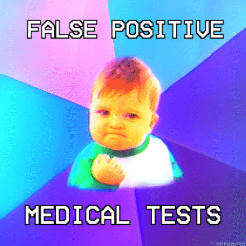

```{=html}
<style>
.dx-calc, .dx-compare, .dx-build{
  --ink:#16232E; --muted:#5C6B76; --line:#DFE6E9; --panel:#FFFFFF;
  --teal:#0E7C7B; --teal-d:#0A5F5E; --teal-l:#4FA3A0; --fp:#C77D0A; --fn:#B5352A;
  font-family: ui-sans-serif, system-ui, -apple-system, "Segoe UI", Roboto, Helvetica, Arial, sans-serif;
  font-feature-settings:"tnum" 1; color:var(--ink);
  border:1px solid var(--line); border-radius:16px;
  background:linear-gradient(180deg,#FBFDFD,#F4F8F8);
  padding:20px 20px 22px; margin:26px 0 34px;
  box-shadow:0 1px 2px rgba(20,35,46,.04), 0 8px 28px -18px rgba(20,35,46,.28);
}
.dx-eyebrow{ font-size:11px; font-weight:700; letter-spacing:.14em; text-transform:uppercase; color:var(--teal-d); margin:0 0 14px;}
.dx-eyebrow::before{content:"";}
.dx-controls{ display:grid; grid-template-columns:repeat(auto-fit,minmax(180px,1fr)); gap:14px 20px; margin-bottom:16px;}
.dx-field label{ display:flex; justify-content:space-between; align-items:baseline; font-size:12.5px; font-weight:600; color:var(--muted); margin-bottom:6px;}
.dx-field label .dx-val{ color:var(--ink); font-weight:700; font-size:13px;}
.dx-field input[type=range]{ width:100%; accent-color:var(--teal); margin:0; cursor:pointer;}
.dx-field .dx-num{ width:100%; margin-top:6px; padding:6px 8px; font-size:13px; border:1px solid var(--line); border-radius:8px; color:var(--ink); font-family:inherit; font-feature-settings:"tnum" 1; background:#fff;}
.dx-field .dx-num:focus{ outline:2px solid var(--teal); outline-offset:1px; border-color:var(--teal);}
.dx-tree{ width:100%; height:auto; display:block; margin:2px 0 4px;}
.dx-tree text{ font-family:inherit; }
.dx-legend{ display:flex; flex-wrap:wrap; gap:14px; margin:8px 0 4px; font-size:11.5px; color:var(--muted);}
.dx-legend span{ display:inline-flex; align-items:center; gap:6px;}
.dx-legend i{ width:11px; height:11px; border-radius:3px; display:inline-block;}
.dx-check{ font-size:12px; color:var(--muted); margin:4px 0 14px;}
.dx-check b{ color:var(--teal-d);}

.dx-stats{ display:grid; grid-template-columns:1fr 1fr; gap:14px; margin-bottom:14px;}
@media (max-width:520px){ .dx-stats{ grid-template-columns:1fr; } }
.dx-stat{ background:var(--panel); border:1px solid var(--line); border-radius:12px; padding:12px 14px;}
.dx-stat .k{ font-size:11.5px; font-weight:700; letter-spacing:.05em; text-transform:uppercase; color:var(--muted);}
.dx-stat .v{ font-size:26px; font-weight:800; letter-spacing:-.02em; margin:2px 0 8px;}
.dx-stat.ppv .v{ color:var(--teal-d);} .dx-stat.npv .v{ color:var(--teal);}
.dx-bar{ height:7px; border-radius:99px; background:#E7EEEF; overflow:hidden;}
.dx-bar > i{ display:block; height:100%; border-radius:99px; transition:width .35s ease;}
.dx-stat.ppv .dx-bar > i{ background:var(--teal-d);} .dx-stat.npv .dx-bar > i{ background:var(--teal);}

.dx-work{ border:1px dashed var(--line); border-radius:12px; padding:14px 16px; margin-bottom:6px; background:#FCFEFE;}
.dx-work .dx-eyebrow{ margin-bottom:10px;}
.dx-work-grid{ display:grid; grid-template-columns:1fr 1fr; gap:18px;}
@media (max-width:560px){ .dx-work-grid{ grid-template-columns:1fr; } }
.dx-work h5{ margin:0 0 6px; font-size:13px; font-weight:800; color:var(--ink);}
.dx-work .step{ font-size:13px; line-height:1.7; color:var(--ink); font-variant-numeric:tabular-nums;}
.dx-work .step .lbl{ color:var(--muted);}
.dx-work .ans{ font-weight:800; color:var(--teal-d);}

.dx-cost{ margin-top:16px; border-top:1px dashed var(--line); padding-top:16px;}
.dx-cost .dx-eyebrow{ margin-bottom:12px;}
.dx-cost-grid{ display:grid; grid-template-columns:repeat(auto-fit,minmax(150px,1fr)); gap:12px;}
.dx-cell{ background:var(--panel); border:1px solid var(--line); border-radius:12px; padding:11px 13px;}
.dx-cell .k{ font-size:11px; font-weight:600; color:var(--muted);}
.dx-cell .v{ font-size:19px; font-weight:800; margin-top:3px; letter-spacing:-.01em;}
.dx-cell.total{ background:#0E7C7B; border-color:#0A5F5E;}
.dx-cell.total .k, .dx-cell.total .v{ color:#fff;}

.dx-tbl{ width:100%; border-collapse:collapse; margin-top:14px; font-size:13px;}
.dx-tbl th, .dx-tbl td{ padding:9px 12px; text-align:right; border-bottom:1px solid var(--line);}
.dx-tbl th:first-child, .dx-tbl td:first-child{ text-align:left; color:var(--muted); font-weight:600;}
.dx-tbl thead th{ font-size:11.5px; letter-spacing:.05em; text-transform:uppercase; color:var(--teal-d); border-bottom:2px solid var(--teal);}
.dx-tbl td.win{ background:#E9F5F4; font-weight:800; color:var(--teal-d);}
.dx-tbl tr.total-row td{ font-weight:800; border-top:2px solid var(--line);}
.dx-tbl .colhead{ display:block; font-weight:800; color:var(--ink); font-size:13.5px;}
.dx-tbl .colsub{ display:block; font-size:11px; color:var(--muted); font-weight:500;}
.dx-shared{ display:grid; grid-template-columns:repeat(auto-fit,minmax(150px,1fr)); gap:12px 18px; margin:2px 0;}
.dx-verdict{ margin-top:14px; padding:12px 14px; border-radius:12px; background:#E9F5F4; border:1px solid #BFE0DE; font-size:13px; color:var(--ink);}
.dx-verdict b{ color:var(--teal-d);}

/* guided builder */
.dx-given{ background:#EEF5F5; border:1px solid #D5E6E5; border-radius:10px; padding:10px 12px; font-size:12.5px; margin-bottom:16px;}
.dx-given b{ color:var(--teal-d);}
/* Tree spans the full width on top; input steps sit underneath it. */
.dx-build-grid{ display:block; }
.dx-buildtree{ width:100%; }
.dx-buildtree .dx-tree{ max-height:none; }
.dx-build-stats:not(:empty){ margin:4px 0 6px; }
.dx-steps{ display:grid; grid-template-columns:repeat(2, minmax(0,1fr)); gap:10px 18px; margin-top:14px; }
@media (max-width:680px){ .dx-steps{ grid-template-columns:1fr; } }
.dx-step{ border:1px solid var(--line); border-radius:12px; padding:12px 14px; margin-bottom:10px; background:#fff; transition:opacity .2s;}
.dx-step.locked{ opacity:.4; pointer-events:none;}
.dx-step.done{ border-color:#9CCBC8; background:#F3FAF9;}
.dx-step .q{ font-size:13px; font-weight:700; margin-bottom:9px; display:flex; align-items:flex-start; gap:9px;}
.dx-step .q .num{ flex:0 0 auto; width:20px; height:20px; border-radius:50%; background:var(--teal); color:#fff; font-size:11px; display:inline-flex; align-items:center; justify-content:center; font-weight:800; margin-top:1px;}
.dx-step.done .q .num{ background:#0A5F5E;}
.dx-step .row{ display:flex; gap:8px; align-items:center; flex-wrap:wrap;}
.dx-step input{ width:120px; padding:6px 8px; border:1px solid var(--line); border-radius:8px; font-size:13px; font-family:inherit;}
.dx-step input:focus{ outline:2px solid var(--teal); border-color:var(--teal);}
.dx-step button{ font-family:inherit; font-size:12.5px; font-weight:700; border-radius:8px; padding:6px 12px; border:1px solid var(--teal); background:var(--teal); color:#fff; cursor:pointer;}
.dx-step button.hintbtn{ background:#fff; color:var(--teal-d); border-color:var(--line);}
.dx-step .hint{ display:none; margin-top:9px; font-size:12.5px; color:var(--muted); background:#F7FAFA; border-left:3px solid var(--teal-l); padding:7px 10px; border-radius:0 8px 8px 0;}
.dx-step .hint.show{ display:block;}
.dx-step .fb{ margin-top:9px; font-size:12.5px; font-weight:600;}
.dx-step .fb.ok{ color:#0A5F5E;} .dx-step .fb.no{ color:#B5352A;}
.dx-build-stats{ margin-top:6px;}
.dx-build-done{ margin-top:12px; padding:12px 14px; border-radius:12px; background:#E9F5F4; border:1px solid #BFE0DE; font-size:13px; display:none;}
.dx-build-done.show{ display:block;} .dx-build-done b{ color:var(--teal-d);}
@media (prefers-reduced-motion: reduce){ .dx-bar > i{ transition:none; } }

/* ---- Shared formative-check styling (matches Workshops 1 & 2) ---- */
.ws-quiz{border:1px solid #d9d9d9;border-left:4px solid #0E7C7B;border-radius:8px;
  padding:16px 18px;margin:14px 0 20px 0;background:#fafafa;}
.ws-quiz p.ws-qtext{font-weight:600;margin:0 0 10px 0;}
.ws-quiz .ws-row{display:flex;flex-wrap:wrap;align-items:center;gap:8px;margin:6px 0;}
.ws-quiz label.ws-inlab{min-width:230px;font-size:15px;}
.ws-quiz input[type=number], .ws-quiz input[type=text]{
  width:120px;padding:6px 8px;border:1px solid #bbb;border-radius:6px;font-size:15px;}
.ws-quiz .ws-opt{display:block;margin:5px 0;font-size:15px;font-weight:400;}
.ws-quiz .ws-opt input{margin-right:7px;}
.ws-quiz button.ws-check{margin-top:10px;padding:7px 16px;border:1px solid #0E7C7B;
  border-radius:6px;background:#0E7C7B;color:#fff;font-size:15px;cursor:pointer;}
.ws-quiz button.ws-check:hover{background:#0A5F5E;}
.ws-quiz .ws-fb{display:block;margin-top:10px;font-size:15px;min-height:1.3em;}
.ws-quiz .ws-fb.ok{color:#2e7d32;font-weight:600;}
.ws-quiz .ws-fb.no{color:#c0152f;font-weight:600;}
.ws-quiz .ws-hint{display:none;margin-top:6px;font-size:14px;color:#555;
  border-top:1px dashed #ccc;padding-top:6px;}
.ws-quiz button.ws-reveal{display:block;margin-top:10px;padding:6px 14px;
  border:1px solid #bbb;border-radius:6px;background:#fff;color:#555;
  font-size:14px;cursor:pointer;}
.ws-quiz button.ws-reveal:hover{border-color:#c0152f;color:#c0152f;}
.ws-locked{display:none;}
.ws-lockednote{font-size:14px;color:#777;margin:-6px 0 18px 0;}
.ws-lockednote::before{content:"\1F512  ";}
</style>
```
**Introduction**

Hey team! Thinking all the way back to Lecture 8 we covered
**probability** and the idea of a **decision tree**. Today you put that
theory to work on the problem it was built for: **diagnostic testing**.
When a test comes back positive, what is the chance the person actually
has the condition? The answer is rarely what you might first guess, and
it depends as much on *who you are testing* as on the test itself.

Last year this workshop was done by hand in Excel. The tools on this
page do the same job interactively, but the **exam still asks you to be
able to calculate probabilites by hand**: from a tree or explaination,
work the numbers down each branch, then be able to calculate PPV or NPV.
So today please get hands-on and practice. Early tasks let you
*explore*; later tasks make you *build the tree yourself*, value by
value.

You can come back to this page any time you need a reminder of how the
tree works.

**What you'll do today**

-   Read a diagnostic decision tree and name every branch
-   Build a tree for a population of size N (COVID, then cancer
    screening)
-   Calculate the four outcomes (TP, FN, FP, TN) and turn them into
    **PPV** and **NPV**
-   See how **prevalence** quietly controls how trustworthy a positive
    result is
-   Weigh **cost and clinical consequence** when choosing between
    competing tests

{fig-align="center" width="400"}

::: {.callout-note appearance="simple"}
**A real-world example...** during the COVID-19 pandemic, the trade-off
between rapid-antigen **sensitivity** (catching COVID when it's there)
and **specificity** (correctly clearing people who don't have it) drove
real policy. A test with 85% sensitivity misses about 15% of cases, but
that trade-off can still be worth it if the alternative is no testing at
all.
:::

## Why decision trees & diagnostic testing?

Decision trees and diagnostic-test analysis are core tools in
healthcare, epidemiology, and any field that makes decisions under
uncertainty. Understanding how a test *performs* tells us whether it's
useful, when a false positive is more worrying than a false negative (or
the reverse), and why the same test can be excellent in one population
and misleading in another.

| Question                                                        | Tool            | What you get                                            |
|-----------------------------------|-------------------|-------------------|
| *Of people with the condition, how many does the test catch?*   | **Sensitivity** | A rate --- the true-positive rate, TP ÷ (TP + FN)       |
| *Of people without it, how many does the test correctly clear?* | **Specificity** | A rate --- the true-negative rate, TN ÷ (TN + FP)       |
| *This person tested positive --- do they actually have it?*     | **PPV**         | A probability --- TP ÷ (TP + FP), depends on prevalence |
| *This person tested negative --- are they actually clear?*      | **NPV**         | A probability --- TN ÷ (TN + FN), depends on prevalence |

**TP** = true positive; **FN** = false negative; **FP** = false
positive; **TN** = true negative.

## The diagnostic-testing essentials {.unnumbered}

Work through these tabs before the tasks. They condense Lecture 8 into
what you need for this workshop (and the exam).

::: panel-tabset
### The tree

Every person in the population takes **two splits**:

1.  **Do they actually have the condition?** This first split is set by
    **prevalence** (and its complement, `1 − prevalence`).
2.  **What does the test say?** For people *with* the condition, this
    split is governed by **sensitivity**; for people *without* it, by
    **specificity**.

Two splits give **four paths**, the only four things that can happen to
a person:

| Path                  | Meaning                                                 |
|------------------------|------------------------------------------------|
| **TP** true positive  | has condition, test says positive                       |
| **FN** false negative | has condition, test says negative (a *missed case*)     |
| **FP** false positive | without condition, test says positive (a *false alarm*) |
| **TN** true negative  | without condition, test says negative                   |

The four always sum to the whole population (or to 1.00 in probability
terms) --- a handy self-check every time you build a tree.

### Sensitivity vs specificity

These two are properties of the **test itself**:

-   **Sensitivity** --- of people who *have* the condition, the
    proportion who test **positive**. High sensitivity → few missed
    cases (few FN).
-   **Specificity** --- of people who *don't* have the condition, the
    proportion who test **negative**. High specificity → few false
    alarms (few FP).

::: {.callout-warning appearance="simple"}
**The classic mix-up:** sensitivity conditions on *having* the disease;
specificity conditions on *not* having it. "Sensitivity = 0.85" means
*85% of people with the disease test positive* --- **not** 85% of
positive tests are correct. That second statement is PPV, and it's a
different number entirely.
:::

### TP · FP · FN · TN

Every person ends at exactly **one of four outcomes**. Two are the test
getting it **right**, two are the test getting it **wrong**. Each is
just the product of the two branch probabilities that lead to it:

-   **TP** true positive: has the condition **and** tests positive (a
    case *correctly* caught):
    $$P(TP) = \text{prevalence} \times \text{sensitivity}$$
-   **FN** false negative: has the condition but tests negative (a
    *missed case*):
    $$P(FN) = \text{prevalence} \times (1 - \text{sensitivity})$$
-   **FP** false positive: is without the condition but tests positive
    (a *false alarm*):
    $$P(FP) = (1 - \text{prevalence}) \times (1 - \text{specificity})$$
-   **TN** true negative: is without the condition **and** tests
    negative (*correctly* cleared):
    $$P(TN) = (1 - \text{prevalence}) \times \text{specificity}$$

The two "has it" paths (TP + FN) always sum to the **prevalence**; the
two "doesn't have it" paths (FP + TN) sum to `1 − prevalence`. All four
together sum to the whole population (or **1.00** in probability terms),
you can self-check this before you compute PPV or NPV.

### PPV & NPV

Sensitivity and specificity answer a question that starts from the
truth, if you know whether someone has the condition, how does the test
behave? But that's backwards from real life. In practice you don't know
the truth, you're holding a test result and trying to figure out what it
means. That's the question predictive values answer:

-   **PPV** --- given a **positive** test, the probability the condition
    is truly present: $$\text{PPV} = \frac{P(TP)}{P(TP) + P(FP)}$$
-   **NPV** --- given a **negative** test, the probability the condition
    is truly absent: $$\text{NPV} = \frac{P(TN)}{P(TN) + P(FN)}$$

Notice that each denominator adds together two kinds of people, those
who truly have the condition and those who don't (a positive test is
either a true positive or a false positive; same idea for negatives).
How many people fall into each group depends on prevalence (i.e., how
common the condition is to begin with). That's why **prevalence drives
the predictive values**, even though it has no effect on sensitivity or
specificity at all.
:::

------------------------------------------------------------------------

## Tasks for you to do

Work through these in order. Each task gives a short background, hands
you a tool to work the numbers, and ends with a question; answer it and
press **✓ Check** for instant feedback. A hint appears if you're stuck
after a couple of tries, and the worked answer stays locked until you
answer correctly (a *reveal* option appears after three attempts, so
have a genuine go first).

Task 1 lets you explore with sliders, Tasks 2 and 3 ask you to build the
tree yourself from the values you're given, and Task 4 makes you weigh
the trade-offs of tests with different sensitivity and specificity.

```{=html}
<script>
/* Lightweight formative answer-checking (no data leaves the page).
   Numeric inputs: data-answer + optional data-tol (tolerance).
   Radio questions: put data-answer on the .ws-quiz container.
   data-unlock: id of the block to unlock on success
   (or via the reveal button after 3 attempts). */
function wsUnlock(id){
  var el = document.getElementById(id);
  if(el){ el.classList.remove('ws-locked'); }
  var note = document.querySelector('.ws-lockednote[data-for="' + id + '"]');
  if(note){ note.remove(); }
}
document.addEventListener('click', function(e){
  var btn = e.target.closest('.ws-check');
  if(!btn) return;
  var q  = btn.closest('.ws-quiz');
  var fb = q.querySelector('.ws-fb');
  var hint = q.querySelector('.ws-hint');
  var nums = q.querySelectorAll('input[data-answer]');
  var allOk = true, anyBlank = false;

  if(nums.length){
    nums.forEach(function(inp){
      if(inp.value.trim() === ''){ anyBlank = true; }
      var exp = parseFloat(inp.dataset.answer);
      var tol = parseFloat(inp.dataset.tol || 0);
      var val = parseFloat(inp.value);
      var ok  = !isNaN(val) && Math.abs(val - exp) <= tol;
      inp.style.borderColor = ok ? '#2e7d32' : '#c0152f';
      inp.style.background  = ok ? '#eef7ee' : '#fdf0f2';
      if(!ok) allOk = false;
    });
  } else if(q.dataset.answer !== undefined){
    var sel = q.querySelector('input[type=radio]:checked') ||
              q.querySelector('select');
    if(sel && sel.tagName === 'SELECT'){
      if(sel.value === ''){ anyBlank = true; allOk = false; }
      else allOk = (sel.value === q.dataset.answer);
    } else if(sel){
      allOk = (sel.value === q.dataset.answer);
    } else {
      anyBlank = true; allOk = false;
    }
  }

  if(anyBlank && !allOk){
    fb.className = 'ws-fb no';
    fb.textContent = 'Fill in an answer first, then press Check.';
    return;
  }

  q.dataset.tries = (parseInt(q.dataset.tries || '0', 10) + 1);

  if(allOk){
    fb.className = 'ws-fb ok';
    fb.textContent = '✓ Correct! ' + (q.dataset.okmsg || '');
    if(hint) hint.style.display = 'none';
    if(q.dataset.unlock){
      wsUnlock(q.dataset.unlock);
      fb.textContent += ' ' + (q.dataset.unlockmsg || 'The worked answer is now unlocked below.');
      var rv = q.querySelector('.ws-reveal');
      if(rv) rv.remove();
    }
  } else {
    fb.className = 'ws-fb no';
    fb.textContent = '✗ Not quite — reconsider and try again.';
    if(hint && q.dataset.tries >= 2){ hint.style.display = 'block'; }
    if(q.dataset.unlock && q.dataset.tries >= 3 && !q.querySelector('.ws-reveal')){
      var btn2 = document.createElement('button');
      btn2.type = 'button';
      btn2.className = 'ws-reveal';
      btn2.textContent = 'Stuck? Reveal the worked answer';
      btn2.addEventListener('click', function(){
        wsUnlock(q.dataset.unlock);
        btn2.remove();
        fb.className = 'ws-fb';
        fb.textContent = 'Unlocked below. Read it closely, then reproduce the working yourself.';
      });
      q.appendChild(btn2);
    }
  }
});
</script>
```
### Task 1 --- Same test, two very different populations

Picture one diagnostic test (**sensitivity 0.90, specificity 0.95**) and
two places to use it. In a **specialist clinic**, half the patients
referred already look likely to have the condition (prevalence ≈
**0.50**). In a **whole-population screen**, only about 1 in 100 does
(prevalence ≈ **0.01**). The test is *identical* in both. Does a
positive result mean the same thing in each? That single question is the
heart of diagnostic testing --- and the reason sensitivity and
specificity alone never tell you how much to trust a result.

Move **prevalence** through **0.50**, **0.10** and **0.01** (leave
sensitivity and specificity fixed), and watch how the **PPV** and **NPV**
values under the tree respond.

```{=html}
<div class="dx-calc" data-sample="1000" data-prev="0.50" data-sens="0.90" data-spec="0.95"></div>
```
Play around with the **prevalence** toggle and see:

1.  How does **PPV** change as prevalence decreases?
2.  How does **NPV** change as prevalence decreases?

```{=html}
<div class="ws-quiz" data-unlock="t1-worked" data-answer="a" data-okmsg="Same test, but the population decides what a positive is worth.">
  <p class="ws-qtext">As prevalence falls from 50% (clinical setting) to 1% (general public), what happens to the predictive values?</p>
  <label class="ws-opt"><input type="radio" name="t1r" value="a">PPV collapses while NPV stays high</label>
  <label class="ws-opt"><input type="radio" name="t1r" value="b">NPV collapses while PPV stays high</label>
  <label class="ws-opt"><input type="radio" name="t1r" value="c">Both collapse by roughly the same amount</label>
  <label class="ws-opt"><input type="radio" name="t1r" value="d">Neither change, the test is fixed</label>
  <button class="ws-check" type="button">✓ Check</button>
  <span class="ws-fb"></span>
  <div class="ws-hint"><strong>Hint:</strong> a positive result competes against the
    pool of healthy people. When that pool is huge (low prevalence), false positives
    swamp the true positives, so PPV drops. Negatives never face that problem.</div>
</div>
```
```{=html}
<p class="ws-lockednote" data-for="t1-worked">Worked answer locked. Answer correctly above to unlock it.</p>
```
::: {#t1-worked .callout-note .ws-locked collapse="true"}
## Worked answer: Task 1

Same test, three prevalences:

| Prevalence              | PPV   | NPV   |
|-------------------------|-------|-------|
| 0.50 (clinical setting) | 94.7% | 90.5% |
| 0.10                    | 66.7% | 98.8% |
| 0.01 (general public)   | 15.4% | 99.9% |

The test didn't change. What changed is how common the condition is in
whoever you're testing, and that shifts with both who you sample (a
specialist clinic vs. the general public) and/or when you sample them (a
winter influenza surge vs. small circulation in summer).

**PPV collapses as prevalence falls** (94.7% → 66.7% → 15.4%). The
test's false-positive rate stays put, but when the disease is rare
you're aiming it at a crowd that's overwhelmingly healthy, so the false
alarms pile up while the true positives dwindle. A positive result
becomes more and more likely to be a false alarm. It's like airport
security, when real threats are vanishingly rare, nearly every beep is a
belt buckle, not a weapon.

**NPV barely moves, and even creeps up** (90.5% → 98.8% → 99.9%). The
flip side of that healthy crowd is that there are hardly any sick people
left to miss, so a negative result is almost always correct. In a sea of
genuinely disease-free people, "*negative*" is nearly always the truth.

Put together, in the specialist clinic a positive is worth taking
seriously (PPV ≈ 95%); run the identical test as a population screen and
a positive is more likely wrong than right (PPV ≈ 15%), while a negative
is rock-solid either way. This is why "*who are we testing?*" matters as
much as "*how good is the test?*" and why, in low-prevalence settings, a
positive usually needs confirmation but a negative can be trusted.
:::

------------------------------------------------------------------------

### Task 2 --- COVID-19 rapid antigen test (build it yourself)

It's exam season in 2022, and campus health is watching a small COVID
uptick, surveillance puts prevalence around **3%**. The plan, hand rapid
antigen tests (**sensitivity 0.85**, **specificity 0.98**) to **9,898**
students and act on the results. Before rolling it out, the team needs
to know what those results will actually be worth (i.e., how many real
cases they'll catch and how many healthy students they'll wrongly flag).

**Build the tree yourself** for 9,898 students, work down each branch,
type each value, press **Check**, and watch it assemble above.

```{=html}
<div class="dx-build" data-mode="count" data-n="9898" data-prev="0.03" data-sens="0.85" data-spec="0.98"></div>
```
With the tree built, interpret it the way the campus health team would.

Your tree gives **252 true positives** and **192 false positives** (PPV
≈ 57%), with NPV ≈ 99.5%. A student arrives with a *positive* rapid
test.

```{=html}
<div class="ws-quiz" data-unlock="t2-interp" data-answer="confirm" data-okmsg="Trust a negative; confirm a positive.">
  <p class="ws-qtext">The best reading of that positive result is:</p>
  <label class="ws-opt"><input type="radio" name="t2i" value="sure">A positive is almost certainly COVID, the test is 98% specific</label>
  <label class="ws-opt"><input type="radio" name="t2i" value="confirm">A positive is ~57% likely to be real, so it should be confirmed with PCR before acting</label>
  <label class="ws-opt"><input type="radio" name="t2i" value="neg">Negatives are the unreliable results here, not positives</label>
  <label class="ws-opt"><input type="radio" name="t2i" value="useless">The test is useless because it produces false positives</label>
  <button class="ws-check" type="button">✓ Check</button>
  <span class="ws-fb"></span>
  <div class="ws-hint"><strong>Hint:</strong> compare true positives (252) with false
    positives (192) — nearly as many alarms are false as real, so one positive can't
    stand alone. But only 45 cases are missed out of 9,454 negatives, so a negative is
    very reliable.</div>
</div>
```
```{=html}
<p class="ws-lockednote" data-for="t2-interp">Interpretation locked. Answer correctly above to unlock it.</p>
```
::: {#t2-interp .callout-note .ws-locked collapse="true"}
## Interpretation --- what a positive is worth

Per 9,898 students at prevalence 0.03: **297 have COVID, 9,601 don't.**

| Leaf | Working      | Count |
|------|--------------|-------|
| TP   | 297 × 0.85   | 252   |
| FN   | 297 × 0.15   | 45    |
| FP   | 9,601 × 0.02 | 192   |
| TN   | 9,601 × 0.98 | 9,409 |

Even with 98% specificity, a positive is only \~57% likely to be real,
because healthy students outnumber infected ones roughly 32 to 1. A
**negative**, though, is highly reliable. Sensible policy: **trust a
negative, confirm a positive** (e.g. with PCR) before acting on it. This
is essentially how Australia's COVID testing policy worked.
:::

Now put numbers on that judgement. Work each question below.

**Question 1. If a student tests *positive*, what's the probability they
actually have COVID? (PPV, as a %)**

```{=html}
<div class="ws-quiz" data-unlock="t2-q1" data-okmsg="That's the PPV, barely better than a coin toss.">
  <p class="ws-qtext">Using your TP and FP leaves, compute PPV = TP ÷ (TP + FP).</p>
  <div class="ws-row"><label class="ws-inlab" for="t2-q1-in">PPV (%):</label>
    <input type="number" id="t2-q1-in" data-answer="56.8" data-tol="1.5"></div>
  <button class="ws-check" type="button">✓ Check</button>
  <span class="ws-fb"></span>
  <div class="ws-hint"><strong>Hint:</strong> 252 ÷ (252 + 192) = 252 ÷ 444.</div>
</div>
```
```{=html}
<p class="ws-lockednote" data-for="t2-q1">Worked answer locked. Answer correctly above to unlock it.</p>
```
::: {#t2-q1 .callout-note .ws-locked collapse="true"}
## Worked answer: Question 1 (PPV)

$$\text{PPV} = \frac{\text{TP}}{\text{TP} + \text{FP}} = \frac{252}{252 + 192} = \frac{252}{444} = 56.8\%$$

A positive rapid test is only about **57%** likely to reflect a real
infection, barely better than a coin toss, despite the test's **98%
specificity**.
:::

**Question 2. If a student tests *negative*, how confident can we be
they don't have COVID? (NPV, as a %)**

```{=html}
<div class="ws-quiz" data-unlock="t2-q2" data-okmsg="A negative here is very trustworthy.">
  <p class="ws-qtext">Using your TN and FN leaves, compute NPV = TN ÷ (TN + FN).</p>
  <div class="ws-row"><label class="ws-inlab" for="t2-q2-in">NPV (%):</label>
    <input type="number" id="t2-q2-in" data-answer="99.5" data-tol="0.5"></div>
  <button class="ws-check" type="button">✓ Check</button>
  <span class="ws-fb"></span>
  <div class="ws-hint"><strong>Hint:</strong> 9,409 ÷ (9,409 + 45) = 9,409 ÷ 9,454.</div>
</div>
```
```{=html}
<p class="ws-lockednote" data-for="t2-q2">Worked answer locked. Answer correctly above to unlock it.</p>
```
::: {#t2-q2 .callout-note .ws-locked collapse="true"}
## Worked answer: Question 2 (NPV)

$$\text{NPV} = \frac{\text{TN}}{\text{TN} + \text{FN}} = \frac{9{,}409}{9{,}409 + 45} = \frac{9{,}409}{9{,}454} = 99.5\%$$

Only 45 infections are missed among 9,454 negatives, so a **negative**
result is highly reassuring.
:::

**Question 3. How many *false positives* would we expect in this
scenario?**

```{=html}
<div class="ws-quiz" data-unlock="t2-q3" data-okmsg="Nearly as many false alarms as real cases.">
  <p class="ws-qtext">Read the FP path straight off your tree (healthy students × the false-positive rate).</p>
  <div class="ws-row"><label class="ws-inlab" for="t2-q3-in">False positives:</label>
    <input type="number" id="t2-q3-in" data-answer="192" data-tol="2"></div>
  <button class="ws-check" type="button">✓ Check</button>
  <span class="ws-fb"></span>
  <div class="ws-hint"><strong>Hint:</strong> 9,601 healthy students × 0.02.</div>
</div>
```
```{=html}
<p class="ws-lockednote" data-for="t2-q3">Worked answer locked. Answer correctly above to unlock it.</p>
```
::: {#t2-q3 .callout-note .ws-locked collapse="true"}
## Worked answer: Question 3 (false positives)

$$\text{FP} = 9{,}601 \times 0.02 = 192$$

**192** healthy students would be wrongly flagged. Close to as many
false alarms (192) as true cases (252). That balance is exactly why the
PPV lands near 57%, and why a single positive can't stand on its own.
:::

------------------------------------------------------------------------

### Task 3 --- Cancer screening: is it worth funding?

A biotech startup pitches Queenslands state health department a new
blood biomarker for **early-stage pancreatic cancer** (a cancer that is
usually caught far too late, with bad prognosis). Their test:
**sensitivity 0.75**, **specificity 0.92**. The catch is prevalence:
even among **50,000** high-risk adults (over-50s with a family history),
the disease is rare, about **0.008** (0.8%). Screening costs **\$200 per
person**, and every positive triggers a **\$5,000** follow-up procedure.
The department has to decide whether it makes economic sense to fund it.
Build the tree, then cost it.

```{=html}
<div class="dx-build" data-mode="count" data-n="50000" data-prev="0.008" data-sens="0.75" data-spec="0.92"></div>
```
Now cost the program using the tree you just built. Work each question
below in turn.

**Question 1. What is the total program cost?** (screening at
\$200/person, follow-up at \$5,000 per positive)

```{=html}
<div class="ws-quiz" data-unlock="t3-q1" data-okmsg="A rare disease makes the whole program expensive.">
  <p class="ws-qtext">Total = (\$200 × 50,000) + (\$5,000 × every positive, true or false). Use the positives from your tree.</p>
  <div class="ws-row"><label class="ws-inlab" for="t3-q1-in">Total cost (\$):</label>
    <input type="number" id="t3-q1-in" data-answer="31340000" data-tol="50000"></div>
  <button class="ws-check" type="button">✓ Check</button>
  <span class="ws-fb"></span>
  <div class="ws-hint"><strong>Hint:</strong> screening = \$10,000,000. Positives = TP + FP =
    300 + 3,968 = 4,268, so follow-ups = 5,000 × 4,268 = \$21,340,000.</div>
</div>
```
```{=html}
<p class="ws-lockednote" data-for="t3-q1">Worked answer locked. Answer correctly above to unlock it.</p>
```
::: {#t3-q1 .callout-note .ws-locked collapse="true"}
## Worked answer: Question 1 (total program cost)

Screening: \$200 × 50,000 = **\$10,000,000**. Every positive (true *or*
false) triggers a follow-up, and positives = TP + FP = 300 + 3,968 =
**4,268**, so follow-ups = \$5,000 × 4,268 = **\$21,340,000**.

**Total ≈ \$31,340,000.**
:::

**Question 2. How many true cases were detected?**

```{=html}
<div class="ws-quiz" data-unlock="t3-q2" data-okmsg="That's the TP path, 300 of 400 real cancers.">
  <p class="ws-qtext">How many of the 400 real cancers does the test actually catch? (the TP path)</p>
  <div class="ws-row"><label class="ws-inlab" for="t3-q2-in">True cases detected:</label>
    <input type="number" id="t3-q2-in" data-answer="300" data-tol="2"></div>
  <button class="ws-check" type="button">✓ Check</button>
  <span class="ws-fb"></span>
  <div class="ws-hint"><strong>Hint:</strong> 400 real cancers × 0.75 sensitivity.</div>
</div>
```
```{=html}
<p class="ws-lockednote" data-for="t3-q2">Worked answer locked. Answer correctly above to unlock it.</p>
```
::: {#t3-q2 .callout-note .ws-locked collapse="true"}
## Worked answer: Question 2 (true cases detected)

$$\text{TP} = 400 \times 0.75 = 300$$

The test finds **300** of the 400 real cancers (that's the 75%
sensitivity) and **misses 100**.
:::

**Question 3. How many people would need unnecessary follow-up
procedures?**

```{=html}
<div class="ws-quiz" data-unlock="t3-q3" data-okmsg="That's the FP path, the false alarms.">
  <p class="ws-qtext">How many healthy people get sent for an invasive follow-up they didn't need? (the FP path)</p>
  <div class="ws-row"><label class="ws-inlab" for="t3-q3-in">Unnecessary follow-ups:</label>
    <input type="number" id="t3-q3-in" data-answer="3968" data-tol="5"></div>
  <button class="ws-check" type="button">✓ Check</button>
  <span class="ws-fb"></span>
  <div class="ws-hint"><strong>Hint:</strong> 49,600 healthy × 0.08.</div>
</div>
```
```{=html}
<p class="ws-lockednote" data-for="t3-q3">Worked answer locked. Answer correctly above to unlock it.</p>
```
::: {#t3-q3 .callout-note .ws-locked collapse="true"}
## Worked answer: Question 3 (unnecessary follow-ups)

$$\text{FP} = 49{,}600 \times 0.08 = 3{,}968$$

**3,968** healthy people would be sent for an invasive follow-up...
about **13× more false positives than true cases found**.
:::

**Question 4. What's the cost per case detected?**

```{=html}
<div class="ws-quiz" data-unlock="t3-q4" data-okmsg="Over \$100k per real cancer found, driven by low prevalence.">
  <p class="ws-qtext">Divide the total program cost by the number of real cancers detected (\$, whole dollars).</p>
  <div class="ws-row"><label class="ws-inlab" for="t3-q4-in">Cost per case detected (\$):</label>
    <input type="number" id="t3-q4-in" data-answer="104467" data-tol="600"></div>
  <button class="ws-check" type="button">✓ Check</button>
  <span class="ws-fb"></span>
  <div class="ws-hint"><strong>Hint:</strong> \$31,340,000 ÷ 300.</div>
</div>
```
```{=html}
<p class="ws-lockednote" data-for="t3-q4">Worked answer locked. Answer correctly above to unlock it.</p>
```
::: {#t3-q4 .callout-note .ws-locked collapse="true"}
## Worked answer: Question 4 (cost per case detected)

$$\frac{\$31{,}340{,}000}{300} \approx \$104{,}467 \text{ per real cancer found}$$

For reference, **PPV** = 300 ÷ (300 + 3,968) = **7.0%** So a positive is
*wrong* 93% of the time.

**The decision:** the program does find 300 cancers early, but at the
price of 3,968 needless invasive follow-ups and over \$100,000 per case
found. Whether that's worth it is a policy call, and the statsitics are
driven almost entirely by the **low prevalence**. This is the same force
you saw in Task 1, now attached to real dollars and real patients.

Australia's National Bowel Cancer Screening Program runs on exactly this
dynamic. It mails free FIT (faecal immunochemical test) kits to everyone
aged 50--74 every two years, and because bowel cancer prevalence in the
screened population is low, a positive result is right only a small
fraction of the time ([one study of the program found a PPV for cancer
of just 3.6%](https://doi.org/10.1111/ajco.12484) so the vast majority
of people sent on to a follow-up colonoscopy don't actually have cancer,
the same low-prevalence effect driving the numbers above, just playing
out at national scale.
:::

------------------------------------------------------------------------

### Task 4 --- Choosing a diagnostic test for a clinic (optional)

If we have time: A **Brisbane public health clinic** is up for its
annual test contract: three vendors, three tests, one budget. The
condition is common here (prevalence **15%**), the clinic screens about
**1,000 patients a year**, each positive costs **\$500** to follow up,
and every **missed case** (false negative) comes back to cost
**\$3,000** in later care. The manager has to pick one test. As you're
about to see, "most accurate" isn't automatically "best".

| Test   | Sensitivity | Specificity | Cost per test |
|--------|-------------|-------------|---------------|
| Test A | 95%         | 80%         | \$50          |
| Test B | 85%         | 95%         | \$75          |
| Test C | 90%         | 90%         | \$100         |

Before you unlock the comparison tool, warm up by hand on **Test A**
(per 1,000 patients, prevalence 0.15):

```{=html}
<div class="ws-quiz" data-unlock="t4-tool" data-okmsg="" data-unlockmsg="The comparison tool is now unlocked below.">
  <p class="ws-qtext">Test A (sensitivity 0.95, specificity 0.80), per 1,000 patients:</p>
  <div class="ws-row"><label class="ws-inlab" for="t4-tp">True positives:</label>
    <input type="number" id="t4-tp" step="0.5" data-answer="142.5" data-tol="1.5"></div>
  <div class="ws-row"><label class="ws-inlab" for="t4-fp">False positives (false alarms):</label>
    <input type="number" id="t4-fp" data-answer="170" data-tol="2"></div>
  <button class="ws-check" type="button">✓ Check</button>
  <span class="ws-fb"></span>
  <div class="ws-hint"><strong>Hint:</strong> 150 patients have the condition, 850
    don't. TP = 150 × 0.95. FP = 850 × (1 − 0.80).</div>
</div>
```
```{=html}
<p class="ws-lockednote" data-for="t4-tool">The comparison tool unlocks once you've worked Test A by hand.</p>
```
::: {#t4-tool .ws-locked}
```{=html}
<div class="dx-compare" data-prev="0.15" data-sample="1000" data-followup="500" data-missed="3000" data-tests='[{"name":"Test A","sens":0.95,"spec":0.80,"cost":50},{"name":"Test B","sens":0.85,"spec":0.95,"cost":75},{"name":"Test C","sens":0.90,"spec":0.90,"cost":100}]'></div>
```
:::

**Now decide.** Compare PPV, NPV and the full cost stack across the
three tests. Then try a scenario where a **missed-case costs \$8,000**
and see whether the cheapest option flips.

**Question to answer**: *if follow-up testing is \$500 and missed cases
eventually cost the government \$3,000 if left undiagnosed, which
diagnostic test would you choose for the clinic, and why?*

```{=html}
<div class="ws-quiz" data-answer="depends" data-unlock="t4-worked" data-okmsg="There is no universally 'best' test, it depends on which error you most need to avoid.">
  <p class="ws-qtext">Which test should the clinic choose?</p>
  <label class="ws-opt"><input type="radio" name="t4d" value="a">Always Test A. Highest sensitivity, so fewest missed cases</label>
  <label class="ws-opt"><input type="radio" name="t4d" value="b">Always Test C. It's the balanced middle option</label>
  <label class="ws-opt"><input type="radio" name="t4d" value="depends">It depends, weigh total cost against whether missed cases or false alarms are worse here</label>
  <button class="ws-check" type="button">✓ Check</button>
  <span class="ws-fb"></span>
  <div class="ws-hint"><strong>Hint:</strong> notice how the "cheapest total" can change
    when you re-price a missed case. A number is only meaningful once you attach a
    consequence to each type of error.</div>
</div>
```
```{=html}
<p class="ws-lockednote" data-for="t4-worked">Worked answer locked. Answer correctly above to unlock it.</p>
```
::: {#t4-worked .callout-note .ws-locked collapse="true"}
## Worked answer: Task 4

Per 1,000 patients at prevalence 0.15 (150 have the condition, 850
don't):

|                          | Test A         | Test B         | Test C        |
|--------------------------|----------------|----------------|---------------|
| True positives           | 143            | 128            | 135           |
| False negatives (missed) | 8              | 23             | 15            |
| False positives (alarms) | 170            | 43             | 85            |
| **PPV**                  | 45.6%          | **75.0%**      | 61.4%         |
| **NPV**                  | 98.9%          | 97.3%          | 98.1%         |
| Testing cost             | \$50,000       | \$75,000       | \$100,000     |
| Follow-up cost           | \$156,500      | \$85,500       | \$110,000     |
| Missed-case cost         | \$24,000       | \$69,000       | \$45,000      |
| **Total annual cost**    | **≈\$230,500** | **≈\$229,500** | **\$255,000** |

*(The live tool computes from exact fractions, so its A/B totals sit a
few hundred dollars lower so the ranking and the winner are unchanged.)*

**Which would you choose, and why?** With costs nearly identical between
Tests A and B, the choice depends on whether you prioritise *catching
every possible case* (Test A's 95% sensitivity) or *minimising false
alarms and follow-up burden* (Test B's 75% PPV). Given the minimal cost
difference, **either is defensible**, it turns on the clinical
priorities and the nature of the condition. You'd pick **Test C** only
if you want balanced performance (both 90%), accepting the higher cost
(\$255,000) for a middle ground that trims both missed cases and false
alarms relative to the A/B extremes (this would be unusual in the real
world).

**Cost tells you almost nothing here.** Tests A and B land within
\~\$1,000 of each other, and Test C is only about \$25,000 dearer for
its balanced profile. So the choice comes down to **which error you
least want to make**:

-   **Test A** catches almost every case (95% sensitivity, only 8
    missed) but raises the most false alarms (170), so its PPV is just
    45.6% and most positives are wrong.
-   **Test B** flips that. fewer catches (23 missed) but far fewer false
    alarms (43), giving the strongest PPV (75%) and the lightest
    follow-up burden.
-   **Test C** sits in the middle on everything, for the highest price.
    The defensible pick only when neither error clearly dominates or is
    consequential.

**How real testing resolves this: pair opposite error profiles.** You
rarely rely on one test. A *sensitive* test screens wide (rule out),
then a *specific* test confirms the positives (rule in). Whichever
weakness the first test has, the second is chosen to cover:

-   **Exercise science, cardiac screening of young athletes.** Screening
    athletes for the hidden heart conditions behind sudden cardiac
    death, usually by ECG. A missed case can be fatal, so you lead with
    a **high-sensitivity** test (Test A logic) to catch almost everyone.
    Its weakness is specificity: athletes' hearts adapt, so many healthy
    players get flagged (false-positive rates historically 15--20%+).
    You don't fix that by loosening the screen, you fix it with a **more
    specific second test** (echocardiogram or cardiac MRI) that confirms
    or clears each positive. The sensitive ECG makes sure nobody
    dangerous slips through; the specific follow-up strips out the false
    alarms so only true cases are disqualified.

-   **Clinical exercise physiology, treadmill cardiac stress testing.**
    A standard cardiac stress test has only moderate accuracy. Run it on
    a low-risk group and just like Task 1, PPV collapses (i.e., most
    positives are false). The danger is over-reacting, sending someone
    straight to an invasive angiogram for a false alarm. So a positive
    stress test isn't a diagnosis, it's a trigger for a **more specific
    confirmatory test** (e.g. CT coronary angiography or stress imaging)
    before anyone reaches the cath lab. The moderate test does the cheap
    first pass; the specific one protects healthy people from an
    unnecessary procedure. (In a high-risk symptomatic patient the
    priority flips back toward sensitivity. So prevalence, not just the
    test, drives the choice.)

**The takeaway:** there's no universally best test. Miss-a-case settings
(athlete clearance) favour sensitivity; false-alarm-burden settings
(low-risk screening) favour specificity/PPV. In practice you often use
both in sequence, sensitive to rule out, specific to rule in.
:::

::: {.callout-tip appearance="simple"}
**Clinical decision making:** when missed cases are dangerous or costly,
high **sensitivity** wins (few FN). When false alarms are costly or
harmful, high **specificity** wins (few FP). The "right" test is the one
whose *errors* you can best afford.
:::

------------------------------------------------------------------------

## How this links to assessment

The exam **gives you a scenario and asks you to calculate from it**. The
four outcomes as percentages (like the Task 2 and 3 builds) and/or the
PPV or NPV after a positive or negative result. You'll be given
prevalence, sensitivity and specificity and asked to work the numbers,
showing your working. You might be asked to **interpret a result** and
make and educated decision of which kind of test to implement (much like
Task 4).

::: {.callout-tip appearance="simple"}
**Cheap marks, expensive mistakes:** **1)** Sensitivity and specificity
are fixed properties of the test. PPV and NPV depend on the population
you apply it to. The same test applied to a population with different
prevalence will yield a different PPV or NPV. **2)** The p for the four
outcomes (TP, FP, TN, FN) must sum to 100% (or 1). If they don't add up
to that, you've made an error somewhere. **3)** To get PPV, only look at
the branches ending in a positive test, and ask what fraction of those
also have the disease. To get NPV, only look at the branches ending in a
negative test, and ask what fraction of those are actually healthy.
:::

------------------------------------------------------------------------

## That's it for Decision Trees for today.

{fig-align="center"}

**Now gather your team for the group Portfolio of Evidence activity
(20mins).**

-   Put all phones, laptops, electronic devices away

-   Turn off the lab computers

-   You can have a calculator, ruler, pen

-   You can write/draw on the exam sheet

-   Please include all names and s numbers for all group members

-   1 mark for first correct scratch, 1/2 mark for second, 1/4 for
    third, 0 for forth and fifth

-   Work together as a team :)

------------------------------------------------------------------------

## Getting help

During the session I'll circulate to help, don't be afraid to ask. After
the workshop, revisit this page, check your module notes for
interpretation help, or post in the Microsoft Teams channel, email me,
or [**book an office hours
meeting**](https://lms.griffith.edu.au/courses/32192#cc-collection-4).

------------------------------------------------------------------------

## References

\[1\] St John, J., & Grogan, P. (2016). Compelling new data on the effectiveness of Australia's National Bowel Cancer Screening Program: A model for best practice? *Asia-Pacific Journal of Clinical Oncology*, 12(1), 7–9. <https://doi.org/10.1111/ajco.12484>

------------------------------------------------------------------------

*Document prepared by Aaron Bach using Quarto.*

```{=html}
<script>
(function(){
  "use strict";

  function compute(prev,sens,spec){
    var TP=prev*sens, FN=prev*(1-sens), FP=(1-prev)*(1-spec), TN=(1-prev)*spec;
    var pos=TP+FP, neg=TN+FN;
    return {TP:TP,FN:FN,FP:FP,TN:TN,pos:pos,neg:neg, PPV:pos>0?TP/pos:0, NPV:neg>0?TN/neg:0};
  }
  function dec(x){ return Number(x.toFixed(4)).toString(); }
  function pct(x){ return (x*100).toFixed(1)+"%"; }
  function money(x){ return "$"+Math.round(x).toLocaleString(); }
  function whole(x){ return Math.round(x).toLocaleString(); }

  /* shared SVG draw helpers */
  function svgNode(x,y,w,h,eb,big,small){
    var t='<rect x="'+x+'" y="'+y+'" width="'+w+'" height="'+h+'" rx="10" fill="#F4F8F8" stroke="#CBD9DA" stroke-width="1.4"/>'+
      '<text x="'+(x+12)+'" y="'+(y+19)+'" font-size="10.5" font-weight="700" letter-spacing=".04em" fill="#5C6B76">'+eb+'</text>'+
      '<text x="'+(x+12)+'" y="'+(y+40)+'" font-size="16" font-weight="800" fill="#16232E">'+big+'</text>';
    if(small) t+='<text x="'+(x+12)+'" y="'+(y+55)+'" font-size="10.5" fill="#5C6B76">'+small+'</text>';
    return t;
  }
  function svgLeaf(x,y,fill,stroke,ebFill,eb,headline,subline){
    return '<rect x="'+x+'" y="'+y+'" width="238" height="70" rx="10" fill="'+fill+'" stroke="'+stroke+'" stroke-width="1.4"/>'+
      '<text x="'+(x+13)+'" y="'+(y+19)+'" font-size="10.5" font-weight="700" letter-spacing=".03em" fill="'+ebFill+'">'+eb+'</text>'+
      '<text x="'+(x+13)+'" y="'+(y+40)+'" font-size="13.5" font-weight="800" fill="#16232E">'+headline+'</text>'+
      '<text x="'+(x+13)+'" y="'+(y+59)+'" font-size="11" fill="#5C6B76">'+subline+'</text>';
  }
  function svgConn(x1,y1,x2,y2){
    return '<path d="M'+x1+' '+y1+' C '+(x1+36)+' '+y1+', '+(x2-36)+' '+y2+', '+x2+' '+y2+'" fill="none" stroke="#C7D3D6" stroke-width="1.6"/>';
  }
  function svgTag(x,y,txt){
    var i=txt.indexOf(" = ");
    if(i<0){
      var w=txt.length*6.0+14;
      return '<rect x="'+(x-w/2)+'" y="'+(y-10)+'" width="'+w+'" height="19" rx="9" fill="#FFFFFF" stroke="#E4EBEC"/>'+
        '<text x="'+x+'" y="'+(y+3)+'" text-anchor="middle" font-size="10.5" font-weight="700" fill="#3E4E58">'+txt+'</text>';
    }
    // Two lines: label on top, "= value" underneath, so the pill fits the branch gap.
    var l1=txt.slice(0,i), l2="= "+txt.slice(i+3);
    var w=Math.max(l1.length,l2.length)*6.0+14;
    return '<rect x="'+(x-w/2)+'" y="'+(y-13)+'" width="'+w+'" height="30" rx="9" fill="#FFFFFF" stroke="#E4EBEC"/>'+
      '<text x="'+x+'" y="'+(y-1)+'" text-anchor="middle" font-size="10.5" font-weight="700" fill="#3E4E58">'+l1+'</text>'+
      '<text x="'+x+'" y="'+(y+11)+'" text-anchor="middle" font-size="10.5" font-weight="700" fill="#3E4E58">'+l2+'</text>';
  }
  var LEAF_FILL={tp:["#E7F3F2","#9CCBC8","#0A5F5E"],fn:["#FBEDEC","#E3B4AF","#B5352A"],fp:["#FCF2E2","#E9CE9C","#8A5A08"],tn:["#EAF4F3","#A9D2CF","#0A5F5E"]};

  /* ---------- live-calculator tree (with count arithmetic) ---------- */
  function tree(prev,sens,spec,N,r){
    var hasN=N>1;
    var s='<svg class="dx-tree" viewBox="0 0 736 384" role="img" aria-label="Diagnostic decision tree">';
    s+=svgConn(126,192,250,100)+svgConn(126,192,250,280);
    s+=svgConn(402,100,486,53)+svgConn(402,100,486,133);
    s+=svgConn(402,280,486,249)+svgConn(402,280,486,329);
    s+=svgTag(188,146,"Prevalence = "+dec(prev))+svgTag(188,236,"1 \u2212 Prevalence = "+dec(1-prev));
    s+=svgTag(444,76,"Sensitivity = "+dec(sens))+svgTag(444,117,"1 \u2212 Sensitivity = "+dec(1-sens));
    s+=svgTag(444,263,"1 \u2212 Specificity = "+dec(1-spec))+svgTag(444,304,"Specificity = "+dec(spec));
    s+=svgNode(8,160,118,64,"POPULATION", hasN?whole(N):"1.0", hasN?"N total":"probability");
    s+=svgNode(250,70,152,60,"HAS CONDITION", hasN?whole(N*prev):dec(prev), hasN?(whole(N)+" \u00D7 "+dec(prev)+" = "+whole(N*prev)):("p = "+dec(prev)));
    s+=svgNode(250,250,152,60,"NO CONDITION", hasN?whole(N*(1-prev)):dec(1-prev), hasN?(whole(N)+" \u00D7 "+dec(1-prev)+" = "+whole(N*(1-prev))):("p = "+dec(1-prev)));
    var hc=N*prev, nc=N*(1-prev);
    function sub(nodeC,cond,leafP){ return hasN ? whole(nodeC)+" \u00D7 "+dec(cond)+" = "+whole(leafP*N)+"  \u00B7  "+pct(leafP) : ""; }
    function subP(a,b,p){ return dec(a)+" \u00D7 "+dec(b)+" = "+dec(p)+" ("+pct(p)+")"; }
    s+=svgLeaf(486,18, LEAF_FILL.tp[0],LEAF_FILL.tp[1],LEAF_FILL.tp[2],"TRUE POSITIVE \u00B7 TP", hasN?whole(r.TP*N)+" people":dec(r.TP), hasN?sub(hc,sens,r.TP):subP(prev,sens,r.TP));
    s+=svgLeaf(486,98, LEAF_FILL.fn[0],LEAF_FILL.fn[1],LEAF_FILL.fn[2],"FALSE NEGATIVE \u00B7 FN", hasN?whole(r.FN*N)+" people":dec(r.FN), hasN?sub(hc,1-sens,r.FN):subP(prev,1-sens,r.FN));
    s+=svgLeaf(486,214,LEAF_FILL.fp[0],LEAF_FILL.fp[1],LEAF_FILL.fp[2],"FALSE POSITIVE \u00B7 FP", hasN?whole(r.FP*N)+" people":dec(r.FP), hasN?sub(nc,1-spec,r.FP):subP(1-prev,1-spec,r.FP));
    s+=svgLeaf(486,294,LEAF_FILL.tn[0],LEAF_FILL.tn[1],LEAF_FILL.tn[2],"TRUE NEGATIVE \u00B7 TN", hasN?whole(r.TN*N)+" people":dec(r.TN), hasN?sub(nc,spec,r.TN):subP(1-prev,spec,r.TN));
    s+='</svg>';
    return s;
  }

  function legend(){
    return '<div class="dx-legend">'+
      '<span><i style="background:#0E7C7B"></i>Correct (TP / TN)</span>'+
      '<span><i style="background:#C77D0A"></i>False positive (false alarm)</span>'+
      '<span><i style="background:#B5352A"></i>False negative (missed case)</span></div>';
  }
  function stat(cls,label,val){
    return '<div class="dx-stat '+cls+'"><div class="k">'+label+'</div><div class="v">'+pct(val)+'</div>'+
      '<div class="dx-bar"><i style="width:'+(val*100).toFixed(1)+'%"></i></div></div>';
  }
  function workPanel(r,N){
    var hasN=N>1;
    var n1=hasN?'<div class="step" style="margin-top:8px;font-size:12px"><span class="lbl">With counts: '+whole(r.TP*N)+' \u00F7 '+whole(r.pos*N)+'.</span></div>':'';
    var n2=hasN?'<div class="step" style="margin-top:8px;font-size:12px"><span class="lbl">With counts: '+whole(r.TN*N)+' \u00F7 '+whole(r.neg*N)+'.</span></div>':'';
    return '<div class="dx-work"><p class="dx-eyebrow">How PPV &amp; NPV are calculated</p><div class="dx-work-grid">'+
      '<div><h5>Positive Predictive Value</h5>'+
        '<div class="step"><span class="lbl">P(positive) = P(TP) + P(FP)</span><br>= '+dec(r.TP)+' + '+dec(r.FP)+' = '+dec(r.pos)+'</div>'+
        '<div class="step" style="margin-top:6px"><span class="lbl">PPV = P(TP) \u00F7 P(positive)</span><br>= '+dec(r.TP)+' \u00F7 '+dec(r.pos)+' = <span class="ans">'+pct(r.PPV)+'</span></div>'+n1+'</div>'+
      '<div><h5>Negative Predictive Value</h5>'+
        '<div class="step"><span class="lbl">P(negative) = P(TN) + P(FN)</span><br>= '+dec(r.TN)+' + '+dec(r.FN)+' = '+dec(r.neg)+'</div>'+
        '<div class="step" style="margin-top:6px"><span class="lbl">NPV = P(TN) \u00F7 P(negative)</span><br>= '+dec(r.TN)+' \u00F7 '+dec(r.neg)+' = <span class="ans">'+pct(r.NPV)+'</span></div>'+n2+'</div>'+
      '</div></div>';
  }

  function initCalc(el){
    var N0=el.dataset.sample?+el.dataset.sample:1000;
    var prev=+el.dataset.prev||0.1, sens=+el.dataset.sens||0.9, spec=+el.dataset.spec||0.95;
    var compare=el.dataset.compare?el.dataset.compare.split(",").map(Number):null;
    var cScreen=el.dataset.costScreen?+el.dataset.costScreen:null, cFollow=el.dataset.costFollow?+el.dataset.costFollow:null;
    function fld(key,label,val,min,max,step){
      return '<div class="dx-field" data-key="'+key+'"><label>'+label+' <span class="dx-val"></span></label>'+
        '<input type="range" min="'+min+'" max="'+max+'" step="'+step+'" value="'+val+'">'+
        '<input type="number" class="dx-num" min="'+min+'" max="'+max+'" step="'+step+'" value="'+val+'"></div>';
    }
    el.innerHTML='<p class="dx-eyebrow">Diagnostic tree calculator</p><div class="dx-controls">'+
      '<div class="dx-field" data-key="sample"><label>Sample size (N) <span class="dx-val"></span></label>'+
        '<input type="range" min="1" max="100000" step="100" value="'+N0+'">'+
        '<input type="number" class="dx-num" min="1" step="1" value="'+N0+'"></div>'+
      fld("prev","Prevalence",prev,0,1,0.001)+fld("sens","Sensitivity",sens,0,1,0.01)+fld("spec","Specificity",spec,0,1,0.01)+
      '</div><div class="dx-treewrap"></div>'+legend()+'<p class="dx-check"></p>'+
      '<div class="dx-stats"></div><div class="dx-workwrap"></div>'+
      (compare?'<div class="dx-cmp"></div>':'')+((cScreen!==null||cFollow!==null)?costSkeleton(cScreen,cFollow):'');

    el.querySelectorAll(".dx-field").forEach(function(fw){
      var rg=fw.querySelector('input[type=range]'), nm=fw.querySelector('input[type=number]'); if(!rg||!nm) return;
      rg.addEventListener("input",function(){ nm.value=rg.value; render(); });
      nm.addEventListener("input",function(){ var v=parseFloat(nm.value); if(!isNaN(v)&&v>=+rg.min&&v<=+rg.max) rg.value=v; render(); });
    });
    function read(k){ return parseFloat(el.querySelector('.dx-field[data-key="'+k+'"] input[type=number]').value)||0; }
    function render(){
      var N=Math.max(1,Math.round(read("sample"))), p=read("prev"), se=read("sens"), sp=read("spec");
      el.querySelector('.dx-field[data-key="sample"] .dx-val').textContent=whole(N);
      el.querySelector('.dx-field[data-key="prev"] .dx-val').textContent=dec(p)+" ("+(p*100).toFixed(1)+"%)";
      el.querySelector('.dx-field[data-key="sens"] .dx-val').textContent=dec(se)+" ("+(se*100).toFixed(0)+"%)";
      el.querySelector('.dx-field[data-key="spec"] .dx-val').textContent=dec(sp)+" ("+(sp*100).toFixed(0)+"%)";
      var r=compute(p,se,sp);
      el.querySelector(".dx-treewrap").innerHTML=tree(p,se,sp,N,r);
      var cChk=N>1?" and the counts total <b>"+whole(N)+"</b>":"";
      el.querySelector(".dx-check").innerHTML="The four probabilities sum to <b>"+dec(r.TP+r.FN+r.FP+r.TN)+"</b>"+cChk+" (they always total the whole population).";
      el.querySelector(".dx-stats").innerHTML=stat("ppv","Positive Predictive Value",r.PPV)+stat("npv","Negative Predictive Value",r.NPV);
      el.querySelector(".dx-workwrap").innerHTML=workPanel(r,N);
      if(compare) renderCmp(el,se,sp,compare);
      if(cScreen!==null||cFollow!==null) renderCost(el,r,N);
    }
    render();
  }

  function renderCmp(el,se,sp,prevs){
    var rows=prevs.map(function(p){ var r=compute(p,se,sp);
      return '<tr><td>'+(p*100)+'%</td><td>'+pct(r.PPV)+'</td><td>'+pct(r.NPV)+'</td></tr>'; }).join("");
    el.querySelector(".dx-cmp").innerHTML='<div class="dx-cost"><p class="dx-eyebrow">Same test, three prevalences</p>'+
      '<table class="dx-tbl"><thead><tr><th>Prevalence</th><th>PPV</th><th>NPV</th></tr></thead><tbody>'+rows+'</tbody></table>'+
      '<p class="dx-check" style="margin-top:10px"></p></div>';
  }
  function costSkeleton(screen,follow){
    var s='<div class="dx-cost"><p class="dx-eyebrow">Program cost &amp; yield</p><div class="dx-controls" style="margin-bottom:14px">';
    if(screen!==null) s+='<div class="dx-field"><label>Screening cost / person ($)</label><input type="number" class="dx-num dx-cost-in" data-key="screen" value="'+screen+'" min="0" step="10"></div>';
    if(follow!==null) s+='<div class="dx-field"><label>Follow-up cost / positive ($)</label><input type="number" class="dx-num dx-cost-in" data-key="follow" value="'+follow+'" min="0" step="10"></div>';
    s+='</div><div class="dx-cost-grid"></div></div>'; return s;
  }
  function renderCost(el,r,N){
    var sIn=el.querySelector('.dx-cost-in[data-key="screen"]'), fIn=el.querySelector('.dx-cost-in[data-key="follow"]');
    var screen=sIn?(+sIn.value||0):0, follow=fIn?(+fIn.value||0):0;
    if(sIn&&!sIn.dataset.b){ sIn.dataset.b=1; sIn.addEventListener("input",function(){ renderCost(el,r,N); }); }
    if(fIn&&!fIn.dataset.b){ fIn.dataset.b=1; fIn.addEventListener("input",function(){ renderCost(el,r,N); }); }
    var TP=r.TP*N, FP=r.FP*N, pos=r.pos*N, screenTot=screen*N, followTot=follow*pos, total=screenTot+followTot, perCase=TP>0?total/TP:0;
    function cell(k,v,t){ return '<div class="dx-cell'+(t?' total':'')+'"><div class="k">'+k+'</div><div class="v">'+v+'</div></div>'; }
    el.querySelector(".dx-cost-grid").innerHTML=
      cell("Cases detected (TP)",whole(TP))+cell("Unnecessary follow-ups (FP)",whole(FP))+
      cell("Screening cost",money(screenTot))+cell("Follow-up cost",money(followTot))+
      cell("Cost per case detected",money(perCase))+cell("Total program cost",money(total),true);
  }

  /* ---------- guided builder ---------- */
  function buildTree(v,rv){
    var count=v.count;
    function val(x){ return count?whole(x):dec(x); }
    var s='<svg class="dx-tree" viewBox="0 0 736 384" role="img" aria-label="Decision tree being built">';
    // root always
    s+=svgNode(8,160,118,64,"POPULATION", count?whole(v.N):"1.0", count?"N total":"probability");
    if(rv.has){ s+=svgConn(126,192,250,100)+svgTag(188,146,"Prevalence = "+dec(v.prev))+
      svgNode(250,70,152,60,"HAS CONDITION", val(v.has), count?(whole(v.N)+" \u00D7 "+dec(v.prev)+" = "+whole(v.has)):("p = "+dec(v.prev))); }
    if(rv.no){ s+=svgConn(126,192,250,280)+svgTag(188,236,"1 \u2212 Prevalence = "+dec(1-v.prev))+
      svgNode(250,250,152,60,"NO CONDITION", val(v.no), count?(whole(v.N)+" \u00D7 "+dec(1-v.prev)+" = "+whole(v.no)):("p = "+dec(1-v.prev))); }
    function leaf(key,x,y,eb,nodeC,cond,leafV,prob){
      var f=LEAF_FILL[key];
      var sub=count?(whole(nodeC)+" \u00D7 "+dec(cond)+" = "+whole(leafV)):(dec(nodeC)+" \u00D7 "+dec(cond)+" = "+dec(leafV)+" ("+pct(prob)+")");
      var head=count?(whole(leafV)+" people"):dec(leafV);
      return svgLeaf(x,y,f[0],f[1],f[2],eb,head,sub);
    }
    if(rv.tp){ s+=svgConn(402,100,486,53)+svgTag(444,76,"Sensitivity = "+dec(v.sens))+leaf('tp',486,18,"TRUE POSITIVE \u00B7 TP", count?v.has:v.prev, v.sens, v.tp, v.tpP); }
    if(rv.fn){ s+=svgConn(402,100,486,133)+svgTag(444,117,"1 \u2212 Sensitivity = "+dec(1-v.sens))+leaf('fn',486,98,"FALSE NEGATIVE \u00B7 FN", count?v.has:v.prev, 1-v.sens, v.fn, v.fnP); }
    if(rv.fp){ s+=svgConn(402,280,486,249)+svgTag(444,263,"1 \u2212 Specificity = "+dec(1-v.spec))+leaf('fp',486,214,"FALSE POSITIVE \u00B7 FP", count?v.no:1-v.prev, 1-v.spec, v.fp, v.fpP); }
    if(rv.tn){ s+=svgConn(402,280,486,329)+svgTag(444,304,"Specificity = "+dec(v.spec))+leaf('tn',486,294,"TRUE NEGATIVE \u00B7 TN", count?v.no:1-v.prev, v.spec, v.tn, v.tnP); }
    s+='</svg>';
    return s;
  }

  function buildSteps(N,prev,sens,spec,count){
    var has=count?N*prev:prev, no=count?N*(1-prev):(1-prev);
    var tp=has*sens, fn=has*(1-sens), fp=no*(1-spec), tn=no*spec;
    var ppv=tp/(tp+fp), npv=tn/(tn+fn);
    function w(x){ return count?whole(x):dec(x); }
    var S=[
      {tree:'has',prop:!count,target:has,
        q: count?"How many people HAVE the condition?":"P(has the condition)?",
        formula: count?"N \u00D7 prevalence  =  "+whole(N)+" \u00D7 "+dec(prev):"= prevalence",
        worked: count? whole(N)+" \u00D7 "+dec(prev)+" = "+whole(has) : "= "+dec(prev)},
      {tree:'no',prop:!count,target:no,
        q: count?"How many do NOT have the condition?":"P(does not have the condition)?",
        formula: count?"N \u00D7 (1 \u2212 prevalence)  =  "+whole(N)+" \u00D7 "+dec(1-prev):"= 1 \u2212 prevalence",
        worked: count? whole(N)+" \u00D7 "+dec(1-prev)+" = "+whole(no) : "= "+dec(1-prev)},
      {tree:'tp',prop:!count,target:tp,
        q:"True positives (TP)?",
        formula: count?"(with condition) \u00D7 sensitivity  =  "+whole(has)+" \u00D7 "+dec(sens):"prevalence \u00D7 sensitivity  =  "+dec(prev)+" \u00D7 "+dec(sens),
        worked: count? whole(has)+" \u00D7 "+dec(sens)+" = "+whole(tp) : dec(prev)+" \u00D7 "+dec(sens)+" = "+dec(tp)+" ("+pct(tp)+")"},
      {tree:'fn',prop:!count,target:fn,
        q:"False negatives (FN)?",
        formula: count?"(with condition) \u00D7 (1 \u2212 sensitivity)":"prevalence \u00D7 (1 \u2212 sensitivity)",
        worked: count? whole(has)+" \u00D7 "+dec(1-sens)+" = "+whole(fn) : dec(prev)+" \u00D7 "+dec(1-sens)+" = "+dec(fn)+" ("+pct(fn)+")"},
      {tree:'fp',prop:!count,target:fp,
        q:"False positives (FP)?",
        formula: count?"(without condition) \u00D7 (1 \u2212 specificity)":"(1 \u2212 prevalence) \u00D7 (1 \u2212 specificity)",
        worked: count? whole(no)+" \u00D7 "+dec(1-spec)+" = "+whole(fp) : dec(1-prev)+" \u00D7 "+dec(1-spec)+" = "+dec(fp)+" ("+pct(fp)+")"},
      {tree:'tn',prop:!count,target:tn,
        q:"True negatives (TN)?",
        formula: count?"(without condition) \u00D7 specificity":"(1 \u2212 prevalence) \u00D7 specificity",
        worked: count? whole(no)+" \u00D7 "+dec(spec)+" = "+whole(tn) : dec(1-prev)+" \u00D7 "+dec(spec)+" = "+dec(tn)+" ("+pct(tn)+")"},
      {prop:true,target:ppv,
        q:"PPV — if the test is positive, what % truly have the condition?",
        formula:"TP \u00F7 (TP + FP)  =  "+w(tp)+" \u00F7 ("+w(tp)+" + "+w(fp)+")",
        worked:w(tp)+" \u00F7 "+w(tp+fp)+" = "+pct(ppv)},
      {prop:true,target:npv,
        q:"NPV — if the test is negative, what % truly do not have it?",
        formula:"TN \u00F7 (TN + FN)  =  "+w(tn)+" \u00F7 ("+w(tn)+" + "+w(fn)+")",
        worked:w(tn)+" \u00F7 "+w(tn+fn)+" = "+pct(npv)}
    ];
    var vals={N:N,prev:prev,sens:sens,spec:spec,count:count,has:has,no:no,tp:tp,fn:fn,fp:fp,tn:tn,
      tpP:count?tp/N:tp,fnP:count?fn/N:fn,fpP:count?fp/N:fp,tnP:count?tn/N:tn,ppv:ppv,npv:npv};
    return {S:S,vals:vals};
  }

  function initBuild(el){
    var count=(el.dataset.mode!=="prob");
    var N=+el.dataset.n||1000, prev=+el.dataset.prev||0.1, sens=+el.dataset.sens||0.9, spec=+el.dataset.spec||0.95;
    var bs=buildSteps(N,prev,sens,spec,count), S=bs.S, vals=bs.vals;
    var revealed={}, current=0;

    var given='<div class="dx-given">Given: '+(count?'<b>N = '+whole(N)+'</b> · ':'')+
      '<b>prevalence = '+dec(prev)+'</b> · <b>sensitivity = '+dec(sens)+'</b> · <b>specificity = '+dec(spec)+'</b></div>';
    var rows=S.map(function(st,i){
      return '<div class="dx-step locked" data-i="'+i+'">'+
        '<div class="q"><span class="num">'+(i+1)+'</span><span>'+st.q+'</span></div>'+
        '<div class="row"><input type="number" step="any" placeholder="'+(st.prop?'e.g. 9.4 (%)':'number')+'">'+
        '<button class="check">Check</button><button class="hintbtn" type="button">Show formula</button></div>'+
        '<div class="hint">Formula: '+st.formula+'</div><div class="fb"></div></div>';
    }).join("");

    el.innerHTML='<p class="dx-eyebrow">Build the tree \u2014 one step at a time</p>'+given+
      '<div class="dx-build-grid">'+
        '<div class="dx-buildtree"></div><div class="dx-build-stats"></div>'+
        '<div class="dx-steps">'+rows+'</div>'+
      '</div>'+
      '<div class="dx-build-done">Nice work \u2014 you built the whole tree and both predictive values by hand. This is exactly the exam workflow.</div>';

    var stepEls=el.querySelectorAll(".dx-step");
    function unlock(i){ if(i<stepEls.length) stepEls[i].classList.remove("locked"); }
    function drawTree(){ el.querySelector(".dx-buildtree").innerHTML=buildTree(vals,revealed); }
    function drawStats(){
      var h='';
      if(revealed.ppv) h+=stat("ppv","Positive Predictive Value",vals.ppv);
      if(revealed.npv) h+=stat("npv","Negative Predictive Value",vals.npv);
      el.querySelector(".dx-build-stats").innerHTML= h?('<div class="dx-stats" style="margin-top:14px">'+h+'</div>'):'';
    }
    unlock(0); drawTree();

    stepEls.forEach(function(row,i){
      var st=S[i], input=row.querySelector("input"), fb=row.querySelector(".fb");
      row.querySelector(".hintbtn").addEventListener("click",function(){ row.querySelector(".hint").classList.toggle("show"); });
      function check(){
        var raw=parseFloat(input.value);
        if(isNaN(raw)){ fb.className="fb no"; fb.textContent="Enter a number first."; return; }
        var tol=st.prop?0.01:Math.max(0.5,Math.abs(st.target)*0.01);
        // Proportion steps accept either a percentage (e.g. 1.5) or a decimal
        // (e.g. 0.015); count steps take the number as typed.
        var ok = st.prop
          ? (Math.abs(raw-st.target)<=tol || Math.abs(raw/100-st.target)<=tol)
          : (Math.abs(raw-st.target)<=tol);
        if(ok){
          fb.className="fb ok"; fb.innerHTML="\u2713 Correct. "+st.worked;
          row.classList.add("done");
          if(st.tree){ revealed[st.tree]=true; drawTree(); }
          else if(i===6){ revealed.ppv=true; drawStats(); }
          else if(i===7){ revealed.npv=true; drawStats(); }
          if(i+1<stepEls.length) unlock(i+1);
          if(i===stepEls.length-1) el.querySelector(".dx-build-done").classList.add("show");
        } else {
          fb.className="fb no"; fb.textContent="Not quite \u2014 try the formula hint and check your arithmetic.";
        }
      }
      row.querySelector(".check").addEventListener("click",check);
      input.addEventListener("keydown",function(e){ if(e.key==="Enter"){ e.preventDefault(); check(); } });
    });
  }

  /* ---------- Task 4 comparison ---------- */
  function initCompare(el){
    var prev0=+el.dataset.prev||0.15, sample0=+el.dataset.sample||1000, follow0=+el.dataset.followup||500, missed0=+el.dataset.missed||3000;
    var tests; try{ tests=JSON.parse(el.dataset.tests); }
    catch(e){ tests=[{name:"Test A",sens:0.95,spec:0.80,cost:50},{name:"Test B",sens:0.85,spec:0.95,cost:75},{name:"Test C",sens:0.90,spec:0.90,cost:100}]; }
    function fn(key,label,val,step){ return '<div class="dx-field"><label>'+label+'</label><input type="number" class="dx-num" data-key="'+key+'" value="'+val+'" step="'+step+'" min="0"></div>'; }
    el.innerHTML='<p class="dx-eyebrow">Test selection \u2014 annual cost model</p><div class="dx-shared">'+
      fn("prev","Prevalence (%)",prev0*100,0.1)+fn("sample","Patients / year",sample0,1)+
      fn("followup","Follow-up / positive ($)",follow0,10)+fn("missed","Missed case / FN ($)",missed0,100)+
      '</div><div class="dx-out"></div><div class="dx-verdict"></div>';
    el.querySelectorAll(".dx-shared input").forEach(function(i){ i.addEventListener("input",render); });
    function g(k){ return parseFloat(el.querySelector('.dx-shared input[data-key="'+k+'"]').value)||0; }
    function render(){
      var prev=g("prev")/100, n=g("sample"), follow=g("followup"), missed=g("missed");
      var rows=tests.map(function(t){ var r=compute(prev,t.sens,t.spec);
        var testCost=t.cost*n, followCost=follow*r.pos*n, missCost=missed*r.FN*n, total=testCost+followCost+missCost;
        return {t:t,r:r,testCost:testCost,followCost:followCost,missCost:missCost,total:total}; });
      var minTotal=Math.min.apply(null,rows.map(function(x){return x.total;}));
      var best=rows.filter(function(x){return x.total===minTotal;})[0];
      var maxPPV=Math.max.apply(null,rows.map(function(x){return x.r.PPV;})), maxNPV=Math.max.apply(null,rows.map(function(x){return x.r.NPV;}));
      var head='<tr><th>Metric</th>'+rows.map(function(x){ return '<th><span class="colhead">'+x.t.name+'</span><span class="colsub">Se '+(x.t.sens*100)+'% \u00B7 Sp '+(x.t.spec*100)+'% \u00B7 $'+x.t.cost+'</span></th>'; }).join("")+'</tr>';
      function row(label,get,winf,m){ return '<tr><td>'+label+'</td>'+rows.map(function(x){ var v=get(x); return '<td class="'+(winf&&winf(x)?'win':'')+'">'+(m?money(v):v)+'</td>'; }).join("")+'</tr>'; }
      var body=row("True positives",function(x){return whole(x.r.TP*n);})+
        row("False negatives (missed)",function(x){return whole(x.r.FN*n);})+
        row("False positives (false alarms)",function(x){return whole(x.r.FP*n);})+
        row("PPV",function(x){return pct(x.r.PPV);},function(x){return x.r.PPV===maxPPV;})+
        row("NPV",function(x){return pct(x.r.NPV);},function(x){return x.r.NPV===maxNPV;})+
        row("Testing cost",function(x){return x.testCost;},null,true)+
        row("Follow-up cost",function(x){return x.followCost;},null,true)+
        row("Missed-case cost",function(x){return x.missCost;},null,true)+
        '<tr class="total-row"><td>Total annual cost</td>'+rows.map(function(x){ return '<td class="'+(x.total===minTotal?'win':'')+'">'+money(x.total)+'</td>'; }).join("")+'</tr>';
      el.querySelector(".dx-out").innerHTML='<table class="dx-tbl"><thead>'+head+'</thead><tbody>'+body+'</tbody></table>';
      el.querySelector(".dx-verdict").innerHTML='On total annual cost, <b>'+best.t.name+'</b> is cheapest at <b>'+money(minTotal)+'</b>. But cost is one axis. Also weigh PPV, NPV and whether missed cases or false alarms matter more before deciding.';
    }
    render();
  }

  function safe(fn){ return function(el){ try{ fn(el); }catch(e){ el.innerHTML='<p style="color:#B5352A;font-family:system-ui">This tool failed to load: '+e.message+'</p>'; if(window.console)console.error(e);} }; }
  function boot(){
    document.querySelectorAll(".dx-calc").forEach(safe(initCalc));
    document.querySelectorAll(".dx-build").forEach(safe(initBuild));
    document.querySelectorAll(".dx-compare").forEach(safe(initCompare));
  }
  if(document.readyState==="loading") document.addEventListener("DOMContentLoaded",boot); else boot();
})();
</script>
```
