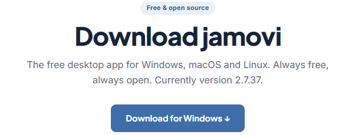

```{r setup}
library(knitr)
```

**Introduction**

Welcome to the first workshop! This is a hands-on session to get you
comfortable driving [Jamovi](https://www.jamovi.org), the statistics
software we'll use all trimester. Today is about the *tool*, not the
theory: opening data, cleaning it, and producing your first descriptive
statistics. You've already met these concepts in lectures, so this is
where you put them into practice.

You can come back to this page any time you need a reminder of how to do
something in Jamovi.

**What you'll do today**

-   Get set up with Jamovi (lab computer, your own laptop, or the cloud)
-   Learn to open, save, and export your work
-   Explore the dataset, fix data-entry errors, and recode variables
-   Produce descriptive statistics and choose appropriate plots

::: {.callout-note appearance="simple"}
{width="100%"} This week we're using the **Titanic
dataset** as a friendly, familiar way to explore Jamovi for the first
time. Don't worry about the statistics being "important" yet, the goal
is to find your way around.
:::

## What is Jamovi?

Jamovi is point-and-click statistical software built for students and
researchers. Under the hood it runs on **R** (a programming language for
statistics), but it shows everything through simple menus and buttons,
so you get powerful analysis without writing any code.

You'll use Jamovi to explore datasets visually, summarise data with
descriptive statistics. Later in the trimester we will use it to run
hypothesis tests. It lets you focus on *interpretation and
decision-making* rather than formulas (we'll save those for lectures).

::: {.callout-tip appearance="simple"}
**Two short videos** from *datalabccon* on YouTube walk through
navigating Jamovi and producing descriptive statistics. Handy if you get
lost in class or want to revisit later.




:::

## Getting set up {.unnumbered}

::: panel-tabset
### In the lab

Jamovi is **pre-installed on all lab computers**. Search for the
'Jamovi' in the Windows bar, open it, and follow along, nothing to
install.

{width="50px"}

### Your own laptop

You can install Jamovi for free:

1.  Visit [jamovi.org](https://www.jamovi.org/download.html)
2.  Click the download button, it should auto detect for macOS or
    Windows.
3.  Version 2.7 or above will be fine

{width="100%"}

### Chromebook / restricted device

If you can't install software, use **Jamovi Cloud** it runs in a
browser. It works, but can be slower or a little glitchy, so install the
desktop version if you can.
:::

### Get the practice file

We'll be working with a dataset called **`titanic.omv`**.

-   Dataset:
    [**titanic.omv**](https://lms.griffith.edu.au/courses/32192/files/9303980?wrap=1)
    *(the omv file means it will require Jamovi to open)*

::: {.callout-important appearance="simple"}
Save the dataset somewhere easy to find, you will be opening it next.
:::

------------------------------------------------------------------------

## The Jamovi essentials {.unnumbered}

Work through these tabs in order. Each one is a self-contained skill
you'll use constantly.

::: panel-tabset
### Open & Save

**Opening data**

1.  Open Jamovi
2.  Click the menu (≡) in the top-left
3.  Select **Open ▸ This PC...**
4.  Browse to your `.omv` file (e.g. `titanic.omv`)

The data opens in a spreadsheet view, ready to go.

**Saving data**

1.  Click the menu (≡)
2.  Select **Save As...**
3.  Choose a location and name your file
4.  Save with the `.omv` extension (Jamovi adds this automatically)

::: {.callout-tip appearance="simple"}
Jamovi opens `.omv`, `.csv`, and `.xlsx` files. Saving as `.omv` keeps
**both your data and your analysis** together in one file.
:::

### Export to PDF

As well as saving the full `.omv`, you can export just your **results**
(tables, graphs, outputs) to a clean PDF:

1.  Complete your analysis in Jamovi
2.  Click the menu (≡) in the top-left
3.  Choose **Export ▸ PDF**
4.  Pick a location and file name, then **Save**

::: {.callout-note appearance="simple"}
The PDF includes everything currently shown in the right-hand **results
panel**, but not the raw dataset.
:::

### Data vs Variables tabs

When you open a dataset you'll see a spreadsheet view with two key tabs.

**Data tab** (the default view)

-   Each **column** is a variable
-   Each **row** is a case or participant
-   Click any cell to view or edit a value

Use this to explore your raw data, just like in Excel.

{width="100%"}

**Variables tab**

This shows the *metadata* about each variable. Here you can:

-   Change a variable's **measure type** (continuous, ordinal, nominal)
    and **data type** (integer, decimal, text)
-   Add variable descriptions and units
-   Specify missing-value codes (e.g. `NA`, `-`, `999`). Left blank,
    Jamovi handles missing data automatically.

This is where you tell Jamovi *how to treat* your data which is crucial
for accurate analysis.

{width="100%"}

### Measure types

Setting the right measure type matters. Use this quick guide:

| Measure type   | What it means            | Example                   |
|----------------|--------------------------|---------------------------|
| **ID**         | Unique identifier        | Participant ID            |
| **Nominal**    | Categories with no order | Sex (M, F)                |
| **Ordinal**    | Ordered categories       | Education (BSc, MSc, PhD) |
| **Continuous** | Numeric scale            | Heart rate (60, 64, 59)   |

Try the helper below to check your understanding.

```{=html}
<div id="mt-helper" style="border:1px solid #d9d9d9; border-radius:8px; padding:16px 18px; margin:14px 0; background:#fafafa;">
  <label for="mt-select" style="display:block; font-weight:600; margin-bottom:8px;">Pick a variable, what measure type should it be?</label>
  <select id="mt-select" style="width:100%; max-width:420px; padding:8px; border:1px solid #bbb; border-radius:6px; font-size:15px;">
    <option value="">— choose a variable —</option>
    <option value="id">Passenger ID</option>
    <option value="nominal">Sex (male / female)</option>
    <option value="nominal2">Embarked port (Cherbourg / Queenstown / Southampton)</option>
    <option value="ordinal">Passenger class (1st / 2nd / 3rd)</option>
    <option value="continuous">Age in years</option>
    <option value="continuous2">Fare paid (£)</option>
  </select>
  <div id="mt-answer" style="margin-top:12px; font-size:15px; min-height:1.4em;"></div>
</div>
<script>
(function(){
  var ans = {
    id:        ["ID", "A unique label for each passenger, not something you'd average or order."],
    nominal:   ["Nominal", "Unordered categories. Male and female have no inherent rank."],
    nominal2:  ["Nominal", "Three ports with no natural order, just labels."],
    ordinal:   ["Ordinal", "Classes have a clear order (1st &gt; 2nd &gt; 3rd), but the 'gap' between them isn't a measured quantity."],
    continuous:["Continuous", "A measured number on a scale, you can take a mean, SD, etc."],
    continuous2:["Continuous", "Money on a continuous scale, means, ranges and quartiles all make sense."]
  };
  var sel = document.getElementById('mt-select');
  var out = document.getElementById('mt-answer');
  sel.addEventListener('change', function(){
    var v = ans[sel.value];
    if(!v){ out.innerHTML = ''; return; }
    out.innerHTML = '<strong style="color:#c0152f;">' + v[0] + '.</strong> ' + v[1];
  });
})();
</script>
```
### Entering data

How you enter data depends on the variable type.

**Quantitative (continuous)**

-   Enter values as numbers, one observation per row
-   e.g. a `body_mass` variable in kg → `57`, `72.4`, `63`

**Qualitative (categorical)**

-   Enter text labels *consistently*

::: {.callout-important appearance="simple"}
Be consistent with categories! Jamovi treats `"running"`, `"Running"`,
and `"Runing"` as **three different groups**.
:::

### Recoding & Filters

**Recoding values** (turning `0`/`1` into meaningful labels)

-   Go to the **Data** tab
-   Click the variable, then **Setup** in the top ribbon
-   Make sure the **Measure Type** is correct (e.g. Nominal)
-   In the **Levels** column, rename each value (e.g. `0` → *male*, `1`
    → *female*)

**Using filters** (focusing on a subset of the data)

-   Go to the **Data** tab and click **Filters**
-   Create a condition, for example `age > 50` or `sex == "female"`

{width="100%"}

| Symbol      | Meaning                       |
|-------------|-------------------------------|
| `==`        | equal to                      |
| `!=`        | not equal to                  |
| `>` / `<`   | greater than / less than      |
| `>=` / `<=` | greater/less than or equal to |

Tick or untick filters to activate them, and use the **eye icon**
(bottom-left) to show or hide rows that don't meet the condition.

{width="220px"}
:::

------------------------------------------------------------------------

## Generating descriptive statistics

Descriptive statistics are the **first step in any analysis**. They help
you understand your sample at a glance, spot data-entry errors, check
distributions and variability, and catch problems before running
anything more complex.

| For continuous variables   | For categorical variables         |
|----------------------------|-----------------------------------|
| mean, median, SD, min, max | counts (frequencies), percentages |

::: callout-tip
## Running descriptives in Jamovi

1.  Open Jamovi and load your dataset
2.  Go to the **Exploration** tab in the top menu
3.  Select **Descriptives**
4.  In the left panel, move your variable(s) into the **Variables** box
    (right panel)
    -   **Split by** divides results by a group (e.g. by `sex`)
5.  Choose your statistics under **Statistics** (mean, SD, etc.)
6.  Results appear instantly in the right-hand **Results** panel
7.  To run something else, go to the **Analyses** tab and pick your next
    test, it's added below the last one in the Results panel
:::

{width="100%"}

{width="100%"}

::: {.callout-tip appearance="simple"}
**Frequency tables:** tick *Frequency tables* in the Descriptives
options to see percentages for each level of a categorical variable.

**Table layout:** use the *Variables across* dropdown to flip whether
variables run in columns or rows which is handy for group comparisons.
:::

------------------------------------------------------------------------

## Tasks for you to do

Work through these in Jamovi, then **check your answers as you go**,
each task has a small answer box. Type (or select) what you found and
press **✓ Check**. You'll get instant feedback, and a hint appears if
you're stuck after a couple of tries.

The full **Worked answer** for each task is locked until you answer
correctly, and if you're really stuck, a *reveal* option appears after
three attempts, so have a genuine go first. A fully worked version (with
screenshots of every output) is released after all lab classes finish
for the week.

```{=html}
<style>
.ws-quiz{border:1px solid #d9d9d9;border-left:4px solid #2c7fb8;border-radius:8px;
  padding:16px 18px;margin:14px 0 20px 0;background:#fafafa;}
.ws-quiz p.ws-qtext{font-weight:600;margin:0 0 10px 0;}
.ws-quiz .ws-row{display:flex;flex-wrap:wrap;align-items:center;gap:8px;margin:6px 0;}
.ws-quiz label.ws-inlab{min-width:170px;font-size:15px;}
.ws-quiz input[type=number], .ws-quiz input[type=text]{
  width:110px;padding:6px 8px;border:1px solid #bbb;border-radius:6px;font-size:15px;}
.ws-quiz .ws-opt{display:block;margin:5px 0;font-size:15px;font-weight:400;}
.ws-quiz .ws-opt input{margin-right:7px;}
.ws-quiz button.ws-check{margin-top:10px;padding:7px 16px;border:1px solid #2c7fb8;
  border-radius:6px;background:#2c7fb8;color:#fff;font-size:15px;cursor:pointer;}
.ws-quiz button.ws-check:hover{background:#1f5f8b;}
.ws-quiz .ws-fb{display:block;margin-top:10px;font-size:15px;min-height:1.3em;}
.ws-quiz .ws-fb.ok{color:#2e7d32;font-weight:600;}
.ws-quiz .ws-fb.no{color:#c0152f;font-weight:600;}
.ws-quiz .ws-hint{display:none;margin-top:6px;font-size:14px;color:#555;
  border-top:1px dashed #ccc;padding-top:6px;}
.ws-quiz button.ws-reveal{display:block;margin-top:10px;padding:6px 14px;
  border:1px solid #bbb;border-radius:6px;background:#fff;color:#555;
  font-size:14px;cursor:pointer;}
.ws-quiz button.ws-reveal:hover{border-color:#c0152f;color:#c0152f;}
.ws-locked{display:none;}
.ws-lockednote{font-size:14px;color:#777;margin:-6px 0 18px 0;}
.ws-lockednote::before{content:"🔒 ";}
</style>
<script>
/* Lightweight formative answer-checking (no data leaves the page).
   Numeric inputs: data-answer + optional data-tol (tolerance).
   Radio questions: put data-answer on the .ws-quiz container.
   data-unlock: id of the worked-answer block to unlock on success
   (or via the reveal button after 3 attempts). */
function wsUnlock(id){
  var el = document.getElementById(id);
  if(el){ el.classList.remove('ws-locked'); }
  var note = document.querySelector('.ws-lockednote[data-for="' + id + '"]');
  if(note){ note.remove(); }
}
document.addEventListener('click', function(e){
  var btn = e.target.closest('.ws-check');
  if(!btn) return;
  var q  = btn.closest('.ws-quiz');
  var fb = q.querySelector('.ws-fb');
  var hint = q.querySelector('.ws-hint');
  var nums = q.querySelectorAll('input[data-answer]');
  var allOk = true, anyBlank = false;

  if(nums.length){
    nums.forEach(function(inp){
      if(inp.value.trim() === ''){ anyBlank = true; }
      var exp = parseFloat(inp.dataset.answer);
      var tol = parseFloat(inp.dataset.tol || 0);
      var val = parseFloat(inp.value);
      var ok  = !isNaN(val) && Math.abs(val - exp) <= tol;
      inp.style.borderColor = ok ? '#2e7d32' : '#c0152f';
      inp.style.background  = ok ? '#eef7ee' : '#fdf0f2';
      if(!ok) allOk = false;
    });
  } else if(q.dataset.answer !== undefined){
    var sel = q.querySelector('input[type=radio]:checked') ||
              q.querySelector('select');
    if(sel && sel.tagName === 'SELECT'){
      if(sel.value === ''){ anyBlank = true; allOk = false; }
      else allOk = (sel.value === q.dataset.answer);
    } else if(sel){
      allOk = (sel.value === q.dataset.answer);
    } else {
      anyBlank = true; allOk = false;
    }
  }

  if(anyBlank && !allOk){
    fb.className = 'ws-fb no';
    fb.textContent = 'Fill in an answer first, then press Check.';
    return;
  }

  q.dataset.tries = (parseInt(q.dataset.tries || '0', 10) + 1);

  if(allOk){
    fb.className = 'ws-fb ok';
    fb.textContent = '✓ Correct! ' + (q.dataset.okmsg || '');
    if(hint) hint.style.display = 'none';
    if(q.dataset.unlock){
      wsUnlock(q.dataset.unlock);
      fb.textContent += ' The worked answer is now unlocked below.';
      var rv = q.querySelector('.ws-reveal');
      if(rv) rv.remove();
    }
  } else {
    fb.className = 'ws-fb no';
    fb.textContent = '✗ Not quite. Go back to your Jamovi output and try again.';
    if(hint && q.dataset.tries >= 2){ hint.style.display = 'block'; }
    if(q.dataset.unlock && q.dataset.tries >= 3 && !q.querySelector('.ws-reveal')){
      var btn2 = document.createElement('button');
      btn2.type = 'button';
      btn2.className = 'ws-reveal';
      btn2.textContent = 'Stuck? Reveal the worked answer';
      btn2.addEventListener('click', function(){
        wsUnlock(q.dataset.unlock);
        btn2.remove();
        fb.className = 'ws-fb';
        fb.textContent = 'Worked answer unlocked below. Read it closely, then try to reproduce the output in Jamovi yourself.';
      });
      q.appendChild(btn2);
    }
  }
});
</script>
```
### Task 1 --- Recode the labels

a)  Recode **`embarked`** assuming `0 = cherbourg`, `1 = queenstown`,
    `2 = southampton`
b)  Recode **`survived`** assuming `0 = died`, `1 = survived`

Once you've recoded `embarked`, run a **frequency table** (Descriptives
▸ tick *Frequency tables*) and enter the counts below.

```{=html}
<div class="ws-quiz" data-unlock="t1-worked" data-okmsg="">
  <p class="ws-qtext">How many passengers embarked at each port?</p>
  <div class="ws-row"><label class="ws-inlab" for="t1-c">Cherbourg:</label>
    <input type="number" id="t1-c" data-answer="270"></div>
  <div class="ws-row"><label class="ws-inlab" for="t1-q">Queenstown:</label>
    <input type="number" id="t1-q" data-answer="123"></div>
  <div class="ws-row"><label class="ws-inlab" for="t1-s">Southampton:</label>
    <input type="number" id="t1-s" data-answer="914"></div>
  <button class="ws-check" type="button">✓ Check</button>
  <span class="ws-fb"></span>
  <div class="ws-hint"><strong>Hint:</strong> after recoding, go to
    <em>Exploration ▸ Descriptives</em>, move <code>embarked</code> into Variables,
    and tick <em>Frequency tables</em> at the bottom. The counts column is what you need.</div>
</div>
```
```{=html}
<p class="ws-lockednote" data-for="t1-worked">Worked answer locked. Answer correctly above to unlock it.</p>
```
::: {#t1-worked .callout-note .ws-locked collapse="true"}
## Worked answer

**Part a)** Once recoded, a frequency table of `embarked` gives:

| Embarked    | Counts | \% of total |
|-------------|--------|-------------|
| Cherbourg   | 270    | 21%         |
| Queenstown  | 123    | 9%          |
| Southampton | 914    | 70%         |

**Part b)** `survived` simply becomes **died** (`0`) and **survived**
(`1`). Recoding to meaningful labels makes every later table and plot
far easier to read.
:::

### Task 2 --- Find the obvious errors

Check the **`class`** and **`age`** variables for obvious errors and
correct them where needed. *Hint: look at the minimum and maximum
values.*

```{=html}
<div class="ws-quiz" data-unlock="t2-worked" data-okmsg="Both maximums are impossible. A 4th class doesn't exist and nobody lives to 224. These are data-entry errors to fix before any real analysis.">
  <p class="ws-qtext">Run Descriptives on <code>class</code> and <code>age</code>. What are the maximum values?</p>
  <div class="ws-row"><label class="ws-inlab" for="t2-cl">Maximum of <code>class</code>:</label>
    <input type="number" id="t2-cl" data-answer="4"></div>
  <div class="ws-row"><label class="ws-inlab" for="t2-ag">Maximum of <code>age</code>:</label>
    <input type="number" id="t2-ag" data-answer="224"></div>
  <button class="ws-check" type="button">✓ Check</button>
  <span class="ws-fb"></span>
  <div class="ws-hint"><strong>Hint:</strong> in Descriptives, make sure
    <em>Minimum</em> and <em>Maximum</em> are ticked under <em>Statistics</em>.
    Then ask yourself: is that value even possible on the Titanic?</div>
</div>
```
```{=html}
<p class="ws-lockednote" data-for="t2-worked">Worked answer locked. Answer correctly above to unlock it.</p>
```
::: {#t2-worked .callout-note .ws-locked collapse="true"}
## Worked answer

Running Descriptives on both variables:

|         | N    | Missing | Mean  | Median | SD    | Min | Max     |
|---------|------|---------|-------|--------|-------|-----|---------|
| Class   | 1309 | 0       | 2.30  | 3      | 0.839 | 1   | **4**   |
| Age (y) | 1309 | 0       | 29.64 | 28     | 13.99 | 0   | **224** |

Both **maximums are impossible**: there are only 3 classes on the ship
(so `4` is a typo), and no-one lives to `224` years. These are
data-entry errors you'd remove or correct before any real analysis.
:::

### Task 3 --- Which variable has the most missing data?

```{=html}
<div class="ws-quiz" data-unlock="t3-worked" data-answer="embarked" data-okmsg="Embarked has 2 missing values; every other variable is complete.">
  <p class="ws-qtext">Tick the <em>Missing</em> box in Descriptives. Which variable has the most missing data?</p>
  <label class="ws-opt"><input type="radio" name="t3" value="passenger">Passenger</label>
  <label class="ws-opt"><input type="radio" name="t3" value="age">Age</label>
  <label class="ws-opt"><input type="radio" name="t3" value="fare">Fare</label>
  <label class="ws-opt"><input type="radio" name="t3" value="embarked">Embarked</label>
  <label class="ws-opt"><input type="radio" name="t3" value="class">Class</label>
  <label class="ws-opt"><input type="radio" name="t3" value="survived">Survival</label>
  <button class="ws-check" type="button">✓ Check</button>
  <span class="ws-fb"></span>
  <div class="ws-hint"><strong>Hint:</strong> add <em>all</em> variables to the
    Variables box at once. The Missing row of the Descriptives table then compares
    every variable side by side.</div>
</div>
```
```{=html}
<p class="ws-lockednote" data-for="t3-worked">Worked answer locked. Answer correctly above to unlock it.</p>
```
::: {#t3-worked .callout-note .ws-locked collapse="true"}
## Worked answer

Tick the **Missing** box in Descriptives to get a missing-data count for
every variable:

| Variable                                                 | Missing |
|----------------------------------------------------------|---------|
| Passenger, Age, Fare, Sex, SibSp, ParCh, Class, Survival | 0       |
| **Embarked**                                             | **2**   |

**Embarked** has the most missing values (2); every other variable is
complete.
:::

### Task 4 --- Five-number summary

Generate a **five-number summary** for the **`fare`** variable, **split
by `survived`**. A five-number summary is **Min -- Q1 -- Median (Q2) --
Q3 -- Max**, the table version of a box plot.

```{=html}
<div class="ws-quiz" data-unlock="t4-worked" data-okmsg="Survivors paid more at every quartile. An early hint that fare (and class) relates to survival.">
  <p class="ws-qtext">From your split output, enter the median fare for each group:</p>
  <div class="ws-row"><label class="ws-inlab" for="t4-d">Median fare — <em>died</em>:</label>
    <input type="number" id="t4-d" step="0.1" data-answer="13" data-tol="0.5"></div>
  <div class="ws-row"><label class="ws-inlab" for="t4-s">Median fare — <em>survived</em>:</label>
    <input type="number" id="t4-s" step="0.1" data-answer="26" data-tol="0.5"></div>
  <div class="ws-row"><label class="ws-inlab" for="t4-q3">75th percentile (Q3) — <em>survived</em>:</label>
    <input type="number" id="t4-q3" step="0.1" data-answer="57" data-tol="0.5"></div>
  <button class="ws-check" type="button">✓ Check</button>
  <span class="ws-fb"></span>
  <div class="ws-hint"><strong>Hint:</strong> put <code>fare</code> in Variables and
    <code>survived</code> in <em>Split by</em>. Under <em>Statistics</em>, tick
    <em>Median</em> and the <em>Percentiles / Quartiles</em> options (25th, 50th, 75th).</div>
</div>
```
```{=html}
<p class="ws-lockednote" data-for="t4-worked">Worked answer locked. Answer correctly above to unlock it.</p>
```
::: {#t4-worked .callout-note .ws-locked collapse="true"}
## Worked answer

| Survival | Min | 25th (Q1) | 50th (Median) | 75th (Q3) | Max |
|----------|-----|-----------|---------------|-----------|-----|
| Died     | 0   | 7.0       | 13.0          | 27.0      | 512 |
| Survived | 0   | 12.0      | 26.0          | 57.0      | 512 |

Notice survivors paid more on average across every quartile. An early
hint that fare (and class) relates to survival.
:::

### Task 5 --- Choose appropriate visualisations

Create visualisations for **(a) age × survival** and **(b) sex ×
survival**. Choose the *right* table/graph for each variable type ---
frequency tables, histograms+density, box-plots, or bar-plots. Try
building each option in Jamovi (Descriptives ▸ **Plots**) before
answering below.

::: {.callout-tip appearance="simple"}
The lesson here isn't "make a graph", it's **matching the plot to the
variable type**. The best plot for age is *not* the best plot for sex.
:::

#### (a) Age × Survival

```{=html}
<div class="ws-quiz" data-unlock="t5a-worked" data-answer="box" data-okmsg="Age is continuous, so it deserves a plot that shows the whole distribution and the box-plot does this most cleanly once the impossible outlier is filtered out.">
  <p class="ws-qtext"><code>age</code> is continuous. Which plot best shows how age relates to survival?</p>
  <label class="ws-opt"><input type="radio" name="t5a" value="bar">A bar chart of mean age for died vs survived</label>
  <label class="ws-opt"><input type="radio" name="t5a" value="hist">A histogram + density, split by survival</label>
  <label class="ws-opt"><input type="radio" name="t5a" value="box">A box-plot of age, split by survival (outlier filtered out)</label>
  <button class="ws-check" type="button">✓ Check</button>
  <span class="ws-fb"></span>
  <div class="ws-hint"><strong>Hint:</strong> which of the three lets you see the
    median, the spread, <em>and</em> any remaining outliers at a glance, rather than
    collapsing everything to a single number?</div>
</div>
```
```{=html}
<p class="ws-lockednote" data-for="t5a-worked">Worked answer locked. Answer correctly above to unlock it.</p>
```
::: {#t5a-worked .callout-note .ws-locked collapse="true"}
## Worked answer --- (a) Age × Survival

`age` is continuous, so:

**A bar chart of means is a *poor* choice.** The two groups look almost
identical because everything about the distribution (spread, shape,
outliers) is hidden behind one mean (bar) per group:

{width="80%" fig-align="center"}

**A histogram + density is *better*.** Now you can see the shape of each
group, though the impossible `224` outlier stretches the x-axis and
squashes the real data into the left side:

{width="80%" fig-align="center"}

**A box-plot is *best*.** medians, quartiles, spread and outliers for
died vs survived, all in one view. You can even see the `224` data-entry
error sitting alone at the top; **filter it out (ID 656)** and the
comparison becomes clean:

{width="80%" fig-align="center"}

**Takeaway:** continuous data deserve a plot that shows the whole
distribution and/or individual data points, and cleaning errors matters.
:::

#### (b) Sex × Survival

```{=html}
<div class="ws-quiz" data-unlock="t5b-worked" data-answer="bar" data-okmsg="Sex is nominal-binary. Counts within groups is exactly what categorical data calls for.">
  <p class="ws-qtext"><code>sex</code> is nominal (binary). Which plot best shows how sex relates to survival?</p>
  <label class="ws-opt"><input type="radio" name="t5b" value="box">A box-plot of sex, split by survival</label>
  <label class="ws-opt"><input type="radio" name="t5b" value="dens">A density plot of sex, split by survival</label>
  <label class="ws-opt"><input type="radio" name="t5b" value="bar">A grouped bar / counts plot of sex within died vs survived</label>
  <button class="ws-check" type="button">✓ Check</button>
  <span class="ws-fb"></span>
  <div class="ws-hint"><strong>Hint:</strong> sex only takes two values (0/1). Does a
    "distribution" between those values even mean anything? What summary <em>does</em>
    make sense for categories?</div>
</div>
```
```{=html}
<p class="ws-lockednote" data-for="t5b-worked">Worked answer locked. Answer correctly above to unlock it.</p>
```
::: {#t5b-worked .callout-note .ws-locked collapse="true"}
## Worked answer --- (b) Sex × Survival

`sex` is nominal-binary, so:

**A box-plot *fails*:** Jamovi will draw one, but a "median sex" of 0 or
1 and boxes stretched between the two values are meaningless. This is a
classic sign of treating a categorical variable as continuous:

{width="80%"
fig-align="center"}

**A density plot also *fails*:** the smooth curves imply values
*between* male and female that don't exist. All the real data is piled
at exactly 0 and 1:

{width="80%" fig-align="center"}

**A grouped bar / counts plot is *best*:** counts of male/female within
died/survived is exactly what nominal-binary data calls for, and the
pattern (most men died; women were far more likely to survive) is
instantly readable:

{width="80%" fig-align="center"}

**Takeaway:** categorical data want counts and groups, not distribution
plots. Always pick the visualisation that suits the data **and** the
research question (in this case, might there be a relationship between
sex and survival?).
:::

------------------------------------------------------------------------

## How this links to assessment

There's no standalone Jamovi assignment, but:

-   Your online exams may include questions referencing Jamovi output or
    techniques
-   You'll use Jamovi throughout your **Portfolio of Evidence**
    activities

::: {.callout-tip appearance="simple"}
**The more you explore, the easier Jamovi gets.** It's designed to be
intuitive. Don't be afraid to click around and try things. Many free
practice datasets (`.csv`) are at
[kaggle.com/datasets](https://www.kaggle.com/datasets) if you want to
apply each week's skills to new data.
:::

------------------------------------------------------------------------

## That's it for Jamovi today.

Hopefully it didn't feel too long...

{width="50%"}

**Now get ready for your practice attempt for the group Portfolio of
Evidence activity (20mins):**

-   Put all phones, laptops, electronic devices away

-   Turn off the lab computers

-   You can have a calculator, ruler, pen

-   You can write/draw on the exam sheet

-   Please include all names and s numbers for all group members

-   1 mark for first correct scratch, 1/2 mark for second, 1/4 for
    third, 0 for forth and fifth

-   Work together as a team :)

## Getting help

During the session I'll circulate to help, don't be afraid to ask. After
the workshop, revisit this page, check your module notes for
interpretation help, or post in the Microsoft Teams channel, email me,
or [**book an office hours
meeting**](https://lms.griffith.edu.au/courses/32192#cc-collection-4).

------------------------------------------------------------------------

## References

\[1\] The jamovi project (2024). *jamovi.* (Version 2.6) \[Computer
Software\]. Retrieved from <https://www.jamovi.org>.

\[2\] R Core Team (2024). *R: A Language and environment for statistical
computing.* (Version 4.4) \[Computer software\]. Retrieved from
<https://cran.r-project.org>.

\[3\] Kaggle (2024). *Titanic - Machine Learning from Disaster.* \[Data
set\]. Retrieved from <https://www.kaggle.com/c/titanic>.

------------------------------------------------------------------------

*Document prepared by Aaron Bach using Quarto.*
