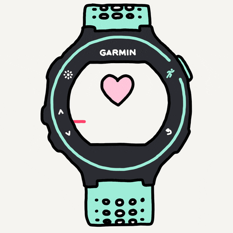
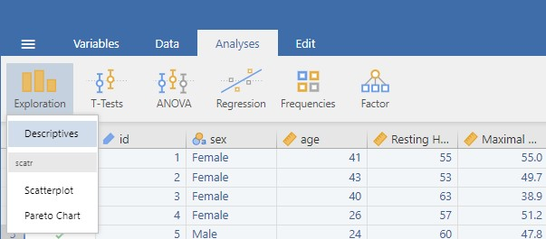
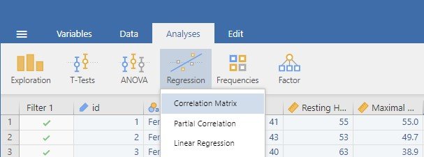
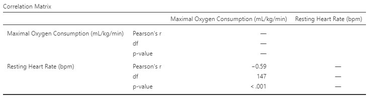
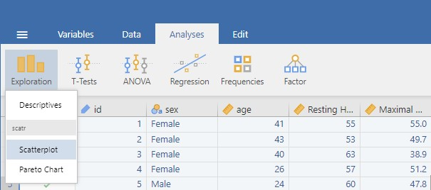
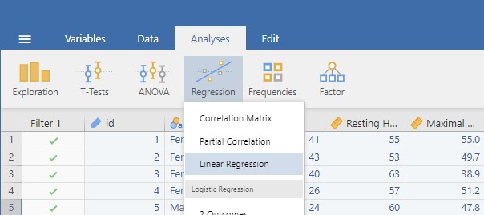
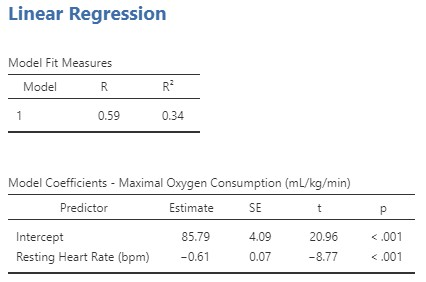
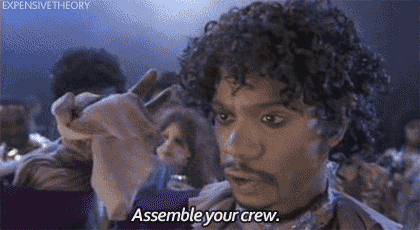

```{r setup}
library(knitr)
```

**Introduction**

Welcome back! Last week you learned to *drive* Jamovi: opening data,
cleaning it, and producing descriptives. This week we ask our first real
research question of the trimester and answer it with **correlation**
and **simple linear regression (SLR)**.

You met all of these ideas in **Lecture 4 - Association Between Groups**
(r, r², the regression equation ŷ = a + bx, assumptions, outliers).
Today is where you run them on real data, check the assumptions
yourself, and practise writing the results up in plain English.

You can come back to this page any time you need a reminder of how to do
something in Jamovi.

**What you'll do today**

-   Explore a new dataset with descriptives and histograms
-   Run a **correlation** (Pearson's r) and interpret its direction and
    strength
-   Build a **scatterplot** with a regression line
-   Run a **simple linear regression**, write the equation, and use it
    to predict
-   Check the **assumptions** (normality of residuals, homoscedasticity)
    and consider outliers
-   Finish with the **group Portfolio of Evidence activity** (counts for
    marks this time, details at the end)

::: {.callout-note appearance="simple"}
{fig-align="center"}

This week's dataset looks at aerobic athletic prediction focusing on
**resting heart rate vs. VO₂max** (a measure of aerobic fitness). Unlike
the Titanic data, this one *is* related to health statistics.
:::

## Why correlation & regression?

Correlation and simple linear regression both examine the relationship
between **two continuous variables**, but they answer slightly different
questions:

| Question                                                                     | Tool                          | What you get                     |
|-------------------------------------|------------------|------------------|
| *How strongly do these two variables move together, and in which direction?* | **Correlation** (Pearson's r) | One number between −1 and +1     |
| *Can I predict one variable from the other, and by how much?*                | **Simple linear regression**  | An equation: ŷ = a + bx, plus r² |

Correlation is **descriptive and symmetric**: the correlation between
height and weight is identical to the correlation between weight and
height. Regression is **directional and predictive**: you must choose
which variable is the *predictor* (x) and which is the *outcome* (y),
and the equation lets you plug in an x and predict a y. (This is why
swapping the axes in Task 3 *would* change your regression equation,
even though it wouldn't change r.)

::: {.callout-important appearance="simple"}
**One thing r cannot see: curves.** Pearson's r only measures
*straight-line* association. Two variables can have a strong, perfectly
real relationship that happens to be curved (think drug dose vs.
benefit: rises, peaks, then falls), and r can come out near **zero**.
This is why the golden rule of this workshop is: **always plot your data
first**. If the scatterplot isn't roughly a straight-line cloud, r and
the regression line will mislead you.
:::

::: {.callout-note appearance="simple"}
**A real-world example...** a pharmacist might examine the relationship
between drug dose and plasma concentration. Correlation tells them how
strongly the two are associated (e.g. r = 0.85, a very strong positive
relationship), while regression provides the equation to *predict*
plasma concentration from a given dose, crucial for therapeutic drug
monitoring and dosing decisions.
:::

::: {.callout-tip appearance="simple"}
**Pearson vs. Spearman, in passing.** Pearson's r (what we use) measures
*linear* association between two continuous variables and is a
**parametric** statistic. You may also see **Spearman's rho** in
Jamovi's options, a rank-based (non-parametric) cousin used when data
are ordinal or badly non-normal. In this course we focus on parametric
tests (plus chi-square later), so Pearson is our tool, but it's good to
recognise Spearman when you see it in papers.
:::

::: {.callout-tip appearance="simple"}
**Two short videos** on running a *Correlation Matrix* and *Linear
Regression* by *datalabcc* on YouTube. Note both videos use **more than
two** variables (*multiple regression*); we only cover **simple**
(two-variable) correlation and regression in this course, so the ideas
transfer, just ignore the extra variables.




:::

------------------------------------------------------------------------

## The regression essentials {.unnumbered}

Work through these tabs before starting the tasks. They're the theory
from Lecture 4 condensed into what you need at the keyboard, plus a
first friendly look at three new columns (SE, t, p) that will appear in
your output.

::: panel-tabset
### The equation

From Lecture 4, the simple linear regression line is:

$$\hat{y} = a + bx$$

| Symbol    | Name            | Meaning                                                             |
|----------------|----------------|-----------------------------------------|
| $\hat{y}$ | predicted value | the outcome the *line* predicts (the "hat" = predicted, not actual) |
| $a$       | intercept       | predicted y when x = 0                                              |
| $b$       | slope           | how much y changes for every 1-unit increase in x                   |
| $x$       | predictor       | the value you plug in                                               |

And remember the **residual** = actual y − predicted ŷ, the vertical
distance from each point to the line. A positive residual means the
person sits *above* the line (the model under-predicted them); a
negative residual means they sit *below* it (over-predicted).

**Where does "the" line come from?** Imagine laying a ruler through the
scatterplot by eye, you could draw hundreds of plausible lines. The
regression line is the single line that makes the **squared residuals as
small as possible** (the *least squares* line). Squaring does two useful
things: it stops positive and negative misses cancelling out, and it
punishes big misses much more than small ones, which is exactly why one
extreme outlier can drag the whole line (Task 5).

### r vs r²

Two numbers, two jobs:

-   **r (correlation coefficient):** direction *and* strength of the
    linear association, from −1 to +1. It's an **effect size**.
-   **r² (coefficient of determination):** the *proportion of variance*
    in y explained by x, from 0 to 1. Multiply by 100 to talk in
    percentages ("x explains 31% of the variance in y"). r² is literally
    r × r, so the sign always disappears.

| r value    | Strength of association |
|------------|-------------------------|
| 0.00--0.10 | negligible              |
| 0.10--0.30 | weak                    |
| 0.30--0.50 | weak-to-moderate        |
| 0.50--0.70 | moderate                |
| 0.70--0.90 | strong                  |
| 0.90--1.00 | very strong             |

The sign (+/−) never affects strength, r = −0.55 and r = +0.55 are
equally strong, just in opposite directions. And remember these are
*guidelines*, not laws: in some fields an r of 0.20 is a big deal.

### Assumptions

Simple linear regression trusts your data to behave. From Lecture 4, the
assumptions (and how we check each one **today**):

| Assumption                    | What it means                                      | How we check it in Jamovi                                                             |
|------------------|---------------------|----------------------------------|
| **Linearity**                 | X and Y follow a straight-line relationship        | Scatterplot (Task 3), does a line make sense?                                         |
| **Independence**              | Each observation is unrelated to the others        | Can't check with a plot! It comes from *study design* (one row = one separate person) |
| **Normality**                 | The **residuals** are normally distributed         | Q-Q plot of residuals (Task 4b)                                                       |
| **Homoscedasticity**          | The spread of residuals is constant along the line | Residuals vs. fitted plot, look for *funnelling* (Task 4b)                            |
| **No influential outliers**\* | Extreme points can drag the whole line             | Boxplot of residuals / 3s rule (Task 5)                                               |

\**not strictly an assumption, but outliers can distort b, r and r², so
we treat them with care.*

::: {.callout-note appearance="simple"}
**Why bother checking?** Jamovi will happily draw a line and print
p-values through *any* data, it never warns you. If the assumptions are
violated, the line still exists but the p-values and predictions can no
longer be trusted. The checks are your quality control, not decoration.
Note two common mix-ups: (1) it's the **residuals** that must be normal,
not the raw variables themselves (the Task 1 histograms are a
data-screening step, not the normality check); (2) homoscedasticity is
about the *spread* of residuals staying constant, if the spread funnels
outwards, your predictions get less trustworthy at that end of the line.
:::

{width="100%"}

::: {.callout-tip appearance="simple"}
**What is a Q-Q plot?** It compares your actual residuals to what you'd
expect if they were perfectly normally distributed. Each dot is **one
participant's residual**. **X-axis:** the value that residual "should"
have if the data were perfectly normal (a theoretical quantile, written
as a z-score). **Y-axis:** the residual's actual standardised value.
**The diagonal line:** where a dot lands when actual = expected, i.e.
perfect normality. So the question you ask is simply *"do the dots hug
the diagonal?"* Yes → residuals look normal. Real data always wobbles a
little at the very top and bottom ends; that's fine. A pronounced
S-shape or a curve bending away from the line through the *middle* is
the warning sign. (You'll read your own Q-Q plot in Task 4b.)
:::

{width="80%" fig-align="center"}

::: {.callout-tip appearance="simple"}
**Residual plots:** Jamovi gives you three. Let's just worry about the
first **(Fitted)** it is the important one, residuals plotted against
your regression line's predictions. The other two plot residuals against
each individual variable we can ignore today. A funnel =
heteroscedasticity (violation of assumption), meaning the model predicts
some people much better than others, so predictions (and p-values)
become less reliable at the wide end of the funnel.
:::

### Reading the output (SE, t, p)

When you run a regression, Jamovi shows more columns than we've met so
far. Here's your **first gentle introduction**, we'll cover the full
machinery (z-, t-, F-, and chi-square tests) later in the trimester
under *hypothesis testing*. For today, this plain-English version is all
you need:

| Column                  | Plain-English meaning                                                                                                                                                                                                                                                                |
|----------------|--------------------------------------------------------|
| **Estimate**            | The two numbers that *build your line*. The **Intercept** row is *a*; the row named after your predictor (here "Resting Heart Rate") is the slope *b*. Read the table one row at a time, left to right: each row gives that number's Estimate, then its SE, t and p.                 |
| **SE (standard error)** | How *precise* that estimate is. Ask: "if I repeated this whole study with a fresh sample of 150 people, how much would this number wobble?" Small SE = we've pinned the number down tightly; big SE = it's fuzzy. (Same idea as SEM from Week 1, but for a slope instead of a mean.) |
| **t**                   | The estimate divided by its SE, i.e. "how many SEs is this estimate away from zero?" A big value (far from 0, in either direction) = the effect stands out clearly from the noise                                                                                                    |
| **p**                   | If there were *truly no relationship*, how often would random sampling alone produce a result **at least this strong**? Small p (below 0.05 by convention) = hard to explain away as chance, we call it **statistically significant**                                                |

So, reading the **slope row** of our example output as one sentence:
"the slope Estimate is −0.61, it's pinned down to within an SE of 0.07,
that's about 9 SEs from zero (t ≈ −8.8), so p is tiny." That single row
is the whole regression in a nutshell.

```{=html}
<!-- PLACEHOLDER IMAGE: annotated coefficients table.
     Generate with WS2_placeholder_figures.R (WS2_coeff_annotated.png)
     or replace with an annotated Jamovi screenshot. -->
```
{width="90%" fig-align="center"}

::: {.callout-note appearance="simple"}
Notice the chain: **t = Estimate ÷ SE**, and **p is calculated from t**.
So the three new columns are really one idea, *how confidently does this
estimate stand out from zero (i.e., no association)?* File that away;
it's the seed of everything in the hypothesis-testing weeks.
:::

::: {.callout-warning appearance="simple"}
**Two things p does NOT mean** (the most common exam traps in
statistics, we will have a dedicated lecture to this):

1.  p is **not** the probability that the relationship is real, and 1 −
    p is not your "confidence" in the result. p only describes how
    surprising your data would be *in a world where no relationship
    exists*.
2.  A small p does **not** mean the effect is big or important. With a
    huge sample, even a tiny, useless correlation becomes "significant".
    **p answers "is it detectable?"; r and r² answer "how big is it?"**
    You need both, which is why our write-up template reports both.
:::
:::

------------------------------------------------------------------------

## Get the practice file

{fig-align="center" width="259"}

-   Dataset:
    [**hr_vo2.omv**](https://lms.griffith.edu.au/courses/32192/files/9303980?wrap=1)

::: {.callout-important appearance="simple"}
Save the dataset somewhere easy to find, then open it in Jamovi.
:::

## Research question

> **Can we predict someone's fitness (Maximal Oxygen Consumption,
> VO₂max) from their resting heart rate?**

Before you touch anything: which variable is the **predictor (x)** and
which is the **outcome (y)**? Physiologically, a lower resting heart
rate reflects a fitter heart, so we'll use **Resting Heart Rate →
predictor** and **VO₂max → outcome**.

------------------------------------------------------------------------

## Tasks for you to do

Work through these in Jamovi in order, then **check your answers as you
go**, each task has a small answer box. Type (or select) what you found
and press **✓ Check**. You'll get instant feedback, and a hint appears
if you're stuck after a couple of tries.

The full **Worked answer** for each task is locked until you answer
correctly, and if you're really stuck, a *reveal* option appears after
three attempts, so have a genuine go first. A fully worked version (with
screenshots of every output) is released after all lab classes finish
for the week.


```{=html}
<style>
.ws-quiz{border:1px solid #d9d9d9;border-left:4px solid #2c7fb8;border-radius:8px;
  padding:16px 18px;margin:14px 0 20px 0;background:#fafafa;}
.ws-quiz p.ws-qtext{font-weight:600;margin:0 0 10px 0;}
.ws-quiz .ws-row{display:flex;flex-wrap:wrap;align-items:center;gap:8px;margin:6px 0;}
.ws-quiz label.ws-inlab{min-width:170px;font-size:15px;}
.ws-quiz input[type=number], .ws-quiz input[type=text]{
  width:110px;padding:6px 8px;border:1px solid #bbb;border-radius:6px;font-size:15px;}
.ws-quiz .ws-opt{display:block;margin:5px 0;font-size:15px;font-weight:400;}
.ws-quiz .ws-opt input{margin-right:7px;}
.ws-quiz button.ws-check{margin-top:10px;padding:7px 16px;border:1px solid #2c7fb8;
  border-radius:6px;background:#2c7fb8;color:#fff;font-size:15px;cursor:pointer;}
.ws-quiz button.ws-check:hover{background:#1f5f8b;}
.ws-quiz .ws-fb{display:block;margin-top:10px;font-size:15px;min-height:1.3em;}
.ws-quiz .ws-fb.ok{color:#2e7d32;font-weight:600;}
.ws-quiz .ws-fb.no{color:#c0152f;font-weight:600;}
.ws-quiz .ws-hint{display:none;margin-top:6px;font-size:14px;color:#555;
  border-top:1px dashed #ccc;padding-top:6px;}
.ws-quiz button.ws-reveal{display:block;margin-top:10px;padding:6px 14px;
  border:1px solid #bbb;border-radius:6px;background:#fff;color:#555;
  font-size:14px;cursor:pointer;}
.ws-quiz button.ws-reveal:hover{border-color:#c0152f;color:#c0152f;}
.ws-locked{display:none;}
.ws-lockednote{font-size:14px;color:#777;margin:-6px 0 18px 0;}
.ws-lockednote::before{content:"🔒 ";}
</style>
<script>
/* Lightweight formative answer-checking (no data leaves the page).
   Numeric inputs: data-answer + optional data-tol (tolerance).
   Radio questions: put data-answer on the .ws-quiz container.
   data-unlock: id of the worked-answer block to unlock on success
   (or via the reveal button after 3 attempts). */
function wsUnlock(id){
  var el = document.getElementById(id);
  if(el){ el.classList.remove('ws-locked'); }
  var note = document.querySelector('.ws-lockednote[data-for="' + id + '"]');
  if(note){ note.remove(); }
}
document.addEventListener('click', function(e){
  var btn = e.target.closest('.ws-check');
  if(!btn) return;
  var q  = btn.closest('.ws-quiz');
  var fb = q.querySelector('.ws-fb');
  var hint = q.querySelector('.ws-hint');
  var nums = q.querySelectorAll('input[data-answer]');
  var allOk = true, anyBlank = false;

  if(nums.length){
    nums.forEach(function(inp){
      if(inp.value.trim() === ''){ anyBlank = true; }
      var exp = parseFloat(inp.dataset.answer);
      var tol = parseFloat(inp.dataset.tol || 0);
      var val = parseFloat(inp.value);
      var ok  = !isNaN(val) && Math.abs(val - exp) <= tol;
      inp.style.borderColor = ok ? '#2e7d32' : '#c0152f';
      inp.style.background  = ok ? '#eef7ee' : '#fdf0f2';
      if(!ok) allOk = false;
    });
  } else if(q.dataset.answer !== undefined){
    var sel = q.querySelector('input[type=radio]:checked') ||
              q.querySelector('select');
    if(sel && sel.tagName === 'SELECT'){
      if(sel.value === ''){ anyBlank = true; allOk = false; }
      else allOk = (sel.value === q.dataset.answer);
    } else if(sel){
      allOk = (sel.value === q.dataset.answer);
    } else {
      anyBlank = true; allOk = false;
    }
  }

  if(anyBlank && !allOk){
    fb.className = 'ws-fb no';
    fb.textContent = 'Fill in an answer first, then press Check.';
    return;
  }

  q.dataset.tries = (parseInt(q.dataset.tries || '0', 10) + 1);

  if(allOk){
    fb.className = 'ws-fb ok';
    fb.textContent = '✓ Correct! ' + (q.dataset.okmsg || '');
    if(hint) hint.style.display = 'none';
    if(q.dataset.unlock){
      wsUnlock(q.dataset.unlock);
      fb.textContent += ' The worked answer is now unlocked below.';
      var rv = q.querySelector('.ws-reveal');
      if(rv) rv.remove();
    }
  } else {
    fb.className = 'ws-fb no';
    fb.textContent = '✗ Not quite. Go back to your Jamovi output and try again.';
    if(hint && q.dataset.tries >= 2){ hint.style.display = 'block'; }
    if(q.dataset.unlock && q.dataset.tries >= 3 && !q.querySelector('.ws-reveal')){
      var btn2 = document.createElement('button');
      btn2.type = 'button';
      btn2.className = 'ws-reveal';
      btn2.textContent = 'Stuck? Reveal the worked answer';
      btn2.addEventListener('click', function(){
        wsUnlock(q.dataset.unlock);
        btn2.remove();
        fb.className = 'ws-fb';
        fb.textContent = 'Worked answer unlocked below. Read it closely, then try to reproduce the output in Jamovi yourself.';
      });
      q.appendChild(btn2);
    }
  }
});
</script>
```
### Task 1 --- Descriptives & histograms

First, get to know the data (this should feel like last week):

a)  Check the **Variables** tab: are the names sensible, and are the
    measure types right (`id` = ID, `sex` = nominal, `age`,
    `Resting Heart Rate`, `Maximal Oxygen Consumption` = continuous)?
b)  Run **Exploration ▸ Descriptives** on the two primary variables
    (Resting HR and VO₂max): N, missing, mean, median, SD, min, max.
c)  Tick **Histogram** (and *Density*) under **Plots**. Is each variable
    roughly normal, or skewed?

::: {.callout-note appearance="simple"}
**Why screen first?** Three quick sanity checks before any analysis:
**impossible values** (e.g. a resting HR of 300 bpm is a typo, not a
person), **missing data** (does N match the number of participants you
expected?), and **shape** (a heavily skewed variable is a heads-up to
look extra carefully at the scatterplot and residual checks later). Note
this is *not* the formal normality assumption, that applies to the
**residuals** and gets checked properly in Task 4b.
:::

{width="100%"}

```{=html}
<div class="ws-quiz" data-unlock="t1-worked" data-okmsg="">
  <p class="ws-qtext">From your Descriptives table:</p>
  <div class="ws-row"><label class="ws-inlab" for="t1-n">N (participants):</label>
    <input type="number" id="t1-n" data-answer="150"></div>
  <div class="ws-row"><label class="ws-inlab" for="t1-hr">Mean Resting HR (bpm):</label>
    <input type="number" id="t1-hr" step="0.1" data-answer="58.8" data-tol="0.5"></div>
  <div class="ws-row"><label class="ws-inlab" for="t1-vo">Mean VO₂max (mL/kg/min):</label>
    <input type="number" id="t1-vo" step="0.1" data-answer="49.9" data-tol="0.5"></div>
  <button class="ws-check" type="button">✓ Check</button>
  <span class="ws-fb"></span>
  <div class="ws-hint"><strong>Hint:</strong> Exploration ▸ Descriptives, move both
    variables into the Variables box. N and Mean are on by default; tick anything
    missing under <em>Statistics</em>.</div>
</div>
```
```{=html}
<p class="ws-lockednote" data-for="t1-worked">Worked answer locked. Answer correctly above to unlock it.</p>
```
::: {#t1-worked .callout-note .ws-locked collapse="true"}
## Worked answer

|                    | N   | Missing | Mean  | Median | SD   | Min  | Max  |
|--------------------|-----|---------|-------|--------|------|------|------|
| Resting HR (bpm)   | 150 | 0       | 58.77 | 59.00  | 4.99 | 46.0 | 81.0 |
| VO₂max (mL/kg/min) | 150 | 0       | 49.95 | 50.30  | 5.17 | 33.3 | 63.1 |

{width="90%" fig-align="center"}

Nothing impossible in the min/max, no missing data, and both
distributions look approximately normal (mean ≈ median is another quick
clue). Good to proceed. (If you saw a resting HR of 300 here, you'd deal
with it *before* any correlation, exactly like the Titanic age of 224
last week.)
:::

### Task 2 --- Correlation (Pearson's r)

-   Go to **Analyses ▸ Regression ▸ Correlation Matrix**
-   Move both variables of interest into the box on the right
-   Your output should look like the one below (similar, not identical
    values)

{width="100%"}

{width="80%" fig-align="center"}

In the output we care about **Pearson's r**, the **correlation
coefficient**. You'll also see **df** (degrees of freedom = n − 2).
Don't worry about df for now, it's a book-keeping number the test needs
and we'll meet it properly in the hypothesis-testing weeks; just report
it. Finally there's a **p-value**: here it is tiny (p \< .001), which we
state as *resting heart rate is significantly correlated with VO₂max*.

```{=html}
<div class="ws-quiz" data-unlock="t2-worked" data-okmsg="r = −0.55: as resting heart rate goes up, VO₂max goes down.">
  <p class="ws-qtext">From your Correlation Matrix:</p>
  <div class="ws-row"><label class="ws-inlab" for="t2-r">Pearson's r:</label>
    <input type="number" id="t2-r" step="0.01" data-answer="-0.55" data-tol="0.01"></div>
  <div class="ws-row"><label class="ws-inlab" for="t2-df">df:</label>
    <input type="number" id="t2-df" data-answer="148"></div>
  <button class="ws-check" type="button">✓ Check</button>
  <span class="ws-fb"></span>
  <div class="ws-hint"><strong>Hint:</strong> Analyses ▸ Regression ▸ Correlation
    Matrix, then read the <em>Pearson's r</em> and <em>df</em> rows where the two
    variables cross. Don't drop the minus sign!</div>
</div>
```
```{=html}
<div class="ws-quiz" data-answer="strongneg" data-okmsg="">
  <p class="ws-qtext">Interpret the r value (direction and strength, using the benchmarks table in the <em>r vs r²</em> tab):</p>
  <label class="ws-opt"><input type="radio" name="t2b" value="weakpos">Weak positive relationship</label>
  <label class="ws-opt"><input type="radio" name="t2b" value="modneg">Negligible negative relationship</label>
  <label class="ws-opt"><input type="radio" name="t2b" value="strongneg">Moderate-to-strong negative relationship</label>
  <label class="ws-opt"><input type="radio" name="t2b" value="perfneg">Perfect negative relationship</label>
  <button class="ws-check" type="button">✓ Check</button>
  <span class="ws-fb"></span>
  <div class="ws-hint"><strong>Hint:</strong> the sign gives direction; the size gives
    strength. Where does 0.55 sit in the benchmarks table? Lecture 4 bands say
    0.5–0.7 = moderate; Cohen's guide says 0.5 = strong.</div>
</div>
```
```{=html}
<p class="ws-lockednote" data-for="t2-worked">Worked answer locked. Answer correctly above to unlock it.</p>
```
::: {#t2-worked .callout-note .ws-locked collapse="true"}
## Worked answer

**r(148) = −0.55, p \< .001.**

-   **Direction:** negative, higher resting heart rate goes with *lower*
    VO₂max.
-   **Strength:** by the Lecture 4 bands this is *moderate* (0.5--0.7).
-   **df = 148** because df = N − 2 = 150 − 2.
-   **p \< .001**: if there were truly no relationship between resting
    HR and VO₂max in the population, random sampling would almost never
    produce a correlation at least this strong in a sample of 150. In a
    sentence: resting HR is *significantly* correlated with VO₂max.
    Careful though: this does *not* mean there's a \>99.9% chance the
    relationship is real.

::: {.callout-note appearance="simple"}
Beyond direction, r is an **effect size**: it tells us how *meaningful*
the relationship is in practical terms, and unlike p, it doesn't inflate
just because the sample is big. What counts as "meaningful" depends on
your field; in some areas r = 0.20 is a big deal! We'll unpack
**practical vs. statistical significance** later in the trimester.
:::
:::

### Task 3 --- Scatterplot (visualising the SLR)

-   Navigate to **Exploration ▸ Scatterplot**
-   Put your **predictor** in the `X-Axis` box and your **outcome** in
    the `Y-Axis` box
-   Under `Regression line`, tick **Linear** to overlay the SLR line

::: {.callout-tip appearance="simple"}
Newer versions of Jamovi also let you build a scatterplot straight from
the **Plots** tab (in the variable setup screen, before you hit *edit*).
Either route gives the same picture, we'll use **Exploration ▸
Scatterplot** here so everyone's on the same menu.
:::

{width="100%"}

```{=html}
<div class="ws-quiz" data-unlock="t3-worked" data-answer="hrx" data-okmsg="Predictor (explanatory) on the x-axis, outcome (response) on the y-axis, straight from Lecture 4.">
  <p class="ws-qtext">Which variable goes on which axis?</p>
  <label class="ws-opt"><input type="radio" name="t3" value="hrx">Resting HR on X (predictor), VO₂max on Y (outcome)</label>
  <label class="ws-opt"><input type="radio" name="t3" value="vox">VO₂max on X (predictor), Resting HR on Y (outcome)</label>
  <label class="ws-opt"><input type="radio" name="t3" value="either">Either way, it makes no difference to the regression</label>
  <button class="ws-check" type="button">✓ Check</button>
  <span class="ws-fb"></span>
  <div class="ws-hint"><strong>Hint:</strong> our research question is "can we predict
    <em>fitness</em> from <em>resting heart rate</em>". The thing doing the predicting
    (explanatory variable) always goes on the x-axis. And no, it's not symmetric,
    swapping the axes changes the regression equation (unlike correlation!).</div>
</div>
```
```{=html}
<p class="ws-lockednote" data-for="t3-worked">Worked answer locked. Answer correctly above to unlock it.</p>
```
::: {#t3-worked .callout-note .ws-locked collapse="true"}
## Worked answer

{width="85%" fig-align="center"}

While you're here, do the **first two assumption checks by eye**:

-   **Linearity:** the cloud of points follows a straight downward
    trend, a line is a sensible model (no obvious curve or U-shape).
-   **Outliers:** scan for points sitting far from the pack, especially
    far *vertically* from the line, or way out at the ends of the x-axis
    (those have the most leverage to tilt the line). One point low-left
    sits noticeably below the pack, keep an eye on it; Task 5 shows you
    how to handle it formally.

This is also the plot you'd put in a report: readers grasp
"downhill-sloping cloud" faster than any table.
:::

### Task 4a --- Simple Linear Regression (SLR)

-   Navigate to **Analyses ▸ Regression ▸ Linear Regression**
-   Put your **predictor** (Resting Heart Rate) in `Covariates` and your
    **outcome** (VO₂max) in `Dependent Variable`
-   Your output has two sections: **Model Fit Measures** and **Model
    Coefficients**

{width="100%"}

{width="70%" fig-align="center"}

Reading the example:

-   **Model Fit ▸ R²:** the proportion of variance in VO₂max explained
    by resting HR, multiply by 100 for a percentage. In *simple* linear
    regression, R² is just your Task 2 correlation squared, check it:
    (−0.59)² ≈ 0.34 ✓
-   **Model Coefficients ▸ Estimate:** the **Intercept** (predicted
    VO₂max when resting HR = 0) and the **slope** for Resting Heart Rate
    (change in *predicted* VO₂max per 1 bpm)
-   **SE, t, p:** precision, signal-vs-noise, and chance, exactly as in
    the *Reading the output* tab. Notice t = Estimate ÷ SE (try it:
    −0.61 ÷ 0.07 ≈ −8.8 ✓)

::: {.callout-important appearance="simple"}
Jamovi's regression also reports **R** (capitalised for some reason)
under Model Fit. It's always shown as *positive*, so it tells you
strength but **not** direction, that's why we ran the correlation first
in Task 2 (which keeps the minus sign). To avoid confusion you can
untick "R" under `Model Fit` and take direction from your Task 2
correlation.
:::

```{=html}
<div class="ws-quiz" data-unlock="t4a-worked" data-okmsg="">
  <p class="ws-qtext">From your regression output, build the equation ŷ = a + bx:</p>
  <div class="ws-row"><label class="ws-inlab" for="t4-a">Intercept (a):</label>
    <input type="number" id="t4-a" step="0.01" data-answer="83.73" data-tol="0.1"></div>
  <div class="ws-row"><label class="ws-inlab" for="t4-b">Slope (b):</label>
    <input type="number" id="t4-b" step="0.01" data-answer="-0.57" data-tol="0.02"></div>
  <div class="ws-row"><label class="ws-inlab" for="t4-r2">R² :</label>
    <input type="number" id="t4-r2" step="0.01" data-answer="0.31" data-tol="0.02"></div>
  <button class="ws-check" type="button">✓ Check</button>
  <span class="ws-fb"></span>
  <div class="ws-hint"><strong>Hint:</strong> Intercept and slope live in the
    <em>Estimate</em> column of Model Coefficients; R² is in Model Fit Measures.
    Keep the slope's minus sign.</div>
</div>
```
```{=html}
<div class="ws-quiz" data-unlock="t4a2-worked" data-okmsg="About 49 mL/kg/min, you just used a regression model to predict!">
  <p class="ws-qtext">Use your equation to <strong>predict</strong> the VO₂max of a person with a resting HR of 60 bpm:</p>
  <div class="ws-row"><label class="ws-inlab" for="t4-p">Predicted VO₂max:</label>
    <input type="number" id="t4-p" step="0.1" data-answer="49.3" data-tol="0.6"></div>
  <button class="ws-check" type="button">✓ Check</button>
  <span class="ws-fb"></span>
  <div class="ws-hint"><strong>Hint:</strong> ŷ = 83.73 + (−0.57 × 60). Same routine
    as the squat/sprint example from Lecture 4.</div>
</div>
```
```{=html}
<p class="ws-lockednote" data-for="t4a-worked">Worked answer locked. Answer the first box correctly to unlock it.</p>
```
::: {#t4a-worked .callout-note .ws-locked collapse="true"}
## Worked answer --- the equation

$$\widehat{VO_2max} = 83.73 + (-0.57 \times \text{Resting HR})$$

-   **Intercept = 83.73:** the model's predicted VO₂max at a resting HR
    of 0 bpm. Obviously nobody has a resting HR of 0, the intercept is a
    mathematical anchor for the line, not always a physiologically
    meaningful value (this is *extrapolation* territory from Lecture 4).
    Don't be tempted to interpret it as a real person.
-   **Slope = −0.57:** every extra 1 bpm of resting heart rate predicts
    a VO₂max **≈ 0.57 mL/kg/min lower**, *on average*. Individuals will
    vary around that; the slope describes the trend, not any one person.
-   **R² = 0.31:** resting HR explains **31%** of the variance in
    VO₂max. The other 69% is due to things we didn't measure (age,
    training, genetics...) plus measurement noise. A useful predictor
    can still leave most of the variance unexplained, 31% from a single,
    easy-to-measure variable is genuinely useful.
-   **The new columns:** slope SE = 0.07 (a tight estimate), t = −0.57 ÷
    0.07 ≈ −8.1 (the slope is about 8 standard errors away from zero, a
    very clear signal), p \< .001 (a slope this steep would essentially
    never arise by chance if the true slope were zero).
:::

```{=html}
<p class="ws-lockednote" data-for="t4a2-worked">Worked answer locked. Answer the prediction correctly to unlock it.</p>
```
::: {#t4a2-worked .callout-note .ws-locked collapse="true"}
## Worked answer --- the prediction

$$\hat{y} = 83.73 - 0.57 \times 60 = 83.73 - 34.5 = 49.2 \text{ mL/kg/min}$$

A resting HR of 60 bpm predicts a VO₂max of about **49 mL/kg/min**.
(Small print: if you rounded the slope to −0.57 you'd get ≈ 49.5, using
Jamovi's fuller −0.57 gives 49.2, that's rounding, not an error.) Two
health warnings on every prediction:

-   It's the *average* expectation for people with that resting HR; real
    individuals scatter around it (that scatter *is* the residuals, and
    with R² = 0.31 there's plenty of it).
-   Keep predictions **inside the range of your data** (here roughly
    46--81 bpm). Plugging in HR = 20 or HR = 200 would be
    **extrapolation**: the line keeps going mathematically, but you have
    no evidence the relationship stays linear out there.
:::

### Task 4b --- Check the assumptions

-   In your regression analysis (Task 4a), expand **Assumption Checks**
-   Tick **Q-Q plot of residuals** (checks **Normality**) and **Residual
    plots** (checks **Homoscedasticity**)

::: {.callout-tip appearance="simple"}
**Need a refresher on what you're looking at?** The *Assumptions* tab up
in "The regression essentials" explains how to read a Q-Q plot (do the
dots hug the diagonal?) and what funnelling looks like on a
residuals-vs-fitted plot. Pop back up there if either plot is unfamiliar
when you run it, then interpret your *own* output below.
:::

**1. Normality --- Q-Q plot of residuals.** In Jamovi, look at your Q-Q
plot: each dot is one participant's residual, and the question is simply
whether the dots hug the diagonal.

```{=html}
<div class="ws-quiz" data-unlock="t4b-worked-norm" data-answer="normal" data-okmsg="Minor wobble at the tails is expected; the middle tracks the line, so normality holds.">
  <p class="ws-qtext">In <em>your</em> Jamovi Q-Q plot, how do the residuals look?</p>
  <label class="ws-opt"><input type="radio" name="t4bqq" value="normal">The dots hug the diagonal, with only minor wobble at the extreme ends</label>
  <label class="ws-opt"><input type="radio" name="t4bqq" value="sshape">A pronounced S-shape bending away from the line through the middle</label>
  <label class="ws-opt"><input type="radio" name="t4bqq" value="funnel">The dots fan out into a funnel from left to right</label>
  <button class="ws-check" type="button">✓ Check</button>
  <span class="ws-fb"></span>
  <div class="ws-hint"><strong>Hint:</strong> a Q-Q plot never shows a “funnel” (that pattern belongs to the residuals-vs-fitted plot). Look at the <em>middle</em> of the line: do the points track it, or curve away? A couple of stray points at the very top and bottom are expected in real data.</div>
</div>
```
```{=html}
<p class="ws-lockednote" data-for="t4b-worked-norm">Worked answer locked. Interpret your Q-Q plot correctly to unlock it.</p>
```
::: {#t4b-worked-norm .callout-note .ws-locked collapse="true"}
## Worked answer --- Normality

{width="70%" fig-align="center"}

The dots track the diagonal closely through the middle, with only a
little wobble at the low end and one point sitting high at the top-right
(the same extreme participant you'll meet in Task 5). Real data always
wobbles at the very tails; it's a systematic S-shape or a bend through
the *middle* that would worry us, and we don't see that here → residuals
approximately normal → **Normality ✓**
:::

**2. Homoscedasticity --- Residuals vs. Fitted.** Now look at your
residuals-vs-fitted plot in Jamovi, scanning the width of the band
across the plot for *funnelling*.

```{=html}
<div class="ws-quiz" data-unlock="t4b-worked-homo" data-answer="even" data-okmsg="An even band, no funnel, no curve → homoscedasticity met.">
  <p class="ws-qtext">Does <em>your</em> residuals-vs-fitted plot in Jamovi meet homoscedasticity?</p>
  <label class="ws-opt"><input type="radio" name="t4bhomo" value="even">Yes, the spread is a roughly even band around zero across the fitted values</label>
  <label class="ws-opt"><input type="radio" name="t4bhomo" value="fan">No, the spread clearly fans out (funnels) from one end to the other</label>
  <label class="ws-opt"><input type="radio" name="t4bhomo" value="curve">No, the points follow an obvious curve rather than a flat band</label>
  <button class="ws-check" type="button">✓ Check</button>
  <span class="ws-fb"></span>
  <div class="ws-hint"><strong>Hint:</strong> ignore the single stray point high up near the top; judge the <em>overall</em> spread. Does the vertical scatter stay about the same width from left to right, or does it visibly widen/narrow?</div>
</div>
```
```{=html}
<p class="ws-lockednote" data-for="t4b-worked-homo">Worked answer locked. Interpret your residuals-vs-fitted plot correctly to unlock it.</p>
```
::: {#t4b-worked-homo .callout-note .ws-locked collapse="true"}
## Worked answer --- Homoscedasticity

{width="70%" fig-align="center"}

An even band around zero with no funnel and no curve →
**Homoscedasticity ✓** (and linearity looks fine). That one high
residual near the top is a single point, not a change in spread, so it
doesn't break the assumption.

The remaining two assumptions aren't read off this plot: **Linearity**
was already checked by eye in Task 3 ✓, and **Independence** comes from
the study design --- each row is a different person measured once ✓ (it
would be *violated* if, say, some participants were measured twice).

If a check *failed*, you wouldn't necessarily throw the analysis away;
you'd report the violation and interpret with caution or use a different
model (beyond this course). What you must **never** do is simply not
look, an unchecked assumption is a hidden asterisk on every number you
report.
:::

### Task 5 --- Removal of outliers (optional)

*Optional due to time. Outlier removal isn't always appropriate; it's up
to you to analyse with and without, then justify and report your
choice.*

::: {.callout-warning appearance="simple"}
Identify-and-remove should only be performed **once**. Removing initial
outliers shrinks the SD of the residuals, which can make previously
normal points look like new "outliers" in the re-run.
:::

**Save and inspect the residuals.** In your regression (Task 4a), open
the **Save** panel and tick `Residuals` (and `Predicted values` if you
like). Now run **Exploration ▸ Descriptives** on that saved *Residuals*
column and tick **Box plot** under Plots. Outliers appear as individual
points beyond the whiskers.

**How many outliers here?** On our data the residual boxplot flags
**exactly one** point beyond the whiskers, **id 6** (a participant whose
VO₂max sits about 3 SDs below what their resting HR predicts). That is
the *only* point that meets the boxplot (1.5xIQR) or 3s rule (refresh
Lecture 3 if needed).

{fig-align="center"}

**Filter & re-analyse.** Go to **Data ▸ Filters** and create `id != 6`.
With the filter active your regression re-runs automatically. Compare
the two sets of results:

|                        | r     | slope (b) | R²   | p       |
|------------------------|-------|-----------|------|---------|
| **All data (N=150)**   | −0.55 | −0.57     | 0.31 | \< .001 |
| **Minus id 6 (N=149)** | −0.59 | −0.61     | 0.34 | \< .001 |

Removing that one point nudges the relationship from *moderate* to a
touch stronger (r −0.55 → −0.59; R² 0.31 → 0.34), but the **direction,
the significance, and the overall story are unchanged**. That's the sign
of a *robust* result. Whether you keep or drop id 6, the honest move is
to **report you tested both** and say what you landed on in the end. The
official name for this is process is a **Sensitivity** **Analysis**
which checks if your results change when you alter your data or methods
(can be applied to most types of tests/models).

::: {.callout-tip appearance="simple"}
**How I would justify removal even when it wasn't an erroneous
data-point:** *"A single outlier (id 6) was detected through residual
analysis and excluded to test the robustness of the model. Its removal
did not change the direction or significance of the relationship, and
altered the slope and R² only slightly, confirming that the association
between VO₂max and resting heart rate was not dependent on this extreme
value."*
:::

```{=html}
<div class="ws-quiz" data-answer="justify" data-okmsg="Transparency beats tidiness: report both, justify your call.">
  <p class="ws-qtext">You find one legitimate (not erroneous) extreme value. Best practice is to:</p>
  <label class="ws-opt"><input type="radio" name="t5" value="delete">Delete it quietly, outliers ruin regressions</label>
  <label class="ws-opt"><input type="radio" name="t5" value="keep">Always keep it, removing data is never allowed</label>
  <label class="ws-opt"><input type="radio" name="t5" value="justify">Run the analysis with and without it, then report and justify your decision</label>
  <button class="ws-check" type="button">✓ Check</button>
  <span class="ws-fb"></span>
  <div class="ws-hint"><strong>Hint:</strong> think about what a reader of your report
    needs to trust your result. What would the Tasmanian Devils example from
    Lecture 4 suggest, and what did that outlier do to r and r²?</div>
</div>
```

------------------------------------------------------------------------

## Putting it into words

The numbers only matter if you can communicate them. Here's the full
interpretation for today's analysis, this is the *template* for your
studies for future exams (short answer output interpretation). *(These
numbers are for the full dataset, N = 150; if you also ran the
outlier-removed version, you'd report both.)*

> Pearson's correlation showed a moderate negative relationship between
> resting heart rate and VO₂max, r(148) = −.55, p \< .001: higher
> resting heart rates were associated with lower fitness. Resting heart
> rate was a significant predictor of VO₂max (VO₂max = 83.73 − 0.57 ×
> Resting HR, p \< .001). For every 1 bpm increase in resting heart
> rate, predicted VO₂max decreased by about 0.57 mL·kg⁻¹·min⁻¹. The
> model explained 31% of the variance in VO₂max (R² = 0.31). Assumption
> checks (Q-Q and residual plots) showed no violations of normality or
> homoscedasticity.

Notice the anatomy: **direction + strength + statistic** (r, with its
df), **the equation**, **the slope in plain units**, **variance
explained** (r²), and **a one-line assumptions statement**. Every
sentence pairs a number with its plain-English meaning.

::: {.callout-important appearance="simple"}
**Correlation still does not imply causation.** We *predicted* fitness
from resting HR; we did not show HR *causes* fitness (or vice versa).
Age, training history and genetics are classic **lurking/confounding
variables** here. Notice how careful the template above is: "associated
with", "predictor", "predicted", never "causes", "lowers", or
"improves". Be careful with your vocabulary.
:::

::: {.callout-warning appearance="simple"}
**Five classic traps** (cheap marks in the exam, expensive mistakes):

1.  **"Significant" ≠ "big".** p tells you the relationship is
    detectable; r and r² tell you how big it is. Report both.
2.  **r ≠ r².** r = −0.55 is the correlation; r² = 0.31 is the variance
    explained. Don't say "the correlation was 31%".
3.  **The slope is not the correlation.** b = −0.57 is in real units
    (mL/kg/min per bpm) and depends on the units of measurement; r is
    unit-free and capped at ±1. They just happen to look similar here,
    pure coincidence.
4.  **Prediction runs one way.** Our equation predicts VO₂max from HR.
    To predict HR from VO₂max you'd need to re-run the regression with
    the variables swapped, you can't just rearrange the equation.
5.  **Don't extrapolate.** The equation is only trustworthy inside the
    range of resting HRs actually observed in the sample (≈ 46--81 bpm)
    and even within that it gets less reliable toward the extremes.
:::

------------------------------------------------------------------------

## How this links to assessment

-   Today's workflow (descriptives → correlation → scatterplot →
    regression → assumptions → interpretation) is how we will frame all
    our tests as we move through the trimester and you will be tested on
    in the **Exams**.
-   The **exams** may include Jamovi output or interpretation questions
    in this style as well.
-   And most immediately... the group activity (next) counts towards
    your **Portfolio of Evidence** and has lab specific questions.

------------------------------------------------------------------------

## That's it for Jamovi today.

{fig-align="center"}

**Now get ready for the group Portfolio of Evidence activity (20mins).
Unlike last week, this one counts for marks:**

-   Put all phones, laptops, electronic devices away

-   Turn off the lab computers

-   You can have a calculator, ruler, pen

-   You can write/draw on the exam sheet

-   Please include all names and s numbers for all group members

-   1 mark for first correct scratch, 1/2 mark for second, 1/4 for
    third, 0 for forth and fifth

-   Work together as a team :)

------------------------------------------------------------------------

## Getting help

During the session I'll circulate to help, don't be afraid to ask. After
the workshop, revisit this page, check your module notes for
interpretation help, or post in the Microsoft Teams channel, email me,
or [**book an office hours
meeting**](https://lms.griffith.edu.au/courses/32192#cc-collection-4).

------------------------------------------------------------------------

## References

\[1\] The jamovi project (2024). *jamovi.* (Version 2.6) \[Computer
Software\]. Retrieved from <https://www.jamovi.org>.

\[2\] R Core Team (2024). *R: A Language and environment for statistical
computing.* (Version 4.4) \[Computer software\]. Retrieved from
<https://cran.r-project.org>.

------------------------------------------------------------------------

*Document prepared by Aaron Bach using Quarto.*
