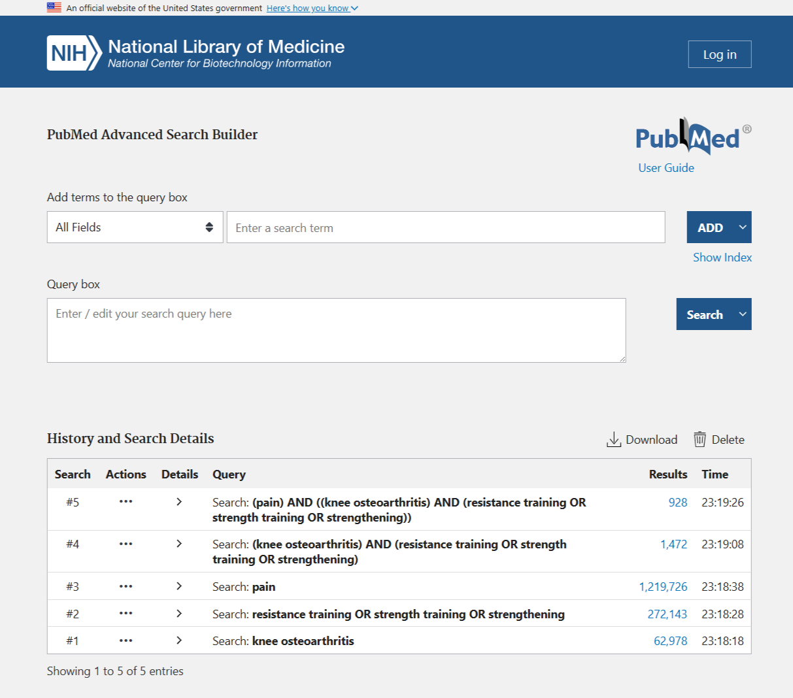

```{r setup}
library(knitr)
```

**Introduction**

Welcome back! The last two workshops were about *using Jamovi* and
running your first analyses. This week we step back from *Jamovi* and
think like a **researcher and a reader**: how studies are designed, how
bias sneaks in, and how you find and judge the evidence behind a claim.
Hopefully some of the skills in this class will help you with other
courses and assignments that require literature searching and
interpreting studies to back up your writing.

This maps directly onto **Lecture 5 (Bias, Blind Spots and Better
Evidence)** and **Lecture 6 (Quantitative Research Design)**. Today you
*apply* some of those learning objectives to real papers and to
abstracts written to make specific problems visible.

The literature-searching part is a **transferable skill for every course
in your degree**. At some point we all need to find evidence, judge how
trustworthy it is, and read it efficiently.

You can come back to this page any time you need a reminder.

**What you'll do today**

-   Refresh the **study-design map**, the **bias reference**, and the
    **evidence pyramid** (the Essentials tabs)
-   Turn a question into **PICO**, then into a **Boolean search string**
    (Part A, 5-10 min)
-   Take that string into **PubMed**: build it, run it, read the search
    history to see where it can be improved, filter it, and triage what
    comes back (Part B, 15-20 min)
-   Compare a **real published study** with a **fabricated one** in your
    discipline, and **classify the design, rank the evidence,** and
    **spot any bias** (Part C, 15-20 min)
-   Write a one-line **limitations** statement in the style your exams
    reward
-   Finish with the **group Portfolio of Evidence activity** (counts for
    marks; details at the end, 20 min)

::: {.callout-note appearance="simple"}
```{=html}
```
{fig-align="center"}

Today has **no dataset to download**, but you *will* need a browser:
**Part B is a literature search in PubMed**, so open
<https://pubmed.ncbi.nlm.nih.gov> in a second tab/window when you get
there (it's free and needs no login). Everything else you need is on
this page. Near the end there's a **"Save my responses as PDF"** button
so you can keep a filled-in copy of your work, including your search
strings and results.
:::

------------------------------------------------------------------------

## The essentials {.unnumbered}

Work through these tabs before the tasks. They condense Lectures 5--6
into what you need in front of you today, and they double as a reference
you can scroll back to.

::: panel-tabset
### The study-design map

Every study you'll read fits somewhere on this map (straight from
Lecture 6).

| Family                          | Design                            | One-line cue                                                                         |
|-------------------|-------------------|----------------------------------|
| **Experimental**                | Randomised controlled trial (RCT) | Researcher *assigns* groups **at random** (e.g. drug vs placebo)                     |
| **Experimental**                | Non-randomised controlled trial   | Groups compared, but allocation **not** random (e.g. patient chooses)                |
| **Observational (analytical)**  | Prospective cohort                | Follow a group **forward** in time; measure who develops the outcome (e.g. cancer)   |
| **Observational (analytical)**  | Retrospective cohort              | Same idea, but the follow-up already happened (look back through medical records)    |
| **Observational (analytical)**  | Case-control                      | Start with cases (have outcome) vs controls (don't), look **back** at their exposure |
| **Observational (descriptive)** | Cross-sectional                   | A **snapshot** at one time point (e.g. a survey/poll)                                |
| **Observational (descriptive)** | Case report / series              | Detailed report of one or a few patients (e.g. a novel disease)                      |

::: {.callout-tip appearance="simple"}
**The quickest tell is *time and control*.** Did the researcher *do*
something to the participants (assign a treatment)? If so, it's
**experimental**. If not it's **observational**, then ask which way time
runs: forward from exposure (cohort), backward from outcome
(case-control), or a single snapshot (cross-sectional)?
:::

### Bias reference

Bias = **systematic error that pushes your results away from the
truth**. It's not random noise, and a bigger sample won't fix it
(*garbage in = garbage out*). The ones you met in Lecture 5 refreshed
below:

| Bias                           | What it is                                                    | Where it shows up most                                         |
|-------------------|-------------------------|----------------------------|
| **Sampling / selection**       | Sample not representative; groups chosen unevenly             | Convenience samples, surveys, case-control (choosing controls) |
| **Non-response**               | Selected people don't reply (or only partly)                  | Surveys, cross-sectional                                       |
| **Response / self-report**     | Wrong answers; leading questions; social desirability         | Questionnaires, self-reported behaviour                        |
| **Recall**                     | People misremember past exposure                              | Case-control, any "looking back"                               |
| **Attrition**                  | Drop-outs over time, and drop-outs aren't random              | Cohort, RCT with long follow-up                                |
| **Confounding**                | A lurking variable explains the apparent link                 | All observational designs                                      |
| **Expectation / confirmation** | Beliefs of participants/researchers shape results             | Unblinded experiments                                          |
| **Publication**                | Positive results get published, null results don't            | Systematic reviews / meta-analyses                             |
| **Survivorship**               | Only the "survivors" are in the sample (WWII bombers example) | Retrospective data, "successful" cases                         |

### The evidence pyramid

Not all evidence is equal. Remember though these are guidelines, not
laws. A thoughtful, well-conducted cohort study can be more informative
than a sloppy RCT for example.

```{=html}
<div class="pyramid">
  <div class="lvl l1">Meta-analyses</div>
  <div class="lvl l2">Systematic reviews</div>
  <div class="lvl l3">Randomised controlled trials (RCTs)</div>
  <div class="lvl l4">Cohort studies</div>
  <div class="lvl l5">Case-control studies</div>
  <div class="lvl l6">Cross-sectional studies &amp; case series</div>
  <div class="lvl l7">Expert opinion, editorials</div>
</div>
<p style="font-size:13px;color:#666;margin-top:6px;text-align:center;">
Top = filtered/synthesised research &amp; lower risk of bias &nbsp;•&nbsp; Bottom = unfiltered / higher risk of bias
</p>
```
::: {.callout-note appearance="simple"}
**Systematic review vs meta-analysis.** A **systematic review** searches
for every study on a question using a pre-registered protocol, appraises
them, and describes what they collectively found. A **meta-analysis**
goes one step further and *statistically pools* all the study results
into a single effect estimate with a confidence interval. Not every
systematic review can support a meta-analysis, because sometimes the
studies are too different to pool sensibly. Pooling adds precision,
which is why meta-analysis sits at the very top, it is an statistical
analysis of all the studies looking at that research question.
:::

### Reading an abstract

All papers will be published in some form with an abstract. A overall
summary of key aspects of the study that follows this structure:

| Section              | What you should find                                                                                                       |
|-----------------------|------------------------------------------------|
| **Background / Aim** | The research question and justification for this work.                                                                     |
| **Methods**          | The design, the sample, how bias was handled. This is where you classify the study and may be able to spot its weaknesses. |
| **Results**          | The key numbers and direction (bigger/smaller, associated or not). No real interpretation just the values.                 |
| **Conclusion**       | The authors' claim/interpretation, watch for causal language the it hasn't earned (i.e. overstating claims/results).       |

::: {.callout-tip appearance="simple"}
When it comes to the paper itselfs, read the Methods first, Conclusion
last, and **be suspicious of the Conclusion.** The
design/bias/transparency (or lack thereof) lives in the Methods. A good
reader decides how much to trust the Conclusion *based on* the Methods.
Too often the authors will overstate their findings as it will make the
work seem more important and novel.
:::
:::

------------------------------------------------------------------------

```{=html}
<style>
/* ---- Formative quiz engine (shared with WS1 & WS2, extended) ---- */
.ws-quiz{border:1px solid #d9d9d9;border-left:4px solid #2c7fb8;border-radius:8px;
  padding:16px 18px;margin:14px 0 20px 0;background:#fafafa;}
.ws-quiz p.ws-qtext{font-weight:600;margin:0 0 10px 0;}
.ws-quiz .ws-row{display:flex;flex-wrap:wrap;align-items:center;gap:8px;margin:6px 0;}
.ws-quiz label.ws-inlab{min-width:170px;font-size:15px;}
.ws-quiz input[type=number], .ws-quiz input[type=text]{
  width:110px;padding:6px 8px;border:1px solid #bbb;border-radius:6px;font-size:15px;}
.ws-quiz select{width:100%;max-width:420px;padding:8px;border:1px solid #bbb;
  border-radius:6px;font-size:15px;}
.ws-quiz textarea{width:100%;min-height:70px;padding:8px;border:1px solid #bbb;
  border-radius:6px;font-size:15px;font-family:inherit;}
.ws-quiz .ws-opt{display:block;margin:5px 0;font-size:15px;font-weight:400;}
.ws-quiz .ws-opt input{margin-right:7px;}
.ws-quiz button.ws-check{margin-top:10px;padding:7px 16px;border:1px solid #2c7fb8;
  border-radius:6px;background:#2c7fb8;color:#fff;font-size:15px;cursor:pointer;}
.ws-quiz button.ws-check:hover{background:#1f5f8b;}
.ws-quiz .ws-fb{display:block;margin-top:10px;font-size:15px;min-height:1.3em;}
.ws-quiz .ws-fb.ok{color:#2e7d32;font-weight:600;}
.ws-quiz .ws-fb.no{color:#c0152f;font-weight:600;}
.ws-quiz .ws-hint{display:none;margin-top:6px;font-size:14px;color:#555;
  border-top:1px dashed #ccc;padding-top:6px;}
.ws-quiz button.ws-reveal, .ws-quiz button.ws-showmodel{display:block;margin-top:10px;
  padding:6px 14px;border:1px solid #bbb;border-radius:6px;background:#fff;color:#555;
  font-size:14px;cursor:pointer;}
.ws-quiz button.ws-reveal:hover, .ws-quiz button.ws-showmodel:hover{border-color:#c0152f;color:#c0152f;}
.ws-locked{display:none;}
.ws-lockednote{font-size:14px;color:#777;margin:-6px 0 18px 0;}
.ws-lockednote::before{content:"🔒 ";}

/* ---- Abstract cards ---- */
.ws-abstract{border:1px solid #d0d7de;border-radius:8px;padding:14px 18px;
  margin:12px 0;background:#fff;}
.ws-abstract.ws-real{border-left:4px solid #2e7d32;}
.ws-abstract.ws-fab{border-left:4px solid #d99e2b;}
.ws-badge{display:inline-block;font-size:11px;font-weight:700;letter-spacing:.03em;
  text-transform:uppercase;padding:2px 8px;border-radius:10px;vertical-align:middle;
  margin-left:8px;}
.ws-badge.ws-breal{background:#e6f2e6;color:#245c26;border:1px solid #b7d8b7;}
.ws-badge.ws-bfab{background:#fdf3e0;color:#8a6414;border:1px solid #ecd9ac;}
.ws-abstract h4{margin:0 0 4px 0;font-size:16px;}
.ws-abstract .ws-abmeta{font-size:13px;color:#888;margin-bottom:8px;font-style:italic;}
.ws-abstract p{margin:6px 0;font-size:14.5px;}

/* ---- Evidence pyramid (7 levels: meta-analysis on top) ---- */
.pyramid{display:flex;flex-direction:column;align-items:center;gap:4px;margin:14px 0;}
.pyramid .lvl{color:#fff;text-align:center;padding:8px 6px;border-radius:4px;
  font-size:14px;font-weight:600;}
.pyramid .l1{width:36%;background:#08306b;}
.pyramid .l2{width:47%;background:#08519c;}
.pyramid .l3{width:58%;background:#2171b5;}
.pyramid .l4{width:69%;background:#4292c6;}
.pyramid .l5{width:80%;background:#6baed6;}
.pyramid .l6{width:90%;background:#9ecae1;color:#123;}
.pyramid .l7{width:100%;background:#c6dbef;color:#123;}

/* ---- Scenario picker ---- */
.scenario-block{display:none;}
#ws-scenario-pick{border:1px solid #d9d9d9;border-radius:8px;padding:16px 18px;
  margin:14px 0;background:#f2f7fb;}
#ws-scenario-pick label{font-weight:600;display:block;margin-bottom:8px;}
#ws-scenario-pick select{width:100%;max-width:460px;padding:8px;border:1px solid #bbb;
  border-radius:6px;font-size:15px;}

/* ---- Answer sheet (built by the save button) ---- */
#ws-pdf-btn{padding:10px 20px;border:1px solid #2c7fb8;border-radius:6px;
  background:#2c7fb8;color:#fff;font-size:16px;cursor:pointer;}
#ws-pdf-btn:hover{background:#1f5f8b;}
#ws-sheet{display:none;border:1px solid #d0d7de;border-radius:8px;padding:18px 22px;
  margin:16px 0;background:#fff;}
#ws-sheet h2{margin:0 0 4px 0;font-size:20px;}
#ws-sheet .ws-sheetmeta{font-size:13px;color:#666;margin-bottom:14px;}
#ws-sheet .ws-item{margin:0 0 16px 0;padding-bottom:12px;
  border-bottom:1px dashed #e2e2e2;font-size:14px;}
#ws-sheet .ws-q{font-weight:600;margin-bottom:4px;}
#ws-sheet .ws-a{margin:0 0 6px 0;}
#ws-sheet .ws-a strong{color:#2c7fb8;}
#ws-sheet .ws-model{background:#f6f8fa;border-left:3px solid #6baed6;
  padding:8px 12px;font-size:13.5px;}
#ws-sheet .ws-model h2, #ws-sheet .ws-model h3{font-size:14px;margin:0 0 4px 0;}

/* ---- Print / PDF rules ---- */
@media print {
  .ws-check, .ws-reveal, .ws-showmodel, #ws-pdf-btn, .ws-hint,
  video, iframe, .ws-lockednote { display:none !important; }
  /* Ordinary Ctrl+P of the page: show every worked answer too. */
  .ws-locked { display:block !important; }
  .ws-quiz, .callout, .ws-abstract, .pyramid { break-inside:avoid; }
  a[href]:after { content:""; }
  body { font-size: 11pt; }

  /* When the "save my answers" button is used, print ONLY the answer sheet.
     #ws-sheet is appended as a direct child of <body>, so hiding body's other
     direct children leaves just the sheet. */
  body.ws-printing > * { display:none !important; }
  body.ws-printing > #ws-sheet { display:block !important; }
}
</style>
<script>
/* Lightweight formative checking (no data leaves the page).
   Modes on the .ws-quiz container:
     - numeric : inputs carry data-answer (+ optional data-tol)
     - single  : container has data-answer; one radio OR one <select>
     - multi   : container has data-multi and data-answer="valA,valB"
                 (checkboxes; order-independent; must match the set exactly)
   data-unlock = id of the worked-answer block to reveal on success. */
function wsUnlock(id){
  var el = document.getElementById(id);
  if(el){ el.classList.remove('ws-locked'); }
  var note = document.querySelector('.ws-lockednote[data-for="' + id + '"]');
  if(note){ note.remove(); }
}
document.addEventListener('click', function(e){
  /* --- free-text "show model answer" buttons --- */
  var sm = e.target.closest('.ws-showmodel');
  if(sm){
    wsUnlock(sm.dataset.unlock);
    sm.textContent = 'Model answer shown below ✓';
    sm.disabled = true;
    return;
  }

  var btn = e.target.closest('.ws-check');
  if(!btn) return;
  var q  = btn.closest('.ws-quiz');
  var fb = q.querySelector('.ws-fb');
  var hint = q.querySelector('.ws-hint');
  var nums = q.querySelectorAll('input[data-answer]');
  var multi = q.dataset.multi !== undefined;
  var allOk = true, anyBlank = false;

  if(multi){
    var boxes = q.querySelectorAll('input[type=checkbox]');
    var chosen = [];
    boxes.forEach(function(b){ if(b.checked) chosen.push(b.value); });
    if(chosen.length === 0){ anyBlank = true; allOk = false; }
    else {
      var want = (q.dataset.answer||'').split(',').map(function(s){return s.trim();}).sort().join('|');
      var got  = chosen.slice().sort().join('|');
      allOk = (want === got);
    }
  } else if(nums.length){
    nums.forEach(function(inp){
      if(inp.value.trim() === ''){ anyBlank = true; }
      var exp = parseFloat(inp.dataset.answer);
      var tol = parseFloat(inp.dataset.tol || 0);
      var val = parseFloat(inp.value);
      var ok  = !isNaN(val) && Math.abs(val - exp) <= tol;
      inp.style.borderColor = ok ? '#2e7d32' : '#c0152f';
      inp.style.background  = ok ? '#eef7ee' : '#fdf0f2';
      if(!ok) allOk = false;
    });
  } else if(q.dataset.answer !== undefined){
    var sel = q.querySelector('input[type=radio]:checked') ||
              q.querySelector('select');
    if(sel && sel.tagName === 'SELECT'){
      if(sel.value === ''){ anyBlank = true; allOk = false; }
      else allOk = (sel.value === q.dataset.answer);
    } else if(sel){
      allOk = (sel.value === q.dataset.answer);
    } else {
      anyBlank = true; allOk = false;
    }
  }

  if(anyBlank && !allOk){
    fb.className = 'ws-fb no';
    fb.textContent = multi ? 'Tick your choices first, then press Check.'
                           : 'Fill in an answer first, then press Check.';
    return;
  }

  q.dataset.tries = (parseInt(q.dataset.tries || '0', 10) + 1);

  if(allOk){
    fb.className = 'ws-fb ok';
    fb.textContent = '✓ Correct! ' + (q.dataset.okmsg || '');
    if(hint) hint.style.display = 'none';
    q.dataset.solved = '1';
    if(q.dataset.unlock){
      /* Only unlock once EVERY question tied to this worked answer is right. */
      var sibs = document.querySelectorAll('.ws-quiz[data-unlock="' + q.dataset.unlock + '"]');
      var pending = 0;
      sibs.forEach(function(s){ if(s.dataset.solved !== '1'){ pending++; } });
      if(pending === 0){
        wsUnlock(q.dataset.unlock);
        fb.textContent += ' The worked answer is now unlocked below.';
        var rv = q.querySelector('.ws-reveal');
        if(rv) rv.remove();
      } else {
        fb.textContent += ' ' + (pending === 1
          ? 'One more question to go before the worked answer unlocks.'
          : pending + ' more questions to go before the worked answer unlocks.');
      }
    }
  } else {
    fb.className = 'ws-fb no';
    fb.textContent = '✗ Not quite. ' + (q.dataset.nomsg ||
                     'Re-read the Methods of the abstract and try again.');
    if(hint && q.dataset.tries >= 2){ hint.style.display = 'block'; }
    if(q.dataset.unlock && q.dataset.tries >= 3 && !q.querySelector('.ws-reveal')){
      var btn2 = document.createElement('button');
      btn2.type = 'button';
      btn2.className = 'ws-reveal';
      btn2.textContent = 'Stuck? Reveal the worked answer';
      btn2.addEventListener('click', function(){
        wsUnlock(q.dataset.unlock);
        btn2.remove();
        fb.className = 'ws-fb';
        fb.textContent = 'Worked answer unlocked below. Read it closely, then make sure you could reach it yourself.';
      });
      q.appendChild(btn2);
    }
  }
});

/* --- Scenario picker: show the chosen discipline block, hide the rest --- */
document.addEventListener('DOMContentLoaded', function(){
  var pick = document.getElementById('ws-scenario-select');
  if(pick){
    pick.addEventListener('change', function(){
      document.querySelectorAll('.scenario-block').forEach(function(b){ b.style.display='none'; });
      if(pick.value){
        var t = document.getElementById(pick.value);
        if(t){ t.style.display='block'; }
      }
    });
  }
  var pdf = document.getElementById('ws-pdf-btn');
  if(pdf){ pdf.addEventListener('click', wsSaveResponses); }
});

/* --- Build a standalone answer sheet, then print only that --- */
function wsSaveResponses(){
  var old = document.getElementById('ws-sheet');
  if(old){ old.remove(); }

  var sheet = document.createElement('div');
  sheet.id = 'ws-sheet';
  var head = document.createElement('div');
  head.innerHTML = '<h2>Workshop 3: my answers</h2>' +
    '<div class="ws-sheetmeta">Study &amp; Bias, Searching the Literature. Generated ' +
    new Date().toLocaleDateString() + '. Your responses are paired with the worked ' +
    'answers so this sheet stands on its own.</div>';
  sheet.appendChild(head);

  var seenModel = {};
  var lastItemFor = {};
  var answered = 0;

  document.querySelectorAll('.ws-quiz').forEach(function(q){
    if(q.offsetParent === null) return;            /* skip hidden scenarios */
    var qt = q.querySelector('.ws-qtext');
    var label = qt ? qt.textContent.trim() : 'Response';
    var ans = [];

    q.querySelectorAll('input[type=number], input[type=text]').forEach(function(inp){
      var row = inp.closest('.ws-row');
      var lab = row && row.querySelector('label')
                ? row.querySelector('label').textContent.trim() + ' ' : '';
      if(inp.value.trim()){ ans.push(lab + inp.value.trim()); }
    });
    q.querySelectorAll('input[type=radio]:checked').forEach(function(r){
      ans.push(r.parentElement.textContent.trim());
    });
    q.querySelectorAll('input[type=checkbox]:checked').forEach(function(c){
      ans.push(c.parentElement.textContent.trim());
    });
    q.querySelectorAll('select').forEach(function(s){
      if(s.value){
        var srow = s.closest('.ws-row');
        var slab = srow && srow.querySelector('label')
                   ? srow.querySelector('label').textContent.trim() + ' ' : '';
        ans.push(slab + s.options[s.selectedIndex].text);
      }
    });
    q.querySelectorAll('textarea').forEach(function(ta){
      if(ta.value.trim()){ ans.push(ta.value.trim()); }
    });

    /* the live search-string builder */
    var built = q.querySelector('#sb-string');
    if(built && built.textContent.indexOf('appears here') === -1){
      ans.push(built.textContent.trim());
    }

    /* Only include questions the student actually engaged with, so the sheet
       stays a record of their work rather than a dump of the whole page. */
    if(ans.length === 0){ return; }
    answered++;

    var item = document.createElement('div');
    item.className = 'ws-item';
    var qd = document.createElement('div');
    qd.className = 'ws-q'; qd.textContent = label;
    var ad = document.createElement('div');
    ad.className = 'ws-a';
    ad.innerHTML = '<strong>My answer:</strong> ' +
      (ans.length ? ans.join(' &nbsp;|&nbsp; ') : '(not answered)');
    item.appendChild(qd); item.appendChild(ad);

    /* remember where each worked answer should go: after the LAST question
       that shares it, so the sheet reads Q, Q, then the explanation */
    var sm = q.querySelector('.ws-showmodel');
    var uid = q.dataset.unlock || (sm ? sm.dataset.unlock : null);
    if(uid){ lastItemFor[uid] = item; }
    sheet.appendChild(item);
  });

  Object.keys(lastItemFor).forEach(function(uid){
    var model = document.getElementById(uid);
    if(model && !seenModel[uid]){
      seenModel[uid] = true;
      var clone = model.cloneNode(true);
      clone.removeAttribute('id');
      clone.className = 'ws-model';
      lastItemFor[uid].appendChild(clone);
    }
  });

  if(answered === 0){
    alert('Nothing to save yet. Answer a few questions first, then try again.');
    return;
  }

  document.body.appendChild(sheet);
  sheet.style.display = 'block';
  sheet.scrollIntoView({behavior:'smooth'});
  document.body.classList.add('ws-printing');
  setTimeout(function(){ window.print(); }, 300);
}
window.addEventListener('afterprint', function(){
  document.body.classList.remove('ws-printing');
});
</script>
```
```{=html}
<style>
/* ================= Additions for Part B (live PubMed search) ================= */
/* Second discipline picker (search topics) */
.search-block{display:none;}
#ws-search-pick{border:1px solid #d9d9d9;border-radius:8px;padding:16px 18px;
  margin:14px 0;background:#f2f7fb;}
#ws-search-pick label{font-weight:600;display:block;margin-bottom:8px;}
#ws-search-pick select{width:100%;max-width:520px;padding:8px;border:1px solid #bbb;
  border-radius:6px;font-size:15px;}

/* Wider text inputs for search strings / citations */
.ws-quiz input[type=text].ws-wide{width:100%;max-width:470px;}
.ws-quiz input[type=text].ws-mid{width:180px;}

/* Copyable search-string cards */
.ws-searchbox{border:1px solid #d0d7de;border-left:4px solid #6baed6;border-radius:8px;
  padding:12px 16px;margin:12px 0;background:#fff;}
.ws-searchbox .ws-sbtitle{font-weight:600;font-size:14px;color:#555;margin-bottom:6px;}
.ws-searchbox code, .sb-out code{display:block;font-size:14px;background:#f6f8fa;
  border:1px solid #e3e7ea;border-radius:6px;padding:9px 11px;
  white-space:pre-wrap;overflow-wrap:anywhere;line-height:1.55;
  color:#123;}
.ws-sbactions{margin-top:9px;display:flex;flex-wrap:wrap;gap:8px;align-items:center;}
.ws-copy{padding:5px 12px;border:1px solid #bbb;border-radius:6px;background:#fff;
  color:#444;font-size:13px;cursor:pointer;}
.ws-copy:hover{border-color:#2c7fb8;color:#2c7fb8;}
.ws-runlink{display:inline-block;padding:5px 12px;border:1px solid #2c7fb8;border-radius:6px;
  background:#2c7fb8;color:#fff !important;font-size:13px;text-decoration:none !important;}
.ws-runlink:hover{background:#1f5f8b;color:#fff !important;}
.sb-out{margin-top:12px;}
.sb-out .sb-lab{font-size:13px;color:#666;margin-bottom:4px;}

@media print{
  .ws-copy, .ws-runlink { display:none !important; }
  .ws-searchbox, .search-block { break-inside:avoid; }
}
</style>
<script>
/* --- generic show/hide discipline picker --- */
function wsBindPicker(selectId, blockClass){
  var pick = document.getElementById(selectId);
  if(!pick) return;
  pick.addEventListener('change', function(){
    document.querySelectorAll('.' + blockClass).forEach(function(b){ b.style.display = 'none'; });
    if(pick.value){
      var t = document.getElementById(pick.value);
      if(t){ t.style.display = 'block'; }
    }
  });
}

/* --- copy-to-clipboard buttons (data-target = selector, or data-copy = literal) --- */
document.addEventListener('click', function(e){
  var cp = e.target.closest('.ws-copy');
  if(!cp) return;
  var txt = cp.dataset.copy || '';
  if(!txt && cp.dataset.target){
    var tgt = document.querySelector(cp.dataset.target);
    txt = tgt ? tgt.textContent.trim() : '';
  }
  if(!cp.dataset.label){ cp.dataset.label = cp.textContent; }
  var flash = function(msg){
    cp.textContent = msg;
    setTimeout(function(){ cp.textContent = cp.dataset.label; }, 1400);
  };
  if(navigator.clipboard && txt){
    navigator.clipboard.writeText(txt).then(function(){ flash('Copied \u2713'); })
                                      .catch(function(){ flash('Select it manually'); });
  } else { flash('Select it manually'); }
});

/* --- live Boolean search-string builder (Task B2) --- */
function wsBuildString(){
  var parts = [];
  document.querySelectorAll('#ws-builder .sb-in').forEach(function(inp){
    var v = inp.value.trim();
    if(v){ parts.push('(' + v + ')'); }
  });
  var str = parts.join(' AND ');
  var out = document.getElementById('sb-string');
  var run = document.getElementById('sb-run');
  if(out){ out.textContent = str || 'Your search string appears here as you type'; }
  if(run){
    if(str){
      run.href = 'https://pubmed.ncbi.nlm.nih.gov/?term=' + encodeURIComponent(str);
      run.style.pointerEvents = 'auto'; run.style.opacity = '1';
    } else {
      run.removeAttribute('href');
      run.style.pointerEvents = 'none'; run.style.opacity = '0.45';
    }
  }
}
document.addEventListener('DOMContentLoaded', function(){
  wsBindPicker('ws-search-select', 'search-block');
  document.querySelectorAll('#ws-builder .sb-in').forEach(function(inp){
    inp.addEventListener('input', wsBuildString);
  });
  wsBuildString();
});
</script>
```
## Part A: From a question to a search string

Before you can judge evidence, you have to *find* it. In Lecuture 5 I
introduced the **PICO** **framework**. You can use this when developing
your research question for a study and also as a tool to help frame a
search if you are looking at understanding a topic better. **PICO** can
turn a vague question into a clear one, and **Boolean logic** turns a
clear question into something a literature database can return the best
results most efficiently. There are a bunch of usual tips and tricks in
the toolkit tabs, then do the four short tasks. We're all using the same
worked example so we can compare notes.

> **Worked example question:** *In adults with knee osteoarthritis, does
> a 12-week strengthening program compared with usual care reduce pain?*

### The search toolkit {.unnumbered}

::: panel-tabset
#### PICO

**PICO** turns a vague question into something searchable (Lecture 6).
Here's a *different* question worked through, so you can do the same to
yours in a moment:

> *In older adults living at home, does a supervised balance program
> compared with usual activity reduce falls?*

| Letter | Meaning                        | In this question            |
|--------|--------------------------------|-----------------------------|
| **P**  | Patient / Population / Problem | older adults living at home |
| **I**  | Intervention / Exposure        | supervised balance program  |
| **C**  | Comparison                     | usual activity              |
| **O**  | Outcome                        | falls                       |

**From PICO to a search string, in three moves:**

1.  **Pick your concepts.** Usually just **P**, **I** and **O**. Leave
    **C** out of the search string: papers rarely put "usual activity"
    in the title, and adding it throws away good studies.
2.  **List synonyms for each concept.** How would *different authors*
    write the same idea? `older adults`, `elderly`,
    `community-dwelling`. Or `balance training`, `balance exercise`,
    `postural stability`.
3.  **Join them up.** Synonyms with **OR** inside brackets, concepts
    with **AND** between brackets.

| Concept               | Synonyms (joined with OR)                               |
|--------------------|----------------------------------------------------|
| **P** older adults    | `"older adults" OR elderly OR "community-dwelling"`     |
| **I** balance program | `balance OR "balance training" OR "postural stability"` |
| **O** falls           | `falls OR "accidental falls" OR "fall risk"`            |

Which assembles into:

`("older adults" OR elderly) AND (balance OR "balance training") AND (falls OR "accidental falls")`

::: {.callout-note appearance="simple"}
**Now do the same to the knee osteoarthritis question above**, on paper
or in your head, before you open Task A1. Which words are the P, the I
and the O? What would a different author have called each one? The tasks
below check what you came up with.
:::

#### Boolean logic

The three operators do all the work. This is the mental picture worth
keeping:

{#fig-venn
fig-align="center"}

| Operator | What it does           | Effect on results   | Use it for                        |
|------------------|------------------|------------------|-------------------|
| **AND**  | Both terms must appear | **Fewer** (narrows) | Joining *different concepts*      |
| **OR**   | Either term will do    | **More** (widens)   | Joining *synonyms*                |
| **NOT**  | Excludes a term        | **Fewer** (narrows) | Cutting a specific nuisance topic |

::: {.callout-important appearance="simple"}
**Brackets are not optional.** Databases read operators left to right,
so `osteoarthritis AND strength* OR resistance` is read as
*"(osteoarthritis **AND** strength\*) **OR*** *resistance"*, and you'll
be handed thousands of papers on say antibiotic resistance. What you
meant was `osteoarthritis AND (strength* OR resistance)`. Group every
**OR** list in its own brackets, every time.
:::

::: {.callout-note appearance="simple"}
**Handle NOT with care.** `football NOT soccer` also deletes papers that
compare the two, or remove US/Aus based papers which might be exactly
what you wanted. Often it is better adding a concept with AND over
excluding one with NOT.
:::

#### Syntax that matters

Four bits of syntax that will do most of the heavy lifting for you.

| Tool                | Looks like         | What it does                                                                                |
|-------------------|-------------------|----------------------------------|
| **Truncation**      | `strength*`        | Matches all endings: strength, strength**en**, strength**ening**, strength**s**             |
| **Phrase (quotes)** | `"working memory"` | Keeps the words together, instead of finding the two words anywhere                         |
| **Brackets**        | `(a OR b) AND c`   | Controls the order the operators are applied in                                             |
| **Field tag**       | `pain[tiab]`       | Restricts the term to a field, here **ti**tle/**ab**stract. These differ between databases. |

**PubMed specifics worth knowing:**

-   `AND`, `OR`, `NOT` must be in **CAPITALS**. Lower-case `and` is
    treated as an ordinary word.
-   Truncation needs **at least four characters** before the `*`, so
    `pain*` works but `app*` is ignored.
-   Truncation and quote marks **switch off PubMed's automatic MeSH
    mapping** (see the *MeSH* tab in Part B).
-   Common field tags: `[tiab]` title/abstract, `[ti]` title only,
    `[mh]` MeSH heading, `[au]` author. These a PubMed specific.

#### Where to search

| Where                                                                                                | Best for                                                                                                               | Watch out for                                                                                                                      |
|-------------------|--------------------------|----------------------------|
| [**PubMed**](https://pubmed.ncbi.nlm.nih.gov/)                                                       | Health & life sciences. Free, no login, MeSH vocabulary, filters by study design                                       | Thinner on sport-performance and psychology titles                                                                                 |
| [**Google Scholar**](https://scholar.google.com/)                                                    | Casting a wide net, finding free PDFs, helps with finding "cited by" chains (a shortcut to building a search strategy) | No controlled vocabulary (largely *natural language* searching), no design filters, indexes low-quality and predatory journals too |
| [**SPORTDiscus**](https://libraryguides.griffith.edu.au/az/sportdiscus-with-full-text-via-ebscohost) | Exercise science, coaching, sports medicine                                                                            | Needs a Griffith login to access                                                                                                   |
| **Cochrane Library**                                                                                 | Systematic reviews and meta-analyses of treatments (the top of the pyramid)                                            | Reviews only, and not every question has one                                                                                       |

Remember although many papers are behind a paywall, you have student
access through the online **Griffith Library** which should cover 99.9%
of papers you might ever need.

::: callout-important
## LLMs are not a literature search

ChatGPT, Gemini, Claude and friends **invent citations that look perfect
and do not exist**. They also invent DOIs and URLs, misreport findings,
and can't tell a strong study from a weak one. They have no reliable
access to much of the published literature, especially anything recent.
While there are PubMed pluggins, and they are improving, it is risky to
rely on them as a way to synthesis/search for literature.

They can be useful for *brainstorming synonyms* for an OR group, or for
explaining a term you don't know. They are **not** a source of
references. Anything an LLM gives you must be found and read in a real
database before it goes anywhere near your work, and if you check,
you'll quickly see why.
:::
:::

### Task A1: Break it into PICO

```{=html}
<div class="ws-quiz" data-answer="usualcare" data-unlock="a1-worked"
     data-okmsg="Exactly, usual care is what the intervention is measured against.">
  <p class="ws-qtext">Which part of the question is the <strong>Comparison (C)</strong>?</p>
  <select>
    <option value="">Select...</option>
    <option value="oa">Adults with knee osteoarthritis</option>
    <option value="strength">A 12-week strengthening program</option>
    <option value="usualcare">Usual care</option>
    <option value="pain">Reduced pain</option>
  </select>
  <button class="ws-check" type="button">✓ Check</button>
  <span class="ws-fb"></span>
  <div class="ws-hint"><strong>Hint:</strong> P = who, I = what you're testing,
    C = what you test it <em>against</em>, O = what you measure.</div>
</div>
```
```{=html}
<p class="ws-lockednote" data-for="a1-worked">Worked answer locked. Answer correctly above to unlock it.</p>
```
::: {#a1-worked .callout-note .ws-locked}
## Worked answer: A1

**P** = adults with knee osteoarthritis, **I** = 12-week strengthening
program, **C** = usual care, **O** = pain. The comparison is the
*alternative* the intervention is judged against. Without a clear C, you
can't say a treatment "worked", worked *compared to what?*

Note that **C is the one you usually leave out of the search string**.
Papers almost never say "usual care" in the title or abstract, so
including it filters out the very studies you want.
:::

### Task A2: Choose the search string

```{=html}
<div class="ws-quiz" data-answer="boolean" data-unlock="a2-worked" data-nomsg="Think concepts, synonyms and brackets."
     data-okmsg="Concepts joined by AND, synonyms by OR, that's a real database search.">
  <p class="ws-qtext">Which is the best search string for a database like PubMed?</p>
  <label class="ws-opt"><input type="radio" name="a2" value="google">how do I fix my sore knee</label>
  <label class="ws-opt"><input type="radio" name="a2" value="vague">osteoarthritis exercise good?</label>
  <label class="ws-opt"><input type="radio" name="a2" value="boolean">(osteoarthritis) AND (strength* OR resistance) AND (pain)</label>
  <button class="ws-check" type="button">✓ Check</button>
  <span class="ws-fb"></span>
  <div class="ws-hint"><strong>Hint:</strong> databases aren't Google. Think concepts
    joined with <code>AND</code>, synonyms with <code>OR</code>, and <code>*</code> to
    catch word endings.</div>
</div>
```
```{=html}
<p class="ws-lockednote" data-for="a2-worked">Worked answer locked. Answer correctly above to unlock it.</p>
```
::: {#a2-worked .callout-note .ws-locked}
## Worked answer: A2

`(osteoarthritis) AND (strength* OR resistance) AND (pain)`.

Each PICO concept becomes a bracketed group; **OR** widens (catches
synonyms), **AND** narrows (all concepts must appear), and `strength*`
truncates to strength/strengthen/strengthening. Natural-language
questions work in Google but waste a database's precision.
:::

### Task A3: Which way does the dial turn?

```{=html}
<div class="ws-quiz" data-answer="up" data-unlock="a3-worked" data-nomsg="Picture the Venn diagram again."
     data-okmsg="OR widens: now only one of the two words has to appear.">
  <p class="ws-qtext">You run <code>exercise AND pain</code>, then change it to
    <code>exercise OR pain</code>. What happens to the number of results?</p>
  <label class="ws-opt"><input type="radio" name="a3" value="down">It drops sharply</label>
  <label class="ws-opt"><input type="radio" name="a3" value="up">It rises sharply</label>
  <label class="ws-opt"><input type="radio" name="a3" value="same">It stays about the same</label>
  <label class="ws-opt"><input type="radio" name="a3" value="depends">Impossible to predict</label>
  <button class="ws-check" type="button">✓ Check</button>
  <span class="ws-fb"></span>
  <div class="ws-hint"><strong>Hint:</strong> look back at the Venn diagram. AND is the
    small overlap in the middle; OR is both circles together.</div>
</div>
```
```{=html}
<p class="ws-lockednote" data-for="a3-worked">Worked answer locked. Answer correctly above to unlock it.</p>
```
::: {#a3-worked .callout-note .ws-locked}
## Worked answer: A3

**It rises sharply.** `AND` returns only the overlap (papers containing
*both* words); `OR` returns everything in either circle, including every
paper that mentions pain and has nothing to do with exercise. That's why
**OR belongs inside a concept** (between synonyms) and **AND belongs
between concepts**. Swap them by accident and your search stops being a
search.
:::

### Task A4: Mind your brackets

```{=html}
<div class="ws-quiz" data-answer="right" data-unlock="a4-worked" data-nomsg="Work through it left to right, like the database does."
     data-okmsg="Brackets keep the OR group together, so AND applies to the whole group.">
  <p class="ws-qtext">You want papers on osteoarthritis that involve
    <em>strengthening or resistance work</em>. Which string actually does that?</p>
  <label class="ws-opt"><input type="radio" name="a4" value="noparen">osteoarthritis AND strength* OR resistance</label>
  <label class="ws-opt"><input type="radio" name="a4" value="right">osteoarthritis AND (strength* OR resistance)</label>
  <label class="ws-opt"><input type="radio" name="a4" value="wrongparen">(osteoarthritis AND strength*) OR resistance</label>
  <label class="ws-opt"><input type="radio" name="a4" value="not">osteoarthritis NOT strength*</label>
  <button class="ws-check" type="button">✓ Check</button>
  <span class="ws-fb"></span>
  <div class="ws-hint"><strong>Hint:</strong> without brackets the database works left to
    right. Where does that leave the word <em>resistance</em>?</div>
</div>
```
```{=html}
<p class="ws-lockednote" data-for="a4-worked">Worked answer locked. Answer correctly above to unlock it.</p>
```
::: {#a4-worked .callout-note .ws-locked}
## Worked answer: A4

`osteoarthritis AND (strength* OR resistance)`.

Options 1 and 3 are read the same way, *(osteoarthritis AND strength\*)
OR resistance*, so PubMed happily adds every paper containing the word
**resistance**: antibiotic resistance, insulin resistance, electrical
resistance. Option 4 does the opposite of what you want, it throws
strengthening papers away.

One more thing to notice: `strength*` is legal (four or more characters
before the `*`), but truncating **switches off PubMed's automatic
mapping to MeSH headings**. For a careful search you'd add the MeSH
heading back in yourself with `OR`.
:::

------------------------------------------------------------------------

## Part B: Let's do it in PubMed

Time to stop talking about searching and do it. Open
[PubMed](https://pubmed.ncbi.nlm.nih.gov/) in a second tab/window or use
the links below as we go (it's free and needs no login) and keep this
page beside it. Everything you type below stays in your browser and ends
up in your saved PDF at the end.

The tabs are your manual, dip into them as you go rather than reading
all six now.

### Inside PubMed {.unnumbered}

::: panel-tabset
#### 1. Orient

PubMed is the free front end to **MEDLINE**, the world's biggest index
of health and life-science literature. Type into the single search box
and PubMed does something clever behind your back: **automatic term
mapping**. It takes your words, matches them against its MeSH
vocabulary, and quietly searches the official heading *and* your words
as text.

So `heart attack` also finds papers indexed under *Myocardial
Infarction* without you asking. Useful, and worth knowing about, because
the moment you use `*` or `" "` that help switches off.

**On a results page, orient yourself with:**

-   the **results count** (top left), your single most useful feedback
    signal
-   **Filters** (left sidebar) to narrow by design, date, age, species
-   **Best match vs Most recent** (sort, top right)

#### 2. Advanced Search

The single box is fine for a quick look. For a real search, use
**Advanced** (the link under the search box). Two things there change
everything:

**The query box** shows you PubMed's *actual* interpretation of your
search. Click the `>` arrow next to any search in your history to see
how your words were translated. If your search returns something
bizarre, this is where you find out why.

**Search history** numbers every search you run (`#1`, `#2`, `#3`...)
with its result count, and lets you combine them:

-   Search each concept **separately** first: `#1` = your P terms, `#2`
    = your I terms, `#3` = your O terms
-   Then combine: `#1 AND #2 AND #3`
-   Too few results? Rerun just the weak concept with more `OR` synonyms
    and recombine

That workflow, one concept at a time, then combine, is how researchers
actually build a search. It also shows you *which* concept is strangling
your results.

#### 3. MeSH

**MeSH** (Medical Subject Headings) is a controlled vocabulary. Human
indexers tag every MEDLINE paper with the official headings for what
it's about, so searching a MeSH heading finds relevant papers
**regardless of the words the authors chose**.

Two quirks to expect:

-   Headings are often **inverted**: it's *Diabetes Mellitus, Type 2*,
    not "type 2 diabetes". *Anti-Inflammatory Agents, Non-Steroidal*,
    not "NSAIDs".
-   MeSH tagging lags, so the newest papers ("ahead of print") may not
    be indexed yet. A MeSH-only search quietly misses this month's
    research.

**How to use it:** search your concept in the [MeSH
browser](https://www.ncbi.nlm.nih.gov/mesh/), find the official heading,
then use it alongside your text words:

`("Diabetes Mellitus, Type 2"[mh] OR "type 2 diabetes"[tiab])`

That's belt and braces: the indexer's word *and* the authors' words.

#### 4. Filters

The left sidebar is where a 12,000-result search becomes readable.

| Filter               | What it's for                                                                                              |
|-------------------------|-----------------------------------------------|
| **Article type**     | Jump straight up the evidence pyramid: *Meta-Analysis*, *Systematic Review*, *Randomized Controlled Trial* |
| **Publication date** | Currency. 5 or 10 years is a normal starting point                                                         |
| **Free full text**   | Papers you can read right now                                                                              |
| **Species / Age**    | *Humans* only; specific age groups                                                                         |

::: {.callout-warning appearance="simple"}
**Two traps.** Filters **stay on** until you clear them, and students
routinely spend ten minutes wondering where all the papers went. And
article-type filters depend on **indexing**, so a brand-new RCT may not
carry the "Randomized Controlled Trial" tag yet.
:::

#### 5. Triage and save

You will never read everything you find. Triage in three passes:

1.  **Titles.** Reject fast. Most of a results list is genuinely
    irrelevant.
2.  **Abstracts.** For the survivors, read the *Methods* sentences first
    (design, sample), then Results.
3.  **Full text.** Only for the handful that pass both.

Then mine the good ones. Every PubMed record has **Similar articles**,
**Cited by** and **References**; following those chains ("snowballing")
often beats another hour of keyword fiddling.

To keep your work: **Save** or **Email** a record, **Send to → Citation
manager** for EndNote or Zotero, or set up a free **My NCBI** account to
save searches and create alerts for new papers.

#### 6. Scoring a paper

A quick-and-dirty scorecard for people new to appraisal. Score each
criterion **1 (poor) / 2 (okay) / 3 (good)**.

| Criterion       | 1 = poor                                                | 3 = good                                                                         |
|-------------------|----------------------------|--------------------------|
| **Relevance**   | Off topic, barely related                               | Directly answers your question                                                   |
| **Recency**     | \>10 years old                                          | \<5 years old                                                                    |
| **Credibility** | Blog, unknown or predatory journal                      | Reputable peer-reviewed journal (check the journal name + "scimago", aim for Q1) |
| **Methods**     | Vague, not repeatable                                   | Detailed, appropriate, repeatable                                                |
| **Sample**      | Tiny or unrepresentative (ex sci n\<15, pharmacy n\<30) | Large and representative (ex sci n\>50, pharmacy n\>100)                         |

**Reading the total (out of 15):** 12+ is a keeper; 9--11 is usable with
caveats; below 9, find something better. It's a rough guide, not a
substitute for the design-and-bias thinking you'll do in Part C.
:::

### Task B1: Pick a topic and find its MeSH heading

Pick the topic closest to your degree. You'll search *this* question for
the rest of Part B, and in Part C you'll appraise two abstracts on the
same topic.

```{=html}
<div id="ws-search-pick">
  <label for="ws-search-select">Choose your search topic:</label>
  <select id="ws-search-select">
    <option value="">Select your discipline...</option>
    <option value="sb-exsci">Exercise Science: HIIT vs continuous training &amp; VO₂max</option>
    <option value="sb-cep">Clinical Exercise Physiology: exercise &amp; type 2 diabetes</option>
    <option value="sb-pharm">Pharmacy: long-term NSAID use &amp; heart attack risk</option>
  </select>
</div>
```
<!-- ===================== SEARCH TOPIC: EXERCISE SCIENCE ===================== -->

::: {#sb-exsci .search-block}
**Your question:** *In recreationally active adults, does high-intensity
interval training (HIIT) improve VO₂max more than moderate-intensity
continuous training?*

| Concept       | Starter synonyms for your OR group                                         |
|---------------------|---------------------------------------------------|
| **P** adults  | `adults OR "young adults"` (often safe to drop entirely)                   |
| **I** HIIT    | `"high-intensity interval training" OR HIIT OR "sprint interval training"` |
| **O** fitness | `VO2max OR "aerobic capacity" OR "cardiorespiratory fitness"`              |

```{=html}
<div class="ws-quiz" data-answer="hiit" data-unlock="sb-exsci-mesh" data-nomsg="Try it in the MeSH browser and see where it redirects you."
     data-okmsg="That's the official heading. Note it's spelled out in full, not the acronym.">
  <p class="ws-qtext">Look up <em>HIIT</em> in the <a href="https://www.ncbi.nlm.nih.gov/mesh/" target="_blank">MeSH browser</a>. Which is the official MeSH heading?</p>
  <label class="ws-opt"><input type="radio" name="sbe-mesh" value="acr">HIIT</label>
  <label class="ws-opt"><input type="radio" name="sbe-mesh" value="hiit">High-Intensity Interval Training</label>
  <label class="ws-opt"><input type="radio" name="sbe-mesh" value="inv">Training, Interval, High-Intensity</label>
  <label class="ws-opt"><input type="radio" name="sbe-mesh" value="sprint">Sprint Interval Exercise</label>
  <button class="ws-check" type="button">✓ Check</button>
  <span class="ws-fb"></span>
  <div class="ws-hint"><strong>Hint:</strong> type "HIIT" into the MeSH browser and see what
    it redirects you to. MeSH rarely uses acronyms as the heading itself.</div>
</div>
```
```{=html}
<p class="ws-lockednote" data-for="sb-exsci-mesh">Worked answer locked. Answer correctly above to unlock it.</p>
```
::: {#sb-exsci-mesh .callout-note .ws-locked}
## Worked answer: B1 (Ex Sci)

**High-Intensity Interval Training**, a MeSH heading added in 2018 and
filed under *Physical Conditioning, Human*. "HIIT" is an *entry term*,
type it in and MeSH sends you to the real heading. That's exactly the
service controlled vocabulary provides, it collects every author's
phrasing under one label.

A robust version of the I concept:
`("High-Intensity Interval Training"[mh] OR HIIT[tiab] OR "high intensity interval training"[tiab])`
:::
:::

<!-- ============== SEARCH TOPIC: CLINICAL EXERCISE PHYSIOLOGY ============== -->

::: {#sb-cep .search-block}
**Your question:** *In adults with type 2 diabetes, does supervised
exercise training reduce HbA1c compared with usual care?*

| Concept                 | Starter synonyms for your OR group                                               |
|---------------------|---------------------------------------------------|
| **P** type 2 diabetes   | `"type 2 diabetes" OR T2DM OR "diabetes mellitus, type 2"`                       |
| **I** exercise training | `exercise OR "physical activity" OR "resistance training" OR "aerobic training"` |
| **O** glycaemic control | `HbA1c OR "glycated haemoglobin" OR "glycaemic control" OR "glycemic control"`   |

```{=html}
<div class="ws-quiz" data-answer="inv" data-unlock="sb-cep-mesh" data-nomsg="Try it in the MeSH browser and see where it redirects you."
     data-okmsg="Inverted heading: MeSH files the specific type after the general concept.">
  <p class="ws-qtext">Look up <em>type 2 diabetes</em> in the <a href="https://www.ncbi.nlm.nih.gov/mesh/" target="_blank">MeSH browser</a>. Which is the official MeSH heading?</p>
  <label class="ws-opt"><input type="radio" name="sbc-mesh" value="plain">Type 2 Diabetes</label>
  <label class="ws-opt"><input type="radio" name="sbc-mesh" value="inv">Diabetes Mellitus, Type 2</label>
  <label class="ws-opt"><input type="radio" name="sbc-mesh" value="acr">T2DM</label>
  <label class="ws-opt"><input type="radio" name="sbc-mesh" value="adult">Diabetes, Adult-Onset</label>
  <button class="ws-check" type="button">✓ Check</button>
  <span class="ws-fb"></span>
  <div class="ws-hint"><strong>Hint:</strong> MeSH inverts headings so that related
    concepts file together alphabetically. What would that do to "type 2 diabetes"?</div>
</div>
```
```{=html}
<p class="ws-lockednote" data-for="sb-cep-mesh">Worked answer locked. Answer correctly above to unlock it.</p>
```
::: {#sb-cep-mesh .callout-note .ws-locked}
## Worked answer: B1 (Clin Ex Phys)

**Diabetes Mellitus, Type 2.** MeSH inverts headings so that everything
about diabetes mellitus sits together in the hierarchy, which is why the
type comes last. "Type 2 diabetes", "T2DM" and "adult-onset diabetes"
are all entry terms pointing at it.

Your outcome has the same trap, the MeSH heading is **Glycated
Hemoglobin** (American spelling, and not "HbA1c"), which is a good
reason to `OR` the heading together with the abbreviation authors often
write. For example,`("Glycated Hemoglobin"[mh] OR HbA1c[tiab])`
:::
:::

<!-- ========================= SEARCH TOPIC: PHARMACY ========================= -->

::: {#sb-pharm .search-block}
**Your question:** *In adults, is long-term NSAID use associated with an
increased risk of myocardial infarction (heart attack)?*

There is no Intervention (I) so the **I** becomes an **E** for Exposure.
Nobody is going to *assign* people to years of NSAIDs to see who has a
heart attack. Same four slots, same search logic, one different letter.

| Concept            | Starter synonyms for your OR group                                       |
|-------------------|-----------------------------------------------------|
| **P** adults       | `adults` (broad enough that you'll usually drop it)                      |
| **E** NSAIDs       | `NSAID* OR "non-steroidal anti-inflammatory" OR ibuprofen OR diclofenac` |
| **O** heart attack | `"myocardial infarction" OR "heart attack" OR "acute coronary syndrome"` |

::: {.callout-warning appearance="simple"}
**Don't add a "risk" concept.** It's tempting to bolt on
`AND (risk OR association)`, but those words do almost no filtering, and
they bin every paper that wrote other terms like "hazard ratio" or "odds
of" instead. The risk is within your **outcome**, not in a fourth search
concept.test
:::

```{=html}
<div class="ws-quiz" data-answer="inv" data-unlock="sb-pharm-mesh" data-nomsg="Try it in the MeSH browser and see where it redirects you."
     data-okmsg="Inverted, spelled out, and nothing like what a clinician would say out loud.">
  <p class="ws-qtext">Look up <em>NSAIDs</em> in the <a href="https://www.ncbi.nlm.nih.gov/mesh/" target="_blank">MeSH browser</a>. Which is the official MeSH heading?</p>
  <label class="ws-opt"><input type="radio" name="sbp-mesh" value="acr">NSAIDs</label>
  <label class="ws-opt"><input type="radio" name="sbp-mesh" value="plain">Non-Steroidal Anti-Inflammatory Drugs</label>
  <label class="ws-opt"><input type="radio" name="sbp-mesh" value="inv">Anti-Inflammatory Agents, Non-Steroidal</label>
  <label class="ws-opt"><input type="radio" name="sbp-mesh" value="analg">Analgesics, Non-Narcotic</label>
  <button class="ws-check" type="button">✓ Check</button>
  <span class="ws-fb"></span>
  <div class="ws-hint"><strong>Hint:</strong> MeSH spells acronyms out and inverts the
    heading, putting the general class first and the qualifier last.</div>
</div>
```
```{=html}
<p class="ws-lockednote" data-for="sb-pharm-mesh">Worked answer locked. Answer correctly above to unlock it.</p>
```
::: {#sb-pharm-mesh .callout-note .ws-locked}
## Worked answer: B1 (Pharmacy)

**Anti-Inflammatory Agents, Non-Steroidal.** Spelled out and inverted,
so it files with the other anti-inflammatory agents. "NSAIDs" and
"non-steroidal anti-inflammatory drugs" are entry terms that redirect to
it. *Analgesics, Non-Narcotic* is a real heading, but a different
(broader, overlapping) one, choosing it would change the question you're
asking and expand the results.

Your outcome heading is **Myocardial Infarction**; "heart attack" is an
entry term. Note that `heart attack*` (truncated) would **not** map to
it, because truncation switches mapping off.
:::
:::

### Task B2: Build your string and run it

Fill in one line per concept, just the synonyms, no brackets or `AND`
needed. The builder assembles the string and the button runs it in
PubMed.

```{=html}
<div class="ws-quiz ws-free" id="ws-builder">
  <p class="ws-qtext">Task B2: my search string (one concept per line, synonyms separated by OR)</p>
  <div class="ws-row">
    <label class="ws-inlab">Concept 1 (P):</label>
    <input type="text" class="ws-wide sb-in" placeholder='e.g. osteoarthritis OR OA'>
  </div>
  <div class="ws-row">
    <label class="ws-inlab">Concept 2 (I / E):</label>
    <input type="text" class="ws-wide sb-in" placeholder='e.g. strength* OR "resistance training"'>
  </div>
  <div class="ws-row">
    <label class="ws-inlab">Concept 3 (O):</label>
    <input type="text" class="ws-wide sb-in" placeholder='e.g. pain OR "pain intensity"'>
  </div>
  <div class="sb-out">
    <div class="sb-lab">Your assembled search string:</div>
    <code id="sb-string">Your search string appears here as you type</code>
    <div class="ws-sbactions">
      <button class="ws-copy" type="button" data-target="#sb-string">⧉ Copy</button>
      <a class="ws-runlink" id="sb-run" target="_blank" rel="noopener">▶ Run it in PubMed</a>
    </div>
  </div>
</div>
```
Now record what came back.

```{=html}
<div class="ws-quiz ws-free">
  <p class="ws-qtext">Task B2: my first search log</p>
  <div class="ws-row">
    <label class="ws-inlab">Results count:</label>
    <input type="text" class="ws-mid" placeholder="e.g. 1,847">
  </div>
  <div class="ws-row">
    <label class="ws-inlab">Of the first 5 titles, how many are genuinely relevant?</label>
    <select>
      <option value="">Select...</option>
      <option>0 of 5</option>
      <option>1 of 5</option>
      <option>2 of 5</option>
      <option>3 of 5</option>
      <option>4 of 5</option>
      <option>5 of 5</option>
    </select>
  </div>
  <p class="ws-qtext" style="margin-top:12px;">Based on that, what's the one change you'd make to your string?</p>
  <textarea placeholder="e.g. my P concept is doing nothing useful, I'll drop it and add MeSH headings to the I concept…"></textarea>
</div>
```
::: {.callout-tip appearance="simple"}
**Steering by the results count.** Thousands of hits and irrelevant
titles? **Narrow**: add a concept with `AND`, or tie terms to `[tiab]`
rather than the whole text. Fewer than about ten hits? **Widen**: drop
your weakest concept, add synonyms with `OR`, or truncate. A good search
usually lands somewhere in the tens-to-low-hundreds before you filter.
:::

### Task B3: One concept at a time (search history)

Typing your whole string into the box at once tells you *one* number.
You can run each concept **separately** in **Advanced Search** and you
get a hit count number for each, which tells you exactly which concept
is doing the work and which one is strangling your results. This is how
researchers actually build a search through iteration.

**The method:**

1.  Go to **Advanced** (the link under the PubMed search box).
2.  Run your **P** terms. PubMed labels it `#1`.
3.  Run your **I** terms. That's `#2`. Then your **O** terms, `#3`.
4.  In the History section Click on the three dots under actions, and
    combine `#1 AND #2`, then add `#3 AND #4`.
5.  Read the counts down the history. The concept with the smallest
    count is the one deciding your results.

{fig-align="center"}

#### A worked history

Here's the knee osteoarthritis question built one concept at a time.
**The counts are illustrative**, PubMed grows every day, so yours will
differ.

| \#  | Search                                                      |     Results | What it tells you                                              |
|:----------------|:-------------------|----------------:|:----------------|
| #1  | `knee osteoarthritis`                                       |    \~63,000 | The population concept is broad, as expected                   |
| #2  | `resistance training OR strength training OR strengthening` |   \~272,000 | Huge, because these words appear across all of health/medicine |
| #3  | `pain`                                                      | \~1,200,000 | Enormous and almost meaningless on its own                     |
| #4  | `#1 AND #2`                                                 |     \~1,500 | The two concepts together do nearly all the narrowing          |
| #5  | `#4 AND #3`                                                 |       \~900 | Adding pain removes about a third                              |

**Where this search could be improved.** Read the history and three
weaknesses jump out:

-   **#3 is broad and could improve #5 more.** It cuts the set from
    around 1,500 to 900. Almost every osteoarthritis training paper
    mentions pain. We might improve the search if we tie it down with
    `pain[tiab]` so it has to appear in the title or abstract (rather
    than anywhere in the paper).
-   **#1 relies on the authors' wording.** Adding the MeSH heading
    catches papers indexed under it regardless of phrasing:
    `("Osteoarthritis, Knee"[mh] OR "knee osteoarthritis"[tiab])`
-   **#2 is broad but shallow.** It misses `exercise therapy`,
    `resistance exercise` and `strength*`. Widening the OR group *and*
    adding the MeSH heading finds more of the right papers, not more
    papers in general.

The point is **the search history is diagnostic.** Without it you only
know that your final number is 900 or so. With it you know *which*
concept made it helped get it to 900, and therefore which areas need to
the string need improvement.

#### Now run these five {.unnumbered}

Copy each into PubMed (or use the run button) and record what you get.

```{=html}
<div class="ws-searchbox">
  <div class="ws-sbtitle">Search 1: one concept</div>
  <code id="q1">knee osteoarthritis</code>
  <div class="ws-sbactions">
    <button class="ws-copy" type="button" data-target="#q1">⧉ Copy</button>
    <a class="ws-runlink" href="https://pubmed.ncbi.nlm.nih.gov/?term=knee+osteoarthritis" target="_blank" rel="noopener">▶ Run in PubMed</a>
  </div>
</div>

<div class="ws-searchbox">
  <div class="ws-sbtitle">Search 2: a second concept added with AND</div>
  <code id="q2">knee osteoarthritis AND resistance training</code>
  <div class="ws-sbactions">
    <button class="ws-copy" type="button" data-target="#q2">⧉ Copy</button>
    <a class="ws-runlink" href="https://pubmed.ncbi.nlm.nih.gov/?term=knee+osteoarthritis+AND+resistance+training" target="_blank" rel="noopener">▶ Run in PubMed</a>
  </div>
</div>

<div class="ws-searchbox">
  <div class="ws-sbtitle">Search 3: a third concept added with AND</div>
  <code id="q3">knee osteoarthritis AND resistance training AND pain</code>
  <div class="ws-sbactions">
    <button class="ws-copy" type="button" data-target="#q3">⧉ Copy</button>
    <a class="ws-runlink" href="https://pubmed.ncbi.nlm.nih.gov/?term=knee+osteoarthritis+AND+resistance+training+AND+pain" target="_blank" rel="noopener">▶ Run in PubMed</a>
  </div>
</div>

<div class="ws-searchbox">
  <div class="ws-sbtitle">Search 4: synonyms added with OR</div>
  <code id="q4">knee osteoarthritis AND (resistance training OR strength training OR strengthening) AND pain</code>
  <div class="ws-sbactions">
    <button class="ws-copy" type="button" data-target="#q4">⧉ Copy</button>
    <a class="ws-runlink" href="https://pubmed.ncbi.nlm.nih.gov/?term=knee+osteoarthritis+AND+%28resistance+training+OR+strength+training+OR+strengthening%29+AND+pain" target="_blank" rel="noopener">▶ Run in PubMed</a>
  </div>
</div>

<div class="ws-searchbox">
  <div class="ws-sbtitle">Search 5: the MeSH heading added to the population concept</div>
  <code id="q5">("Osteoarthritis, Knee"[mh] OR "knee osteoarthritis"[tiab]) AND (resistance training OR strength training OR strengthening) AND pain</code>
  <div class="ws-sbactions">
    <button class="ws-copy" type="button" data-target="#q5">⧉ Copy</button>
    <a class="ws-runlink" href="https://pubmed.ncbi.nlm.nih.gov/?term=%28%22Osteoarthritis%2C+Knee%22%5Bmh%5D+OR+%22knee+osteoarthritis%22%5Btiab%5D%29+AND+%28resistance+training+OR+strength+training+OR+strengthening%29+AND+pain" target="_blank" rel="noopener">▶ Run in PubMed</a>
  </div>
</div>
```
```{=html}
<div class="ws-quiz ws-free">
  <p class="ws-qtext">Task B3: my search history</p>
  <div class="ws-row"><label class="ws-inlab">Search 1:</label><input type="text" class="ws-mid" placeholder="results"></div>
  <div class="ws-row"><label class="ws-inlab">Search 2:</label><input type="text" class="ws-mid" placeholder="results"></div>
  <div class="ws-row"><label class="ws-inlab">Search 3:</label><input type="text" class="ws-mid" placeholder="results"></div>
  <div class="ws-row"><label class="ws-inlab">Search 4:</label><input type="text" class="ws-mid" placeholder="results"></div>
  <div class="ws-row"><label class="ws-inlab">Search 5:</label><input type="text" class="ws-mid" placeholder="results"></div>
</div>
```
Now the same two questions, about your own numbers.

```{=html}
<div class="ws-quiz" data-answer="fewer" data-unlock="b3-worked"
     data-nomsg="Check your recorded counts for searches 2 and 3."
     data-okmsg="AND narrows: every extra concept is another requirement.">
  <p class="ws-qtext">Going from Search 2 to Search 3 you added <code>AND pain</code>. The count…</p>
  <label class="ws-opt"><input type="radio" name="b3a" value="fewer">went down</label>
  <label class="ws-opt"><input type="radio" name="b3a" value="more">went up</label>
  <label class="ws-opt"><input type="radio" name="b3a" value="same">didn't change</label>
  <button class="ws-check" type="button">✓ Check</button>
  <span class="ws-fb"></span>
  <div class="ws-hint"><strong>Hint:</strong> a paper now has to mention all three things
    to survive.</div>
</div>
```
```{=html}
<div class="ws-quiz" data-answer="more" data-unlock="b3-worked"
     data-nomsg="Check your recorded counts for searches 3 and 4."
     data-okmsg="OR widens: the extra synonyms let more papers through the same gate.">
  <p class="ws-qtext">Going from Search 3 to Search 4 you added synonyms with <code>OR</code>. The count…</p>
  <label class="ws-opt"><input type="radio" name="b3b" value="fewer">went down</label>
  <label class="ws-opt"><input type="radio" name="b3b" value="more">went up</label>
  <label class="ws-opt"><input type="radio" name="b3b" value="same">didn't change</label>
  <button class="ws-check" type="button">✓ Check</button>
  <span class="ws-fb"></span>
  <div class="ws-hint"><strong>Hint:</strong> Search 4 contains everything Search 3 found,
    plus papers that used a different word for the same training.</div>
</div>
```
```{=html}
<p class="ws-lockednote" data-for="b3-worked">Worked answer locked. Answer <strong>both</strong> questions correctly to unlock it.</p>
```
::: {#b3-worked .callout-note .ws-locked}
## Worked answer: B3

Your exact numbers will differ from your neighbour's, but the **pattern
is guaranteed**:

-   **Searches 1 to 3: down each time.** Every `AND` adds a requirement,
    so the set can only shrink. Search 3 is a *subset* of Search 2,
    which is a subset of Search 1.
-   **Search 3 to 4: up.** Search 4 asks for the same three concepts but
    accepts three different words for the training one, so everything in
    Search 3 is still there, plus more.
-   **Search 4 to 5: usually up again.** The MeSH heading pulls in
    papers that never wrote the phrase "knee osteoarthritis" in the way
    you did. This is the one change that adds *relevant* papers rather
    than just more papers.

When a search is drowning you, add a concept with `AND`. When it's
starving you, add synonyms with `OR`, or add the MeSH heading. Nothing
else you do moves the numbers as much as these three moves.
:::

```{=html}
<div class="ws-quiz ws-free">
  <p class="ws-qtext">Task B3: reading your own history</p>
  <div class="ws-row">
    <label class="ws-inlab">Thinking back to your search topic in Task B2 (HIIT, T2D, or NSAIDs), which of your concepts (P, I/E, O) had the smallest count?</label>
    <input type="text" class="ws-wide" placeholder="e.g. my outcome concept, only 40 results on its own">
  </div>
  <p class="ws-qtext" style="margin-top:12px;">What one change would improve this search, and why?</p>
  <textarea placeholder="My O (outcome) concept is doing almost no filtering, so I'll drop it and add the MeSH heading to my I (intervention) concept instead, because…"></textarea>
</div>
```
::: {.callout-tip appearance="simple"}
**Steering by the results count.** Thousands of hits and irrelevant
titles? **Narrow**: add a concept with `AND`, or tie terms to `[tiab]`.
Fewer than about ten hits? **Widen**: drop your weakest concept, add
synonyms with `OR`, add the MeSH heading, or truncate. A good search
usually lands somewhere in the tens to low hundreds before you filter.
:::

### Task B4: Filter to the top of the pyramid

Take **Search 4**
(`knee osteoarthritis AND (resistance training OR strength training OR strengthening) AND pain`)
and, in the left sidebar in PubMed, tick **Randomized Controlled Trial**
under *Article type* and **5 years** under *Publication date*.

```{=html}
<div class="ws-quiz ws-free">
  <p class="ws-qtext">Task B4: the effect of filtering</p>
  <div class="ws-row"><label class="ws-inlab">Search 4, unfiltered:</label><input type="text" class="ws-mid" placeholder="results"></div>
  <div class="ws-row"><label class="ws-inlab">RCTs, last 5 years:</label><input type="text" class="ws-mid" placeholder="results"></div>
</div>
```
```{=html}
<div class="ws-quiz" data-answer="sens" data-unlock="b4-worked" data-nomsg="Ask what kinds of good paper are now invisible to you."
     data-okmsg="Precision bought with sensitivity. You're now missing relevant work on purpose.">
  <p class="ws-qtext">That filter probably cut your results by ~90%. What have you <strong>traded away</strong>?</p>
  <label class="ws-opt"><input type="radio" name="b4" value="none">Nothing, filters only remove irrelevant papers</label>
  <label class="ws-opt"><input type="radio" name="b4" value="sens">Sensitivity: you'll now miss relevant studies, including good ones</label>
  <label class="ws-opt"><input type="radio" name="b4" value="prec">Precision: the remaining papers are less relevant</label>
  <label class="ws-opt"><input type="radio" name="b4" value="rel">Reliability: the results are less trustworthy</label>
  <button class="ws-check" type="button">✓ Check</button>
  <span class="ws-fb"></span>
  <div class="ws-hint"><strong>Hint:</strong> think about the excellent 2015 cohort study,
    and the RCT published last month that hasn't been indexed yet. Where are they now?</div>
</div>
```
```{=html}
<p class="ws-lockednote" data-for="b4-worked">Worked answer locked. Answer correctly above to unlock it.</p>
```
::: {#b4-worked .callout-note .ws-locked}
## Worked answer: B4

You traded **sensitivity** (finding everything relevant) for
**precision** (a high proportion of what's left being useful). That's
usually a good trade when you have twenty minutes and want the strongest
evidence first, and a bad one if you're writing a systematic review,
where missing studies would prevent publication/cause reputational
damage.

Two specific things you just lost:

-   **Good non-RCT evidence.** A large, careful cohort study is gone,
    even though it might answer your question better than a small trial.
-   **The best older work and the newest papers.** Some of the most
    comprehesive work on the subject may have happend over 5 years ago.
    In addition, article-type filters rely on human indexing, so a trial
    published last month may not be tagged "Randomized Controlled Trial"
    yet and not be in your results.
:::

### Task B5: Triage what came back

```{=html}
<div class="ws-quiz" data-answer="titles" data-unlock="b5-worked" data-nomsg="Which approach rejects the most papers for the least reading?"
     data-okmsg="Titles first, then abstracts, then methods: cheapest rejection first.">
  <p class="ws-qtext">You have 60 results and 20 minutes. What do you do?</p>
  <label class="ws-opt"><input type="radio" name="b5a" value="all">Read all 60 abstracts in order</label>
  <label class="ws-opt"><input type="radio" name="b5a" value="titles">Skim all 60 titles, read the abstracts of the survivors, then the Methods of the best few</label>
  <label class="ws-opt"><input type="radio" name="b5a" value="newest">Read the newest one in full and cite that</label>
  <label class="ws-opt"><input type="radio" name="b5a" value="cited">Sort by citation count and take the top result</label>
  <button class="ws-check" type="button">✓ Check</button>
  <span class="ws-fb"></span>
  <div class="ws-hint"><strong>Hint:</strong> which order rejects the most papers for the
    least reading effort?</div>
</div>
```
```{=html}
<div class="ws-quiz" data-answer="methods" data-unlock="b5-worked" data-nomsg="Where would a paper describe its sample and its allocation?"
     data-okmsg="Methods every time. That's where design and bias-control live.">
  <p class="ws-qtext">In the abstracts you're skimming, which section tells you the study <strong>design</strong> and how bias was controlled?</p>
  <label class="ws-opt"><input type="radio" name="b5b" value="background">Background</label>
  <label class="ws-opt"><input type="radio" name="b5b" value="methods">Methods</label>
  <label class="ws-opt"><input type="radio" name="b5b" value="results">Results</label>
  <label class="ws-opt"><input type="radio" name="b5b" value="conclusion">Conclusion</label>
  <button class="ws-check" type="button">✓ Check</button>
  <span class="ws-fb"></span>
  <div class="ws-hint"><strong>Hint:</strong> the authors' <em>claim</em> is in the
    Conclusion, but whether you should <em>believe</em> it lives one section up.</div>
</div>
```
```{=html}
<p class="ws-lockednote" data-for="b5-worked">Worked answer locked. Answer either question above to unlock it.</p>
```
::: {#b5-worked .callout-note .ws-locked}
## Worked answer: B5

**Triage in passes, cheapest first.** Titles reject most of a list in
seconds. Abstracts of the survivors take a minute each, and you read
them **Methods first**; design, sample, how bias was handled. Only the
handful that pass both passes deserve reading the full paper.

Sorting result by citations rewards *age* (older papers have more chance
to be cited) and *fashion* (fashionable or even infamous papers can have
lots of citations it doesn't equal quality)*.* While simply grabbing the
newest papers ignores everything else that came before it. Neither is
triage, both are shortcuts that cherry pick your evidence for you and
would be it's own form of bias.

Design (and if included, the control measures) live in the Methods,
which is why you skim it before you let the Conclusion tell you what to
think. Authors regularly claim more than their design can support, and
that's exactly what Part C is about.
:::

::: {.callout-note appearance="simple"}
**That's the whole workflow.** Start with a question. Break it into PICO
concepts. Turn those concepts into a Boolean search string. Run it, and
let the number of results tell you whether to widen it or narrow it.
Filter down to the strongest designs, skim titles then abstracts to
throw out what doesn't fit, and keep the handful worth reading properly.

It works in any database, on any subject, for the rest of your degree,
and once it's a habit the whole thing takes about ten minutes.
:::

------------------------------------------------------------------------

## Part C: Design & bias in your discipline

Finding papers is the easy part, evaluating quality of evidence and if
bias is present is a skill that takes time and experience to develop.
**Pick the scenario closest to your degree** (the same three topics you
just searched), read its two abstracts, and work through the four
checks.

::: {.callout-important appearance="simple"}
**One of each pair is a real published study; the other is a fabricated
teaching example.** The real one is clearly labelled and linked, and
what you'll read here is a **summary written for this workshop**, not
the authors' own abstract, so go and read the original on PubMed. The
fabricated one is written to make a specific bias visible, which real
abstracts rarely do this obligingly. Being able to tell the difference
is part of the exercise.
:::

```{=html}
<!-- =====================================================================
     HOW TO SWAP IN YOUR OWN ABSTRACTS
     Each scenario below is a <div class="scenario-block" id="sc-...">.
     To replace an abstract: edit the text inside its .ws-abstract card.
     Use class "ws-abstract ws-real" for real studies (green badge) and
     "ws-abstract ws-fab" for fabricated ones (amber badge).
     To update the answers for that abstract, change:
       * design classifier  -> data-answer on the .ws-quiz (values listed
         in the <select>: rct, nonrct, prospective, retrospective,
         casecontrol, crosssectional, casereport, systematic, metaanalysis)
       * "which is stronger" -> data-answer ("A" or "B")
       * bias multi-select   -> data-answer="x,y" on the .ws-quiz
         (values: sampling, response, recall, attrition, confounding,
          publication, expectation, selection)
     Note: where two quizzes share the same data-unlock, BOTH must be
     answered correctly before the worked answer unlocks.
     Then update the matching worked-answer callout text below it.
     ===================================================================== -->
<div id="ws-scenario-pick">
  <label for="ws-scenario-select">Choose your scenario:</label>
  <select id="ws-scenario-select">
    <option value="">Select your discipline...</option>
    <option value="sc-exsci">Exercise Science: HIIT vs continuous training &amp; VO₂max</option>
    <option value="sc-cep">Clinical Exercise Physiology: exercise &amp; type 2 diabetes</option>
    <option value="sc-pharm">Pharmacy: NSAID use &amp; heart attack risk</option>
  </select>
</div>
```
<!-- ============================ EXERCISE SCIENCE ============================ -->

::: {#sc-exsci .scenario-block}
**Research question:** *Does high-intensity interval training (HIIT)
improve aerobic fitness (VO₂max) more than moderate-intensity continuous
training?*

```{=html}
<div class="ws-abstract ws-real">
  <h4>Abstract A <span class="ws-badge ws-breal">Real study</span></h4>
  <div class="ws-abmeta">Milanović Z, Sporiš G, Weston M (2015). <em>Sports Medicine</em>, 45(10), 1469–1481.
    <a href="https://pubmed.ncbi.nlm.nih.gov/26243014/" target="_blank" rel="noopener">PubMed record (PMID 26243014)</a>.
    Summarised for this workshop; read the authors' own abstract at the link.</div>
  <p><strong>Background:</strong> HIIT is promoted as an efficient way to build cardiovascular fitness, but head-to-head comparisons with traditional endurance training had given inconsistent answers.</p>
  <p><strong>Methods:</strong> The authors <em>searched six databases</em> (MEDLINE, PubMed, SPORTDiscus, Web of Science, CINAHL and Google Scholar) for controlled trials in healthy adults aged 18–45, lasting at least two weeks, with VO₂max measured before and after training. <em>Twenty-eight studies (723 participants, mean age 25 y) were pooled in a random-effects analysis.</em> Two reviewers screened and extracted independently, risk of bias was assessed, and funnel-plot asymmetry was tested with Egger's test.</p>
  <p><strong>Results:</strong> Against no-exercise controls, endurance training raised VO₂max by about 4.9 mL·kg⁻¹·min⁻¹ and HIIT by about 5.5. Where the two were compared directly, HIIT was ahead by roughly 1.2 mL·kg⁻¹·min⁻¹, a small effect. <em>Egger's test indicated publication bias across all analyses.</em></p>
  <p><strong>Conclusion:</strong> Both training types produce large fitness gains in healthy young to middle-aged adults, with a modest additional gain from HIIT.</p>
</div>

<div class="ws-abstract ws-fab">
  <h4>Abstract B <span class="ws-badge ws-bfab">Fabricated teaching example</span></h4>
  <div class="ws-abmeta">Written for this workshop. Not a real study, do not cite it.</div>
  <p><strong>Background:</strong> Many gym-goers favour HIIT, but its real-world link to fitness is unclear.</p>
  <p><strong>Methods:</strong> 420 members of a commercial gym completed an <em>online questionnaire</em> about their usual weekly training (self-identified "HIIT" vs "steady-state"). A subsample had VO₂max estimated on the same day. Fitness was compared between the two self-reported groups at this <em>single time point</em>.</p>
  <p><strong>Results:</strong> Self-identified HIIT users had higher estimated VO₂max than steady-state trainers.</p>
  <p><strong>Conclusion:</strong> HIIT-style training was associated with greater fitness; the authors note causation cannot be established.</p>
</div>
```
#### Task C1: Classify each design

```{=html}
<div class="ws-quiz" data-answer="metaanalysis" data-unlock="exsci-c1"
     data-nomsg="Look again at what the authors did with the 28 studies they found."
     data-okmsg="Databases searched, studies screened, then results statistically pooled.">
  <p class="ws-qtext">Abstract A is a…</p>
  <select>
    <option value="">Choose a design...</option>
    <option value="rct">Randomised controlled trial</option>
    <option value="nonrct">Non-randomised controlled trial</option>
    <option value="prospective">Prospective cohort study</option>
    <option value="retrospective">Retrospective cohort study</option>
    <option value="casecontrol">Case-control study</option>
    <option value="crosssectional">Cross-sectional study</option>
    <option value="casereport">Case report / series</option>
    <option value="systematic">Systematic review (without meta-analysis)</option>
    <option value="metaanalysis">Systematic review with meta-analysis</option>
  </select>
  <button class="ws-check" type="button">✓ Check</button>
  <span class="ws-fb"></span>
  <div class="ws-hint"><strong>Hint:</strong> the authors collected no new participants
    of their own. What did they collect, and did they <em>pool the numbers</em>?</div>
</div>

<div class="ws-quiz" data-answer="crosssectional" data-unlock="exsci-c1"
     data-nomsg="Check the time structure: how many times were these people measured?"
     data-okmsg="A one-time survey snapshot with no follow-up and no manipulation.">
  <p class="ws-qtext">Abstract B is a…</p>
  <select>
    <option value="">Choose a design...</option>
    <option value="rct">Randomised controlled trial</option>
    <option value="nonrct">Non-randomised controlled trial</option>
    <option value="prospective">Prospective cohort study</option>
    <option value="retrospective">Retrospective cohort study</option>
    <option value="casecontrol">Case-control study</option>
    <option value="crosssectional">Cross-sectional study</option>
    <option value="casereport">Case report / series</option>
    <option value="systematic">Systematic review (without meta-analysis)</option>
    <option value="metaanalysis">Systematic review with meta-analysis</option>
  </select>
  <button class="ws-check" type="button">✓ Check</button>
  <span class="ws-fb"></span>
  <div class="ws-hint"><strong>Hint:</strong> a questionnaire measured at a single
    time point, with nothing done to participants…</div>
</div>
```
```{=html}
<p class="ws-lockednote" data-for="exsci-c1">Worked answer locked. Classify <strong>both</strong> abstracts correctly to unlock it.</p>
```
::: {#exsci-c1 .callout-note .ws-locked}
## Worked answer: C1 (Ex Sci)

**A = systematic review with meta-analysis.** The three giveaways are
all in the Methods: a **systematic search** of named databases,
**explicit inclusion criteria**, and results from 28 separate studies
**statistically pooled** into one estimate. Without that pooling it
would be a systematic review; with it, it sits at the very top of the
evidence pyramid.

**B = cross-sectional study.** Self-reported training and a fitness
estimate were captured at a *single time point*, with no intervention
and no follow-up. It's a snapshot: an observational, descriptive design.
:::

#### Task C2: Rank the evidence

```{=html}
<div class="ws-quiz" data-answer="A" data-unlock="exsci-c2"
     data-nomsg="Compare where each design sits on the pyramid."
     data-okmsg="A pooled analysis of controlled trials sits at the top of the pyramid.">
  <p class="ws-qtext">Which abstract gives <strong>stronger</strong> evidence that HIIT <em>causes</em> greater fitness gains?</p>
  <label class="ws-opt"><input type="radio" name="exsci-c2" value="A">Abstract A (the meta-analysis)</label>
  <label class="ws-opt"><input type="radio" name="exsci-c2" value="B">Abstract B (the survey)</label>
  <button class="ws-check" type="button">✓ Check</button>
  <span class="ws-fb"></span>
  <div class="ws-hint"><strong>Hint:</strong> one of these pools many controlled trials;
    the other measured everybody once. Check the pyramid.</div>
</div>
```
```{=html}
<p class="ws-lockednote" data-for="exsci-c2">Worked answer locked. Answer correctly above to unlock it.</p>
```
::: {#exsci-c2 .callout-note .ws-locked}
## Worked answer: C2 (Ex Sci)

**Abstract A.** It pools 28 *controlled* trials, so allocation to
training was under the researchers' control in the underlying studies,
and pooling them gives a more precise estimate than any single trial.
That combination puts it at the top of the pyramid.

The cross-sectional survey (B) can only show **association**. Fitter
people might simply *choose* HIIT rather than HIIT making them fitter,
which is **reverse causation**, and nothing in a one-time snapshot can
rule it out.

Being at the top of the evidence pyramid doesn't make A flawless. Its
own Methods report that **Egger's test indicated publication bias**. In
plain terms, studies that find a clear effect are far more likely to get
written up and published than studies that find nothing, so the trials
sitting in the databases are probably not a fair sample of the trials
researchers actually ran. The ones showing no benefit from HIIT are
disproportionately missing (i.e. did not get published, as journals want
studies that show differences). A meta-analysis can only pool what it
can find, so the pooled advantage for HIIT may be **overstated**.

This is the key limitation of the whole top tier of the evidence
pyramid. A meta-analysis inherits the weaknesses of the literature it
pools. Synthesising published studies well cannot fix a published record
that was skewed toward only positive results before you started.
:::

#### Task C3: Spot the bias (choose TWO)

```{=html}
<div class="ws-quiz" data-multi data-answer="sampling,response" data-unlock="exsci-c3"
     data-nomsg="Think about who ended up in the sample, and how their training was measured."
     data-okmsg="Volunteer gym members + self-reported training is a textbook combination.">
  <p class="ws-qtext">Which <strong>two</strong> biases is Abstract B (the survey) most exposed to?</p>
  <label class="ws-opt"><input type="checkbox" value="sampling">Sampling bias</label>
  <label class="ws-opt"><input type="checkbox" value="response">Response / self-report bias</label>
  <label class="ws-opt"><input type="checkbox" value="recall">Recall bias</label>
  <label class="ws-opt"><input type="checkbox" value="attrition">Attrition bias</label>
  <label class="ws-opt"><input type="checkbox" value="publication">Publication bias</label>
  <button class="ws-check" type="button">✓ Check</button>
  <span class="ws-fb"></span>
  <div class="ws-hint"><strong>Hint:</strong> think about <em>who</em> ended up in the
    sample, and <em>how</em> their training was measured. Attrition needs follow-up
    (there is none); publication bias is a review-level problem.</div>
</div>
```
```{=html}
<p class="ws-lockednote" data-for="exsci-c3">Worked answer locked. Answer correctly above to unlock it.</p>
```
::: {#exsci-c3 .callout-note .ws-locked}
## Worked answer: C3 (Ex Sci)

**Sampling bias** + **response/self-report bias.** The sample is
volunteer members of one commercial gym, hardly representative of
"adults" (sampling). And training type was *self-reported* on a
questionnaire, so people may misjudge or flatter their own habits
(response).

*Recall* fits looking-back designs, *attrition* needs follow-up over
time not a single survey, and *publication* bias is about which studies
get published, which is Abstract A's problem, not B's.
:::

#### Task C4: Write the limitation (exam style)

Write **one sentence** you could put in a report describing the biggest
limitation of Abstract B. Then reveal the model answer to compare.

```{=html}
<div class="ws-quiz ws-free">
  <p class="ws-qtext">Your one-sentence limitation for Abstract B:</p>
  <textarea placeholder="Because participants self-reported their training in a single gym survey…"></textarea>
  <button class="ws-showmodel" type="button" data-unlock="exsci-c4">Show a model answer</button>
</div>
```
::: {#exsci-c4 .callout-note .ws-locked}
## Model answer: C4 (Ex Sci)

*"Because training type was self-reported by volunteers from a single
gym at one time point, the study is prone to sampling and response bias
and can show only an association between HIIT and fitness, not that HIIT
causes higher VO₂max."*

Note the careful language: **"associated with"**, never **"causes"**.
:::
:::

<!-- ==================== CLINICAL EXERCISE PHYSIOLOGY ==================== -->

::: {#sc-cep .scenario-block}
**Research question:** *Does supervised exercise training reduce HbA1c
(blood-glucose control) in adults with type 2 diabetes?*

```{=html}
<div class="ws-abstract ws-real">
  <h4>Abstract A <span class="ws-badge ws-breal">Real study</span></h4>
  <div class="ws-abmeta">Church TS, Blair SN, Cocreham S, et al. (2010). <em>JAMA</em>, 304(20), 2253–2262.
    <a href="https://pubmed.ncbi.nlm.nih.gov/21098771/" target="_blank" rel="noopener">PubMed record (PMID 21098771)</a>.
    Summarised for this workshop; read the authors' own abstract at the link.</div>
  <p><strong>Background:</strong> Guidelines recommend both aerobic and resistance training for people with diabetes, but few studies had tested the combination directly.</p>
  <p><strong>Methods:</strong> 262 sedentary adults in Louisiana with type 2 diabetes and HbA1c of 6.5% or higher were <em>randomly assigned</em> to one of four groups for nine months: no exercise (n = 41), resistance training three days a week (n = 73), aerobic exercise (n = 72), or combined aerobic and resistance training (n = 76). The primary outcome was change in HbA1c.</p>
  <p><strong>Results:</strong> Participants averaged 56 years of age with a baseline HbA1c of 7.7%. Compared with the control group, HbA1c fell by 0.34% in the combined-training group (95% CI −0.64 to −0.03, p = 0.03). Changes in the aerobic-only (−0.24%, p = 0.14) and resistance-only (−0.16%, p = 0.32) groups were not statistically significant.</p>
  <p><strong>Conclusion:</strong> Combined aerobic and resistance training improved HbA1c; neither modality alone reached statistical significance against control.</p>
</div>

<div class="ws-abstract ws-fab">
  <h4>Abstract B <span class="ws-badge ws-bfab">Fabricated teaching example</span></h4>
  <div class="ws-abmeta">Written for this workshop. Not a real study, do not cite it.</div>
  <p><strong>Background:</strong> Whether everyday physical activity tracks with glucose control over the long term is unclear.</p>
  <p><strong>Methods:</strong> 900 adults with type 2 diabetes were <em>recruited and then followed for 5 years</em>. Baseline physical activity was measured by accelerometer, and HbA1c was tracked at each annual visit. 180 participants were <em>lost to follow-up</em>, more of them from the least active group. Diet, medication and body weight were recorded but not adjusted for.</p>
  <p><strong>Results:</strong> More active participants tended to have lower HbA1c across the five years.</p>
  <p><strong>Conclusion:</strong> Physical activity was associated with better long-term glucose control, though other lifestyle factors may contribute.</p>
</div>
```
#### Task C1: Classify each design

```{=html}
<div class="ws-quiz" data-answer="rct" data-unlock="cep-c1"
     data-nomsg="Ask two questions: did the researchers assign the training, and was that assignment random?"
     data-okmsg="Randomly assigned groups plus a manipulated intervention = experimental.">
  <p class="ws-qtext">Abstract A is a…</p>
  <select>
    <option value="">Choose a design...</option>
    <option value="rct">Randomised controlled trial</option>
    <option value="nonrct">Non-randomised controlled trial</option>
    <option value="prospective">Prospective cohort study</option>
    <option value="retrospective">Retrospective cohort study</option>
    <option value="casecontrol">Case-control study</option>
    <option value="crosssectional">Cross-sectional study</option>
    <option value="casereport">Case report / series</option>
    <option value="systematic">Systematic review (without meta-analysis)</option>
    <option value="metaanalysis">Systematic review with meta-analysis</option>
  </select>
  <button class="ws-check" type="button">✓ Check</button>
  <span class="ws-fb"></span>
  <div class="ws-hint"><strong>Hint:</strong> four groups, allocated by the researchers,
    and one of them did no exercise at all. What does "randomly assigned" tell you?</div>
</div>

<div class="ws-quiz" data-answer="prospective" data-unlock="cep-c1"
     data-nomsg="Nothing was assigned here. So which way does time run?"
     data-okmsg="Recruited first, then followed forward while the outcome developed.">
  <p class="ws-qtext">Abstract B is a…</p>
  <select>
    <option value="">Choose a design...</option>
    <option value="rct">Randomised controlled trial</option>
    <option value="nonrct">Non-randomised controlled trial</option>
    <option value="prospective">Prospective cohort study</option>
    <option value="retrospective">Retrospective cohort study</option>
    <option value="casecontrol">Case-control study</option>
    <option value="crosssectional">Cross-sectional study</option>
    <option value="casereport">Case report / series</option>
    <option value="systematic">Systematic review (without meta-analysis)</option>
    <option value="metaanalysis">Systematic review with meta-analysis</option>
  </select>
  <button class="ws-check" type="button">✓ Check</button>
  <span class="ws-fb"></span>
  <div class="ws-hint"><strong>Hint:</strong> participants were recruited, measured, and
    then followed <em>forward</em> for five years, with nothing assigned to them.</div>
</div>
```
```{=html}
<p class="ws-lockednote" data-for="cep-c1">Worked answer locked. Classify <strong>both</strong> abstracts correctly to unlock it.</p>
```
::: {#cep-c1 .callout-note .ws-locked}
## Worked answer: C1 (Clin Ex Phys)

**A = randomised controlled trial.** The researchers *assigned* the
intervention and did so *at random*, the two defining features of an
experiment. A no-exercise control group and a pre-specified primary
outcome make it a well-run one.

**B = prospective cohort study.** Nobody was assigned anything: exposure
(activity) was *measured*, then participants were followed **forward**
in time while the outcome accumulated. Forward time plus no manipulation
is the cohort signature. Contrast it with a case-control study, which
would have started from people who already had the outcome and looked
backwards.
:::

#### Task C2: Rank the evidence

```{=html}
<div class="ws-quiz" data-answer="A" data-unlock="cep-c2"
     data-nomsg="Only one of these designs can support a causal claim."
     data-okmsg="Randomisation is what buys you a causal claim.">
  <p class="ws-qtext">Which abstract gives <strong>stronger</strong> evidence that exercise <em>causes</em> better glucose control?</p>
  <label class="ws-opt"><input type="radio" name="cep-c2" value="A">Abstract A (the trial)</label>
  <label class="ws-opt"><input type="radio" name="cep-c2" value="B">Abstract B (the cohort)</label>
  <button class="ws-check" type="button">✓ Check</button>
  <span class="ws-fb"></span>
  <div class="ws-hint"><strong>Hint:</strong> which design balances the lurking variables
    you didn't think to measure?</div>
</div>
```
```{=html}
<p class="ws-lockednote" data-for="cep-c2">Worked answer locked. Answer correctly above to unlock it.</p>
```
::: {#cep-c2 .callout-note .ws-locked}
## Worked answer: C2 (Clin Ex Phys)

**Abstract A.** Randomisation balances known *and unknown* lurking
variables across the groups, so a difference in HbA1c can reasonably be
attributed to the training itself. The cohort (B) can only show
**association**, and people who exercise more also tend to eat better,
weigh less and take their medication more reliably, which is textbook
**confounding**.

Worth noticing that the RCT's honest result is that only the *combined*
group beat control, and by 0.34%. A single well-run trial that reports a
modest effect is more trustworthy than an observational study reporting
a dramatic one.

On the pyramid, a single RCT still sits below a meta-analysis of RCTs.
:::

#### Task C3: Spot the bias (choose TWO)

```{=html}
<div class="ws-quiz" data-multi data-answer="attrition,confounding" data-unlock="cep-c3"
     data-nomsg="Look at the 180 who left, and at the variables recorded but never adjusted for."
     data-okmsg="Non-random drop-outs plus unadjusted lifestyle variables.">
  <p class="ws-qtext">Which <strong>two</strong> biases is Abstract B (the cohort) most exposed to?</p>
  <label class="ws-opt"><input type="checkbox" value="attrition">Attrition bias</label>
  <label class="ws-opt"><input type="checkbox" value="confounding">Confounding</label>
  <label class="ws-opt"><input type="checkbox" value="recall">Recall bias</label>
  <label class="ws-opt"><input type="checkbox" value="publication">Publication bias</label>
  <label class="ws-opt"><input type="checkbox" value="expectation">Expectation bias</label>
  <button class="ws-check" type="button">✓ Check</button>
  <span class="ws-fb"></span>
  <div class="ws-hint"><strong>Hint:</strong> 180 people left, and not at random. And what
    else might explain why active people have lower HbA1c? Recall bias needs people to be
    <em>remembering</em>; activity here was measured by accelerometer.</div>
</div>
```
```{=html}
<p class="ws-lockednote" data-for="cep-c3">Worked answer locked. Answer correctly above to unlock it.</p>
```
::: {#cep-c3 .callout-note .ws-locked}
## Worked answer: C3 (Clin Ex Phys)

**Attrition bias** + **confounding.** 180 of 900 participants (20%) were
lost, and disproportionately from the least active group, so the people
still being measured at year five are not the people who started. That
alone can manufacture the association.

And activity was never randomly allocated: more active participants also
tend to eat better, weigh less and adhere to medication, any of which
could be the real driver of lower HbA1c. The abstract even tells you
these were recorded but **not adjusted for**.

*Recall* bias needs people to be remembering something, and activity was
measured objectively by accelerometer. *Expectation* bias belongs to
unblinded experiments, and *publication* bias is bigger than one
individual study and about which studies get published (e.g. only ones
showing a difference).
:::

#### Task C4: Write the limitation (exam style)

```{=html}
<div class="ws-quiz ws-free">
  <p class="ws-qtext">Your one-sentence limitation for Abstract B:</p>
  <textarea placeholder="Because 20% of participants were lost to follow-up and lifestyle factors were not adjusted for…"></textarea>
  <button class="ws-showmodel" type="button" data-unlock="cep-c4">Show a model answer</button>
</div>
```
::: {#cep-c4 .callout-note .ws-locked}
## Model answer: C4 (Clin Ex Phys)

*"Because 20% of participants were lost to follow-up, disproportionately
from the least active group, and diet, weight and medication use were
recorded but never adjusted for, this cohort is exposed to attrition
bias and confounding, so it shows that activity is associated with lower
HbA1c rather than that activity lowers it."*
:::
:::

<!-- ============================== PHARMACY ============================== -->

::: {#sc-pharm .scenario-block}
**Research question:** *Is NSAID use associated with an increased risk
of heart attack (myocardial infarction)?*

```{=html}
<div class="ws-abstract ws-fab">
  <h4>Abstract A <span class="ws-badge ws-bfab">Fabricated teaching example</span></h4>
  <div class="ws-abmeta">Written for this workshop. Not a real study, do not cite it.</div>
  <p><strong>Background:</strong> NSAIDs are among the most widely used medicines in the community, and their cardiovascular safety is debated.</p>
  <p><strong>Methods:</strong> 300 patients admitted with a first heart attack (<em>cases</em>) were compared with 300 <em>controls</em> selected from other wards of the same hospital. All participants were <em>interviewed about their NSAID use over the previous five years</em>, and past use was reconstructed from what they could remember.</p>
  <p><strong>Results:</strong> Cases reported more frequent long-term NSAID use than controls.</p>
  <p><strong>Conclusion:</strong> Long-term NSAID use was more common among heart attack patients than controls.</p>
</div>

<div class="ws-abstract ws-real">
  <h4>Abstract B <span class="ws-badge ws-breal">Real study</span></h4>
  <div class="ws-abmeta">Schjerning Olsen AM, Fosbøl EL, Lindhardsen J, et al. (2011). <em>Circulation</em>, 123(20), 2226–2235.
    <a href="https://pubmed.ncbi.nlm.nih.gov/21555710/" target="_blank" rel="noopener">PubMed record (PMID 21555710)</a>.
    Summarised for this workshop; read the authors' own abstract at the link.</div>
  <p><strong>Background:</strong> NSAIDs are discouraged in people with established cardiovascular disease, yet many still receive short courses. Little was known about how the <em>duration</em> of treatment relates to risk.</p>
  <p><strong>Methods:</strong> Using Denmark's national registries, the authors identified <em>every patient aged 30 or over admitted with a first heart attack between 1997 and 2006</em>, then linked each person to the national pharmacy dispensing register to see which NSAIDs they were actually dispensed afterwards. All of these records already existed before the study began. 83,677 patients were followed for death or a further heart attack, analysed with Cox models.</p>
  <p><strong>Results:</strong> 42.3% were dispensed an NSAID during follow-up. NSAID treatment was associated with a raised risk of death or recurrent heart attack (hazard ratio 1.45, 95% CI 1.29 to 1.62), with the risk apparent from the first week of treatment.</p>
  <p><strong>Conclusion:</strong> Even short courses of NSAIDs were associated with increased cardiovascular risk in this population; the authors found no treatment duration that appeared safe.</p>
</div>
```
#### Task C1: Classify each design

```{=html}
<div class="ws-quiz" data-answer="casecontrol" data-unlock="pharm-c1"
     data-nomsg="Start from the outcome: who was recruited first, and what were they asked about?"
     data-okmsg="Started from people who already had the outcome, then looked backwards at exposure.">
  <p class="ws-qtext">Abstract A is a…</p>
  <select>
    <option value="">Choose a design...</option>
    <option value="rct">Randomised controlled trial</option>
    <option value="nonrct">Non-randomised controlled trial</option>
    <option value="prospective">Prospective cohort study</option>
    <option value="retrospective">Retrospective cohort study</option>
    <option value="casecontrol">Case-control study</option>
    <option value="crosssectional">Cross-sectional study</option>
    <option value="casereport">Case report / series</option>
    <option value="systematic">Systematic review (without meta-analysis)</option>
    <option value="metaanalysis">Systematic review with meta-analysis</option>
  </select>
  <button class="ws-check" type="button">✓ Check</button>
  <span class="ws-fb"></span>
  <div class="ws-hint"><strong>Hint:</strong> the words <em>cases</em> and <em>controls</em>
    are in the Methods, and exposure was reconstructed <em>after</em> the outcome happened.</div>
</div>

<div class="ws-quiz" data-answer="retrospective" data-unlock="pharm-c1"
     data-nomsg="It is a cohort. The question is whether the data existed before the researchers did."
     data-okmsg="A cohort followed forward through records that already existed.">
  <p class="ws-qtext">Abstract B is a…</p>
  <select>
    <option value="">Choose a design...</option>
    <option value="rct">Randomised controlled trial</option>
    <option value="nonrct">Non-randomised controlled trial</option>
    <option value="prospective">Prospective cohort study</option>
    <option value="retrospective">Retrospective cohort study</option>
    <option value="casecontrol">Case-control study</option>
    <option value="crosssectional">Cross-sectional study</option>
    <option value="casereport">Case report / series</option>
    <option value="systematic">Systematic review (without meta-analysis)</option>
    <option value="metaanalysis">Systematic review with meta-analysis</option>
  </select>
  <button class="ws-check" type="button">✓ Check</button>
  <span class="ws-fb"></span>
  <div class="ws-hint"><strong>Hint:</strong> a group is followed forward from exposure to
    outcome, so it's a cohort. But nobody was recruited and watched in real time: the
    registry data was already sitting there.</div>
</div>
```
```{=html}
<p class="ws-lockednote" data-for="pharm-c1">Worked answer locked. Classify <strong>both</strong> abstracts correctly to unlock it.</p>
```
::: {#pharm-c1 .callout-note .ws-locked}
## Worked answer: C1 (Pharmacy)

**A = case-control study.** It starts from the **outcome**, people who
already had a heart attack (cases) versus people who didn't (controls),
then looks *backwards* at **exposure**.

**B = retrospective cohort study.** It starts from **exposure** and runs
forwards to the **outcome**, which makes it a cohort. It's
*retrospective* because every record already existed in the national
registries before the researchers began; nobody was recruited and
watched in real time.

The distinction matters for a practical reason. The registry data is
cheap, enormous (83,677 people here) and free of recall bias, but you're
stuck with whatever the registry happened to record.
:::

#### Task C2: Rank the evidence

```{=html}
<div class="ws-quiz" data-answer="B" data-unlock="pharm-c2"
     data-nomsg="Which one measured the exposure before the outcome happened?"
     data-okmsg="Cohorts outrank case-control studies, and dispensing records beat memory.">
  <p class="ws-qtext">Which abstract gives <strong>stronger</strong> evidence linking NSAIDs to heart attack risk?</p>
  <label class="ws-opt"><input type="radio" name="pharm-c2" value="A">Abstract A (case-control)</label>
  <label class="ws-opt"><input type="radio" name="pharm-c2" value="B">Abstract B (registry cohort)</label>
  <button class="ws-check" type="button">✓ Check</button>
  <span class="ws-fb"></span>
  <div class="ws-hint"><strong>Hint:</strong> which one took exposure from records written
    down at the time, rather than asking people to remember?</div>
</div>
```
```{=html}
<p class="ws-lockednote" data-for="pharm-c2">Worked answer locked. Answer correctly above to unlock it.</p>
```
::: {#pharm-c2 .callout-note .ws-locked}
## Worked answer: C2 (Pharmacy)

**Abstract B.** Cohorts sit above case-control studies on the pyramid,
and this one has two further advantages: exposure comes from
**dispensing records created at the time**, not from memory, which
removes recall bias entirely. Study B also covers an **entire national
health records** rather than a single hospital's patients, which removes
most of the selection problem.

Both are still observational, so neither proves causation. B's own
weakness is **confounding by indication**. The people prescribed NSAIDs
were in pain, and whatever was causing that pain (arthritis, reduced
mobility, other illness) may itself raise cardiac risk.
:::

#### Task C3: Spot the bias (choose TWO)

```{=html}
<div class="ws-quiz" data-multi data-answer="recall,selection" data-unlock="pharm-c3"
     data-nomsg="One bias comes from how exposure was measured, the other from where the controls came from."
     data-okmsg="Remembering past pills (recall) plus how the controls were chosen (selection).">
  <p class="ws-qtext">Which <strong>two</strong> biases is Abstract A (case-control) most characteristically exposed to?</p>
  <label class="ws-opt"><input type="checkbox" value="recall">Recall bias</label>
  <label class="ws-opt"><input type="checkbox" value="selection">Selection bias (choosing controls)</label>
  <label class="ws-opt"><input type="checkbox" value="attrition">Attrition bias</label>
  <label class="ws-opt"><input type="checkbox" value="publication">Publication bias</label>
  <label class="ws-opt"><input type="checkbox" value="expectation">Expectation bias</label>
  <button class="ws-check" type="button">✓ Check</button>
  <span class="ws-fb"></span>
  <div class="ws-hint"><strong>Hint:</strong> exposure was measured by <em>asking people
    to remember</em>, and the controls were <em>chosen</em> by the researchers.
    Attrition needs forward follow-up; expectation bias belongs to unblinded
    experiments.</div>
</div>
```
```{=html}
<p class="ws-lockednote" data-for="pharm-c3">Worked answer locked. Answer correctly above to unlock it.</p>
```
::: {#pharm-c3 .callout-note .ws-locked}
## Worked answer: C3 (Pharmacy)

**Recall bias** + **selection bias.** People who've just had a heart
attack may search their memory harder for a cause, so they over-report
past NSAID use compared with healthy controls (recall). And *how the
controls were chosen*, other patients on the wards of the same hospital,
makes them unrepresentative of the population that produced the cases
(selection); hospital inpatients are unwell for reasons of their own.

*Attrition* needs forward follow-up, which this design doesn't have.
*Expectation* bias applies to unblinded experiments. *Publication* bias
is a property of a body of literature (e.g. journals preferencing
significant findings), not one study.
:::

#### Task C4: Write the limitation (exam style)

```{=html}
<div class="ws-quiz ws-free">
  <p class="ws-qtext">Your one-sentence limitation for Abstract A:</p>
  <textarea placeholder="Because past NSAID use was based on patient recall in a case-control design…"></textarea>
  <button class="ws-showmodel" type="button" data-unlock="pharm-c4">Show a model answer</button>
</div>
```
::: {#pharm-c4 .callout-note .ws-locked}
## Model answer: C4 (Pharmacy)

*"Because exposure relied on patients recalling five years of past NSAID
use and the controls were selected from other patients in the same
hospital, this case-control study is prone to recall and selection bias,
so it shows an association between NSAID use and heart attack rather
than proving that NSAIDs cause it."*
:::
:::

------------------------------------------------------------------------

## Save your work (PDF)

Filled everything in? The button below builds an **answer sheet**: every
question you answered, what you put, and the worked answer next to it.
It then opens the print dialog with **only that sheet** on the page, so
set **Destination → Save as PDF** and you have a revision document that
makes sense weeks from now without this page open beside it.

```{=html}
<button id="ws-pdf-btn" type="button">📄 Build my answer sheet &amp; save as PDF</button>
```
::: {.callout-tip appearance="simple"}
Your search strings and result counts get captured too, so next time you
search this topic you can start from where you finished rather than from
scratch. Nothing is uploaded anywhere: it's all built in your browser.
:::

::: {.callout-note appearance="simple"}
Want the **whole page** instead, abstracts and all? Just press
**Ctrl+P** (**Cmd+P** on a Mac) without using the button. That prints
everything with all the worked answers unlocked.
:::

------------------------------------------------------------------------

## How this links to assessment

-   The skill of **classifying a design → judging the evidence → naming
    the likely bias → stating a limitation** is exactly what you may be
    asked of in your exams.
-   **Finding and appraising evidence** underpins every course in your
    degree. The PubMed workflow from Part B is the one you'll reuse in
    every literature review you ever write.
-   And most immediately... the **group Portfolio of Evidence activity
    (next)** counts towards your mark and has lab-specific questions in
    this style.

------------------------------------------------------------------------

## That's it for PubMed today.

{fig-align="center"}

**Now get ready for the group Portfolio of Evidence activity (20mins).
This one counts for marks:**

-   Put all phones, laptops, electronic devices away

-   Turn off the lab computers

-   You can have a calculator, ruler, pen

-   You can write/draw on the exam sheet

-   Please include all names and s numbers for all group members

-   1 mark for first correct scratch, 1/2 mark for second, 1/4 for
    third, 0 for forth and fifth

-   Work together as a team :)

------------------------------------------------------------------------

## Getting help

During the session I'll circulate to help, don't be afraid to ask. After
the workshop, revisit this page, check your module notes, or post in the
Microsoft Teams channel, email me, or [**book an office hours
meeting**](https://lms.griffith.edu.au/courses/32192#cc-collection-4).

------------------------------------------------------------------------

## References

\[1\] Milanović, Z., Sporiš, G., & Weston, M. (2015). Effectiveness of
high-intensity interval training (HIT) and continuous endurance training
for VO2max improvements: A systematic review and meta-analysis of
controlled trials. *Sports Medicine, 45*(10), 1469--1481.

\[2\] Church, T. S., Blair, S. N., Cocreham, S., et al. (2010). Effects
of aerobic and resistance training on hemoglobin A1c levels in patients
with type 2 diabetes: A randomized controlled trial. *JAMA, 304*(20),
2253--2262.

\[3\] Schjerning Olsen, A. M., Fosbøl, E. L., Lindhardsen, J., et al.
(2011). Duration of treatment with nonsteroidal anti-inflammatory drugs
and impact on risk of death and recurrent myocardial infarction in
patients with prior myocardial infarction: A nationwide cohort study.
*Circulation, 123*(20), 2226--2235.

------------------------------------------------------------------------

*Document prepared by Aaron Bach using Quarto.*
