```{=html}
<!--
  IMAGE PLACEHOLDERS used on this page (drop the files next to this .qmd):
    WS5_team.gif                 intro gif
    WS5_data.gif                 "get the data" gif
    WS5_onesample_dialog.png     (optional) Jamovi: One Sample T-Test dialog with options ticked
    WS5_done.gif                 closing gif
  Supplied (cropped from the 2025 "Complete" PDFs, one element per file):
    WS5_T1_hist/box/qq/normality/table/ciplot.png
    WS5_T2_desc_table/density/box/qq/table/ciplot.png
    WS5_T3_desc_table/diff_hist/diff_box/diff_qq/table/ciplot.png
  Supplied (from the 2025 worksheet): t-tests.jpg, ci-overlap.png, o-s-ttest.jpg, i-s-ttest.jpg, p-s-ttest.jpg
  NOTES: WS5_T2_table.png predates the Levene's step, so no Homogeneity table is shown.
         WS5_T3_table.png was run Music -> Silence (-1.43); the page uses Silence -> Music (+1.43)
         and says so under the image. Re-run and re-crop if you'd rather the signs match.
-->
<style>
/* ---------- interactive tools (CI lab + effect-size viewer) ---------- */
.tt-lab, .tt-dviz, .tt-sampler{
  --ink:#16232E; --muted:#5C6B76; --line:#DFE6E9; --panel:#FFFFFF;
  --teal:#0E7C7B; --teal-d:#0A5F5E; --teal-l:#4FA3A0; --amber:#C77D0A; --red:#B5352A;
  font-family: ui-sans-serif, system-ui, -apple-system, "Segoe UI", Roboto, Helvetica, Arial, sans-serif;
  font-feature-settings:"tnum" 1; color:var(--ink);
  border:1px solid var(--line); border-radius:16px;
  background:linear-gradient(180deg,#FBFDFD,#F4F8F8);
  padding:20px 20px 22px; margin:26px 0 34px;
  box-shadow:0 1px 2px rgba(20,35,46,.04), 0 8px 28px -18px rgba(20,35,46,.28);
}
.tt-eyebrow{ font-size:11px; font-weight:700; letter-spacing:.14em; text-transform:uppercase; color:var(--teal-d); margin:0 0 14px;}
.tt-controls{ display:grid; grid-template-columns:repeat(auto-fit,minmax(150px,1fr)); gap:14px 20px; margin-bottom:14px;}
.tt-field label{ display:flex; justify-content:space-between; align-items:baseline; font-size:12.5px; font-weight:600; color:var(--muted); margin-bottom:6px;}
.tt-field label .tt-val{ color:var(--ink); font-weight:700; font-size:13px;}
.tt-field input[type=range]{ width:100%; accent-color:var(--teal); margin:0; cursor:pointer;}
.tt-field .tt-num, .tt-field select{ width:100%; margin-top:6px; padding:6px 8px; font-size:13px; border:1px solid var(--line); border-radius:8px; color:var(--ink); font-family:inherit; background:#fff;}
.tt-field .tt-num:focus, .tt-field select:focus{ outline:2px solid var(--teal); outline-offset:1px; border-color:var(--teal);}
.tt-presets{ display:flex; flex-wrap:wrap; gap:8px; margin:0 0 14px;}
.tt-presets button{ font-family:inherit; font-size:12px; font-weight:700; border-radius:999px; padding:5px 12px; border:1px solid var(--line); background:#fff; color:var(--teal-d); cursor:pointer;}
.tt-presets button:hover{ border-color:var(--teal); background:#F1F8F8;}
.tt-presets button.on{ background:var(--teal); color:#fff; border-color:var(--teal);}
.tt-note{ font-size:12.5px; color:var(--muted); margin:-6px 0 14px; line-height:1.5;}
.tt-note b{ color:var(--ink);}
.tt-sub{ font-size:12px; font-weight:700; letter-spacing:.06em; text-transform:uppercase; color:var(--muted); margin:14px 0 4px;}
.tt-svg{ width:100%; height:auto; display:block; margin:4px 0 8px;}
.tt-svg text{ font-family:inherit;}
.tt-stats{ display:grid; grid-template-columns:repeat(auto-fit,minmax(125px,1fr)); gap:12px; margin:8px 0 12px;}
.tt-stat{ background:var(--panel); border:1px solid var(--line); border-radius:12px; padding:11px 13px;}
.tt-stat .k{ font-size:11px; font-weight:700; letter-spacing:.05em; text-transform:uppercase; color:var(--muted);}
.tt-stat .v{ font-size:21px; font-weight:800; letter-spacing:-.02em; margin-top:3px;}
.tt-stat .s{ font-size:11px; color:var(--muted); margin-top:2px;}
.tt-stat.sig .v{ color:var(--teal-d);} .tt-stat.ns .v{ color:var(--amber);}
.tt-stat.ci .v{ font-size:17px; white-space:nowrap; margin-top:6px;}
.tt-verdict{ margin-top:6px; padding:12px 14px; border-radius:12px; font-size:13px; border:1px solid #BFE0DE; background:#E9F5F4;}
.tt-verdict.ns{ background:#FCF2E2; border-color:#E9CE9C;}
.tt-verdict b{ color:var(--teal-d);} .tt-verdict.ns b{ color:#8A5A08;}
.tt-work{ border:1px dashed var(--line); border-radius:12px; padding:12px 14px; margin-top:12px; background:#FCFEFE; font-size:12.5px; line-height:1.7;}
.tt-work .lbl{ color:var(--muted);} .tt-work .ans{ font-weight:800; color:var(--teal-d);}
.tt-legend{ display:flex; flex-wrap:wrap; gap:14px; margin:2px 0 6px; font-size:11.5px; color:var(--muted);}
.tt-legend span{ display:inline-flex; align-items:center; gap:6px;}
.tt-legend i{ width:11px; height:11px; border-radius:3px; display:inline-block;}
.tt-sampler canvas{ width:100%; height:auto; display:block; border-radius:12px; background:#fff; border:1px solid var(--line);}
.tt-actions{ display:flex; flex-wrap:wrap; gap:8px; margin:0 0 12px;}
.tt-actions button{ font-family:inherit; font-size:13px; font-weight:700; border-radius:10px; padding:8px 14px; border:1px solid var(--teal); background:var(--teal); color:#fff; cursor:pointer;}
.tt-actions button.ghost{ background:#fff; color:var(--teal-d);}
.tt-actions button:disabled{ opacity:.5; cursor:default;}

/* ---------- formative checks (same as Workshops 2 & 4) ---------- */
.ws-quiz{border:1px solid #d9d9d9;border-left:4px solid #0E7C7B;border-radius:8px;
  padding:16px 18px;margin:14px 0 20px 0;background:#fafafa;}
.ws-quiz p.ws-qtext{font-weight:600;margin:0 0 10px 0;}
.ws-quiz .ws-row{display:flex;flex-wrap:wrap;align-items:center;gap:8px;margin:6px 0;}
.ws-quiz label.ws-inlab{min-width:230px;font-size:15px;}
.ws-quiz input[type=number], .ws-quiz input[type=text]{
  width:120px;padding:6px 8px;border:1px solid #bbb;border-radius:6px;font-size:15px;}
.ws-quiz .ws-opt{display:block;margin:5px 0;font-size:15px;font-weight:400;}
.ws-quiz .ws-cloze{font-size:15px;line-height:2.2;font-weight:400;margin:0 0 6px 0;}
.ws-quiz .ws-cloze select{display:inline-block;padding:3px 6px;margin:0 2px;border:1px solid #bbb;
  border-radius:6px;font-size:14.5px;background:#fff;color:#16232E;max-width:100%;}
.ws-quiz .ws-cloze select:focus{outline:2px solid #0E7C7B;outline-offset:1px;}
.ws-quiz .ws-opt input{margin-right:7px;}
.ws-quiz button.ws-check{margin-top:10px;padding:7px 16px;border:1px solid #0E7C7B;
  border-radius:6px;background:#0E7C7B;color:#fff;font-size:15px;cursor:pointer;}
.ws-quiz button.ws-check:hover{background:#0A5F5E;}
.ws-quiz .ws-fb{display:block;margin-top:10px;font-size:15px;min-height:1.3em;}
.ws-quiz .ws-fb.ok{color:#2e7d32;font-weight:600;}
.ws-quiz .ws-fb.no{color:#c0152f;font-weight:600;}
.ws-quiz .ws-hint{display:none;margin-top:6px;font-size:14px;color:#555;
  border-top:1px dashed #ccc;padding-top:6px;}
.ws-quiz button.ws-reveal{display:block;margin-top:10px;padding:6px 14px;
  border:1px solid #bbb;border-radius:6px;background:#fff;color:#555;
  font-size:14px;cursor:pointer;}
.ws-quiz button.ws-reveal:hover{border-color:#c0152f;color:#c0152f;}
.ws-locked{display:none;}
.ws-lockednote{font-size:14px;color:#777;margin:-6px 0 18px 0;}
.ws-lockednote::before{content:"\1F512  ";}
/* four-questions checklist */
.ws-four{display:grid;grid-template-columns:1fr 1fr;gap:12px;margin:14px 0 20px;}
@media (max-width:480px){.ws-four{grid-template-columns:1fr;}}
.ws-four div{border:1px solid #DFE6E9;border-radius:12px;background:#fff;padding:12px 14px;font-size:14px;}
.ws-four b{display:block;color:#0A5F5E;font-size:12px;letter-spacing:.06em;text-transform:uppercase;margin-bottom:4px;}
</style>
```
**Introduction**

Hey team! Over the last two weeks of lectures you begun to build the
hypothesis-testing toolkit: **confidence intervals** (Lecture 11), the
**five steps of a significance test** (Lecture 12), and the three
**t-tests** (Lectures 11, 12, 13). Today you run all three on data in
Jamovi, check the assumptions yourself, and check our understanding of
key concepts as we prepare for the final exam.

Every result today gets *interpreted* by asking the same **four
interpretation questions**. We will use these again and again as we
perform new tests each week. These are not the five steps of a
significance test from Lecture 12 (assumptions → hypotheses → test
statistic → p-value → conclusion); they are how you do the **fifth
step** properly. Learn them now and they'll carry you through ANOVA and
chi-square later in the trimester.

```{=html}
<div class="ws-four">
  <div><b>Significance</b>Is p &lt; α? Reject or fail to reject H₀?</div>
  <div><b>Confidence interval</b>What range is plausible? Does it include 0 (or the hypothesised value)?</div>
  <div><b>Effect size</b>If significant, how <em>big</em> is it? (Cohen's d)</div>
  <div><b>Clinical meaning</b>Do the values matter in the real world?</div>
</div>
```
You can come back to this page any time you need a reminder of how to
run a t-test in Jamovi.

**What you'll do today**

-   Choose the right t-test from the research design/data
-   Check the normality assumption with Shapiro--Wilk, histograms and
    Q-Q plots
-   Run a one-sample, an independent samples and a paired samples t-test
-   Read the output: t, df, p, the 95% CI and Cohen's d (an effect size
    for a t-test)
-   See why the CI and the p-value always agree, and why overlapping
    group CIs can still be "significant"
-   Write up one result using the four interpretation questions
    structure

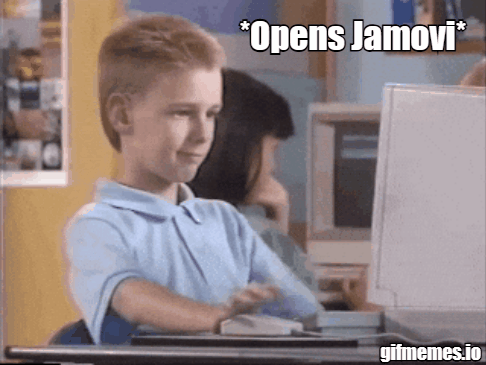{fig-align="center"}

::: {.callout-note appearance="simple"}
**A real-world example...** a sports scientist might use a **one-sample
t-test** to ask whether elite athletes' resting heart rates differ from
the general-population average, an **independent samples t-test** to
compare reaction times between gamers and non-gamers, and a **paired
samples t-test** to test whether cholesterol changed after a new drug in
the same patients. Same family of test, three different research
designs.
:::

## Why t-tests?

T-tests compare **means**. Our sample mean is only an estimate of the
**population mean** (the parameter we really want to know), so a t-test
asks whether the difference we observed is bigger than sampling
variation alone would produce, and the CI gives the range of population
means (or mean differences) consistent with the data. Which one you use
is decided entirely by your **design**:

+-------------------------------+----------------+----------------+
| Question                      | Test           | What it        |
|                               |                | compares       |
+===============================+================+================+
| *Does this group differ from  | **One-sample** | One sample     |
| a known/recommended value?*   |                | mean vs. a     |
|                               |                | fixed          |
|                               |                | hypothesised   |
|                               |                | value μ₀ (e.g. |
|                               |                | 7 h)           |
+-------------------------------+----------------+----------------+
| *Do two separate groups       | **Independent  | Mean of group  |
| differ?*                      | samples**      | A vs. mean of  |
|                               |                | group B (bet   |
|                               |                | ween-subjects) |
+-------------------------------+----------------+----------------+
| *Did the same people change   | **Paired       | Mean of the    |
| between two                   | samples**      | *within-person |
| conditions/times?*            |                | differences*   |
|                               |                | vs. 0          |
+-------------------------------+----------------+----------------+

{width="100%" fig-align="center"}

::: {.callout-important appearance="simple"}
**Why t and not z?** Remember from Lecture 13's, we use a z-test only
when the population SD (σ) is known, which is almost never. Everything
today estimates σ from the sample SD (*s*), which adds uncertainty, so
we use the t-distribution with its fatter tails and its degrees of
freedom (df). With large samples t and z converge; with small samples t
is deliberately more cautious/conservative.
:::

------------------------------------------------------------------------

## The t-test essentials {.unnumbered}

Work through these tabs before the tasks. They condense Lectures 11--13
into what you need at the keyboard (and in the exam).

::: panel-tabset
### Which test?

The choice is made by the **design**, not by the data. Ask two
questions:

1.  **How many groups/conditions?** One → *one-sample*. Two → next
    question.
2.  **Are the two sets of scores from the *same* people (or matched
    pairs)?** Yes → *paired*. No → *independent*.

+------------------------------------------------+----------------+
| Design cue in the scenario                     | Test           |
+================================================+================+
| "compared to the recommended...", "differ from | One-sample     |
| the norm"                                      |                |
+------------------------------------------------+----------------+
| "two groups", "smokers vs non-smokers",        | Independent    |
| "between"                                      | samples        |
+------------------------------------------------+----------------+
| "before and after", "each participant did      | Paired samples |
| both", "matched pairs", "cross-over"           |                |
+------------------------------------------------+----------------+

Quick-fire practice (three scenarios, no data needed):

```{=html}
<div class="ws-quiz" data-answer="paired" data-okmsg="Same players measured twice, so the differences are what we test.">
  <p class="ws-qtext">Grip strength is measured in 18 netballers before and after a 6-week training block. Which test?</p>
  <label class="ws-opt"><input type="radio" name="wt1" value="one">One-sample t-test</label>
  <label class="ws-opt"><input type="radio" name="wt1" value="indep">Independent samples t-test</label>
  <label class="ws-opt"><input type="radio" name="wt1" value="paired">Paired samples t-test</label>
  <button class="ws-check" type="button">✓ Check</button>
  <span class="ws-fb"></span>
  <div class="ws-hint"><strong>Hint:</strong> are the "before" scores and the "after" scores from the same people?</div>
</div>
<div class="ws-quiz" data-answer="one" data-okmsg="One group, one reference value.">
  <p class="ws-qtext">A dietitian records daily sodium intake in 40 tradies and asks whether it differs from the 2,000 mg guideline. Which test?</p>
  <label class="ws-opt"><input type="radio" name="wt2" value="one">One-sample t-test</label>
  <label class="ws-opt"><input type="radio" name="wt2" value="indep">Independent samples t-test</label>
  <label class="ws-opt"><input type="radio" name="wt2" value="paired">Paired samples t-test</label>
  <button class="ws-check" type="button">✓ Check</button>
  <span class="ws-fb"></span>
  <div class="ws-hint"><strong>Hint:</strong> how many groups of people were measured? What is the 2,000 mg being compared against?</div>
</div>
<div class="ws-quiz" data-answer="indep" data-okmsg="Two separate groups of people, nobody measured twice.">
  <p class="ws-qtext">Reaction time is compared between 30 regular gamers and 30 non-gamers. Which test?</p>
  <label class="ws-opt"><input type="radio" name="wt3" value="one">One-sample t-test</label>
  <label class="ws-opt"><input type="radio" name="wt3" value="indep">Independent samples t-test</label>
  <label class="ws-opt"><input type="radio" name="wt3" value="paired">Paired samples t-test</label>
  <button class="ws-check" type="button">✓ Check</button>
  <span class="ws-fb"></span>
  <div class="ws-hint"><strong>Hint:</strong> a gamer's score isn't linked to any particular non-gamer's score. They are unrelated groups.</div>
</div>
```
### The five steps

Every significance test follows the same recipe from Lecture 12. Jamovi
does the arithmetic for steps 3 and 4; steps 1, 2 and 5 are **yours**.

+----------------+---------------------------------+----------------+
| Step           | What you do                     | Where it       |
|                |                                 | happens today  |
+================+=================================+================+
| 1\. A          | Continuous outcome, independent | Exploration ▸  |
| ssumptions\*\* | observations (design),          | Descriptives   |
|                | approximately normal            |                |
+----------------+---------------------------------+----------------+
| 2\.            | H₀: no difference (μ = 7, μ₁ =  | Written        |
| **Hypotheses** | μ₂, or μ_d = 0).                | *before* you   |
|                |                                 | analyse        |
|                | Hₐ: a difference (≠,            |                |
|                | two-tailed)                     |                |
+----------------+---------------------------------+----------------+
| 3\. **Test     | t = (observed difference) ÷     | Jamovi output, |
| statistic**    | (standard error of that         | `Statistic`    |
|                | difference)                     |                |
+----------------+---------------------------------+----------------+
| 4\.            | Probability of a t at least     | Jamovi output, |
| **p-value**    | this extreme *if H₀ were true*, | `p`            |
|                | using the t-distribution with   |                |
|                | df                              |                |
+----------------+---------------------------------+----------------+
| 5\.            | Reject / fail to reject H₀,     | Your write-up  |
| **Conclusion** | then interpret with CI, effect  |                |
|                | size and real-world context     |                |
+----------------+---------------------------------+----------------+

::: {.callout-tip appearance="simple"}
**Two-tailed by default.** All three research questions today ask
whether there is *a difference*, not a difference in a specified
direction, so Hₐ uses ≠ and α = 0.05 is split 0.025 into each tail.
Lecture 13's point still stands, even when you expect a direction, a
two-tailed test is the conservative, widely accepted choice. It sets a
higher bar to clear before we claim a difference, so a result that
clears it is harder to argue with, and it can still detect an effect
that turns out to run the opposite way to what we predicted.
:::

### Assumptions

T-tests are **parametric**, they assume the sampling distribution of the
mean is normal. In practice we check the *data* (or the *differences*,
for a paired test) three ways and read them together:

+---------------+------------------------------+---------------+
| Check         | What to look for             | Jamovi        |
+===============+==============================+===============+
| **Sh          | p \> 0.05 → no evidence      | Descriptives  |
| apiro--Wilk** | **against** normality        | ▸ Statistics  |
|               |                              | ▸ Normality,  |
|               |                              | or T-Tests ▸  |
|               |                              | Assumption    |
|               |                              | Checks        |
+---------------+------------------------------+---------------+
| **Histog      | Roughly bell-shaped, no      | Descriptives  |
| ram/density** | severe skew                  | ▸ Plots       |
+---------------+------------------------------+---------------+
| **Q-Q plot**  | Dots hug the diagonal;       | Descriptives  |
|               | wobble at the very ends is   | ▸ Plots ▸     |
|               | normal, an S-bend is not     | Q-Q, or       |
|               |                              | T-Tests ▸     |
|               |                              | Assumption    |
|               |                              | Checks        |
+---------------+------------------------------+---------------+

Plus two you check from the **design**, not a plot... the outcome is
**continuous**, and observations are **independent** (one row = one
person for the one-sample and independent tests). For a paired test the
two scores within a person are meant to be related (that's the point),
but each pair must be independent of every other pair e.g., no
participant doing the study twice, no participants doing a task side by
side and influencing each other's scores.

::: {.callout-warning appearance="simple"}
**Three traps when checking normality.** **(1)** With large samples
Shapiro--Wilk becomes hypersensitive and will flag trivially non-normal
data as "significant", so never rely on it alone; look at the plots.
**(2)** For a **paired** test the assumption applies to the **difference
scores**, not the two raw columns. **(3)** Outliers in a boxplot are
*not* a reason to delete data. T-tests are reasonably robust to
outliers; remove a point only if you can justify it (e.g. a known
measurement or entry error) and report that you did.
:::

You'll also see *Mann-Whitney U* and *Wilcoxon rank* options in the
Jamovi dialogs. These are the **non-parametric** versions for when
normality clearly fails; they're not covered in this course, so leave
them unticked. We focus on nice textbook style data and don't get into
all the adjustments you can make to data when it is non-normal.

### Reading the output

Jamovi's t-test table has more columns than we've used before. Here's
what each one is, in the order they appear:

+----------------+--------------------------------------------------+
| Column         | Plain-English meaning                            |
+================+==================================================+
| **Statistic    | The observed difference divided by its standard  |
| (t)**          | error, i.e. *how many SEs away from H₀ are we?*  |
|                | Bigger (either sign) = stronger evidence         |
+----------------+--------------------------------------------------+
| **df**         | Degrees of freedom. One-sample and paired: n     |
|                | − 1. Independent: n₁ + n₂ − 2. Sets the exact    |
|                | shape of the t-distribution                      |
+----------------+--------------------------------------------------+
| **p**          | If H₀ were true, how often would sampling alone  |
|                | give a t at least this extreme? Below 0.05 →     |
|                | *statistically significant*                      |
+----------------+--------------------------------------------------+
| **Mean         | The raw effect in the units you measured (hours, |
| difference**   | points, mm). For one-sample: mean − hypothesised |
|                | value (μ₀)                                       |
+----------------+--------------------------------------------------+
| **SE           | The precision of that difference (how much it    |
| difference**   | would wobble in a repeat study). Note **t = Mean |
|                | difference ÷ SE**                                |
+----------------+--------------------------------------------------+
| **95% CI       | The range of plausible values for the            |
| (Lower,        | *population* difference. For one-sample Jamovi   |
| Upper)**       | shows the CI of the **difference** in the t-test |
|                | table and the CI of the **mean** in Descriptives |
+----------------+--------------------------------------------------+
| **Effect size  | The difference in **SD units**, so results can   |
| (Cohen's d)**  | be compared across studies with different scales |
+----------------+--------------------------------------------------+

::: {.callout-warning appearance="simple"}
**Two easy-to-confuse terms.** The **test statistic** is *t*, the number
Jamovi calculates from your data. The **hypothesised value** (μ₀, which
Jamovi's one-sample dialog labels "Test value") is the number you are
testing *against*, e.g. 7 h.
:::

### CIs & p-values

A **95% confidence interval (CI)** is the range of values for the
population parameter that are consistent with your data. That gives you
a second, more informative route to the same yes/no answer as the
p-value:

::: {.callout-tip appearance="simple"}
For the independent and paired tests (both report a **mean
difference**). If the 95% CI for that difference includes 0, p \> 0.05;
if it excludes 0, p \< 0.05. For a one-sample test the same logic
applies to whether the CI for the mean includes the hypothesised value
μ₀ (in today's one sample test \[Task 1\] it is 7 h). The CI gives you
the same decision *plus* the size and direction of plausible effects,
which is why we report both.
:::

Two properties from Lecture 11 that you'll see in Task 4: a CI gets
**narrower as n grows** (SEM = s ÷ √n) and **wider as you ask for more
confidence** (99% \> 95% \> 90%).

::: {.callout-warning appearance="simple"}
**Overlapping group CIs are NOT a significance test.** Jamovi shows you
two different CIs. The descriptive plot draws a 95% CI around each
group's mean (two separate error bars). The t-test table gives a 95% CI
for the mean difference (the Lower and Upper columns). Only the second
one answers the hypothesis, because H₀ is a claim about the difference
i.e., does 0 sit inside the range of plausible differences or not? The
two error bars in the plot can overlap while that interval still
excludes 0 (we will see this in Task 3 today).
:::

{width="100%" fig-align="center"}

### Effect size

A p-value tells you whether the difference is unlikely to be chance;
**Cohen's d** tells you how big it is, in standard-deviation units:

$$d = \frac{\text{mean difference}}{\text{SD}}$$

Because d is standardised (analogous to a z-score), an 8-point focus
change on a 100-point scale and a 0.5-s change in reaction time can be
compared directly, which is what makes **meta-analysis** possible, by
pooling and comparing results across studies even when they measured the
outcome on different scales or in different units.

+-----------+-----------+
| d         | Label     |
+===========+===========+
| ≈ 0.2     | Small     |
+-----------+-----------+
| ≈ 0.5     | Medium    |
+-----------+-----------+
| ≥ 0.8     | Large     |
+-----------+-----------+

**What d actually describes.** Picture the histogram (with its density
curve) of each group's scores, as Jamovi draws them, side by side on the
same axis. Cohen's d is the distance between the two peaks measured in
standard deviations, the typical spread of each histogram. That ratio
decides how much the two groups overlap. At d = 0.2 (small) the two
histograms sit almost on top of each other; at d = 0.8 (large) you can
see the separation at a glance. You met the same idea in Week 2:
Pearson's *r* is also an effect size (0.1 / 0.3 / 0.5 for small / medium
/ large), just for relationships instead of group differences. Task 4
lets you visualise the overlap of Cohen's d.

Two rules for today. **1)** If p \> 0.05, interpret d with great caution
(or not at all), as you haven't shown that the means differ, so there is
no difference for d to describe the size of. **2)** Effect size ≠
clinical meaningfulness. Whether a difference *matters* needs domain
knowledge or is already a standard value e.g., what patients can notice,
what guidelines say, a cost threshold. A "small" d can matter (e.g., 20
min less sleep every night) and a "significant" difference can be
irrelevant (e.g., a 1.4-point change on a scale where people only begin
to notice if it is \>4).
:::

------------------------------------------------------------------------

## Get the Jamovi data files

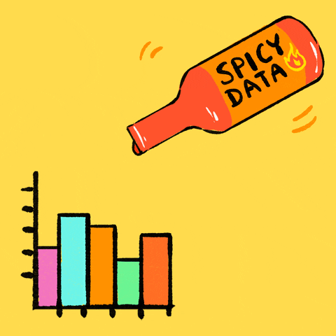{fig-align="center" width="410"}

Three datasets, one for each type of t-test. Save them somewhere
easy to find, then open each in Jamovi when its task comes up.

-   Task 1: [**student_sleep.csv**](https://lms.griffith.edu.au/courses/32192/files/10008969?wrap=1) --- 57 students,
    `Sleep (h)`
-   Task 2: [**coffee_stress.csv**](https://lms.griffith.edu.au/courses/32192/files/10008970?wrap=1) --- 66 students,
    `Group` (Coffee / NonCoffee) and `VAS Stress 0-10 Score (mm)`
-   Task 3: [**music_focus.csv**](https://lms.griffith.edu.au/courses/32192/files/10008972?wrap=1) --- 22 students,
    `Silence` and `Music` focus scores (out of 100)

::: {.callout-important appearance="simple"}
In each file, check the Variables tab first. The outcome should be
*Continuous*, `Group` should be *Nominal*, and `ID` should be *ID*.
Jamovi guesses, and it often guesses wrong.
:::

## Research questions

> 1.  Do university students get the recommended **7 hours** of sleep
>     per night during exam period?
> 2.  Is there a difference in **perceived stress** between regular
>     coffee drinkers and non-coffee drinkers?
> 3.  Is there a difference in **focus scores** when studying with music
>     versus in silence?

------------------------------------------------------------------------

## Tasks for you to do

Work through these in Jamovi in order and **check your answers as you
go**. Each task has small answer boxes, type (or select) what you found
and press **✓ Check**. As usual, you get instant feedback, and a hint
appears if you're stuck after a couple of tries. The full **worked
answer** for each task stays locked until you answer correctly (a
*reveal* option appears after three attempts, so have a genuine go
first). A fully worked version with every Jamovi task/test will be
released on Canvas after all lab classes finish for the week.

```{=html}
<script>
/* Lightweight formative answer-checking (no data leaves the page).
   Numeric inputs: data-answer + optional data-tol (tolerance) + optional
   data-abs="1" (accept either sign, for differences whose sign depends on
   the order the student entered the variables).
   Interpretation (cloze) questions: inline <select data-answer="..."> elements
   inside a .ws-cloze paragraph; every select must match to pass.
   Radio questions: put data-answer on the .ws-quiz container.
   data-unlock: id of the worked-answer block to unlock on success
   (or via the reveal button after 3 attempts). */
function wsUnlock(id){
  var el = document.getElementById(id);
  if(el){ el.classList.remove('ws-locked'); }
  var note = document.querySelector('.ws-lockednote[data-for="' + id + '"]');
  if(note){ note.remove(); }
}
/* Vary the order of dropdown options in interpretation questions so the
   correct choice is not always in the same position. */
document.addEventListener('DOMContentLoaded', function(){
  document.querySelectorAll('.ws-cloze').forEach(function(par){
    par.querySelectorAll('select').forEach(function(sel, i){
      var opts = Array.prototype.slice.call(sel.options, 1);
      if(opts.length < 2) return;
      var k = i % opts.length;
      var rotated = opts.slice(k).concat(opts.slice(0, k));
      rotated.forEach(function(o){ sel.appendChild(o); });
      sel.selectedIndex = 0;
    });
  });
});
document.addEventListener('click', function(e){
  var btn = e.target.closest('.ws-check');
  if(!btn) return;
  var q  = btn.closest('.ws-quiz');
  var fb = q.querySelector('.ws-fb');
  var hint = q.querySelector('.ws-hint');
  var nums = q.querySelectorAll('input[data-answer], select[data-answer]');
  var allOk = true, anyBlank = false;

  if(nums.length){
    nums.forEach(function(inp){
      if(inp.value.trim() === ''){ anyBlank = true; }
      if(inp.tagName === 'SELECT'){
        var okS = (inp.value === inp.dataset.answer);
        inp.style.borderColor = okS ? '#2e7d32' : '#c0152f';
        inp.style.background  = okS ? '#eef7ee' : '#fdf0f2';
        if(!okS) allOk = false;
        return;
      }
      var exp = parseFloat(inp.dataset.answer);
      var tol = parseFloat(inp.dataset.tol || 0);
      var val = parseFloat(inp.value);
      if(inp.dataset.abs){ exp = Math.abs(exp); val = Math.abs(val); }
      var ok  = !isNaN(val) && Math.abs(val - exp) <= tol;
      inp.style.borderColor = ok ? '#2e7d32' : '#c0152f';
      inp.style.background  = ok ? '#eef7ee' : '#fdf0f2';
      if(!ok) allOk = false;
    });
  } else if(q.dataset.answer !== undefined){
    var sel = q.querySelector('input[type=radio]:checked') ||
              q.querySelector('select');
    if(sel && sel.tagName === 'SELECT'){
      if(sel.value === ''){ anyBlank = true; allOk = false; }
      else allOk = (sel.value === q.dataset.answer);
    } else if(sel){
      allOk = (sel.value === q.dataset.answer);
    } else {
      anyBlank = true; allOk = false;
    }
  }

  if(anyBlank && !allOk){
    fb.className = 'ws-fb no';
    fb.textContent = 'Fill in an answer first, then press Check.';
    return;
  }

  q.dataset.tries = (parseInt(q.dataset.tries || '0', 10) + 1);

  if(allOk){
    fb.className = 'ws-fb ok';
    fb.textContent = '✓ Correct! ' + (q.dataset.okmsg || '');
    if(hint) hint.style.display = 'none';
    if(q.dataset.unlock){
      wsUnlock(q.dataset.unlock);
      fb.textContent += ' ' + (q.dataset.unlockmsg || 'The worked answer is now unlocked below.');
      var rv = q.querySelector('.ws-reveal');
      if(rv) rv.remove();
    }
  } else {
    fb.className = 'ws-fb no';
    fb.textContent = '✗ Not quite. Go back to your Jamovi output and try again.';
    if(hint && q.dataset.tries >= 2){ hint.style.display = 'block'; }
    if(q.dataset.unlock && q.dataset.tries >= 3 && !q.querySelector('.ws-reveal')){
      var btn2 = document.createElement('button');
      btn2.type = 'button';
      btn2.className = 'ws-reveal';
      btn2.textContent = 'Stuck? Reveal the worked answer';
      btn2.addEventListener('click', function(){
        wsUnlock(q.dataset.unlock);
        btn2.remove();
        fb.className = 'ws-fb';
        fb.textContent = 'Worked answer unlocked below. Read it closely, then reproduce the output in Jamovi yourself.';
      });
      q.appendChild(btn2);
    }
  }
});
</script>
```
### Task 1 --- One-sample t-test: are students getting enough sleep?

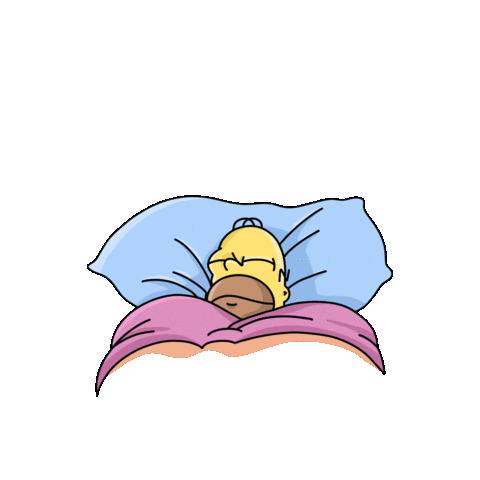{fig-align="center"}

**Scenario.** The Sleep Health Foundation recommends adults get at least
**7 hours** of sleep a night. You've collected sleep data from 57
university students during exam period. Are they meeting the
recommendation?

-   **H₀:** μ = 7.0 h (students get the recommended amount of sleep)
-   **Hₐ:** μ ≠ 7.0 h (two-tailed)

**a) Explore and check assumptions.** Open `student_sleep.omv`. Run
**Exploration ▸ Descriptives** on `Sleep (h)`: under *Statistics* tick
**Shapiro--Wilk** and **Confidence interval** (for the mean); under
*Plots* tick **Histogram** (+ Density), **Box plot** and **Q-Q**. Is the
distribution roughly bell-shaped? Do any values look like entry errors
(a 14-hour night, a negative number)? Outliers on their own aren't an
assumption of the t-test, so a few points beyond the whiskers are not a
problem, you're just doing the usual checks before we run the analysis.

**b) Run the test.** **Analyses ▸ T-Tests ▸ One Sample T-Test**:

1.  Move `Sleep (h)` into **Dependent Variables**
2.  Under *Hypothesis*, set **Test value = 7** (Jamovi's name for the
    hypothesised value μ₀; don't confuse it with the *test statistic*,
    t)  
3.  Under *Tests*, keep **Student's**
4.  Under *Additional Statistics* tick **Mean difference**, **Confidence
    interval**, **Effect size**, **Descriptives** and **Descriptives
    plots**
5.  Under *Assumption Checks* tick **Normality test** and **Q-Q plot**

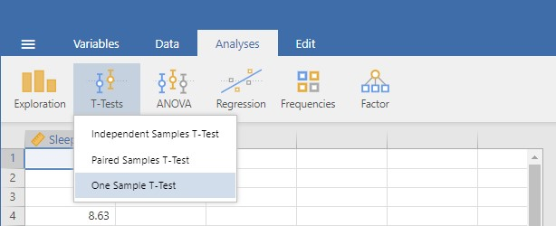{width="80%" fig-align="center"}

```{=html}
<div class="ws-quiz" data-unlock="t1-desc" data-okmsg="Mean below 7, and the data look normal. Now for the test.">
  <p class="ws-qtext">From your Descriptives:</p>
  <div class="ws-row"><label class="ws-inlab" for="t1-n">N (students):</label>
    <input type="number" id="t1-n" data-answer="57"></div>
  <div class="ws-row"><label class="ws-inlab" for="t1-m">Mean sleep (h):</label>
    <input type="number" id="t1-m" step="0.01" data-answer="6.58" data-tol="0.02"></div>
  <div class="ws-row"><label class="ws-inlab" for="t1-sd">SD (h):</label>
    <input type="number" id="t1-sd" step="0.01" data-answer="1.10" data-tol="0.02"></div>
  <button class="ws-check" type="button">✓ Check</button>
  <span class="ws-fb"></span>
  <div class="ws-hint"><strong>Hint:</strong> Exploration ▸ Descriptives with <code>Sleep (h)</code>
    in Variables. Tick <em>Shapiro</em> under Statistics ▸ Normality. A large p here is
    <em>good</em> news for the assumption.</div>
</div>
```
```{=html}
<p class="ws-lockednote" data-for="t1-desc">Assumption check locked. Answer correctly above to unlock it.</p>
```
::: {#t1-desc .callout-note .ws-locked collapse="true"}
## Worked answer --- descriptives & assumptions

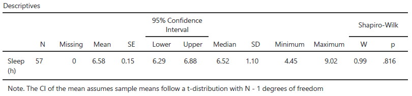{fig-align="center"}

::: {layout-ncol="2"}
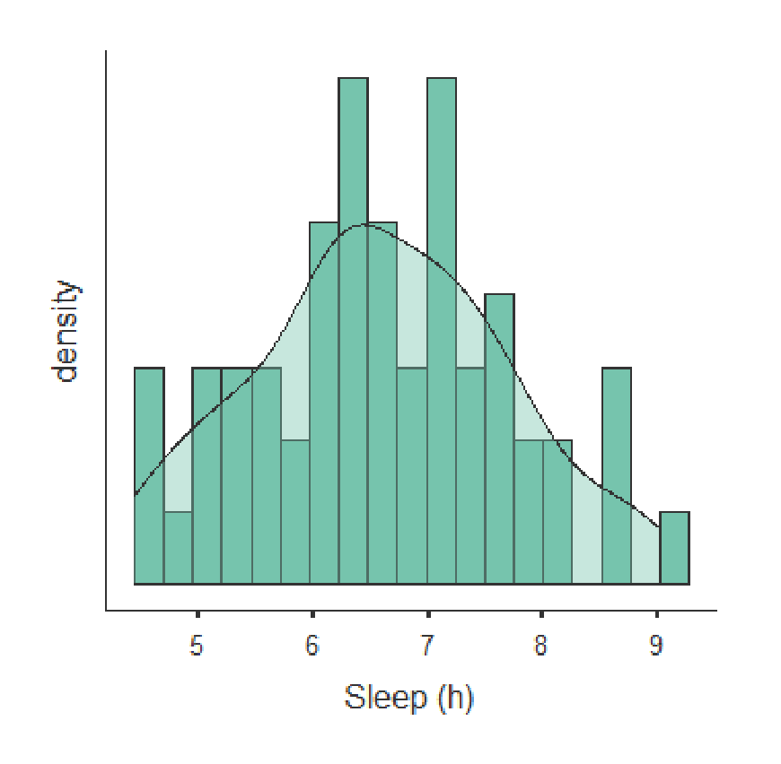

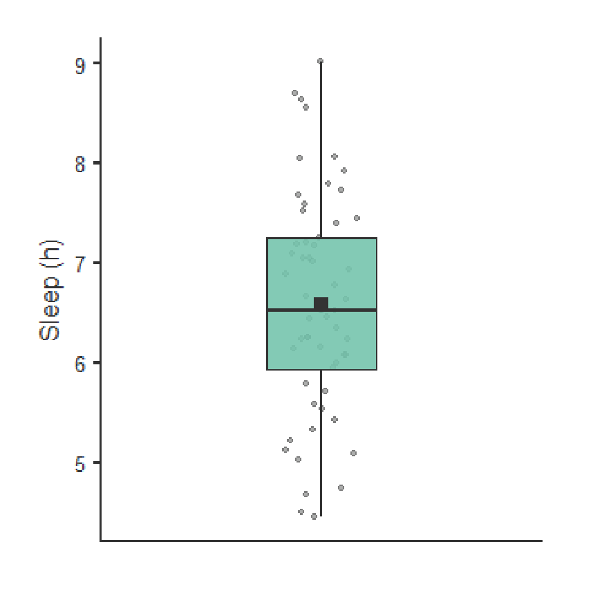

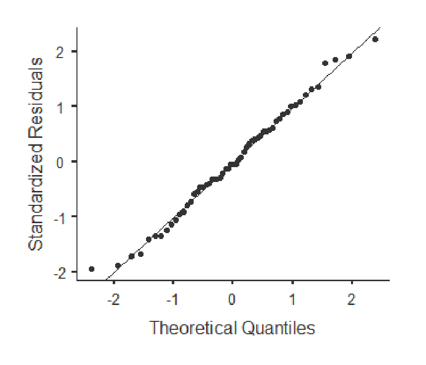

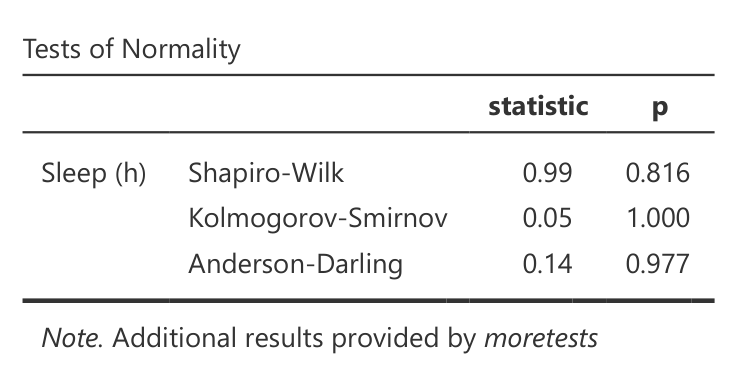
:::

Bell-shaped histogram, no outliers beyond the boxplot whiskers,
Shapiro--Wilk p = 0.816 (no evidence against normality) and Q-Q dots
tracking the diagonal. **Normality ✓.** Continuous outcome ✓;
independence from the design (each row is one student) ✓. Safe to run a
t-test.

Also notice the **95% CI of the mean** in this table **\[6.29, 6.88\]**.
It doesn't contain our reference value of 7 h. File that away, it
already tells you how the test is going to go.
:::

```{=html}
<div class="ws-quiz" data-unlock="t1-test" data-okmsg="That paragraph is a complete write-up of the result.">
  <p class="ws-qtext">Build the interpretation. Use your One Sample T-Test table to choose the right words (the numbers are given; the judgement is yours):</p>
  <p class="ws-cloze">A one-sample t-test compared students’ sleep during exam period (x = 6.58 h, s = 1.10, n = 57) with the recommended 7 h. On average students slept <select data-answer="less" aria-label="direction"><option value="">choose…</option><option value="less">less than</option><option value="more">more than</option><option value="same">about the same as</option></select> the recommendation, and the difference was <select data-answer="sig" aria-label="significance"><option value="">choose…</option><option value="sig">statistically significant</option><option value="ns">not statistically significant</option></select> at α = 0.05, t(56) = −2.85, p = 0.006, so we <select data-answer="reject" aria-label="decision"><option value="">choose…</option><option value="reject">reject H₀</option><option value="fail">fail to reject H₀</option><option value="accept">accept H₀</option></select>. The 95% CI for the mean difference, [−0.71, −0.12] h, <select data-answer="excl" aria-label="ci"><option value="">choose…</option><option value="excl">does not include</option><option value="incl">includes</option></select> 0, which <select data-answer="agrees" aria-label="agree"><option value="">choose…</option><option value="agrees">agrees with</option><option value="contradicts">contradicts</option></select> the p-value. Cohen’s d = −0.38 is a <select data-answer="smallmed" aria-label="effect"><option value="">choose…</option><option value="negl">negligible</option><option value="smallmed">small-to-medium</option><option value="large">large</option></select> effect. Because 0.42 h is about 25 minutes of lost sleep every night of exam period, the shortfall is <select data-answer="meaningful" aria-label="meaning"><option value="">choose…</option><option value="meaningful">practically meaningful</option><option value="notmeaningful">not practically meaningful</option></select> for student health.</p>
  <button class="ws-check" type="button">✓ Check</button>
  <span class="ws-fb"></span>
  <div class="ws-hint"><strong>Hint:</strong> every choice comes from one row of the t-test table. Sign of the mean difference → direction. p vs 0.05 → significant and the H₀ decision (we never “accept” H₀). Does 0 sit between Lower and Upper? d against 0.2 / 0.5 / 0.8. Then ask whether 25 minutes a night would matter to a health professional.</div>
</div>
```
**c) One tail or two?** The research question says "getting *enough*
sleep", which sounds directional. In the dialog, change *Hypothesis*
from **≠ Test value** to **\< Test value** and watch the p-value.

```{=html}
<div class="ws-quiz" data-answer="halves" data-okmsg="All of α now sits in the lower tail, so the same t is 'more extreme'. Switch it back to ≠ before moving on.">
  <p class="ws-qtext">What happens to p when you switch to the one-tailed (&lt; 7) hypothesis?</p>
  <label class="ws-opt"><input type="radio" name="t1tail" value="halves">It halves (0.006 → 0.003); t and the mean difference don't change</label>
  <label class="ws-opt"><input type="radio" name="t1tail" value="doubles">It doubles (0.006 → 0.012)</label>
  <label class="ws-opt"><input type="radio" name="t1tail" value="same">Nothing changes; the hypothesis setting only relabels the table</label>
  <button class="ws-check" type="button">✓ Check</button>
  <span class="ws-fb"></span>
  <div class="ws-hint"><strong>Hint:</strong> Lecture 12: a two-tailed test splits α = 0.05 into 0.025 per tail. A one-tailed test puts all 0.05 in one tail, so the same result gets a smaller p.</div>
</div>
```
::: {.callout-warning appearance="simple"}
**So why don't we just use one tail?** Because the direction must be
justified *before* seeing the data, a one-tailed test can never detect a
surprise in the other direction, and readers (and markers) are rightly
suspicious of a result that is only significant one-tailed. Two-tailed
is the conservative default in this course; report a one-tailed test
only when you pre-specified it and can defend it.
:::

```{=html}
<p class="ws-lockednote" data-for="t1-test">Worked answer locked. Complete the interpretation correctly to unlock it.</p>
```
::: {#t1-test .callout-note .ws-locked collapse="true"}
## Worked answer --- the test

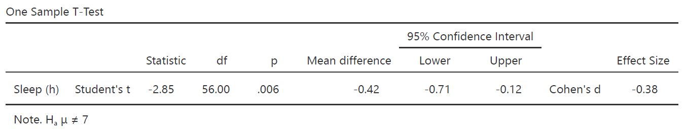{fig-align="center"}

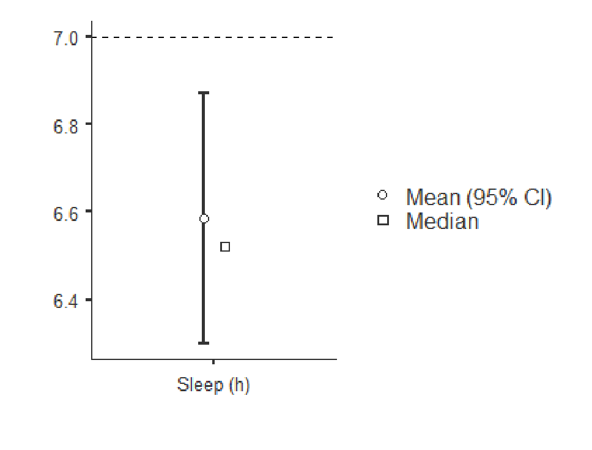{width="55%" fig-align="center"}

Now the four interpretation questions:

**Significance.** t(56) = −2.85, p = 0.006 \< 0.05 therefore we can
**reject H₀**. Students' sleep differs significantly from the 7-hour
recommendation, and the negative test statistics and mean difference
says they get *less*.

**Confidence interval.** The difference is plausibly anywhere from
**0.12 to 0.71 h below** 7 h. The interval doesn't include 0, which is
the same decision as the p-value. Equivalently, the CI for the mean
\[6.29, 6.88\] doesn't include 7. Look at your descriptive plot: the
whole error bar sits under the 7-h line.

**Effect size.** d = −0.38, a **small-to-medium** effect. The students
are about 0.4 SD short of the recommendation.

**Clinical meaning.** 0.42 h is about **25 minutes** a night, every
night of exam period. Let's say research links 20 minutes of chronic
short sleep to poorer cognition, mood and wellbeing, so despite the
modest d this is probably a **meaningful** shortfall and would justify
sleep hygiene and exam-stress interventions.

Notice how the effect size and the clinical judgement pull in slightly
different directions here (statistically "small", practically
important). That's normal; the two are related but not the same thing.
Sometimes you will see the opposite, a large statistical effect and
small p-values but it doesn't mean anything clinically.
:::

------------------------------------------------------------------------

### Task 2 --- Independent samples t-test: coffee and stress

{fig-align="center"}

**Scenario.** Many students lean on caffeine during the trimester. Does
regular coffee drinking go with different stress levels? You have
perceived-stress scores (visual analogue scale, 0--10) from 33 regular
coffee drinkers and 33 non-drinkers.

-   **H₀:** μ~Coffee~ = μ~NonCoffee~ (no difference in mean stress)
-   **Hₐ:** μ~Coffee~ ≠ μ~NonCoffee~ (two-tailed)

**a) Explore and check assumptions, per group.** Open
`coffee_stress.omv`. **Exploration ▸ Descriptives**: put
`VAS Stress 0-10 Score (mm)` in *Variables* and `Group` in **Split by**.
Tick **Shapiro--Wilk** and **Confidence interval** (for the mean), and
under *Plots* the **Histogram** (+ Density), **Box plot** and **Q-Q**.

**b) Run the test.** **Analyses ▸ T-Tests ▸ Independent Samples
T-Test**:

1.  `VAS Stress 0-10 Score (mm)` → **Dependent Variables**; `Group` →
    **Grouping Variable**
2.  *Tests*: keep **Student's**
3.  *Additional Statistics*: tick **Mean difference**, **Confidence
    interval**, **Effect size**, **Descriptives** and **Descriptives
    plots**
4.  *Assumption Checks*: tick **Homogeneity test** (Levene's)

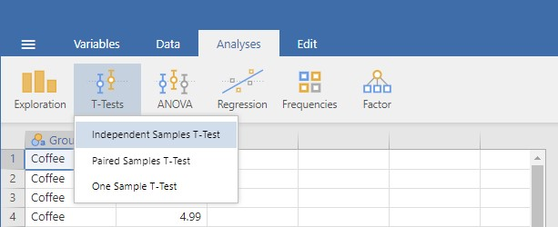{width="80%" fig-align="center"}

::: {.callout-note appearance="simple"}
**The extra assumption for two groups.** Student's t assumes the two
groups have roughly **equal variances** (it pools them). Levene's test
checks this... p \> 0.05 then it's fine, you can use Student's. If
Levene's p \< 0.05, tick **Welch's** under *Tests* and report that row
instead; Welch's doesn't assume equal variances and adjusts the df
(usually to a non-integer). Here the SDs look a little different (1.52
vs 1.17) so worth double checking.
:::

```{=html}
<div class="ws-quiz" data-unlock="t2-desc" data-okmsg="Coffee drinkers score a little higher and vary a little more. Both groups look normal.">
  <p class="ws-qtext">From your split Descriptives:</p>
  <div class="ws-row"><label class="ws-inlab" for="t2-mc">Mean stress, Coffee:</label>
    <input type="number" id="t2-mc" step="0.01" data-answer="6.67" data-tol="0.02"></div>
  <div class="ws-row"><label class="ws-inlab" for="t2-sc">SD, Coffee:</label>
    <input type="number" id="t2-sc" step="0.01" data-answer="1.52" data-tol="0.02"></div>
  <div class="ws-row"><label class="ws-inlab" for="t2-mn">Mean stress, NonCoffee:</label>
    <input type="number" id="t2-mn" step="0.01" data-answer="6.24" data-tol="0.02"></div>
  <div class="ws-row"><label class="ws-inlab" for="t2-sn">SD, NonCoffee:</label>
    <input type="number" id="t2-sn" step="0.01" data-answer="1.17" data-tol="0.02"></div>
  <div class="ws-row"><label class="ws-inlab" for="t2-lev">Levene's test p:</label>
    <input type="number" id="t2-lev" step="0.001" data-answer="0.119" data-tol="0.01"></div>
  <button class="ws-check" type="button">✓ Check</button>
  <span class="ws-fb"></span>
  <div class="ws-hint"><strong>Hint:</strong> with <code>Group</code> in <em>Split by</em>, the
    Descriptives table has one row per group. Two decimal places is plenty. Levene's p is in
    the <em>Homogeneity of Variances Test</em> table under the t-test output.</div>
</div>
```
```{=html}
<p class="ws-lockednote" data-for="t2-desc">Assumption check locked. Answer correctly above to unlock it.</p>
```
::: {#t2-desc .callout-note .ws-locked collapse="true"}
## Worked answer --- descriptives & assumptions

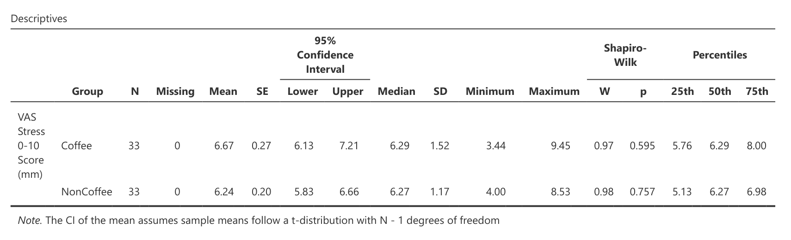{width="100%"}

::: {layout-ncol="2"}
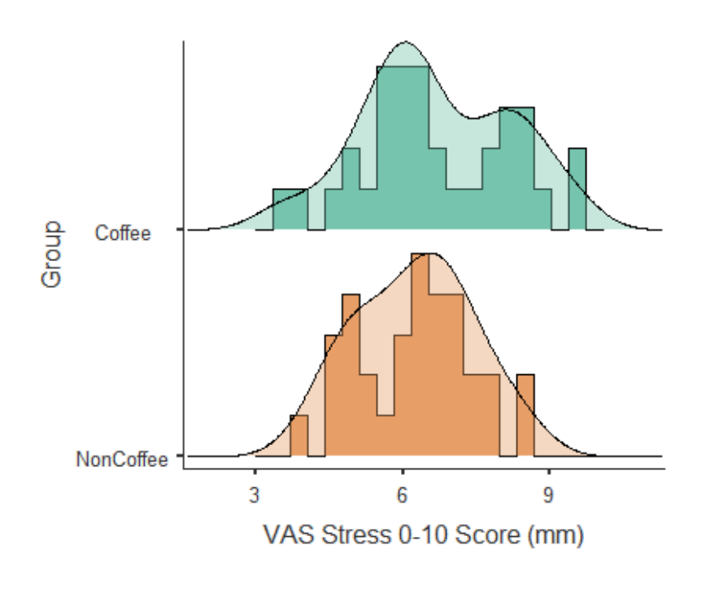

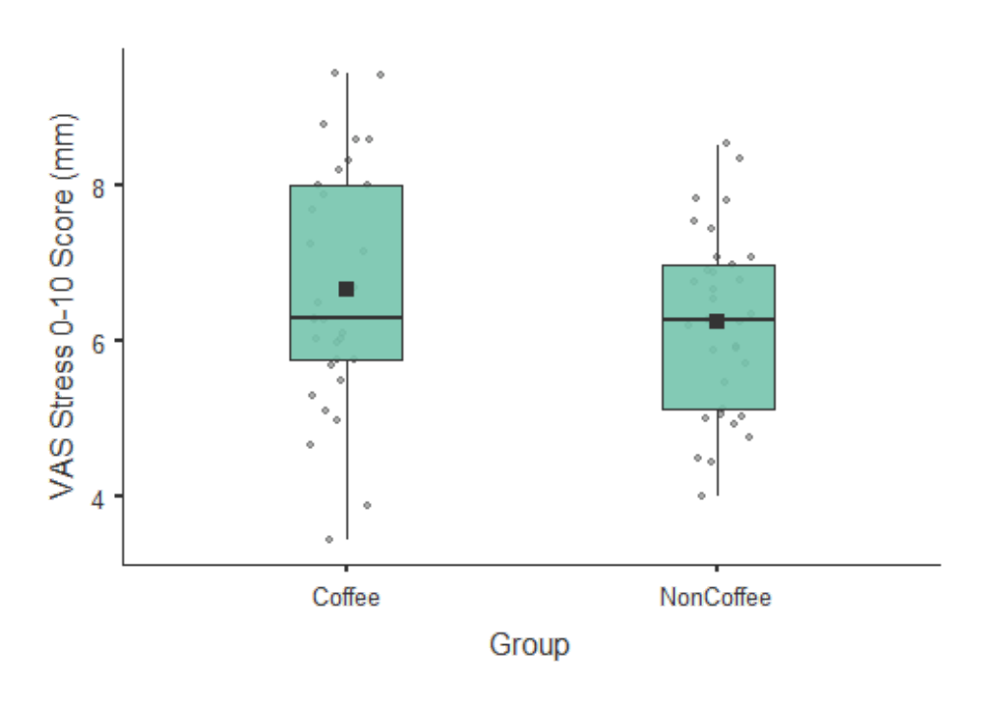
:::

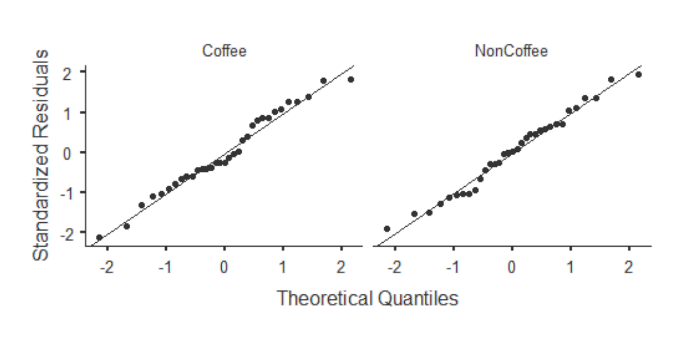{width="70%" fig-align="center"}

Coffee drinkers have a marginally higher mean and a wider spread; no
outliers in either boxplot. Both Shapiro--Wilk tests are non-significant
and both Q-Q plots track the diagonal therfore **Normality ✓** in each
group. Levene's F(1, 64) = 2.50, p = 0.119 suggests **equal variances
✓**, so Student's t is appropriate (Welch's gives the same answer
anyway: t(60) = 1.29, p = 0.203). Two unrelated groups of 33 so we
assume independence ✓. Also note the two groups' 95% CIs **overlap
heavily** (6.13--7.21 vs 5.83--6.66); keep that in mind for the next
part.
:::

```{=html}
<div class="ws-quiz" data-unlock="t2-test" data-okmsg="A non-significant result written up without over-claiming in either direction.">
  <p class="ws-qtext">Build the interpretation from your Independent Samples T-Test table:</p>
  <p class="ws-cloze">An independent samples t-test compared stress between coffee drinkers (x = 6.67, s = 1.52, n = 33) and non-drinkers (x = 6.24, s = 1.17, n = 33). Coffee drinkers scored <select data-answer="higher" aria-label="direction"><option value="">choose…</option><option value="higher">higher</option><option value="lower">lower</option><option value="same">identically</option></select> on average, but the difference was <select data-answer="ns" aria-label="significance"><option value="">choose…</option><option value="ns">not statistically significant</option><option value="sig">statistically significant</option></select>, t(64) = 1.29, p = 0.203, so we <select data-answer="fail" aria-label="decision"><option value="">choose…</option><option value="fail">fail to reject H₀</option><option value="reject">reject H₀</option><option value="accept">accept H₀</option></select>. The 95% CI for the difference, [−0.24, 1.10], <select data-answer="incl" aria-label="ci"><option value="">choose…</option><option value="incl">includes</option><option value="excl">does not include</option></select> 0, meaning a true difference of zero <select data-answer="plausible" aria-label="plaus"><option value="">choose…</option><option value="plausible">is plausible</option><option value="ruledout">has been ruled out</option></select>. Cohen’s d = 0.32 <select data-answer="caution" aria-label="effect"><option value="">choose…</option><option value="caution">should be interpreted with caution because p &gt; 0.05</option><option value="report">shows coffee has a small-to-medium effect on stress</option></select>. The correct conclusion is that this study <select data-answer="noevidence" aria-label="conclusion"><option value="">choose…</option><option value="noevidence">found no evidence of a difference in stress</option><option value="proves">proves coffee does not affect stress</option></select>.</p>
  <button class="ws-check" type="button">✓ Check</button>
  <span class="ws-fb"></span>
  <div class="ws-hint"><strong>Hint:</strong> p = 0.203 &gt; 0.05 and the CI straddles 0: the two always agree. “Not significant” means we lack evidence of a difference, not that we have shown there is none. And re-read the Effect size tab about d when p &gt; 0.05.</div>
</div>
```
```{=html}
<p class="ws-lockednote" data-for="t2-test">Worked answer locked. Complete the interpretation correctly to unlock it.</p>
```
::: {#t2-test .callout-note .ws-locked collapse="true"}
## Worked answer --- the test

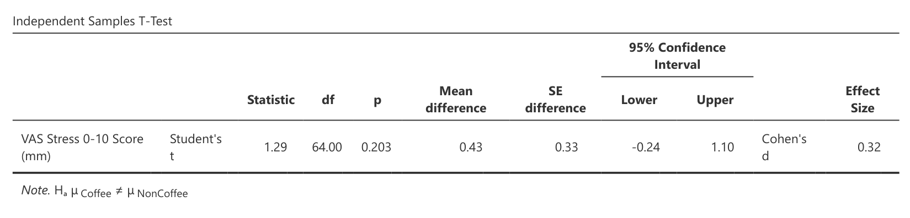{width="100%"}

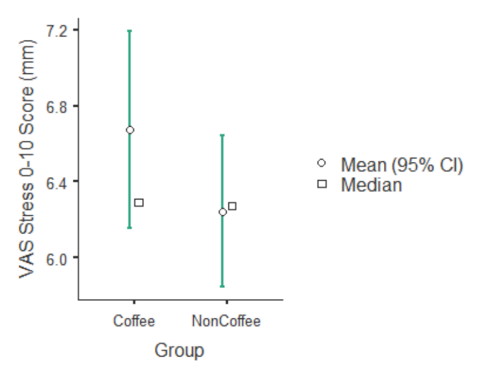{width="55%" fig-align="center"}

**Significance.** t(64) = 1.29, p = 0.203 \> 0.05, so we **fail to
reject H₀**. Using intuition, if we think about and unadjusted z cut-off
being ±1.96, well a t-statistics of 1.29 is well inside it, so a t
cut-off, which only going to be larger, is certainly not going to be
crossed.

**Confidence interval.** The true difference could plausibly be anywhere
from **0.24 points lower to 1.10 points higher** for coffee drinkers.
Because that range **includes 0**, "no difference" is entirely
consistent with the data.

**Effect size.** d = 0.32 would be small-to-medium *if* it were real,
but we haven't shown it is. With p = 0.203 (i.e., non-significant) we
**don't really accept the effect size** (though the opposite is true, if
we had a small \[i.e., significant\] p we would interpret the d no
matter the size to tell us the size of the effect).

**Clinical meaning.** On a 0--10 stress scale a 0.4-point average gap is
unlikely to be noticeable in daily life even if it existed.

**Careful with the wording:** we did *not* prove coffee has no effect.
The honest conclusion is that *this study found no evidence of a
difference*. To see why the distinction matters, with exactly these
means and SDs but **80 per group**, p ≈ 0.047; with **100 per group**, p
≈ 0.026. "Not significant" often just means "not enough data to be
sure", which is why the CI (\[−0.24, 1.10\], wide) is more honest than
the p-value alone as in that hypothetical is means the true population
mean could fall either side of zero (we are not sure the direction of
the relationship, if any).
:::

::: {.callout-important appearance="simple"}
**Design check before Task 3.** Even if this had been significant, it
would *not* show that coffee causes stress. Students **chose** their
group, so coffee drinkers might differ in workload, sleep, income or
anxiety to begin with (the confounding problem from the earlier
correlation lectures). Compare that with Task 3, where the same students
do both conditions in a **counterbalanced experiment**. That design
*can* support a causal claim, which is one more reason paired designs
are so valuable when they're feasible.
:::

------------------------------------------------------------------------

### Task 3 --- Paired samples t-test: music and focus

{fig-align="center"}

**Scenario.** Does background music help you study? 22 students
completed a focus task under two conditions, **silence** and **music**,
in counterbalanced order. Each person contributes both scores (out of
100), so the two columns are *paired*.

-   **H₀:** μ~d~ = 0 (no difference in focus between conditions)
-   **Hₐ:** μ~d~ ≠ 0 (two-tailed)

**a) Create the difference score.** Open `music_focus.omv`. **Data ▸
Compute**, name it `Difference`, formula: `` `Silence` - `Music` ``. A
positive difference means the student focused *better in silence*. This
is the variable the paired test actually analyses, so it's the one whose
normality matters.

**b) Check assumptions.** **Exploration ▸ Descriptives** on `Silence`,
`Music` **and** `Difference` with **Shapiro--Wilk**, **Histogram**,
**Box plot** and **Q-Q**. You'll see a couple of boxplot outliers in the
raw scores (IDs 5 and 12); don't remove them, there's no reason to think
they're errors and t-tests are robust to a few.

**c) Run the test.** **Analyses ▸ T-Tests ▸ Paired Samples T-Test**:

1.  Move **`Silence` first, then `Music`** into *Paired Variables* (so
    Jamovi reports Silence − Music and the sign matches your
    `Difference` column)
2.  *Tests*: keep **Student's**
3.  *Additional Statistics*: **Mean difference**, **Confidence
    interval**, **Effect size**, **Descriptives** and **Descriptives
    plots**

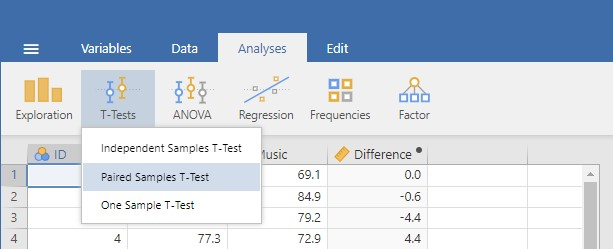{width="80%" fig-align="center"}

```{=html}
<div class="ws-quiz" data-unlock="t3-desc" data-okmsg="The differences are normal, which is the assumption that matters for a paired test.">
  <p class="ws-qtext">From your Descriptives:</p>
  <div class="ws-row"><label class="ws-inlab" for="t3-ms">Mean focus, Silence:</label>
    <input type="number" id="t3-ms" step="0.01" data-answer="79.18" data-tol="0.02"></div>
  <div class="ws-row"><label class="ws-inlab" for="t3-mm">Mean focus, Music:</label>
    <input type="number" id="t3-mm" step="0.01" data-answer="77.75" data-tol="0.02"></div>
  <div class="ws-row"><label class="ws-inlab" for="t3-sdd">SD of Difference:</label>
    <input type="number" id="t3-sdd" step="0.01" data-answer="3.16" data-tol="0.02"></div>
  <div class="ws-row"><label class="ws-inlab" for="t3-sw">Shapiro–Wilk p for Difference:</label>
    <input type="number" id="t3-sw" step="0.001" data-answer="0.873" data-tol="0.01"></div>
  <button class="ws-check" type="button">✓ Check</button>
  <span class="ws-fb"></span>
  <div class="ws-hint"><strong>Hint:</strong> three rows in Descriptives: Silence, Music,
    Difference. The Shapiro–Wilk we care about is the <em>Difference</em> row.</div>
</div>
```
```{=html}
<p class="ws-lockednote" data-for="t3-desc">Assumption check locked. Answer correctly above to unlock it.</p>
```
::: {#t3-desc .callout-note .ws-locked collapse="true"}
## Worked answer --- descriptives & assumptions

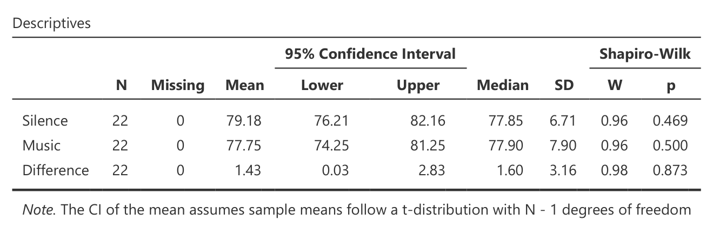{width="85%" fig-align="center"}

::: {layout-ncol="3"}
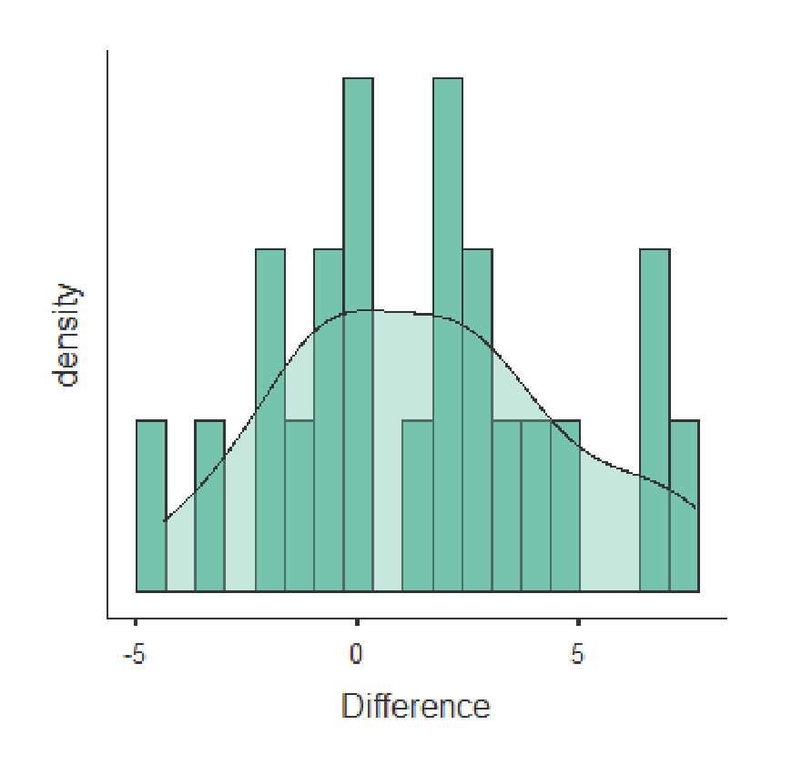

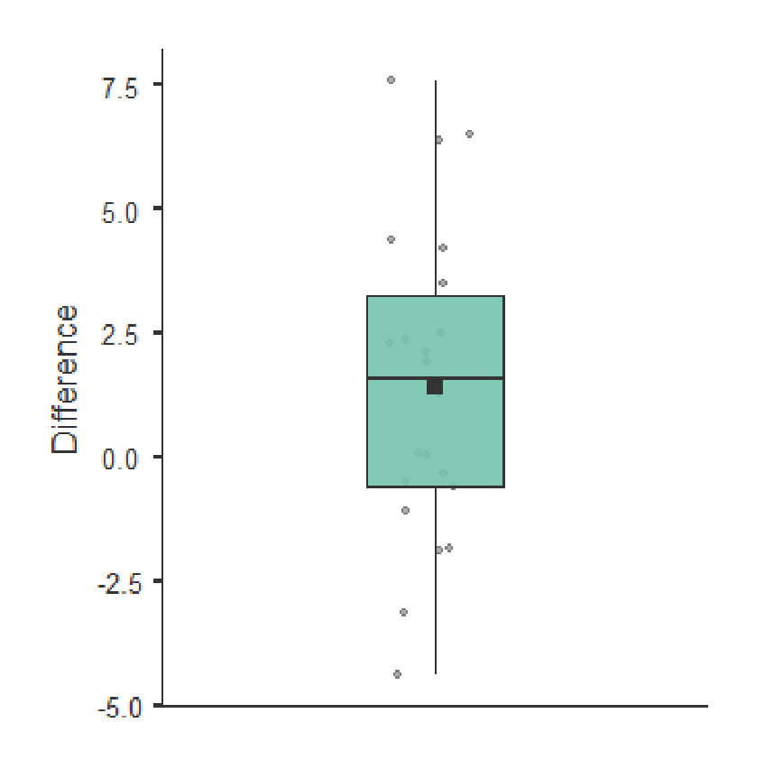

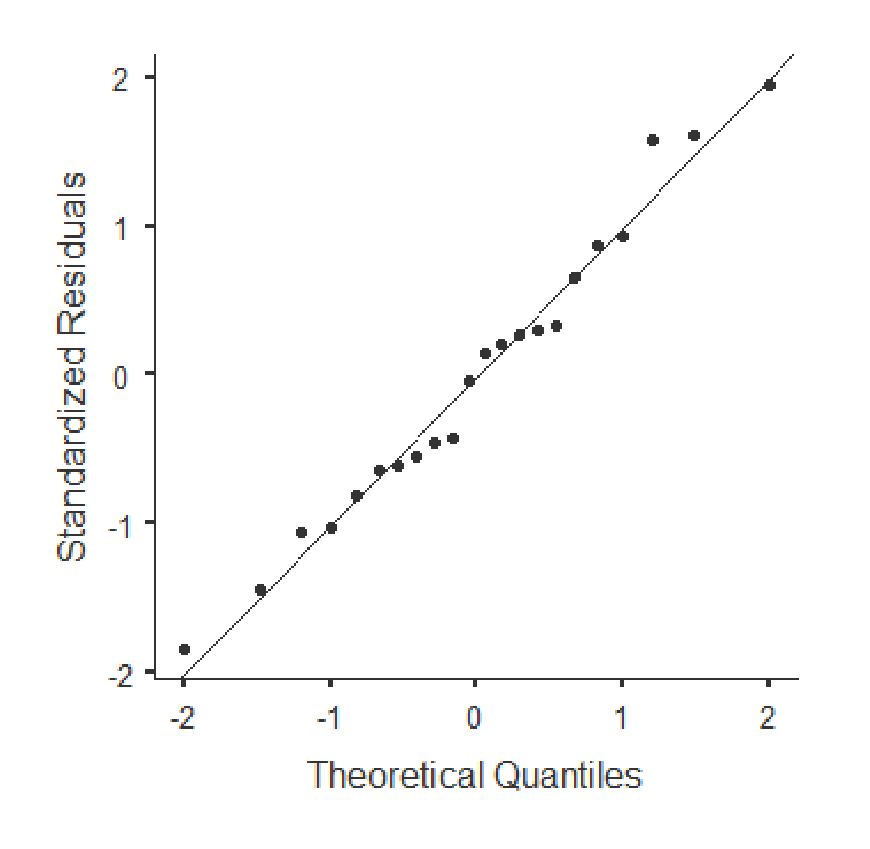
:::

On average students scored **1.43 points higher in silence** than with
music, with a lot of person-to-person variation (SD 3.16, some students
improved with music, most got slightly worse). The Difference scores are
approximately normal (SW p = 0.873, clean histogram and Q-Q) therfore
**Normality ✓**. The pairs are independent students ✓.
:::

```{=html}
<div class="ws-quiz" data-unlock="t3-test" data-okmsg="Now the two follow-up questions push on what this result does and doesn’t mean.">
  <p class="ws-qtext">Build the interpretation from your Paired Samples T-Test table (Silence − Music):</p>
  <p class="ws-cloze">A paired samples t-test compared focus in silence (x = 79.18, s = 6.71) and with music (x = 77.75, s = 7.90) in the same 22 students. Focus was <select data-answer="silence" aria-label="direction"><option value="">choose…</option><option value="silence">higher in silence</option><option value="music">higher with music</option><option value="same">the same in both</option></select>, and the difference was <select data-answer="sig" aria-label="significance"><option value="">choose…</option><option value="sig">statistically significant</option><option value="ns">not statistically significant</option></select>, t(21) = 2.12, p = 0.046, so we <select data-answer="reject" aria-label="decision"><option value="">choose…</option><option value="reject">reject H₀</option><option value="fail">fail to reject H₀</option></select>. The 95% CI for the mean difference, [0.03, 2.83] points, <select data-answer="excl" aria-label="ci"><option value="">choose…</option><option value="excl">does not include</option><option value="incl">includes</option></select> 0, but its lower limit is <select data-answer="close" aria-label="limit"><option value="">choose…</option><option value="close">only just above</option><option value="far">well clear of</option></select> zero, so the true effect could be <select data-answer="tiny" aria-label="range"><option value="">choose…</option><option value="tiny">almost nothing or nearly 3 points</option><option value="big">at least 2 points</option></select>. Cohen’s d = 0.45 is a <select data-answer="smallmed" aria-label="effect"><option value="">choose…</option><option value="smallmed">small-to-medium</option><option value="large">large</option><option value="negl">negligible</option></select> effect.</p>
  <button class="ws-check" type="button">✓ Check</button>
  <span class="ws-fb"></span>
  <div class="ws-hint"><strong>Hint:</strong> p = 0.046 is under 0.05, but only just, and the CI’s lower limit of 0.03 says the same thing. Positive mean difference = silence scored higher (if yours is negative you entered Music first). df = pairs − 1.</div>
</div>
```
```{=html}
<div class="ws-quiz" data-answer="sigoverlap" data-okmsg="Exactly. The CI for the difference is the one that answers the hypothesis.">
  <p class="ws-qtext">The 95% CI for the mean difference is [0.03, 2.83], yet the two groups' own 95% CIs (Silence 76.2–82.2, Music 74.3–81.3) overlap a lot. Which statement is correct?</p>
  <label class="ws-opt"><input type="radio" name="t3ci" value="notsig">Because the group CIs overlap, the difference can't be significant</label>
  <label class="ws-opt"><input type="radio" name="t3ci" value="sigoverlap">The difference is significant: the CI of the <em>difference</em> excludes 0, and overlapping group CIs don't rule that out</label>
  <label class="ws-opt"><input type="radio" name="t3ci" value="error">Jamovi has made an error, these two results contradict each other</label>
  <button class="ws-check" type="button">✓ Check</button>
  <span class="ws-fb"></span>
  <div class="ws-hint"><strong>Hint:</strong> re-read the warning in the <em>CIs &amp; p-values</em> tab. Non-overlapping group CIs guarantee significance; overlapping ones tell you nothing either way. And a paired test removes the between-person variation that makes each group's CI wide.</div>
</div>
```
```{=html}
<div class="ws-quiz" data-answer="notmeaningful" data-okmsg="Significant, but not big enough to matter on this scale.">
  <p class="ws-qtext"><strong>Clinical meaningfulness.</strong> Suppose the focus scale was validated so that a change of about <strong>5 points</strong> is the smallest difference students can actually notice in their concentration. How should the 1.43-point effect be judged?</p>
  <label class="ws-opt"><input type="radio" name="t3clin" value="meaningful">Statistically significant and clinically meaningful; students should stop listening to music</label>
  <label class="ws-opt"><input type="radio" name="t3clin" value="notmeaningful">Statistically significant but not clinically meaningful; too small to warrant changing study habits</label>
  <label class="ws-opt"><input type="radio" name="t3clin" value="nothing">Not significant, so there's nothing to interpret</label>
  <button class="ws-check" type="button">✓ Check</button>
  <span class="ws-fb"></span>
  <div class="ws-hint"><strong>Hint:</strong> compare the mean difference (and even the far end of its CI, 2.83) with the 5-point threshold. p answers "is it there?", the scale answers "does it matter?"</div>
</div>
```
```{=html}
<p class="ws-lockednote" data-for="t3-test">Worked answer locked. Complete the interpretation correctly to unlock it.</p>
```
::: {#t3-test .callout-note .ws-locked collapse="true"}
## Worked answer --- the test

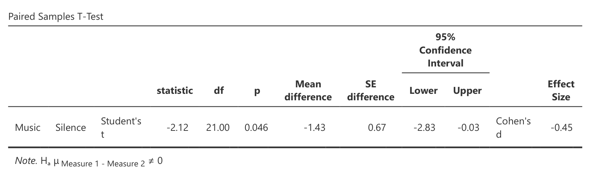{width="100%"}

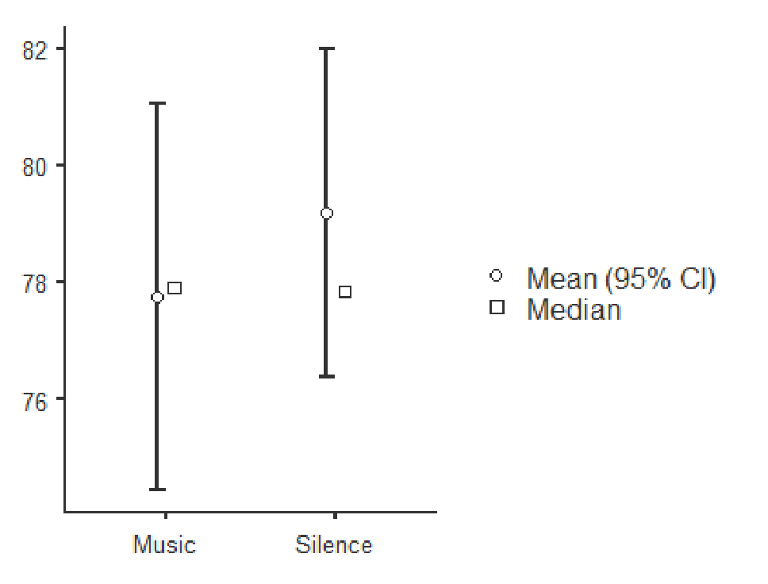{width="55%" fig-align="center"}

*(This output was produced with the pair entered Music then Silence, so
every sign is flipped relative to the table above; the sizes are
identical. I did this intentionally to demonstrate that the condition
you list first changes the sign but not the conclusion.)*

**Significance.** t(21) = 2.12, p = 0.046 \< 0.05 therefore we can
**reject H₀**. Focus was significantly *higher in silence* (i.e. lower
with music). Only just: p = 0.046 is a whisker under 0.05. Now ask
yourself is a probability of 4.6% vs. 5.0% really that different? But
magically it is when it comes to interpretation of significant vs
non-significant for p-values it is and this is a problem we will cover
in later weeks.

**Confidence interval.** \[0.03, 2.83\] excludes 0, matching the
p-value, but its lower end is barely above zero. The true effect could
be almost nothing or nearly 3 points.

**Effect size.** d = 0.45, small-to-medium.

**Clinical meaning.** 1.43 points on a 0--100 scale where about 5 points
is the smallest noticeable change. Even the most pessimistic end of the
CI (2.83) is under that threshold. **Not clinically meaningful**: no
reason to tell students to ditch their playlists.

**The overlapping-CI lesson.** The descriptive plot shows two heavily
overlapping error bars, yet the test is significant. That's because the
paired design compares each student with *themselves*, stripping out the
huge between-person differences (scores range from the 50s to the 90s)
that make each group's CI wide. The within-person differences are much
tighter (SD 3.16 vs \~7 for the raw scores), which is exactly why we
prefer paired designs when we can get them.
:::

------------------------------------------------------------------------

### Task 4 --- Visualisation, confidence intervals & effect sizes (if we have time in class)

Three interactive tools, then a few short questions. No Jamovi needed.

**a) Where the sampling distribution comes from.** Every CI and every
t-test on this page rests on one idea from Lecture 11: if you took many
samples from the same population, the sample *means* would themselves
form a distribution, the **sampling distribution of the mean**. You can
never see it in real research (you get one sample), so here it is
simulated. Pick a population shape, choose a sample size, and press
**Draw 1 sample**: the dots that fall are individual people's scores;
they settle into a sample, their mean is calculated, and that mean drops
into the bottom panel. Do it a few times, then let the tool draw
hundreds.

```{=html}
<div class="tt-sampler"></div>
```
Three things to notice, in this order:

1.  The **sample means pile up around the population mean μ**, and they
    are far less spread out than the individual scores above them.
    Their spread is the **standard error of the mean**, and the tool
    shows it matches σ ÷ √n.
2.  **Increase n** and draw again, the pile gets narrower. That is the
    whole reason larger samples give narrower CIs and smaller p-values.
3.  Switch to the **right-skewed** or **bimodal** population and draw a
    few hundred samples with n = 30. The population is nothing like a
    bell curve, yet the sampling distribution of the mean is. That is
    the **Central Limit Theorem**, and it is why the t-test only needs
    *approximate* normality once samples are moderately large.

::: {.callout-important appearance="simple"}
**This is where the z, t and F tables come from, and where hypothesis
tests come from.** You have just built a sampling distribution by brute
force. Statisticians worked out the *exact* shape of these
distributions mathematically, for every sample size, and that is what
the tables in the lecture (and Jamovi's p-values) contain: the
sampling distribution you would get **if H₀ were true**. The t-table
has a row for every df because, once σ has to be estimated from the
sample, the shape depends on n, which is why small samples need a bigger
t to reach significance.

A hypothesis test is then a simple question: *is my sample mean (or
mean difference) a plausible draw from the sampling distribution that
H₀ predicts?* If it sits in the middle, H₀ survives. If it sits out in
the tail, beyond the critical value, we conclude our sample did **not**
come from a population with that mean. For a pre/post weight-loss
study, rejecting H₀ says the post-programme weights behave as if they
were drawn from a population with a *different* mean to the
pre-programme weights, i.e. the programme moved the population mean,
not just this sample.
:::

```{=html}
<div class="ws-quiz" data-answer="narrow" data-okmsg="SEM = σ ÷ √n, so quadrupling n halves the spread of the sample means.">
  <p class="ws-qtext">Keep the population the same and change only the sample size from n = 10 to n = 40. After a few hundred draws, what happens to the sampling distribution of the mean?</p>
  <label class="ws-opt"><input type="radio" name="t4samp" value="narrow">It stays centred on μ but its spread roughly halves</label>
  <label class="ws-opt"><input type="radio" name="t4samp" value="same">Nothing changes: the population is the same, so the sampling distribution is the same</label>
  <label class="ws-opt"><input type="radio" name="t4samp" value="shift">It shifts to a different centre and gets wider</label>
  <button class="ws-check" type="button">✓ Check</button>
  <span class="ws-fb"></span>
  <div class="ws-hint"><strong>Hint:</strong> compare the "SD of the sample means" readout at the two sample sizes, and compare both with σ ÷ √n. √40 is twice √10.</div>
</div>
```

**b) The CI lab.** This is the sleep study from Task 1 as a live
calculation. Everything in the t-test table comes from just four
numbers: n, the mean, the SD and the hypothesised value μ₀. The SEM in
the first card is the spread of the sampling distribution you just
watched form; the CI is simply the middle 95% of it, centred on the
sample mean. Drag the inputs and watch the CI, t and p move
**together**.

```{=html}
<div class="tt-lab" data-n="57" data-mean="6.584" data-sd="1.101" data-mu="7" data-conf="95"></div>
```
Try these in order:

1.  Press **Sleep data** and confirm you get the Task 1 numbers (any
    difference in the last decimal place is rounding).
2.  Drop **n to 20** (same mean and SD). Watch the CI widen and swallow
    the 7-h line: the same 25-minute shortfall is now *not* significant.
    Small samples can only detect big effects.
3.  Reset, then set the **mean to 6.90** (a 6-minute shortfall). Not
    significant at n = 57. Now push **n** up until the CI just
    excludes 7. That's the "big sample makes anything significant"
    effect from Lecture 12, and why we never stop interpretation at just
    the p-value.
4.  Switch confidence to **99%**. Wider interval, same data.

**By hand, once.** The exam asks you to calculate a CI with a t-table
(Lecture 11), so do it once here without the tool. For the sleep data: x̄
= 6.58, s = 1.10, n = 57, so SEM = s ÷ √n. From the t-table,
t~0.025, df 56~ ≈ 2.003.

```{=html}
<div class="ws-quiz" data-okmsg="Same interval Jamovi gave you (any 0.01 difference is rounding). Now use the lab to see what changes it.">
  <p class="ws-qtext">95% CI = x̄ ± t × SEM. Fill in the limits to 2 decimal places:</p>
  <div class="ws-row"><label class="ws-inlab" for="t4-lo">Lower limit:</label>
    <input type="number" id="t4-lo" step="0.01" data-answer="6.29" data-tol="0.015"></div>
  <div class="ws-row"><label class="ws-inlab" for="t4-hi">Upper limit:</label>
    <input type="number" id="t4-hi" step="0.01" data-answer="6.88" data-tol="0.015"></div>
  <button class="ws-check" type="button">✓ Check</button>
  <span class="ws-fb"></span>
  <div class="ws-hint"><strong>Hint:</strong> margin of error = 2.003 × 0.146 = 0.29. Subtract it from and add it to 6.58.</div>
</div>
```
```{=html}
<div class="ws-quiz" data-unlock="t4-ci" data-okmsg="Right, a sample in the high 400s. Six minutes of sleep becomes 'significant' purely through sample size. Think to yourself will 6-minute likely be clinically meaningful...? You might want an extra 6-minutes of sleep, but it won't change your health one way or the other (remember 20-minutes of more was our clinical threshold).">
  <p class="ws-qtext">With mean = 6.90 h and s = 1.10 h, roughly what sample size makes the 95% CI first exclude 7 h (p just under 0.05)?</p>
  <label class="ws-opt"><input type="radio" name="t4n" value="60">About 60</label>
  <label class="ws-opt"><input type="radio" name="t4n" value="150">About 150</label>
  <label class="ws-opt"><input type="radio" name="t4n" value="480">About 480</label>
  <label class="ws-opt"><input type="radio" name="t4n" value="never">It never does, the difference is too small</label>
  <button class="ws-check" type="button">✓ Check</button>
  <span class="ws-fb"></span>
  <div class="ws-hint"><strong>Hint:</strong> type values straight into the n box rather than dragging. Watch the verdict flip from amber to teal.</div>
</div>
```
```{=html}
<p class="ws-lockednote" data-for="t4-ci">Worked answer locked. Answer correctly above to unlock it.</p>
```
::: {#t4-ci .callout-note .ws-locked collapse="true"}
## Worked answer --- why n matters

SEM = s ÷ √n, and the CI is mean ± t~crit~ × SEM. Quadrupling n halves
the SEM and halves the CI width. With a 0.10-h shortfall you need SEM ≈
0.05, so √n ≈ 22 → n ≈ 475--480. At that point p ≈ 0.048 and d is a
trivial 0.09 (you can check against the visualisation tool).

That result is *statistically* significant and *practically* meaningless
(6-minutes of sleep). Compare it with Task 1: a 25-minute shortfall at n
= 57 gave p = 0.006 **and** a plausible health impact. Same test but
very different stories, which is why the four interpretation questions
are asked together and never separately.
:::

**c) What does Cohen's d look like?** Effect sizes are new this week, so
here is the picture behind the number. **Each dot is one person's raw
score** (e.g., a stress rating, hours of sleep, a focus score) and each
bell curve is just the smoothed outline of one group's dots, exactly
like the density line Jamovi draws over a histogram. The axis is in
**standard deviations**, with the teal group's mean at 0. **Cohen's d is
the distance between the two peaks, in SD units.** The grey region is
where the two groups' scores overlap and both colours of dot are mixed
together. The bigger d, the smaller that region and the easier it is to
tell a member of one group from the other. Press the **preset buttons**
to load today's studies with the groups named. Press the **preset
buttons** to load today's studies with the groups named. Start with Task
3. Even though music made a *statistically significant* difference to
focus, the two conditions' scores intermingle almost completely (d =
0.45). Then drag the slider to see what medium and large effects look
like.

::: {.callout-tip appearance="simple"}
**Same shape, two different jobs.** The bell curves here, and the
density curves in Jamovi's Descriptives, show the spread of **individual
people's scores** (you can see the people inside them). The
t-distribution in the CI lab shows how the **test statistic** would vary
across repeat samples if H₀ were true, and the CI figure earlier shows
how a **mean** varies across samples. Individuals vary far more than
means do, which is why two groups can overlap heavily here (small d) and
still have a mean difference whose CI clearly excludes 0.
:::

```{=html}
<div class="tt-dviz" data-d="0.45"></div>
```
```{=html}
<div class="ws-quiz" data-answer="small" data-okmsg="A d of 0.15 leaves the two groups almost completely overlapping.">
  <p class="ws-qtext"><strong>Study question.</strong> A researcher finds that students who use social media &gt; 3 h/day have significantly lower GPAs (p = 0.03) but d = 0.15. Press the <em>Social media</em> preset button (d = 0.15) and look at the overlap, then choose the best interpretation:</p>
  <label class="ws-opt"><input type="radio" name="t4d" value="strong">p = 0.03 shows a strong effect of social media on GPA</label>
  <label class="ws-opt"><input type="radio" name="t4d" value="small">The difference is unlikely to be chance, but it's very small because heavy and light users' GPAs overlap almost entirely</label>
  <label class="ws-opt"><input type="radio" name="t4d" value="none">d = 0.15 means there's no real difference, so the p-value must be wrong</label>
  <button class="ws-check" type="button">✓ Check</button>
  <span class="ws-fb"></span>
  <div class="ws-hint"><strong>Hint:</strong> read the overlap percentage. p and d answer different questions ("is it detectable?" vs "how big?"). A large sample makes a tiny effect detectable.</div>
</div>
```

------------------------------------------------------------------------

## Putting it into words

The numbers only matter if you can communicate them. Below is a model
write-up for each test, built on the same four-question skeleton, **the
test and the descriptives, the statistic with df and p, the CI, the
effect size, then the decision and what it means in context.** This is
the template for the exam's short-answer interpretation questions and
are the answers to the earlier dropdown interpretation questions.

> **One-sample.** A one-sample t-test compared students' sleep during
> exam period (x = 6.58 h, s = 1.10, n = 57) with the recommended 7 h.
> Students slept significantly less than recommended, t(56) = −2.85, p =
> 0.006, mean difference −0.42 h, 95% CI \[−0.71, −0.12\], d = −0.38.
> Although the effect size is small-to-medium, a shortfall of \~25 min
> per night is consistent with impairments in cognition and mood, so the
> finding is practically meaningful and supports sleep interventions
> during exam periods.

> **Independent samples.** An independent samples t-test compared
> perceived stress between coffee drinkers (x = 6.67, s = 1.52) and
> non-drinkers (x = 6.24, s = 1.17). There was no significant
> difference, t(64) = 1.29, p = 0.203, mean difference 0.43, 95% CI
> \[−0.24, 1.10\]. Because the interval includes zero, the data are
> consistent with no difference; the observed d = 0.32 should not be
> interpreted as evidence of an effect.

> **Paired samples.** A paired samples t-test compared focus scores when
> studying with music (x = 77.75, s = 7.90) versus in silence (x =
> 79.18, s = 6.71) in 22 students. Focus was significantly lower with
> music, t(21) = 2.12, p = 0.046, mean difference (silence − music)
> 1.43, 95% CI \[0.03, 2.83\], d = 0.45. However, the difference is well
> below the \~5-point change students can perceive, so while
> statistically significant it is not practically meaningful.

### The same tests in real research (optional reading)

If you want to see how these write-ups look in published work, here are
three open-access papers, one from each of your disciplines, that lean
on exactly today's tools. In each case the *Results* section is short
enough to read in five minutes; look for the mean(s), the mean
difference, the CI, the p-value and the effect size, and ask the four
interpretation questions yourself.

::: {.callout-note appearance="simple"}
**Pharmacy · paired samples t-test.** Gan et al. (2025) trained 18
Malaysian community pharmacists to deliver HIV PrEP services and tested
their knowledge before and after an online course. Each pharmacist is
their own control, so the pre/post scores are paired. Mean knowledge
rose from 64.7% to 78.9%, a mean increase of 14.2 percentage points with
a 95% CI of 8.2 to 20.1, p \< 0.001 (paired t-test). **Notice,** the CI
is nowhere near 0, so the p-value adds little; the CI is the more
informative number. Also notice int he full paper they went looking for
who *didn't* improve (four mid-career pharmacists), which is a
clinical-meaning question they were interested in. [PubMed 40824910 ·
PLOS ONE](https://pubmed.ncbi.nlm.nih.gov/40824910/)
:::

::: {.callout-note appearance="simple"}
**Exercise science · independent samples t-test.** Dello Iacono et al.
(2022) compared force output on an isometric horizontal push test
between 16 football players and 16 recreationally active university
students. Two separate groups, therefore independent samples.
Footballers produced 10.09 ± 1.57 N/kg versus 6.18 ± 0.89 N/kg in
controls, p \< 0.001, with an effect size of g = 3.2 ("large").
**Notice,** the effect size is reported as Hedges' g, which is Cohen's d
with a small correction for small samples (read it exactly as you would
d). With means over 3 SDs apart the two groups barely overlap at all;
put d = 2 into the visualiser slider above to get a feel for where 3.2
would be. Also note the SDs differ a bit between groups (1.57 vs 0.89),
so this is a case where you'd want to see Levene's test and likely run a
Welch's t-test (not Student's t-test). [PubMed 35959334 · Biology of
Sport](https://pubmed.ncbi.nlm.nih.gov/35959334/)
:::

::: {.callout-note appearance="simple"}
**Clinical exercise physiology · paired samples t-test (crossover).**
Saiphoklang et al. (2022) asked whether the corridor length used for the
six-minute walk test (6MWT) changes the result (6MWT is a clinical tool
for exercise capacity in frail/diseased individuals). Fifty patients
with COPD walked both a 20-m and a 30-m course in randomised order (a
counterbalanced crossover, exactly like Task 3). Mean ± SD distances
were 337.8 ± 71.8 m on the 20-m course and 359.9 ± 77.3 m on the 30-m
course. There was a mean difference of 22.0 m, 95% CI 15.8 to 28.3 m, p
\< 0.001 between groups. **Notice,** the clinical-meaning step reported,
the smallest change in 6MWD that matters to COPD patients is usually
quoted at around \~30 m, and the whole CI sits just under that. The
authors' conclusion, that walkway length matters and the 30-m course
(standard) should be kept. This conclusion rests on the size of the
difference relative to that threshold, not on the p-value alone. If the
CIs captured 30 m toward the middle these two courses (20-m or 30-m)
might be interchangable. [PubMed 34995334 · PLOS
ONE](https://pubmed.ncbi.nlm.nih.gov/34995334/)
:::

::: {.callout-tip appearance="simple"}
**Why no one-sample example?** They're rare in published research.
Studies almost always have a comparison group, and a trustworthy
population reference value is hard to come by. Where one-sample tests do
appear it is usually to compare a clinical group with a normative or
age-predicted value (e.g. patients' VO₂peak as a percentage of
predicted), which is exactly the sleep-vs-7-hours logic from Task 1.
:::

::: {.callout-warning appearance="simple"}
**Six classic traps that cost marks:**

1.  **Never "accept" H₀.** We reject it or fail to reject it. Task 2 did
    not show coffee has *no* effect; it found no evidence of one.
2.  **Significant ≠ big.** p only says the difference is unlikely to be
    chance; the mean difference and d say how large it is. Report both
    (Task 4a showed 6 minutes
3.  **Overlapping group CIs ≠ non-significant.** Non-overlapping
    **group** CIs guarantee significance; overlapping **group** CIs tell
    you nothing either way. Only the CI for the **mean difference**
    answers the hypothesis (e.g., Task 3 saw overlapping group bars, yet
    the difference CI excluded 0).
4.  **Don't interpret d when p \> 0.05**, or at least say clearly that
    you are speculating.
5.  **Paired tests check the differences between groups**, not the two
    raw groups' data, for normality.
6.  **Statistical ≠ clinical.** A result can be significant but
    unimportant (study music saw a diff. of 1.4 points on a scale where
    people don't notice until 5) or may be modest but important
    (students sleeping +25 minutes a night = better health).
:::

::: {.callout-tip appearance="simple"}
**Looking ahead we need to consider multiple comparisons.** Each study today asked *one*
question, so α = 0.05 was fine. If you tested whether music affects
focus **and** stress **and** memory (three tests on the same data), the
chance of at least one false positive rises to about 14%. An upcoming
lecture covers how to adjust α for that. This is a common mistake in
published research.
:::

------------------------------------------------------------------------

## How this links to assessment

-   The workflow today (assumptions → hypotheses → test → CI → effect
    size → interpretation) is the frame for **every** test for the rest
    of the trimester and for the **exam**.
-   The exam will give you Jamovi output like today's and ask you to
    **choose the right test from a scenario**, **read the table** (t,
    df, p, CI, d) and **write the interpretation**, including whether a
    result is practically meaningful.
-   And most immediately... the group activity (next) counts towards
    your **Portfolio of Evidence** and has lab-specific questions.

------------------------------------------------------------------------

## That's it for Jamovi today.

{fig-align="center"}

**Now gather your team for the group Portfolio of Evidence activity (20
mins).**

-   Put all phones, laptops, electronic devices away

-   Turn off the lab computers

-   You can have a calculator, ruler, pen

-   You can write/draw on the exam sheet

-   Please include all names and s numbers for all group members

-   1 mark for first correct scratch, 1/2 mark for second, 1/4 for
    third, 0 for forth

-   Work together as a team :)

------------------------------------------------------------------------

## Getting help

During the session I'll circulate to help, don't be afraid to ask. After
the workshop, revisit this page, check your module notes for
interpretation help, or post in the Microsoft Teams channel, email me,
or [**book an office hours
meeting**](https://lms.griffith.edu.au/courses/32192#cc-collection-4).

------------------------------------------------------------------------

## References

\[1\] The jamovi project (2024). *jamovi.* (Version 2.6) \[Computer
Software\]. Retrieved from <https://www.jamovi.org>.

\[2\] R Core Team (2024). *R: A Language and environment for statistical
computing.* (Version 4.4) \[Computer software\]. Retrieved from
<https://cran.r-project.org>.

\[3\] Cohen, J. (1988). *Statistical power analysis for the behavioral
sciences* (2nd ed.). Lawrence Erlbaum Associates.

\[4\] Gan, Y. N., Zaki, R., Hafidzar, S. A., et al. (2025). Development
and evaluation of an online HIV pre-exposure prophylaxis (PrEP) training
program for community pharmacists to implement pharmacy-led PrEP
services in Malaysia. *PLOS ONE, 20*(8), e0328713.
<https://doi.org/10.1371/journal.pone.0328713>

\[5\] Dello Iacono, A., Holgado Lopez, C., Bakhshi, A., & Halperin, I.
(2022). The isometric horizontal push test correlates with jumping and
sprinting performance among athletes and recreationally active controls.
*Biology of Sport, 39*(3), 555--562.
<https://doi.org/10.5114/biolsport.2022.106158>

\[6\] Saiphoklang, N., Pugongchai, A., & Leelasittikul, K. (2022).
Comparison between 20 and 30 meters in walkway length affecting the
6-minute walk test in patients with chronic obstructive pulmonary
disease: A randomized crossover study. *PLOS ONE, 17*(1), e0262238.
<https://doi.org/10.1371/journal.pone.0262238>

\[7\] Magnusson, K. (2023). *Interpreting Cohen's d effect size: An
interactive visualization* (Version 2.6.0) \[Web app\]. R Psychologist.
<https://rpsychologist.com/cohend/>

------------------------------------------------------------------------

*Document prepared by Aaron Bach using Quarto.*

```{=html}
<script>
(function(){
  "use strict";

  /* ---------- t-distribution maths (two-tailed p and critical value) ---------- */
  function lgamma(x){
    var c=[76.18009172947146,-86.50532032941677,24.01409824083091,-1.231739572450155,0.1208650973866179e-2,-0.5395239384953e-5];
    var y=x, tmp=x+5.5; tmp-=(x+0.5)*Math.log(tmp); var ser=1.000000000190015;
    for(var j=0;j<6;j++){ ser+=c[j]/++y; }
    return -tmp+Math.log(2.5066282746310005*ser/x);
  }
  function betacf(a,b,x){
    var MAXIT=300,EPS=3e-13,FPMIN=1e-300, qab=a+b,qap=a+1,qam=a-1, c=1, d=1-qab*x/qap;
    if(Math.abs(d)<FPMIN)d=FPMIN; d=1/d; var h=d;
    for(var m=1;m<=MAXIT;m++){
      var m2=2*m, aa=m*(b-m)*x/((qam+m2)*(a+m2));
      d=1+aa*d; if(Math.abs(d)<FPMIN)d=FPMIN; c=1+aa/c; if(Math.abs(c)<FPMIN)c=FPMIN; d=1/d; h*=d*c;
      aa=-(a+m)*(qab+m)*x/((a+m2)*(qap+m2));
      d=1+aa*d; if(Math.abs(d)<FPMIN)d=FPMIN; c=1+aa/c; if(Math.abs(c)<FPMIN)c=FPMIN; d=1/d;
      var del=d*c; h*=del; if(Math.abs(del-1)<EPS)break;
    }
    return h;
  }
  function ibeta(a,b,x){
    if(x<=0)return 0; if(x>=1)return 1;
    var bt=Math.exp(lgamma(a+b)-lgamma(a)-lgamma(b)+a*Math.log(x)+b*Math.log(1-x));
    return (x<(a+1)/(a+b+2)) ? bt*betacf(a,b,x)/a : 1-bt*betacf(b,a,1-x)/b;
  }
  function pTwo(t,df){ return ibeta(df/2,0.5,df/(df+t*t)); }
  function tCrit(df,alpha){ var lo=0,hi=100; for(var i=0;i<80;i++){ var mid=(lo+hi)/2; if(pTwo(mid,df)>alpha) lo=mid; else hi=mid; } return (lo+hi)/2; }
  function normCdf(z){ // Abramowitz-Stegun 7.1.26
    var s=z<0?-1:1, x=Math.abs(z)/Math.SQRT2, t=1/(1+0.3275911*x);
    var y=1-(((((1.061405429*t-1.453152027)*t)+1.421413741)*t-0.284496736)*t+0.254829592)*t*Math.exp(-x*x);
    return 0.5*(1+s*y);
  }
  function f2(x){ return (Math.round(x*100)/100).toFixed(2); }
  function f3(x){ return (Math.round(x*1000)/1000).toFixed(3); }
  function pFmt(p){ return p<0.001 ? "&lt; 0.001" : f3(p); }
  function pStr(p){ return p<0.001 ? "p &lt; 0.001" : "p = "+f3(p); }

  /* ---------- CI lab ---------- */
  function initLab(el){
    var d0={n:+el.dataset.n||57, mean:+el.dataset.mean||6.58, sd:+el.dataset.sd||1.10, mu:+el.dataset.mu||7, conf:+el.dataset.conf||95};
    function fld(key,label,val,min,max,step){
      return '<div class="tt-field" data-key="'+key+'"><label>'+label+' <span class="tt-val"></span></label>'+
        '<input type="range" min="'+min+'" max="'+max+'" step="'+step+'" value="'+val+'">'+
        '<input type="number" class="tt-num" min="'+min+'" max="'+max+'" step="'+step+'" value="'+val+'"></div>';
    }
    el.innerHTML='<p class="tt-eyebrow">CI lab \u2014 one-sample t-test, live</p>'+
      '<div class="tt-presets"><button data-p="sleep">Task 1 sleep data</button><button data-p="n20">Same data, only 20 students</button><button data-p="m690">Tiny shortfall (mean 6.90 h)</button><button data-p="reset">Reset</button></div>'+
      '<div class="tt-note"></div>'+
      '<div class="tt-controls">'+
        fld("n","Sample size (n)",d0.n,3,1000,1)+fld("mean","Sample mean",d0.mean,4,10,0.01)+
        fld("sd","Sample SD",d0.sd,0.1,3,0.01)+fld("mu","Hypothesised value \u03bc\u2080 (H\u2080)",d0.mu,4,10,0.1)+
        '<div class="tt-field" data-key="conf"><label>Confidence level</label><select><option value="90">90%</option><option value="95" selected>95%</option><option value="99">99%</option></select></div>'+
      '</div><div class="tt-sub">1 \u00b7 The confidence interval</div><div class="tt-svgwrap"></div>'+
      '<div class="tt-legend"><span><i style="background:#0E7C7B"></i>CI excludes \u03bc\u2080 (significant)</span><span><i style="background:#C77D0A"></i>CI includes \u03bc\u2080 (not significant)</span></div>'+
      '<div class="tt-sub">2 \u00b7 The test statistic on the t-distribution</div><div class="tt-tsvg"></div>'+
      '<div class="tt-legend"><span><i style="background:#F3C7C2"></i>Rejection regions (\u03b1 split across both tails)</span><span><i style="background:#16232E"></i>Observed t</span></div>'+
      '<div class="tt-stats"></div><div class="tt-verdict"></div><div class="tt-work"></div>';

    function set(k,v){ var f=el.querySelector('.tt-field[data-key="'+k+'"]'); var r=f.querySelector('input[type=range]'), nm=f.querySelector('input[type=number]'); if(r) r.value=v; if(nm) nm.value=v; }
    var notes={
      sleep:"<b>Task 1 as run in Jamovi:</b> 57 students, mean 6.58 h, SD 1.10 h, tested against 7 h.",
      reset:"<b>Task 1 as run in Jamovi:</b> 57 students, mean 6.58 h, SD 1.10 h, tested against 7 h.",
      n20:"<b>What if only 20 students had been sampled?</b> Same mean and SD, so the same 25-minute shortfall, but SEM is larger, the CI is wider and t is smaller.",
      m690:"<b>What if the shortfall were only 6 minutes?</b> Mean 6.90 h with the original 57 students. Then try typing a bigger n into the box and watch when it becomes \u2018significant\u2019."
    };
    function note(t){ el.querySelector(".tt-note").innerHTML=t||""; }
    el.querySelectorAll(".tt-presets button").forEach(function(b){
      b.addEventListener("click",function(){
        var p=b.dataset.p;
        if(p==="sleep"||p==="reset"){ set("n",57); set("mean",6.584); set("sd",1.101); set("mu",7); el.querySelector("select").value="95"; }
        if(p==="n20"){ set("n",20); set("mean",6.584); set("sd",1.101); set("mu",7); }
        if(p==="m690"){ set("n",57); set("mean",6.90); set("sd",1.10); set("mu",7); }
        el.querySelectorAll(".tt-presets button").forEach(function(x){ x.classList.toggle("on",x===b&&p!=="reset"); });
        note(notes[p]); render();
      });
    });
    note(notes.sleep); el.querySelector('.tt-presets button[data-p="sleep"]').classList.add("on");
    el.querySelectorAll(".tt-field").forEach(function(fw){
      var rg=fw.querySelector('input[type=range]'), nm=fw.querySelector('input[type=number]'), sl=fw.querySelector('select');
      if(rg&&nm){
        rg.addEventListener("input",function(){ nm.value=rg.value; clearOn(); render(); });
        nm.addEventListener("input",function(){ var v=parseFloat(nm.value); if(!isNaN(v)){ rg.value=Math.min(+rg.max,Math.max(+rg.min,v)); } clearOn(); render(); });
      }
      if(sl) sl.addEventListener("change",render);
    });
    function read(k){ return parseFloat(el.querySelector('.tt-field[data-key="'+k+'"] input[type=number]').value); }
    function clearOn(){ el.querySelectorAll(".tt-presets button").forEach(function(x){ x.classList.remove("on"); }); }
    function tpdf(x,df){ return Math.exp(lgamma((df+1)/2)-lgamma(df/2))/Math.sqrt(df*Math.PI)*Math.pow(1+x*x/df,-(df+1)/2); }
    function drawT(t,tc,df,sig){
      var W=720,H=170,pad=30, xmin=-5,xmax=5, base=H-32;
      function X(v){ return pad+(v-xmin)/(xmax-xmin)*(W-2*pad); }
      var scale=(base-22)/tpdf(0,df);
      function seg(a,b){ var d=""; for(var z=a; z<=b+1e-9; z+=0.04){ d+=(d?" L":"M")+X(z).toFixed(1)+" "+(base-tpdf(z,df)*scale).toFixed(1); } return d; }
      var s='<svg class="tt-svg" viewBox="0 0 '+W+' '+H+'" role="img" aria-label="t distribution with rejection regions and observed t">';
      s+='<path d="'+seg(xmin,-tc)+' L'+X(-tc)+' '+base+' L'+X(xmin)+' '+base+' Z" fill="#B5352A" fill-opacity=".22"/>';
      s+='<path d="'+seg(tc,xmax)+' L'+X(xmax)+' '+base+' L'+X(tc)+' '+base+' Z" fill="#B5352A" fill-opacity=".22"/>';
      s+='<path d="'+seg(xmin,xmax)+'" fill="none" stroke="#5C6B76" stroke-width="2"/>';
      s+='<line x1="'+pad+'" y1="'+base+'" x2="'+(W-pad)+'" y2="'+base+'" stroke="#C7D3D6"/>';
      [-4,0,4].forEach(function(z){ s+='<text x="'+X(z)+'" y="'+(base+15)+'" text-anchor="middle" font-size="11" fill="#5C6B76">'+z+'</text>'; });
      s+='<text x="'+X(-tc)+'" y="'+(base+15)+'" text-anchor="middle" font-size="10.5" font-weight="700" fill="#B5352A">\u2212'+f2(tc)+'</text><text x="'+X(tc)+'" y="'+(base+15)+'" text-anchor="middle" font-size="10.5" font-weight="700" fill="#B5352A">+'+f2(tc)+'</text>';
      var tx=Math.max(xmin+0.15,Math.min(xmax-0.15,t)), off=(t<xmin||t>xmax);
      s+='<line x1="'+X(tx)+'" y1="14" x2="'+X(tx)+'" y2="'+base+'" stroke="#16232E" stroke-width="2.4"/>';
      var lab='t = '+f2(t)+(off?' (off the chart)':''), anchor=(tx>2.5?'end':(tx<-2.5?'start':'middle'));
      s+='<text x="'+X(tx)+'" y="11" text-anchor="'+anchor+'" font-size="11.5" font-weight="700" fill="#16232E">'+lab+'</text>';
      s+='<text x="'+(W-pad)+'" y="'+(base-8)+'" text-anchor="end" font-size="11" fill="#5C6B76">t-distribution, df = '+df+'</text>';
      s+='</svg>';
      el.querySelector(".tt-tsvg").innerHTML=s;
    }

    function render(){
      var n=Math.max(3,Math.round(read("n")||3)), mean=read("mean"), sd=Math.max(0.01,read("sd")), mu=read("mu"), conf=+el.querySelector("select").value;
      if(isNaN(mean)||isNaN(mu)) return;
      var alpha=1-conf/100, df=n-1, sem=sd/Math.sqrt(n), tc=tCrit(df,alpha), lo=mean-tc*sem, hi=mean+tc*sem;
      var t=(mean-mu)/sem, p=pTwo(Math.abs(t),df), d=(mean-mu)/sd, sig=p<alpha;
      el.querySelector('.tt-field[data-key="n"] .tt-val').textContent=n;
      el.querySelector('.tt-field[data-key="mean"] .tt-val').textContent=f2(mean);
      el.querySelector('.tt-field[data-key="sd"] .tt-val').textContent=f2(sd);
      el.querySelector('.tt-field[data-key="mu"] .tt-val').textContent=f2(mu);

      /* number line */
      var W=720,H=150,padL=40,padR=40, span=Math.max(hi,mu,mean+0.3)-Math.min(lo,mu,mean-0.3), axMin=Math.min(lo,mu)-span*0.25, axMax=Math.max(hi,mu)+span*0.25;
      function X(v){ return padL+(v-axMin)/(axMax-axMin)*(W-padL-padR); }
      var col=sig?"#0E7C7B":"#C77D0A", y=78;
      var s='<svg class="tt-svg" viewBox="0 0 '+W+' '+H+'" role="img" aria-label="Confidence interval on a number line">';
      s+='<line x1="'+padL+'" y1="'+(y+42)+'" x2="'+(W-padR)+'" y2="'+(y+42)+'" stroke="#C7D3D6" stroke-width="1.4"/>';
      var ticks=6; for(var i=0;i<=ticks;i++){ var v=axMin+(axMax-axMin)*i/ticks; s+='<line x1="'+X(v)+'" y1="'+(y+38)+'" x2="'+X(v)+'" y2="'+(y+46)+'" stroke="#C7D3D6"/><text x="'+X(v)+'" y="'+(y+62)+'" text-anchor="middle" font-size="11" fill="#5C6B76">'+f2(v)+'</text>'; }
      s+='<line x1="'+X(mu)+'" y1="18" x2="'+X(mu)+'" y2="'+(y+42)+'" stroke="#B5352A" stroke-width="1.6" stroke-dasharray="5 4"/>';
      s+='<text x="'+X(mu)+'" y="13" text-anchor="middle" font-size="11.5" font-weight="700" fill="#B5352A">H\u2080: \u03bc = '+f2(mu)+'</text>';
      s+='<line x1="'+X(lo)+'" y1="'+y+'" x2="'+X(hi)+'" y2="'+y+'" stroke="'+col+'" stroke-width="5" stroke-linecap="round"/>';
      s+='<line x1="'+X(lo)+'" y1="'+(y-11)+'" x2="'+X(lo)+'" y2="'+(y+11)+'" stroke="'+col+'" stroke-width="3"/><line x1="'+X(hi)+'" y1="'+(y-11)+'" x2="'+X(hi)+'" y2="'+(y+11)+'" stroke="'+col+'" stroke-width="3"/>';
      s+='<circle cx="'+X(mean)+'" cy="'+y+'" r="7" fill="#fff" stroke="'+col+'" stroke-width="3"/>';
      s+='<text x="'+X(lo)+'" y="'+(y-18)+'" text-anchor="middle" font-size="11.5" font-weight="700" fill="'+col+'">'+f3(lo)+'</text><text x="'+X(hi)+'" y="'+(y-18)+'" text-anchor="middle" font-size="11.5" font-weight="700" fill="'+col+'">'+f3(hi)+'</text>';
      s+='<text x="'+X(mean)+'" y="'+(y+30)+'" text-anchor="middle" font-size="11.5" fill="#16232E">x\u0304 = '+f2(mean)+'</text>';
      s+='<text x="'+padL+'" y="13" font-size="11" font-weight="700" fill="#5C6B76">'+conf+'% CI of the mean</text>';
      s+='</svg>';
      el.querySelector(".tt-svgwrap").innerHTML=s;
      drawT(t,tc,df,sig);

      function st(k,v,sub,cls){ return '<div class="tt-stat '+(cls||'')+'"><div class="k">'+k+'</div><div class="v">'+v+'</div>'+(sub?'<div class="s">'+sub+'</div>':'')+'</div>'; }
      el.querySelector(".tt-stats").innerHTML=
        st("SEM",f3(sem),"s \u00f7 \u221an = "+f2(sd)+" \u00f7 \u221a"+n)+
        st("t critical",(sig?"\u00b1":"\u00b1")+f3(tc),"df = "+df+", \u03b1 = "+f2(alpha))+
        st(conf+"% CI","["+f3(lo)+", "+f3(hi)+"]",(sig?"excludes":"includes")+" "+f2(mu),(sig?"sig":"ns")+" ci")+
        st("t statistic",f2(t),"(x\u0304 \u2212 \u03bc\u2080) \u00f7 SEM")+
        st("p (two-tailed)",pFmt(p),(sig?"below":"not below")+" \u03b1 = "+f2(alpha),sig?"sig":"ns")+
        st("Cohen's d",f2(d),"(x\u0304 \u2212 \u03bc\u2080) \u00f7 s");
      var v=el.querySelector(".tt-verdict"); v.className="tt-verdict "+(sig?"":"ns");
      v.innerHTML= sig ?
        '<b>Reject H\u2080.</b> The '+conf+'% CI ['+f3(lo)+', '+f3(hi)+'] does not contain \u03bc\u2080 = '+f2(mu)+'; the test statistic t = '+f2(t)+' falls in a rejection region (beyond \u00b1'+f2(tc)+'); and '+pStr(p)+', which is below \u03b1 = '+f2(alpha)+'. Three views of the same fact.' :
        '<b>Fail to reject H\u2080.</b> The '+conf+'% CI ['+f3(lo)+', '+f3(hi)+'] contains \u03bc\u2080 = '+f2(mu)+'; the test statistic t = '+f2(t)+' stays inside \u00b1'+f2(tc)+'; and '+pStr(p)+', which is not below \u03b1 = '+f2(alpha)+'. Three views of the same fact.';
      el.querySelector(".tt-work").innerHTML=
        '<span class="lbl">CI = x\u0304 \u00b1 t<sub>crit</sub> \u00d7 SEM = </span>'+f2(mean)+' \u00b1 '+f3(tc)+' \u00d7 '+f3(sem)+' = <span class="ans">['+f3(lo)+', '+f3(hi)+']</span><br>'+
        '<span class="lbl">t = (x\u0304 \u2212 \u03bc\u2080) \u00f7 SEM = </span>('+f2(mean)+' \u2212 '+f2(mu)+') \u00f7 '+f3(sem)+' = <span class="ans">'+f2(t)+'</span>'+
        ' <span class="lbl">\u2192 compared with the critical value \u00b1'+f3(tc)+' on '+df+' df \u2192 </span><span class="ans">'+pStr(p)+'</span>';
    }
    render();
  }

  /* ---------- Cohen's d visualiser ---------- */
  function initDviz(el){
    var d0=+el.dataset.d||0.5;
    el.innerHTML='<p class="tt-eyebrow">Effect size \u2014 what Cohen\u2019s d looks like (one dot = one person)</p>'+
      '<div class="tt-presets"><button data-d="0.38" data-a="Students\u2019 sleep (mean 6.58 h)" data-b="If they slept the recommended 7 h" data-o="Task 1: hours of sleep, d = 0.38">Task 1 sleep, d = 0.38</button>'+
      '<button data-d="0.32" data-a="Non-coffee drinkers (stress)" data-b="Coffee drinkers (stress)" data-o="Task 2: stress score, d = 0.32">Task 2 coffee, d = 0.32</button>'+
      '<button data-d="0.45" data-a="Studying with music (focus)" data-b="Studying in silence (focus)" data-o="Task 3: focus score, d = 0.45">Task 3 music, d = 0.45</button>'+
      '<button data-d="0.15" data-a="Heavy social-media users (GPA)" data-b="Lighter users (GPA)" data-o="Study question: GPA, d = 0.15">Social media, d = 0.15</button>'+
      '<button data-d="0.8" data-a="Group A" data-b="Group B" data-o="A textbook large effect">Large, d = 0.8</button></div>'+
      '<div class="tt-note"></div>'+
      '<div class="tt-controls"><div class="tt-field" data-key="d"><label>Cohen\u2019s d <span class="tt-val"></span></label>'+
      '<input type="range" min="0" max="2" step="0.01" value="'+d0+'"><input type="number" class="tt-num" min="0" max="2" step="0.01" value="'+d0+'"></div></div>'+
      '<div class="tt-svgwrap"></div><div class="tt-stats"></div><div class="tt-verdict"></div>';
    var rg=el.querySelector('input[type=range]'), nm=el.querySelector('input[type=number]');
    var nameA="Group A (lower mean)", nameB="Group B (higher mean)", outcome="";
    function generic(){ nameA="Group A (lower mean)"; nameB="Group B (higher mean)"; outcome=""; el.querySelectorAll(".tt-presets button").forEach(function(x){ x.classList.remove("on"); }); }
    rg.addEventListener("input",function(){ nm.value=rg.value; generic(); render(); });
    nm.addEventListener("input",function(){ var v=parseFloat(nm.value); if(!isNaN(v)) rg.value=Math.min(2,Math.max(0,v)); generic(); render(); });
    el.querySelectorAll(".tt-presets button").forEach(function(b){ b.addEventListener("click",function(){
      rg.value=b.dataset.d; nm.value=b.dataset.d; nameA=b.dataset.a; nameB=b.dataset.b; outcome=b.dataset.o;
      el.querySelectorAll(".tt-presets button").forEach(function(x){ x.classList.toggle("on",x===b); }); render(); }); });

    function render(){
      var d=Math.max(0,Math.min(2,parseFloat(nm.value)||0));
      el.querySelector(".tt-val").textContent=f2(d);
      /* two normal curves, each filled with dots (one dot = one person); dots are placed
         by deterministic rejection sampling so the picture is stable, not random */
      var W=720,H=250,pad=30, xmin=-3.6, xmax=3.6+d, base=H-40;
      function X(v){ return pad+(v-xmin)/(xmax-xmin)*(W-2*pad); }
      function pdf(z){ return Math.exp(-0.5*z*z)/Math.sqrt(2*Math.PI); }
      var scale=(base-30)/pdf(0);
      function path(mu){ var p=""; for(var z=-3.6; z<=3.6; z+=0.05){ p+=(p?" L":"M")+X(z+mu).toFixed(1)+" "+(base-pdf(z)*scale).toFixed(1); } return p; }
      var ov=""; for(var z=xmin; z<=xmax; z+=0.05){ ov+=(ov?" L":"M")+X(z).toFixed(1)+" "+(base-Math.min(pdf(z),pdf(z-d))*scale).toFixed(1); }
      ov+=" L"+X(xmax)+" "+base+" L"+X(xmin)+" "+base+" Z";
      var seed; function rnd(){ seed=(seed*9301+49297)%233280; return seed/233280; }
      function cloud(sd0){ /* returns [z, frac-of-height] pairs under a standard normal curve */
        seed=sd0; var pts=[], tries=0;
        while(pts.length<150 && tries<3000){ tries++; var z=-3.4+rnd()*6.8, u=rnd(); if(u<pdf(z)/pdf(0)) pts.push([z,u]); }
        return pts;
      }
      if(!el._cloudA){ el._cloudA=cloud(7); el._cloudB=cloud(91); }
      function dots(pts,mu,col){ var o=""; for(var i=0;i<pts.length;i++){ o+='<circle cx="'+X(pts[i][0]+mu).toFixed(1)+'" cy="'+(base-pts[i][1]*pdf(0)*scale*0.97-2).toFixed(1)+'" r="3" fill="'+col+'" fill-opacity=".75"/>'; } return o; }
      var s='<svg class="tt-svg" viewBox="0 0 '+W+' '+H+'" role="img" aria-label="Two overlapping normal curves filled with dots, one dot per person">';
      s+='<path d="'+ov+'" fill="#5C6B76" fill-opacity=".14"/>';
      s+=dots(el._cloudA,0,"#0E7C7B")+dots(el._cloudB,d,"#C77D0A");
      s+='<path d="'+path(0)+'" fill="none" stroke="#0A5F5E" stroke-width="2.2"/><path d="'+path(d)+'" fill="none" stroke="#8A5A08" stroke-width="2.2"/>';
      /* mean lines + gap arrow */
      var top=base-pdf(0)*scale;
      s+='<line x1="'+X(0)+'" y1="'+(top-6)+'" x2="'+X(0)+'" y2="'+base+'" stroke="#0A5F5E" stroke-width="2" stroke-dasharray="4 3"/>';
      s+='<line x1="'+X(d)+'" y1="'+(top-6)+'" x2="'+X(d)+'" y2="'+base+'" stroke="#8A5A08" stroke-width="2" stroke-dasharray="4 3"/>';
      var gy=top-14;
      if(d>0.02){ s+='<line x1="'+X(0)+'" y1="'+gy+'" x2="'+X(d)+'" y2="'+gy+'" stroke="#16232E" stroke-width="2"/>'; }
      s+='<text x="'+(X(d)+8)+'" y="'+(gy+4)+'" font-size="12.5" font-weight="800" fill="#16232E">d = '+f2(d)+' SD between the means</text>';
      /* axis + 1 SD ruler */
      s+='<line x1="'+pad+'" y1="'+base+'" x2="'+(W-pad)+'" y2="'+base+'" stroke="#C7D3D6"/>';
      for(var z=-3; z<=Math.floor(xmax); z++){ s+='<text x="'+X(z)+'" y="'+(base+14)+'" text-anchor="middle" font-size="11" fill="#5C6B76">'+(z>0?'+':'')+z+'</text>'; }
      var by=base+30;
      s+='<line x1="'+X(0)+'" y1="'+by+'" x2="'+X(1)+'" y2="'+by+'" stroke="#5C6B76" stroke-width="1.5"/><line x1="'+X(0)+'" y1="'+(by-5)+'" x2="'+X(0)+'" y2="'+(by+5)+'" stroke="#5C6B76"/><line x1="'+X(1)+'" y1="'+(by-5)+'" x2="'+X(1)+'" y2="'+(by+5)+'" stroke="#5C6B76"/>';
      s+='<text x="'+(X(1)+8)+'" y="'+(by+4)+'" font-size="10.5" fill="#5C6B76">= 1 SD (the spread of the dots)</text>';
      s+='<text x="'+pad+'" y="'+(by+4)+'" font-size="10.5" fill="#5C6B76">axis: SD units (0 = teal mean)</text>';
      s+='</svg>';
      el.querySelector(".tt-note").innerHTML= outcome ? '<b>'+outcome+'.</b> Each dot is one person\u2019s score. Teal = '+nameA+', amber = '+nameB+'. The curve is just the smoothed outline of the dots (like the density line on a Jamovi histogram).' : 'Each dot is one person\u2019s score; the curve is the smoothed outline of the dots. Drag the slider or press a preset.';
      el.querySelector(".tt-svgwrap").innerHTML=s+'<div class="tt-legend"><span><i style="background:#0E7C7B;border-radius:50%"></i>'+nameA+'</span><span><i style="background:#C77D0A;border-radius:50%"></i>'+nameB+'</span><span><i style="background:#8A939A"></i>Overlap (both colours mixed)</span></div>';
      var overlap=2*normCdf(-d/2), u3=normCdf(d), ps=normCdf(d/Math.SQRT2);
      var label = d<0.2?"negligible":d<0.5?"small":d<0.8?"medium":"large";
      function st(k,v,sub){ return '<div class="tt-stat"><div class="k">'+k+'</div><div class="v">'+v+'</div><div class="s">'+sub+'</div></div>'; }
      el.querySelector(".tt-stats").innerHTML=
        st("Cohen\u2019s d",f2(d),"the two peaks are "+f2(d)+" SD apart")+
        st("Overlap",(overlap*100).toFixed(0)+"%","of all the dots sit in the grey shared range")+
        st("Above the other mean",(u3*100).toFixed(0)+"%","of the amber group score above the teal group\u2019s average (50% if d = 0)")+
        st("Superiority",(ps*100).toFixed(0)+"%","chance a random amber person outscores a random teal person (50% if d = 0)");
      var A=nameA.replace(/\s*\(.*\)$/,""), B=nameB.replace(/\s*\(.*\)$/,"");
            el.querySelector(".tt-verdict").innerHTML='<b>In plain language, d = '+f2(d)+' means:</b> '+(u3*100).toFixed(0)+'% of <em>'+B+'</em> score above the average of <em>'+A+'</em>; '+(overlap*100).toFixed(0)+'% of all the scores sit in the range where the two groups overlap; and if you picked one person from each group at random, the one from <em>'+B+'</em> would have the higher score '+(ps*100).toFixed(0)+'% of the time (it would be 50% if d = 0). By Cohen\u2019s benchmarks this is a <b>'+label+'</b> effect. Whether it <em>matters</em> is a separate question that needs the scale, the context and the cost of acting on it. <span style="display:block;margin-top:6px;font-size:12px;color:#5C6B76">This visual is modelled on Kristoffer Magnusson\u2019s <a href="https://rpsychologist.com/cohend/" target="_blank" rel="noopener">Interpreting Cohen\u2019s d</a>.</span>';
    }
    var def=el.querySelector('.tt-presets button[data-d="'+d0+'"]'); if(def){ def.click(); } else { render(); }
  }

  /* ---------- Sampling-distribution simulator ---------- */
  function initSampler(el){
    var W=720,H=520, pad=36, xmin=0, xmax=100;
    var POP={
      normal:{name:"Normal",draw:function(){ var u=1-Math.random(), v=Math.random(); return 50+12*Math.sqrt(-2*Math.log(u))*Math.cos(2*Math.PI*v); }},
      skew:{name:"Right-skewed",draw:function(){ var g=0; for(var i=0;i<2;i++){ g+=-Math.log(1-Math.random()); } return 8+g*14; }},
      bimodal:{name:"Bimodal",draw:function(){ var u=1-Math.random(), v=Math.random(), z=Math.sqrt(-2*Math.log(u))*Math.cos(2*Math.PI*v); return (Math.random()<0.5?28:72)+7*z; }},
      uniform:{name:"Uniform",draw:function(){ return 5+90*Math.random(); }}
    };
    function sampleVal(pp){ var x, g=0; do{ x=pp.draw(); g++; }while((x<xmin||x>=xmax)&&g<50); return Math.max(xmin,Math.min(xmax-0.001,x)); }
    Object.keys(POP).forEach(function(k){ /* population mean, sd and density from a large fixed pre-sample (values outside 0-100 are redrawn) */
      var pp=POP[k], n=60000, sum=0, sq=0, bins=new Array(60).fill(0);
      for(var i=0;i<n;i++){ var x=sampleVal(pp); sum+=x; sq+=x*x; bins[Math.floor((x-xmin)/(xmax-xmin)*60)]++; }
      pp.mu=sum/n; pp.sigma=Math.sqrt(sq/n-pp.mu*pp.mu); pp.dens=bins.map(function(b){ return b/n; });
    });
    el.innerHTML='<p class="tt-eyebrow">Sampling distribution simulator \u2014 from people, to a sample, to the mean of many samples</p>'+
      '<div class="tt-presets tt-pop">'+Object.keys(POP).map(function(k,i){ return '<button data-pop="'+k+'" class="'+(i===0?'on':'')+'">'+POP[k].name+' population</button>'; }).join('')+'</div>'+
      '<div class="tt-controls"><div class="tt-field" data-key="n"><label>Sample size (n) <span class="tt-val">10</span></label><input type="range" min="2" max="100" step="1" value="10"></div></div>'+
      '<div class="tt-actions"><button data-act="one">Draw 1 sample</button><button data-act="ten">Draw 10 samples (animated)</button><button data-act="many" class="ghost">Draw 100 samples (fast)</button><button data-act="lots" class="ghost">Draw 1000 (instant)</button><button data-act="reset" class="ghost">Reset</button></div>'+
      '<canvas width="'+W+'" height="'+H+'"></canvas>'+
      '<div class="tt-legend"><span><i style="background:#0E7C7B;border-radius:50%"></i>One person\u2019s score</span><span><i style="background:#C77D0A;border-radius:50%"></i>One sample\u2019s mean</span><span><i style="background:#B5352A;height:3px;border-radius:0"></i>Population mean \u03bc</span><span><i style="background:#8A939A;height:3px;border-radius:0"></i>Normal curve with SD = \u03c3 \u00f7 \u221an</span></div>'+
      '<div class="tt-stats"></div><div class="tt-verdict"></div>';
    var cv=el.querySelector("canvas"), ctx=cv.getContext("2d");
    var popKey="normal", n=10, means=[], balls=[], meanBall=null, sample=[], busy=false, lastMean=null, chain=false;
    var yPopBase=150, ySampBase=290, yHistBase=470;
    function X(v){ return pad+(v-xmin)/(xmax-xmin)*(W-2*pad); }
    function pop(){ return POP[popKey]; }

    function drawStatic(){
      ctx.clearRect(0,0,W,H);
      ctx.font="12px system-ui, sans-serif"; ctx.textBaseline="alphabetic";
      /* --- population panel --- */
      var pp=pop(), maxd=Math.max.apply(null,pp.dens), scale=100/maxd, bw=(W-2*pad)/60;
      ctx.fillStyle="rgba(14,124,123,.15)"; ctx.strokeStyle="#0E7C7B"; ctx.lineWidth=2; ctx.beginPath();
      for(var i=0;i<60;i++){ var x=pad+i*bw, y=yPopBase-pp.dens[i]*scale; if(i===0) ctx.moveTo(x,yPopBase); ctx.lineTo(x,y); ctx.lineTo(x+bw,y); }
      ctx.lineTo(W-pad,yPopBase); ctx.closePath(); ctx.fill(); ctx.stroke();
      axis(yPopBase); label(pad, 28, "POPULATION \u2014 every individual\u2019s score", "#0A5F5E");
      ctx.fillStyle="#5C6B76"; ctx.fillText("\u03bc = "+pp.mu.toFixed(1)+"   \u03c3 = "+pp.sigma.toFixed(1), W-pad-150, 28);
      muLine(yPopBase-108, yPopBase);
      /* --- sample panel --- */
      label(pad, yPopBase+30, "ONE SAMPLE \u2014 n = "+n+" people drawn from the population", "#0A5F5E");
      axis(ySampBase); muLine(ySampBase-60, ySampBase);
      ctx.fillStyle="#0E7C7B";
      sample.forEach(function(b){ dot(b.x,b.y,4.5,"#0E7C7B"); });
      if(lastMean!==null && !meanBall){ tick(X(lastMean), ySampBase, "#C77D0A", "x\u0304 = "+lastMean.toFixed(1)); }
      /* --- sampling distribution panel --- */
      label(pad, ySampBase+30, "SAMPLING DISTRIBUTION OF THE MEAN \u2014 one dot per sample ("+means.length+" so far)", "#8A5A08");
      axis(yHistBase); muLine(yHistBase-160, yHistBase);
      var nb=100, hb=new Array(nb).fill(0), cw=(W-2*pad)/nb;
      means.forEach(function(m){ hb[Math.min(nb-1,Math.floor((m-xmin)/(xmax-xmin)*nb))]++; });
      var hmax=Math.max(1,Math.max.apply(null,hb)), unit=Math.min(7, 150/hmax);
      for(var j=0;j<nb;j++){ if(!hb[j]) continue; var cx=pad+(j+0.5)*cw; if(unit>=5){ for(var k=0;k<hb[j];k++){ dot(cx, yHistBase-4-k*unit-unit/2, Math.min(3.2,unit/2-0.5), "#C77D0A"); } } else { ctx.fillStyle="rgba(199,125,10,.75)"; ctx.fillRect(cx-cw/2+0.5, yHistBase-hb[j]*unit-2, cw-1, hb[j]*unit); } }
      /* theoretical normal for the mean */
      if(means.length>=10){ var se=pp.sigma/Math.sqrt(n), tot=means.length, binw=(xmax-xmin)/nb;
        ctx.strokeStyle="#8A939A"; ctx.lineWidth=2; ctx.setLineDash([5,4]); ctx.beginPath();
        for(var t=xmin; t<=xmax; t+=0.5){ var dens=Math.exp(-0.5*Math.pow((t-pp.mu)/se,2))/(se*Math.sqrt(2*Math.PI)); var yy=yHistBase-2-dens*binw*tot*unit; if(t===xmin) ctx.moveTo(X(t),yy); else ctx.lineTo(X(t),yy); }
        ctx.stroke(); ctx.setLineDash([]); }
      /* axis numbers */
      ctx.fillStyle="#5C6B76"; ctx.textAlign="center"; for(var v=0; v<=100; v+=20){ ctx.fillText(v, X(v), yHistBase+16); } ctx.textAlign="left";
      ctx.fillText("score (0\u2013100)", W-pad-70, yHistBase+32);
    }
    function axis(y){ ctx.strokeStyle="#C7D3D6"; ctx.lineWidth=1; ctx.beginPath(); ctx.moveTo(pad,y+0.5); ctx.lineTo(W-pad,y+0.5); ctx.stroke(); }
    function label(x,y,t,c){ ctx.fillStyle=c; ctx.font="700 11px system-ui, sans-serif"; ctx.fillText(t,x,y); ctx.font="12px system-ui, sans-serif"; }
    function muLine(y0,y1){ ctx.strokeStyle="#B5352A"; ctx.lineWidth=1.5; ctx.setLineDash([4,3]); ctx.beginPath(); ctx.moveTo(X(pop().mu),y0); ctx.lineTo(X(pop().mu),y1); ctx.stroke(); ctx.setLineDash([]); }
    function dot(x,y,r,c){ ctx.fillStyle=c; ctx.beginPath(); ctx.arc(x,y,r,0,Math.PI*2); ctx.fill(); }
    function tick(x,y,c,t){ ctx.strokeStyle=c; ctx.lineWidth=3; ctx.beginPath(); ctx.moveTo(x,y-34); ctx.lineTo(x,y+2); ctx.stroke(); ctx.fillStyle=c; ctx.font="700 12px system-ui, sans-serif"; ctx.fillText(t,x+6,y-22); ctx.font="12px system-ui, sans-serif"; }

    function stats(){
      var pp=pop(), m=means.length, mm=0, sd=0;
      if(m){ mm=means.reduce(function(a,b){return a+b;},0)/m; if(m>1){ var v=0; means.forEach(function(x){ v+=(x-mm)*(x-mm); }); sd=Math.sqrt(v/(m-1)); } }
      function st(k,v,sub){ return '<div class="tt-stat"><div class="k" style="text-transform:none">'+k+'</div><div class="v">'+v+'</div><div class="s">'+sub+'</div></div>'; }
      el.querySelector(".tt-stats").innerHTML=
        st("POPULATION \u03bc and \u03c3", pp.mu.toFixed(1)+", "+pp.sigma.toFixed(1), "the truth we never see")+
        st("LAST SAMPLE MEAN", lastMean===null?"\u2014":lastMean.toFixed(1), "n = "+n)+
        st("SAMPLES DRAWN", m, "dots in the bottom panel")+
        st("MEAN OF THE MEANS", m?mm.toFixed(1):"\u2014", "should settle on \u03bc = "+pp.mu.toFixed(1))+
        st("SD OF THE SAMPLE MEANS", m>1?sd.toFixed(2):"\u2014", "observed standard error")+
        st("PREDICTED: \u03c3 \u00f7 \u221an", (pp.sigma/Math.sqrt(n)).toFixed(2), "predicted standard error");
      var v=el.querySelector(".tt-verdict");
      if(m<10){ v.innerHTML="Draw some samples. Watch where the orange dots land compared with the teal population above."; }
      else { v.innerHTML='<b>'+m+' samples of n = '+n+'.</b> The sample means cluster around \u03bc with a spread of about '+sd.toFixed(2)+' (predicted \u03c3 \u00f7 \u221an = '+(pp.sigma/Math.sqrt(n)).toFixed(2)+'), and the dashed normal curve fits them'+(popKey!=="normal"?' even though the population is '+pp.name.toLowerCase():'')+'. This spread is the SEM that every CI and t-statistic on this page is built from.'; }
    }

    function drawOneInstant(){ var pp=pop(), sum=0; for(var i=0;i<n;i++){ sum+=sampleVal(pp); } var m=sum/n; means.push(m); lastMean=m; return m; }
    function animateOne(done, quick){
      busy=true; setBusy(true); sample=[]; meanBall=null; lastMean=null;
      var pp=pop(), xs=[]; for(var i=0;i<n;i++){ xs.push(sampleVal(pp)); }
      var stagger=quick?Math.max(6,260/n):Math.max(12,600/n), fall=quick?260:420, t0=performance.now();
      var flying=xs.map(function(x,i){ return {x:X(x), y0:yPopBase-6, y1:ySampBase-6-(Math.random()*20), start:t0+i*stagger, val:x}; });
      function frame(now){
        drawStatic();
        var allDone=true;
        flying.forEach(function(b){ var p=(now-b.start)/fall; if(p<0){ allDone=false; return; } if(p>=1){ if(!b.landed){ b.landed=true; sample.push({x:b.x,y:b.y1}); } return; } allDone=false; var e=p*p; dot(b.x, b.y0+(b.y1-b.y0)*e, 4.5, "#0E7C7B"); });
        if(!allDone){ requestAnimationFrame(frame); return; }
        var m=xs.reduce(function(a,b){return a+b;},0)/n; lastMean=m;
        var mb={x:X(m), y0:ySampBase-20, y1:yHistBase-8, start:performance.now()+(quick?150:350)}, dropMs=quick?400:650;
        function frame2(now2){ drawStatic(); tick(mb.x, ySampBase, "#C77D0A", "x\u0304 = "+m.toFixed(1)); var p=(now2-mb.start)/dropMs; if(p<0){ requestAnimationFrame(frame2); return; } if(p<1){ dot(mb.x, mb.y0+(mb.y1-mb.y0)*p*p, 6, "#C77D0A"); requestAnimationFrame(frame2); return; } means.push(m); drawStatic(); stats(); if(!chain){ busy=false; setBusy(false); } if(done) done(); }
        requestAnimationFrame(frame2);
      }
      requestAnimationFrame(frame);
    }
    function setBusy(b){ el.querySelectorAll(".tt-actions button").forEach(function(x){ x.disabled=b; }); }
    function drawMany(count, perTick){
      busy=true; setBusy(true); var left=count;
      (function step(){ var k=Math.min(perTick,left); for(var i=0;i<k;i++){ drawOneInstant(); } left-=k; sample=[]; drawStatic(); stats(); if(left>0){ setTimeout(step,30); } else { busy=false; setBusy(false); } })();
    }
    el.querySelectorAll(".tt-pop button").forEach(function(b){ b.addEventListener("click",function(){ if(busy) return; popKey=b.dataset.pop; el.querySelectorAll(".tt-pop button").forEach(function(x){ x.classList.toggle("on",x===b); }); means=[]; sample=[]; lastMean=null; drawStatic(); stats(); }); });
    var rg=el.querySelector('input[type=range]'); rg.addEventListener("input",function(){ if(busy){ rg.value=n; return; } n=+rg.value; el.querySelector(".tt-val").textContent=n; means=[]; sample=[]; lastMean=null; drawStatic(); stats(); });
    el.querySelectorAll(".tt-actions button").forEach(function(b){ b.addEventListener("click",function(){ if(busy) return; var a=b.dataset.act;
      if(a==="one") animateOne();
      else if(a==="ten"){ var left=10; chain=true; (function next(){ if(left--<=0){ chain=false; busy=false; setBusy(false); return; } animateOne(function(){ setTimeout(next, 120); }, true); })(); }
      else if(a==="many") drawMany(100,4);
      else if(a==="lots") drawMany(1000,1000);
      else { means=[]; sample=[]; lastMean=null; drawStatic(); stats(); } }); });
    drawStatic(); stats();
  }

  function safe(fn){ return function(el){ try{ fn(el); }catch(e){ el.innerHTML='<p style="color:#B5352A;font-family:system-ui">This tool failed to load: '+e.message+'</p>'; if(window.console)console.error(e);} }; }
  function boot(){
    document.querySelectorAll(".tt-lab").forEach(safe(initLab));
    document.querySelectorAll(".tt-dviz").forEach(safe(initDviz));
    document.querySelectorAll(".tt-sampler").forEach(safe(initSampler));
  }
  if(document.readyState==="loading") document.addEventListener("DOMContentLoaded",boot); else boot();
})();
</script>
```
