```{=html}
<!--
  IMAGE PLACEHOLDERS used on this page (drop the files next to this .qmd):
    WS6_intro.gif                intro gif (e.g. "three's a crowd" / referee sorting three teams)
    WS6_data.gif                 "get the data" gif
    WS6_recovery.gif             Task 1 gif (ice bath / compression / spin bike)
    WS6_hayfever.gif             Task 2 gif (sneezing / pollen)
    WS6_done.gif                 closing gif
    WS6_anova_dialog.png         (optional) Jamovi: ANOVA dialog with the options ticked
    WS6_rm_dialog.png            (optional) Jamovi: Repeated Measures ANOVA dialog with the factor renamed
  Crop these from the two 2025 "Completed" PDFs (one element per file):
    WS6_T1_desc_table.png   WS6_T1_density.png   WS6_T1_anova_table.png   WS6_T1_levene.png
    WS6_T1_sw.png           WS6_T1_qq.png        WS6_T1_posthoc.png       WS6_T1_emm.png
    WS6_T2_desc_table.png   WS6_T2_density_oral.png  WS6_T2_density_nasal.png  WS6_T2_density_eye.png
    WS6_T2_rm_table.png     WS6_T2_between.png   WS6_T2_sphericity.png    WS6_T2_qq.png
    WS6_T2_posthoc.png      WS6_T2_emm.png
  Reused from Workshop 5: ci-overlap.png (the overlapping-CI figure)
  NOTES: The 2025 Jamovi output was run on the old CSV whose header read "RSSMD (ms)" (a typo).
         The fixed data file uses "RMSSD (ms)"; either re-run and re-crop, or leave the cropped
         images as they are (the numbers are identical) - the page says so under the first image.
         The 2025 ANOVA output did not have eta-squared ticked; if you re-run, tick it so the
         cropped ANOVA table shows the eta-squared column (0.686 / 0.591) that the page asks for.
         Canvas file links below still point at the 2025 course (27562); update to the 2026 IDs.
-->
<style>
/* ---------- interactive tools (CI lab + effect-size viewer) ---------- */
.tt-lab, .tt-dviz, .tt-sampler{
  --ink:#16232E; --muted:#5C6B76; --line:#DFE6E9; --panel:#FFFFFF;
  --teal:#0E7C7B; --teal-d:#0A5F5E; --teal-l:#4FA3A0; --amber:#C77D0A; --red:#B5352A;
  font-family: ui-sans-serif, system-ui, -apple-system, "Segoe UI", Roboto, Helvetica, Arial, sans-serif;
  font-feature-settings:"tnum" 1; color:var(--ink);
  border:1px solid var(--line); border-radius:16px;
  background:linear-gradient(180deg,#FBFDFD,#F4F8F8);
  padding:20px 20px 22px; margin:26px 0 34px;
  box-shadow:0 1px 2px rgba(20,35,46,.04), 0 8px 28px -18px rgba(20,35,46,.28);
}
.tt-eyebrow{ font-size:11px; font-weight:700; letter-spacing:.14em; text-transform:uppercase; color:var(--teal-d); margin:0 0 14px;}
.tt-controls{ display:grid; grid-template-columns:repeat(auto-fit,minmax(150px,1fr)); gap:14px 20px; margin-bottom:14px;}
.tt-field label{ display:flex; justify-content:space-between; align-items:baseline; font-size:12.5px; font-weight:600; color:var(--muted); margin-bottom:6px;}
.tt-field label .tt-val{ color:var(--ink); font-weight:700; font-size:13px;}
.tt-field input[type=range]{ width:100%; accent-color:var(--teal); margin:0; cursor:pointer;}
.tt-field .tt-num, .tt-field select{ width:100%; margin-top:6px; padding:6px 8px; font-size:13px; border:1px solid var(--line); border-radius:8px; color:var(--ink); font-family:inherit; background:#fff;}
.tt-field .tt-num:focus, .tt-field select:focus{ outline:2px solid var(--teal); outline-offset:1px; border-color:var(--teal);}
.tt-presets{ display:flex; flex-wrap:wrap; gap:8px; margin:0 0 14px;}
.tt-presets button{ font-family:inherit; font-size:12px; font-weight:700; border-radius:999px; padding:5px 12px; border:1px solid var(--line); background:#fff; color:var(--teal-d); cursor:pointer;}
.tt-presets button:hover{ border-color:var(--teal); background:#F1F8F8;}
.tt-presets button.on{ background:var(--teal); color:#fff; border-color:var(--teal);}
.tt-note{ font-size:12.5px; color:var(--muted); margin:-6px 0 14px; line-height:1.5;}
.tt-note b{ color:var(--ink);}
.tt-sub{ font-size:12px; font-weight:700; letter-spacing:.06em; text-transform:uppercase; color:var(--muted); margin:14px 0 4px;}
.tt-svg{ width:100%; height:auto; display:block; margin:4px 0 8px;}
.tt-svg text{ font-family:inherit;}
.tt-stats{ display:grid; grid-template-columns:repeat(auto-fit,minmax(125px,1fr)); gap:12px; margin:8px 0 12px;}
.tt-stat{ background:var(--panel); border:1px solid var(--line); border-radius:12px; padding:11px 13px;}
.tt-stat .k{ font-size:11px; font-weight:700; letter-spacing:.05em; text-transform:uppercase; color:var(--muted);}
.tt-stat .v{ font-size:21px; font-weight:800; letter-spacing:-.02em; margin-top:3px;}
.tt-stat .s{ font-size:11px; color:var(--muted); margin-top:2px;}
.tt-stat.sig .v{ color:var(--teal-mcd);} .tt-stat.ns .v{ color:var(--amber);}
.tt-stat.ci .v{ font-size:17px; white-space:nowrap; margin-top:6px;}
.tt-verdict{ margin-top:6px; padding:12px 14px; border-radius:12px; font-size:13px; border:1px solid #BFE0DE; background:#E9F5F4;}
.tt-verdict.ns{ background:#FCF2E2; border-color:#E9CE9C;}
.tt-verdict b{ color:var(--teal-d);} .tt-verdict.ns b{ color:#8A5A08;}
.tt-work{ border:1px dashed var(--line); border-radius:12px; padding:12px 14px; margin-top:12px; background:#FCFEFE; font-size:12.5px; line-height:1.7;}
.tt-work .lbl{ color:var(--muted);} .tt-work .ans{ font-weight:800; color:var(--teal-d);}
.tt-legend{ display:flex; flex-wrap:wrap; gap:14px; margin:2px 0 6px; font-size:11.5px; color:var(--muted);}
.tt-legend span{ display:inline-flex; align-items:center; gap:6px;}
.tt-legend i{ width:11px; height:11px; border-radius:3px; display:inline-block;}
.tt-sampler canvas{ width:100%; height:auto; display:block; border-radius:12px; background:#fff; border:1px solid var(--line);}
.tt-actions{ display:flex; flex-wrap:wrap; gap:8px; margin:0 0 12px;}
.tt-actions button{ font-family:inherit; font-size:13px; font-weight:700; border-radius:10px; padding:8px 14px; border:1px solid var(--teal); background:var(--teal); color:#fff; cursor:pointer;}
.tt-actions button.ghost{ background:#fff; color:var(--teal-d);}
.tt-actions button:disabled{ opacity:.5; cursor:default;}

/* ---------- formative checks (same as Workshops 2 & 4) ---------- */
.ws-quiz{border:1px solid #d9d9d9;border-left:4px solid #0E7C7B;border-radius:8px;
  padding:16px 18px;margin:14px 0 20px 0;background:#fafafa;}
.ws-quiz p.ws-qtext{font-weight:600;margin:0 0 10px 0;}
.ws-quiz .ws-row{display:flex;flex-wrap:wrap;align-items:center;gap:8px;margin:6px 0;}
.ws-quiz label.ws-inlab{min-width:230px;font-size:15px;}
.ws-quiz input[type=number], .ws-quiz input[type=text]{
  width:120px;padding:6px 8px;border:1px solid #bbb;border-radius:6px;font-size:15px;}
.ws-quiz .ws-opt{display:block;margin:5px 0;font-size:15px;font-weight:400;}
.ws-quiz .ws-cloze{font-size:15px;line-height:2.2;font-weight:400;margin:0 0 6px 0;}
.ws-quiz .ws-cloze select{display:inline-block;padding:3px 6px;margin:0 2px;border:1px solid #bbb;
  border-radius:6px;font-size:14.5px;background:#fff;color:#16232E;max-width:100%;}
.ws-quiz .ws-cloze select:focus{outline:2px solid #0E7C7B;outline-offset:1px;}
.ws-quiz .ws-opt input{margin-right:7px;}
.ws-quiz button.ws-check{margin-top:10px;padding:7px 16px;border:1px solid #0E7C7B;
  border-radius:6px;background:#0E7C7B;color:#fff;font-size:15px;cursor:pointer;}
.ws-quiz button.ws-check:hover{background:#0A5F5E;}
.ws-quiz .ws-fb{display:block;margin-top:10px;font-size:15px;min-height:1.3em;}
.ws-quiz .ws-fb.ok{color:#2e7d32;font-weight:600;}
.ws-quiz .ws-fb.no{color:#c0152f;font-weight:600;}
.ws-quiz .ws-hint{display:none;margin-top:6px;font-size:14px;color:#555;
  border-top:1px dashed #ccc;padding-top:6px;}
.ws-quiz button.ws-reveal{display:block;margin-top:10px;padding:6px 14px;
  border:1px solid #bbb;border-radius:6px;background:#fff;color:#555;
  font-size:14px;cursor:pointer;}
.ws-quiz button.ws-reveal:hover{border-color:#c0152f;color:#c0152f;}
.ws-locked{display:none;}
.ws-lockednote{font-size:14px;color:#777;margin:-6px 0 18px 0;}
.ws-lockednote::before{content:"\1F512  ";}
/* four-questions checklist */
.ws-four{display:grid;grid-template-columns:1fr 1fr;gap:12px;margin:14px 0 20px;}
@media (max-width:480px){.ws-four{grid-template-columns:1fr;}}
.ws-four div{border:1px solid #DFE6E9;border-radius:12px;background:#fff;padding:12px 14px;font-size:14px;}
.ws-four b{display:block;color:#0A5F5E;font-size:12px;letter-spacing:.06em;text-transform:uppercase;margin-bottom:4px;}

/* ---------- ANOVA tools (F-ratio explorer + family-wise error) ----------
   Only what Workshop 5's .tt-* styles do not already provide. The panel rule is
   re-declared for the two new classes so they pick up the same tokens/card look. */
.tt-fviz, .tt-fwer{
  --ink:#16232E; --muted:#5C6B76; --line:#DFE6E9; --panel:#FFFFFF;
  --teal:#0E7C7B; --teal-d:#0A5F5E; --teal-l:#4FA3A0; --amber:#C77D0A; --red:#B5352A;
  font-family: ui-sans-serif, system-ui, -apple-system, "Segoe UI", Roboto, Helvetica, Arial, sans-serif;
  font-feature-settings:"tnum" 1; color:var(--ink);
  border:1px solid var(--line); border-radius:16px;
  background:linear-gradient(180deg,#FBFDFD,#F4F8F8);
  padding:20px 20px 22px; margin:26px 0 34px;
  box-shadow:0 1px 2px rgba(20,35,46,.04), 0 8px 28px -18px rgba(20,35,46,.28);
}
/* ten small cards for the ANOVA table; slightly narrower minimum so they tile 5 x 2 */
.tt-fviz .tt-stats{ grid-template-columns:repeat(auto-fit,minmax(118px,1fr)); }
.tt-fviz .tt-stat .v{ font-size:19px; }
/* one headline card for the family-wise error rate */
.tt-stat.big .v{ font-size:30px; }
.tt-stat.big.sig .v{ color:var(--teal-d);} .tt-stat.big.warn .v{ color:var(--red);}
/* number-only field (no slider) keeps the same label + box look */
.tt-field.numonly .tt-num{ margin-top:0; }
</style>
```
**Introduction**

Hey team! Last week you ran the three *t*-tests and interpreted each one
with the same **four interpretation questions**. What do you do when
there are **three or more** groups or conditions to compare and we can
no longer use *t*-tests? This week we answer that question by using the
**analysis of variance (ANOVA)**. In Lecture 14 we introduced ANOVA (or
*F*-tests), and today you run the two versions you need in Jamovi
(one-way and repeated measures), check the assumptions yourself, work
out *which* groups differ with a post-hoc test, and interpret the
results.

The four questions don't change. Two small additions for ANOVA: there is
now a **whole-test effect size** (η², "eta squared") as well as Cohen's
*d* for each pair (as you will see an ANOVA uses *t*-tests), and there
is an extra step, the **post-hoc test**.

```{=html}
<div class="ws-four">
  <div><b>Significance</b>Is p &lt; α for the overall F? Reject or fail to reject H₀? If yes, which pairs differ (post-hoc)?</div>
  <div><b>Confidence interval</b>For each pair, what range of differences is plausible? Does it include 0?</div>
  <div><b>Effect size</b>If significant, how <em>big</em>? η² for the whole ANOVA, Cohen's d for each pair</div>
  <div><b>Clinical meaning</b>Do the differences beat the smallest change that matters (the minimum clinically important difference [MCID])?</div>
</div>
```
You can come back to this page any time you need a reminder of how to
run an ANOVA in Jamovi.

**What you'll do today**

-   Choose between a one-way ANOVA, a repeated measures ANOVA (and know
    when our data/study would require a *t*-test or a two-way ANOVA
    instead)
-   Check normality, homogeneity of variance (Levene's) and, for
    repeated measures ANOVA, sphericity (Mauchly's)
-   Run a one-way ANOVA and a repeated measures ANOVA and read the ANOVA
    table: SS, df, MS, F, p and η²
-   Run Tukey post-hoc comparisons, read the mean differences, and
    calculate a 95% CI for a difference by hand
-   See why running three *t*-tests are not the same as one ANOVA (the
    issue of multiple comparisons)
-   Write up one result of each type using the four interpretation
    questions
-   At home: find the interpretation mistakes in two ANOVA write-ups

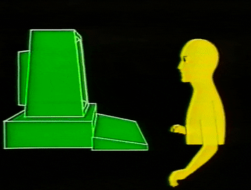{fig-align="center"}

::: {.callout-note appearance="simple"}
**A real-world example...** a physiotherapist might use a **one-way
ANOVA** to compare pain scores in patients randomised to manual therapy,
dry needling or exercise prescription, a **repeated measures ANOVA** to
compare the same participants' blood glucose after three different
breakfast types, and a **two-way ANOVA** to ask whether three stretching
protocols improve flexibility differently in runners versus swimmers. A
family of tests for three different types research designs, and (you
guessed it) exactly what's in this workshop, **minus the two-way**,
which you will **only need to understand conceptually.**
:::

## Why ANOVA, and not three *t*-tests?

ANOVA compares **means**, just like a *t*-test, but for **three or
more** groups at once. It belongs on the same branch of the decision
tree from the lecture, a *numeric outcome* with a *categorical
predictor*, this time with more than two groups/levels.

| Question                                                                  | Test                             | What it compares                                                                |
|---------------------------------------------------------------------------|----------------------------------|---------------------------------------------------------------------------------|
| *Do three or more separate groups differ?*                                | **One-way ANOVA**                | The means of *k* independent groups (between-subjects)                          |
| *Do the **same people** differ across three or more conditions or times?* | **Repeated measures (RM) ANOVA** | The means of *k* conditions measured in the same participants (within-subjects) |
| *Do two factors, and their combination, affect the outcome?*              | **Two-way ANOVA**                | Two main effects and their interaction (concept only in this course)            |

So why not just run a *t*-test on every pair? Because every test you run
is a fresh 5% gamble on a false positive (a Type I error). This will be
covered in detail in this weeks lecture. With three groups there are
three pairs, so three *t*-tests give roughly a **14%** chance that at
least one of them is "significant" by luck alone; with four groups (six
pairs) it is about **26%**. ANOVA asks one question first, *do the means
differ at all?*, at a single α = 0.05, and only then looks at the pairs,
using a **post-hoc test** that adjusts to keep the overall error rate at
5%. The tool below visualises the issue with multiple **unadjusted**
*t*-tests.

```{=html}
<div class="tt-fwer"></div>
```
::: {.callout-important appearance="simple"}
**The F-test asks one question.** A significant ANOVA tells you *at
least one* group mean differs from another. It does **not** tell you
which, and it does **not** mean every group differs from every other.
That's what the **post-hoc test** is for, and you only get to that step
and run it when the first overall tests' (aka the omnibus test) F is
significant.
:::

------------------------------------------------------------------------

## The ANOVA essentials {.unnumbered}

Work through these tabs before the tasks. They condense Lecture 14 (and
the multiple-comparisons and effect-size ideas coming in Lecture 16)
into what you need now and likely will help in the exam.

::: panel-tabset
### Which test?

Same two questions as last week, with one more level:

1.  **How many groups/conditions?** Two → a *t*-test (independent or
    paired). Three or more → an ANOVA.
2.  **Are the scores from the *same* people?** Yes → *repeated measures
    ANOVA*. No → *one-way ANOVA*.
3.  **Is there a second factor** (e.g. training method *and* sex)? →
    *two-way ANOVA*. Again, we only need to know the concept, not the
    Jamovi/interpretation steps for this one.

| Design cue in the scenario                                                           | Test                                                                 |
|--------------------------------------------------------------------------------------|----------------------------------------------------------------------|
| "three groups", "randomised to one of four diets", "athletes, students and controls" | One-way ANOVA                                                        |
| "each participant tried all three", "cross-over", "baseline, 4 weeks and 8 weeks"    | Repeated measures ANOVA                                              |
| "does the effect of A depend on B", two categorical predictors                       | Two-way ANOVA (interaction)                                          |
| only two groups/conditions                                                           | *t*-test (an ANOVA on two groups gives the identical answer: F = t²) |

Quick-fire practice (no data needed):

```{=html}
<div class="ws-quiz" data-answer="oneway" data-okmsg="Four separate groups of people, one outcome, one factor with four levels.">
  <p class="ws-qtext">Adults with high cholesterol are randomised to one of four diets (Mediterranean, low-fat, low-carb, usual diet) and LDL is measured after 12 weeks. Which test?</p>
  <label class="ws-opt"><input type="radio" name="wt1" value="indep">Independent samples t-test</label>
  <label class="ws-opt"><input type="radio" name="wt1" value="oneway">One-way ANOVA</label>
  <label class="ws-opt"><input type="radio" name="wt1" value="rm">Repeated measures ANOVA</label>
  <label class="ws-opt"><input type="radio" name="wt1" value="twoway">Two-way ANOVA</label>
  <button class="ws-check" type="button">✓ Check</button>
  <span class="ws-fb"></span>
  <div class="ws-hint"><strong>Hint:</strong> how many groups? Is anyone measured more than once? Is there more than one categorical predictor?</div>
</div>
<div class="ws-quiz" data-answer="rm" data-okmsg="Same 20 patients, three conditions each, within-particpant design.">
  <p class="ws-qtext">Twenty asthma patients each use three different inhaler devices on separate days (order randomised) and peak expiratory flow is recorded after each. Which test?</p>
  <label class="ws-opt"><input type="radio" name="wt2" value="paired">Paired samples t-test</label>
  <label class="ws-opt"><input type="radio" name="wt2" value="oneway">One-way ANOVA</label>
  <label class="ws-opt"><input type="radio" name="wt2" value="rm">Repeated measures ANOVA</label>
  <label class="ws-opt"><input type="radio" name="wt2" value="twoway">Two-way ANOVA</label>
  <button class="ws-check" type="button">✓ Check</button>
  <span class="ws-fb"></span>
  <div class="ws-hint"><strong>Hint:</strong> "each ... three ... on separate days" is the cross-over cue from last week, but now with three conditions instead of two.</div>
</div>
<div class="ws-quiz" data-answer="twoway" data-okmsg="Two categorical predictors (method and sex), and the question is about their combination, an interaction effect.">
  <p class="ws-qtext">A strength coach wants to know whether three training methods work equally well for male and female athletes, or whether the best method depends on sex. Which test?</p>
  <label class="ws-opt"><input type="radio" name="wt3" value="indep">Independent samples t-test</label>
  <label class="ws-opt"><input type="radio" name="wt3" value="oneway">One-way ANOVA</label>
  <label class="ws-opt"><input type="radio" name="wt3" value="rm">Repeated measures ANOVA</label>
  <label class="ws-opt"><input type="radio" name="wt3" value="twoway">Two-way ANOVA</label>
  <button class="ws-check" type="button">✓ Check</button>
  <span class="ws-fb"></span>
  <div class="ws-hint"><strong>Hint:</strong> "depends on" is the interaction cue from the lecture's song-duration example (the lines on the plot weren't parallel).</div>
</div>
<div class="ws-quiz" data-answer="indep" data-okmsg="Only two groups, so a t-test.">
  <p class="ws-qtext">Reaction time is compared between 30 regular gamers and 30 non-gamers. Which test?</p>
  <label class="ws-opt"><input type="radio" name="wt4" value="indep">Independent samples t-test</label>
  <label class="ws-opt"><input type="radio" name="wt4" value="oneway">One-way ANOVA</label>
  <label class="ws-opt"><input type="radio" name="wt4" value="rm">Repeated measures ANOVA</label>
  <button class="ws-check" type="button">✓ Check</button>
  <span class="ws-fb"></span>
  <div class="ws-hint"><strong>Hint:</strong> count the groups. ANOVA is for three or more; with two, last week's test is the natural choice.</div>
</div>
```
### The five steps

With the F-statistic in step 3 and a sixth "which groups?" step tacked
on the end. Jamovi does steps 3 and 4 (and the post-hoc arithmetic);
steps 1, 2 and 5 are **yours**.

+----------------------+----------------------+----------------------+
| Step                 | What you do          | Where it happens     |
|                      |                      | today                |
+======================+======================+======================+
| 1\. **Assumptions**  | Continuous outcome,  | Exploration ▸        |
|                      | independent people,  | Descriptives and the |
|                      | approximately normal | ANOVA dialog's       |
|                      | in each group,       | *Assumption Checks*  |
|                      | similar spread in    |                      |
|                      | each group (RM: plus |                      |
|                      | sphericity)          |                      |
+----------------------+----------------------+----------------------+
| 2\. **Hypotheses**   | H₀: μ₁ = μ₂ = μ₃     | Written *before* you |
|                      | (all group means     | analyse              |
|                      | equal).              |                      |
|                      |                      |                      |
|                      | Hₐ: at least one     |                      |
|                      | mean differs         |                      |
+----------------------+----------------------+----------------------+
| 3\. **Test           | F = MS~between~ ÷    | Jamovi ANOVA table,  |
| statistic**          | MS~within~, i.e. how | `F`                  |
|                      | far apart the group  |                      |
|                      | means are, relative  |                      |
|                      | to how scattered     |                      |
|                      | people are within    |                      |
|                      | groups               |                      |
+----------------------+----------------------+----------------------+
| 4a. **p-value**      | Probability of an F  | Jamovi ANOVA table,  |
|                      | at least this large  | `p`                  |
|                      | *if H₀ were true*,   |                      |
|                      | from the             |                      |
|                      | F-distribution with  |                      |
|                      | df₁ and df₂          |                      |
+----------------------+----------------------+----------------------+
| 4b. **Post-hoc** (if | *Only if p \< 0.05*: | Jamovi *Post Hoc     |
| significant)         | which pairs differ?  | Tests* table         |
|                      | Mean difference, CI, |                      |
|                      | Cohen's d, MCID for  |                      |
|                      | each pair            |                      |
+----------------------+----------------------+----------------------+
| 5\. **Conclusion**   | Reject / fail to     | Your write-up        |
|                      | reject H₀, then      |                      |
|                      | interpret with η²    |                      |
|                      | and context          |                      |
+----------------------+----------------------+----------------------+

::: {.callout-tip appearance="simple"}
**Degrees of freedom.** F has two: **df₁ = k − 1** (the number of groups
minus one) and **df₂ = N − k** (the total number of people minus the
number of groups) for a one-way ANOVA. For a repeated measures ANOVA the
second one becomes **df₂ = (n − 1)(k − 1)** because the same n people
are measured k times. Jamovi prints both in the ANOVA table and you
report them as F(df₁, df₂).
:::

::: {.callout-tip appearance="simple"}
**One tail, always.** F is a ratio of two variances and variances can't
be negative, so the whole of α = 0.05 sits in the right-hand tail. There
is no one- vs two-tailed choice to make. Under H₀, F is usually around
1; a large F means the means are further apart than the within-group
scatter can explain.
:::

### Assumptions

ANOVA is **parametric**, like the *t*-test, with one extra check for
independent groups and another for repeated measures:

+----------------------+----------------------+----------------------+
| Check                | What to look for     | Jamovi               |
+======================+======================+======================+
| -   \*               | Shapiro--Wilk p \>   | Descriptives with    |
|                      | 0.05, bell-shaped    | *Split by*, or ANOVA |
| Normality\*\* (each  | histogram, Q-Q dots  | ▸ Assumption Checks  |
| group /              | on the diagonal      | ▸ Normality test +   |
|                      |                      | Q-Q (one test on the |
| condition)           |                      | *residuals* from all |
|                      |                      | groups)              |
+----------------------+----------------------+----------------------+
| -   \*Homogeneity of | Levene's p \> 0.05.  | ANOVA ▸ Assumption   |
|                      | If violated, tick    | Checks ▸ Homogeneity |
|     variance\*\*     | *Don't assume equal  | test                 |
|     (one-way)        | (Welch's)*           |                      |
|                      | correction and       |                      |
|                      | report that row      |                      |
+----------------------+----------------------+----------------------+
| -   \*               | Mauchly's p \> 0.05. | RM ANOVA ▸           |
|     Sphericity\*\*   | If violated, tick    | Assumption Checks ▸  |
|     (RM only)        | the G r              | Sphericity tests     |
|                      | eenhouse--Geisser    |                      |
|                      | correction and       |                      |
|                      | report that row      |                      |
+----------------------+----------------------+----------------------+

Plus the two you check from the **design** that the outcome is
**continuous**, and observations are **independent** (one row = one
person for a one-way ANOVA; for an RM ANOVA the three scores *within* a
person are meant to be related, but each person must be independent of
every other person i.e., no double ups).

**What is sphericity?** In a paired *t*-test we analysed one column of
*difference scores*. With three conditions there are three sets of
differences (A − B, A − C, B − C). Sphericity means those three sets of
differences have roughly **equal variances**. If they don't, the F-test
is too liberal (more Type I errors), and the Greenhouse--Geisser
correction fixes that by shrinking the degrees of freedom. We check it
with Mauchly's test. This explaination is for those wanting to know what
is going on with these corrections and we won't go into the correction's
maths in this course.

::: {.callout-warning appearance="simple"}
**Three traps when checking assumptions.** **(1)** Shapiro--Wilk in the
ANOVA dialog is one test on the *residuals* (every score minus its own
group mean), so a single p-value covers all groups; so we still look at
the per-group plots from Descriptives. **(2)** Levene's is "the
assumption is fine" when p is *large*; a significant Levene's is bad
news, not good. ANOVA copes well with mildly unequal SDs when group
sizes are equal (as they are today). **(3)** Outliers in a boxplot are
not a reason to delete data. Remove a point only if you can justify it
(a known measurement or entry error) and report that you did.
:::

You'll also see *Kruskal--Wallis* (under One-Way ANOVA ▸ Non-Parametric)
and *Friedman* options in Jamovi. These are the **non-parametric**
versions for when normality clearly fails; they're not covered in this
course, so leave them alone.

### Reading the output

Jamovi's ANOVA table has the pieces of the F-ratio laid out, one row for
the factor and one for the error ("Residuals"):

| Column                  | Plain-English meaning                                                                                                                                                   |
|-------------------------|-------------------------------------------------------------------------------------------------------------------------------------------------------------------------|
| **Sum of Squares (SS)** | The raw variability. Factor row = how far the group means sit from the grand mean (between). Residuals row = how far individuals sit from their own group mean (within) |
| **df**                  | k − 1 for the factor; N − k for the residuals (RM: (n − 1)(k − 1))                                                                                                      |
| **Mean Square (MS)**    | SS ÷ df, i.e. the variability *per degree of freedom*. This is what gets compared                                                                                       |
| **F**                   | MS~between~ ÷ MS~within~. Bigger the value = stronger evidence against H₀                                                                                               |
| **p**                   | Right-tail probability of an F this large if H₀ were true. Below 0.05 then it is *statistically significant*                                                            |
| **η²**                  | SS~between~ ÷ SS~total~: the proportion of all the variability in scores that is explained by which group you are in (an effect size; tick it under *Effect Size*)      |

The **Post Hoc Comparisons** table then has one row per pair, with
columns you already know from the *t*-test: **Mean Difference**, **SE**,
**df**, **t**, and **p~tukey~** (a p-value already corrected for the
number of comparisons, so judge it against 0.05 as usual). For a one-way
ANOVA you can also tick **Cohen's d** for each pair. What Jamovi does
*not* print is a 95% CI for each mean difference, so today we calculate
it by hand, once, from mean difference (MD) and standard error (SE)
(next tab).

::: {.callout-warning appearance="simple"}
**Two easy-to-confuse tables.** The *Descriptives* table (and the
Estimated Marginal Means plot) shows each **group's mean with its own
95% CI**. The *Post Hoc* table shows the **difference between two
groups**. Only the second answers "do these two groups differ?", and as
you saw last week, two group CIs can overlap while the difference is
still significant.
:::

### Post-hoc & CIs

**Why a post-hoc test and not three t-tests?** A significant F says at
least one mean differs. To find out *which*, Jamovi runs a *t*-test on
every pair, but with a correction that keeps the family-wise error rate
at 5%. We use **Tukey's HSD** (honestly significant difference), the
standard choice when you want every pair compared. Bonferroni is the
other common one; it just divides α by the number of tests. Both are
already built into the p~tukey~ / p~bonferroni~ column, so never correct
them again yourself.

**The 95% CI for a pairwise difference.** Same recipe as Week 5:

$$\text{95\% CI} = \text{Mean Difference} \pm (\text{critical value} \times SE)$$

The one wrinkle, because Tukey has made the test stricter, the matching
interval uses a slightly bigger multiplier than the ordinary t-table
value, so that the CI and p~tukey~ always agree (i.e., CI excludes 0
then p~tukey~ \< 0.05). We give you the multiplier; you don't need to
look it up:

| Design today                   | df  | t-table value | Tukey adjusted t-value |
|--------------------------------|-----|---------------|------------------------|
| Task 1: one-way, N = 45, k = 3 | 42  | 2.02          | **2.43**               |
| Task 2: RM, n = 25, k = 3      | 24  | 2.06          | **2.50**               |

If you used the t-table value you would get a slightly narrower
"unadjusted" interval, correct for a single planned comparison but not
for three at once.

::: {.callout-tip appearance="simple"}
**Read the interval twice.** Once against **0** (is the difference
statistically real?) and once against the **MCID** (is the whole
interval, part of it, or none of it beyond the smallest difference that
matters?). Lecture 16 will go deeper on this; today try and do it for
every pair.
:::

{width="100%" fig-align="center"}

### Effect size

Two effect sizes today, one you (should) know and one that's new:

**Cohen's *d* for each pair** (one-way ANOVA post-hoc). Exactly last
week's *d*: the mean difference in standard-deviation units (Jamovi uses
the pooled within-group SD, √MS~within~). 0.2 small, 0.5 medium, 0.8
large. Jamovi doesn't print *d* for repeated measures post-hoc pairs, so
there we judge size from the mean difference against the scale and the
MCID.

**η² ("eta squared") for the whole ANOVA.** A *proportion* of how much
of the total variability in the scores is explained by which group
people are in.

$$\eta^2 = \frac{SS_{between}}{SS_{total}} = \frac{SS_{between}}{SS_{between} + SS_{within}}$$

They are **not** read the same way, so keep the two side by side:

|                            | Cohen's *d*                               | η²                                                           |
|----------------------------|-------------------------------------------|--------------------------------------------------------------|
| **What it is**             | A *distance*, how far apart two means are | A *proportion*, how much of the variance the factor explains |
| **Units**                  | Standard deviations                       | A fraction of 1 (read it as a %)                             |
| **Applies to**             | One pair of groups                        | The whole ANOVA (all groups at once)                         |
| **Small / medium / large** | 0.2 / 0.5 / 0.8                           | 0.01 / 0.06 / 0.14                                           |
| **Say it as**              | "the means are 0.89 SD apart"             | "recovery method explains 69% of the variability"            |
| **Never say**              | "explains 89% of the variance"            | "the groups are 0.69 SD apart" or "69% chance they differ"   |

You don't need the η² benchmarks by heart, but you should be able to
*read* η² = 0.30 as "30% of the variation in the outcome is down to the
factor". Like *d*, η² is standardised, so it lets you compare an ANOVA
on Task 1 heart RMSSD with Task 2 symptom scores. If it helps, η² is the
same idea as *r*² from the correlation weeks i.e., it's the proportion
of variance explained, just with a categorical predictor.

Two effect size rules, unchanged from last week. **1)** If the overall p
\> 0.05, don't interpret η² or run post-hoc tests, there is no
difference to describe the size of. **2)** Effect size ≠ clinical
meaningfulness. A "large" *d* between two recovery methods can still be
a difference too small for an athlete to notice; the MCID decides that,
not *d*.
:::

------------------------------------------------------------------------

## Get the Jamovi data files

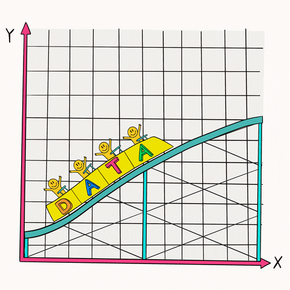{fig-align="center" width="410"}

Two datasets, one for each type of ANOVA. Save them somewhere easy to
find, then open each in Jamovi when its task comes up.

-   Task 1:
    [**Recovery_HRV.csv**](https://lms.griffith.edu.au/courses/32192/files?search_term=hrv&preview=9304106)
    --- 45 athletes, `Recovery Method` (Ice Bath / Compression / Active
    Recovery) and `RMSSD (ms)`
-   Task 2:
    [**Antihistamine_Delivery.csv**](https://lms.griffith.edu.au/courses/32192/files?search_term=antih&preview=9304108)
    --- 25 patients, `Oral`, `Nasal` and `Eye` symptom-relief scores
    (0--100)

::: {.callout-important appearance="simple"}
In each file, check the Variables tab first. The outcomes should be
*Continuous*, `Recovery Method` should be *Nominal*, and `ID` should be
*ID*. Jamovi guesses, and it often guesses wrong. Notice the two files
are shaped differently: Task 1 is **long** (one row per athlete, a group
column), Task 2 is **wide** (one row per patient, one column per
condition).
:::

## Research questions

> 1.  Which recovery method leads to the best next-day **heart rate
>     variability** (RMSSD) in athletes... ice bath, compression, or
>     active recovery?
> 2.  Which antihistamine delivery method (oral tablet, nasal spray or
>     eye drops) gives hay fever patients the best **symptom relief**?

------------------------------------------------------------------------

## Tasks for you to do

Work through these in Jamovi in order and **check your answers as you
go**. Each task has small answer boxes, type (or select) what you found
and press **✓ Check**. As usual, you get instant feedback, and a hint
appears if you're stuck after a couple of tries. The full **worked
answer** for each task stays locked until you answer correctly (a
*reveal* option appears after three attempts, so have a genuine go
first).

```{=html}
<script>
/* Lightweight formative answer-checking (no data leaves the page).
   Numeric inputs: data-answer + optional data-tol (tolerance) + optional
   data-abs="1" (accept either sign, for differences whose sign depends on
   the order the student entered the variables).
   Interpretation (cloze) questions: inline <select data-answer="..."> elements
   inside a .ws-cloze paragraph; every select must match to pass.
   Radio questions: put data-answer on the .ws-quiz container.
   data-unlock: id of the worked-answer block to unlock on success
   (or via the reveal button after 3 attempts). */
function wsUnlock(id){
  if(typeof wsRevealPredictions === 'function'){ wsRevealPredictions(id); }
  var el = document.getElementById(id);
  if(el){ el.classList.remove('ws-locked'); }
  var note = document.querySelector('.ws-lockednote[data-for="' + id + '"]');
  if(note){ note.remove(); }
}
/* Vary the order of dropdown options in interpretation questions so the
   correct choice is not always in the same position. */
document.addEventListener('DOMContentLoaded', function(){
  document.querySelectorAll('.ws-cloze').forEach(function(par){
    par.querySelectorAll('select').forEach(function(sel, i){
      var opts = Array.prototype.slice.call(sel.options, 1);
      if(opts.length < 2) return;
      var k = i % opts.length;
      var rotated = opts.slice(k).concat(opts.slice(0, k));
      rotated.forEach(function(o){ sel.appendChild(o); });
      sel.selectedIndex = 0;
    });
  });
});
document.addEventListener('click', function(e){
  var btn = e.target.closest('.ws-check');
  if(!btn) return;
  var q  = btn.closest('.ws-quiz');
  var fb = q.querySelector('.ws-fb');
  var hint = q.querySelector('.ws-hint');
  var nums = q.querySelectorAll('input[data-answer], select[data-answer]');
  var allOk = true, anyBlank = false;

  if(nums.length){
    nums.forEach(function(inp){
      if(inp.value.trim() === ''){ anyBlank = true; }
      if(inp.tagName === 'SELECT'){
        var okS = (inp.value === inp.dataset.answer);
        inp.style.borderColor = okS ? '#2e7d32' : '#c0152f';
        inp.style.background  = okS ? '#eef7ee' : '#fdf0f2';
        if(!okS) allOk = false;
        return;
      }
      var exp = parseFloat(inp.dataset.answer);
      var tol = parseFloat(inp.dataset.tol || 0);
      var val = parseFloat(inp.value);
      if(inp.dataset.abs){ exp = Math.abs(exp); val = Math.abs(val); }
      var ok  = !isNaN(val) && Math.abs(val - exp) <= tol;
      inp.style.borderColor = ok ? '#2e7d32' : '#c0152f';
      inp.style.background  = ok ? '#eef7ee' : '#fdf0f2';
      if(!ok) allOk = false;
    });
  } else if(q.dataset.answer !== undefined){
    var sel = q.querySelector('input[type=radio]:checked') ||
              q.querySelector('select');
    if(sel && sel.tagName === 'SELECT'){
      if(sel.value === ''){ anyBlank = true; allOk = false; }
      else allOk = (sel.value === q.dataset.answer);
    } else if(sel){
      allOk = (sel.value === q.dataset.answer);
    } else {
      anyBlank = true; allOk = false;
    }
  }

  if(anyBlank && !allOk){
    fb.className = 'ws-fb no';
    fb.textContent = 'Fill in an answer first, then press Check.';
    return;
  }

  q.dataset.tries = (parseInt(q.dataset.tries || '0', 10) + 1);

  if(allOk){
    fb.className = 'ws-fb ok';
    fb.textContent = '✓ Correct! ' + (q.dataset.okmsg || '');
    if(hint) hint.style.display = 'none';
    if(q.dataset.unlock){
      wsUnlock(q.dataset.unlock);
      fb.textContent += ' ' + (q.dataset.unlockmsg || 'The worked answer is now unlocked below.');
      var rv = q.querySelector('.ws-reveal');
      if(rv) rv.remove();
    }
  } else {
    fb.className = 'ws-fb no';
    fb.textContent = '✗ Not quite. Go back to your Jamovi output and try again.';
    if(hint && q.dataset.tries >= 2){ hint.style.display = 'block'; }
    if(q.dataset.unlock && q.dataset.tries >= 3 && !q.querySelector('.ws-reveal')){
      var btn2 = document.createElement('button');
      btn2.type = 'button';
      btn2.className = 'ws-reveal';
      btn2.textContent = 'Stuck? Reveal the worked answer';
      btn2.addEventListener('click', function(){
        wsUnlock(q.dataset.unlock);
        btn2.remove();
        fb.className = 'ws-fb';
        fb.textContent = 'Worked answer unlocked below. Read it closely, then reproduce the output in Jamovi yourself.';
      });
      q.appendChild(btn2);
    }
  }
});
</script>
```
```{=html}
<style>
/* ---------- predict-before-you-run ---------- */
.ws-predict{border:1px solid #d9d9d9;border-left:4px solid #C77D0A;border-radius:8px;
  padding:16px 18px;margin:14px 0 20px 0;background:#fffaf2;}
.ws-predict p.ws-qtext{font-weight:600;margin:0 0 10px 0;}
.ws-predict .ws-pq{margin:10px 0 12px;padding:8px 10px;border-radius:8px;background:#fff;border:1px solid #eee;}
.ws-predict .ws-pq p{margin:0 0 4px;font-weight:600;font-size:15px;}
.ws-predict .ws-pq.right{border-color:#2e7d32;background:#eef7ee;}
.ws-predict .ws-pq.wrong{border-color:#c0152f;background:#fdf0f2;}
.ws-predict .ws-pq.nolock{border-color:#C77D0A;}
.ws-predict .ws-why{margin-top:6px;font-size:14px;color:#333;border-top:1px dashed #ccc;padding-top:6px;}
.ws-predict button.ws-lock{margin-top:6px;padding:7px 16px;border:1px solid #C77D0A;
  border-radius:6px;background:#C77D0A;color:#fff;font-size:15px;cursor:pointer;}
.ws-predict button.ws-lock:disabled{background:#8A5A08;border-color:#8A5A08;cursor:default;}
.ws-predict.locked input[type=radio]{pointer-events:none;}
.ws-predict .ws-fb{display:block;margin-top:10px;font-size:15px;min-height:1.3em;}
.ws-predict .ws-fb.ok{color:#8A5A08;font-weight:600;}
.ws-predict .ws-fb.no{color:#c0152f;font-weight:600;}
.ws-predict .ws-score{margin-top:10px;font-weight:700;color:#16232E;}

/* ---------- sort-the-pairs ---------- */
.ws-sort .ws-cards{display:flex;flex-wrap:wrap;gap:10px;min-height:52px;padding:10px;margin:8px 0 12px;
  border:1px dashed #bbb;border-radius:8px;background:#fff;}
.ws-sort .ws-cards:empty::before{content:"All cards placed. Press Check.";color:#999;font-size:14px;}
.ws-sort .ws-card{cursor:grab;user-select:none;padding:8px 12px;border:1px solid #0E7C7B;border-radius:8px;
  background:#E9F5F4;font-size:14px;line-height:1.35;max-width:260px;}
.ws-sort .ws-card small{display:block;color:#5C6B76;font-size:12.5px;}
.ws-sort .ws-card.sel{outline:3px solid #C77D0A;outline-offset:1px;}
.ws-sort .ws-card.ok{border-color:#2e7d32;background:#eef7ee;}
.ws-sort .ws-card.bad{border-color:#c0152f;background:#fdf0f2;}
.ws-sort .ws-cols{display:grid;grid-template-columns:repeat(4,1fr);gap:10px;}
@media (max-width:700px){.ws-sort .ws-cols{grid-template-columns:1fr 1fr;}}
@media (max-width:480px){.ws-sort .ws-cols{grid-template-columns:1fr;}}
.ws-sort .ws-col{min-height:120px;border:2px dashed #DFE6E9;border-radius:10px;padding:8px;background:#FBFDFD;
  display:flex;flex-direction:column;gap:8px;}
.ws-sort .ws-col.over{border-color:#0E7C7B;background:#F1F8F8;}
.ws-sort .ws-col b{font-size:13px;color:#0A5F5E;}
.ws-sort .ws-col span.ws-coldesc{font-size:12px;color:#5C6B76;margin-top:-4px;}
.ws-sort .ws-col .ws-card{max-width:none;}
.ws-sort button.ws-sortcheck{margin-top:10px;padding:7px 16px;border:1px solid #0E7C7B;
  border-radius:6px;background:#0E7C7B;color:#fff;font-size:15px;cursor:pointer;}
.ws-sort button.ws-sortcheck:hover{background:#0A5F5E;}
.ws-sort .ws-sortnote{font-size:13px;color:#777;margin:0 0 6px;}

/* ---------- spot-the-error ---------- */
.ws-spot .ws-passage{font-size:15.5px;line-height:1.9;background:#fff;border:1px solid #eee;border-radius:8px;padding:12px 14px;margin:8px 0 10px;}
.ws-spot .ws-sent{cursor:pointer;padding:2px 3px;border-radius:4px;border-bottom:2px dotted #bbb;}
.ws-spot .ws-sent:hover{background:#fff6e5;}
.ws-spot .ws-sent.sel{background:#fde8c8;border-bottom:2px solid #C77D0A;}
.ws-spot .ws-sent.hit{background:#fdf0f2;border-bottom:2px solid #c0152f;}
.ws-spot .ws-sent.miss{background:#fff;border-bottom:2px solid #c0152f;box-shadow:inset 0 -3px 0 #c0152f;}
.ws-spot .ws-sent.falsealarm{background:#eef7ee;border-bottom:2px solid #2e7d32;}
.ws-spot .ws-why{display:none;font-size:14px;color:#333;margin:6px 0 10px;padding:8px 10px;border-left:3px solid #c0152f;background:#fdf6f7;}
.ws-spot.revealed .ws-why{display:block;}
.ws-spot button.ws-spotcheck{margin-top:6px;padding:7px 16px;border:1px solid #0E7C7B;
  border-radius:6px;background:#0E7C7B;color:#fff;font-size:15px;cursor:pointer;}
.ws-spot .ws-count{font-size:13px;color:#777;margin:0 0 6px;}
</style>
<script>
/* Extensions to the formative-check engine: predictions, sort-the-pairs, spot-the-error. */
(function(){
  "use strict";

  /* ---------- predictions ---------- */
  function revealPredict(block){
    if(block.dataset.revealed) return;
    block.dataset.revealed = "1";
    var locked = block.classList.contains('locked'), right = 0, n = 0;
    block.querySelectorAll('.ws-pq').forEach(function(pq){
      n++;
      var chosen = pq.querySelector('input[type=radio]:checked');
      var ok = locked && chosen && chosen.value === pq.dataset.answer;
      if(ok) right++;
      pq.classList.add(locked ? (ok ? 'right' : 'wrong') : 'nolock');
      var why = document.createElement('div');
      why.className = 'ws-why';
      why.innerHTML = (locked ? (ok ? '✓ You called it. ' : '✗ Not this time. ') : '(No prediction locked.) ') + pq.dataset.why;
      pq.appendChild(why);
    });
    var sc = document.createElement('div');
    sc.className = 'ws-score';
    sc.textContent = locked ? ('Predictions: ' + right + ' of ' + n + ' correct. Being wrong here is useful; it tells you which intuition to update.')
                            : 'You unlocked the answer without locking a prediction. Next task, commit first: it is the prediction that does the teaching.';
    block.appendChild(sc);
    var btn = block.querySelector('.ws-lock'); if(btn) btn.disabled = true;
    block.querySelectorAll('input[type=radio]').forEach(function(r){ r.disabled = true; });
  }
  window.wsRevealPredictions = function(id){
    document.querySelectorAll('.ws-predict[data-reveal-on="' + id + '"]').forEach(revealPredict);
  };
  document.addEventListener('click', function(e){
    var btn = e.target.closest('.ws-lock'); if(!btn) return;
    var block = btn.closest('.ws-predict'), fb = block.querySelector('.ws-fb');
    var missing = 0;
    block.querySelectorAll('.ws-pq').forEach(function(pq){ if(!pq.querySelector('input[type=radio]:checked')) missing++; });
    if(missing){ fb.className = 'ws-fb no'; fb.textContent = 'Answer every prediction before locking in.'; return; }
    block.classList.add('locked'); btn.disabled = true; btn.textContent = '🔒 Locked';
    block.querySelectorAll('input[type=radio]').forEach(function(r){ r.disabled = true; });
    fb.className = 'ws-fb ok';
    fb.textContent = 'Locked. Now run the analysis. Your predictions are scored automatically when the post-hoc worked answer unlocks.';
  });

  /* ---------- sort the pairs ---------- */
  var dragCard = null, selCard = null;
  function placeCard(card, target){
    target.appendChild(card); card.classList.remove('sel','ok','bad'); selCard = null;
  }
  document.addEventListener('dragstart', function(e){
    var c = e.target.closest && e.target.closest('.ws-sort .ws-card'); if(!c) return;
    dragCard = c; e.dataTransfer.effectAllowed = 'move'; try{ e.dataTransfer.setData('text/plain','card'); }catch(err){}
  });
  document.addEventListener('dragover', function(e){
    var t = e.target.closest && e.target.closest('.ws-sort .ws-col, .ws-sort .ws-cards'); if(!t || !dragCard) return;
    e.preventDefault(); t.classList.add('over');
  });
  document.addEventListener('dragleave', function(e){
    var t = e.target.closest && e.target.closest('.ws-sort .ws-col, .ws-sort .ws-cards'); if(t) t.classList.remove('over');
  });
  document.addEventListener('drop', function(e){
    var t = e.target.closest && e.target.closest('.ws-sort .ws-col, .ws-sort .ws-cards'); if(!t || !dragCard) return;
    e.preventDefault(); t.classList.remove('over'); placeCard(dragCard, t); dragCard = null;
  });
  document.addEventListener('dragend', function(){ document.querySelectorAll('.ws-sort .over').forEach(function(x){ x.classList.remove('over'); }); dragCard = null; });
  /* click-to-move fallback (touch / keyboard): tap a card, then tap a column */
  document.addEventListener('click', function(e){
    var card = e.target.closest && e.target.closest('.ws-sort .ws-card');
    if(card){
      if(selCard === card){ card.classList.remove('sel'); selCard = null; return; }
      if(selCard) selCard.classList.remove('sel');
      selCard = card; card.classList.add('sel'); return;
    }
    var col = e.target.closest && e.target.closest('.ws-sort .ws-col, .ws-sort .ws-cards');
    if(col && selCard && col.closest('.ws-sort') === selCard.closest('.ws-sort')){ placeCard(selCard, col); }
  });
  document.addEventListener('keydown', function(e){
    if(e.key !== 'Enter' && e.key !== ' ') return;
    var el = document.activeElement; if(!el) return;
    if(el.classList.contains('ws-card') || el.classList.contains('ws-col')){ e.preventDefault(); el.click(); }
  });
  document.addEventListener('click', function(e){
    var btn = e.target.closest('.ws-sortcheck'); if(!btn) return;
    var q = btn.closest('.ws-sort'), fb = q.querySelector('.ws-fb'), hint = q.querySelector('.ws-hint');
    var cards = q.querySelectorAll('.ws-card'), unplaced = 0, wrong = 0;
    cards.forEach(function(c){
      var col = c.closest('.ws-col');
      if(!col){ unplaced++; c.classList.remove('ok','bad'); return; }
      var ok = col.dataset.col === c.dataset.col;
      c.classList.toggle('ok', ok); c.classList.toggle('bad', !ok); if(!ok) wrong++;
    });
    if(unplaced){ fb.className = 'ws-fb no'; fb.textContent = 'Place every card in a column first (' + unplaced + ' still in the tray).'; return; }
    q.dataset.tries = (parseInt(q.dataset.tries || '0', 10) + 1);
    if(!wrong){
      fb.className = 'ws-fb ok'; fb.textContent = '✓ Correct! ' + (q.dataset.okmsg || '');
      if(hint) hint.style.display = 'none';
      if(q.dataset.unlock && typeof wsUnlock === 'function'){ wsUnlock(q.dataset.unlock); fb.textContent += ' The worked answer is now unlocked below.'; }
    } else {
      fb.className = 'ws-fb no';
      fb.textContent = '✗ ' + wrong + ' card' + (wrong > 1 ? 's are' : ' is') + ' in the wrong column (marked red). Re-read the CI on each card against 0 and against the MCID.';
      if(hint && q.dataset.tries >= 2) hint.style.display = 'block';
    }
  });

  /* ---------- spot the error ---------- */
  document.addEventListener('click', function(e){
    var s = e.target.closest && e.target.closest('.ws-spot .ws-sent');
    if(s && !s.closest('.ws-spot').classList.contains('revealed')){ s.classList.toggle('sel'); return; }
    var btn = e.target.closest('.ws-spotcheck'); if(!btn) return;
    var q = btn.closest('.ws-spot'), fb = q.querySelector('.ws-fb'), hint = q.querySelector('.ws-hint');
    var sents = q.querySelectorAll('.ws-sent'), hits = 0, misses = 0, false_ = 0, total = 0;
    sents.forEach(function(x){
      var isErr = x.dataset.err === '1', sel = x.classList.contains('sel');
      if(isErr) total++;
      if(isErr && sel) hits++; else if(isErr && !sel) misses++; else if(!isErr && sel) false_++;
    });
    if(!hits && !false_){ fb.className = 'ws-fb no'; fb.textContent = 'Click the sentences you think are wrong first, then press Check.'; return; }
    q.dataset.tries = (parseInt(q.dataset.tries || '0', 10) + 1);
    function reveal(){
      q.classList.add('revealed');
      sents.forEach(function(x){
        var isErr = x.dataset.err === '1', sel = x.classList.contains('sel');
        x.classList.remove('sel');
        if(isErr){ x.classList.add(sel ? 'hit' : 'miss'); var w = document.createElement('div'); w.className = 'ws-why'; w.innerHTML = '<strong>' + (sel ? 'Found: ' : 'Missed: ') + '</strong>' + x.dataset.why; x.insertAdjacentElement('afterend', w); }
        else if(sel){ x.classList.add('falsealarm'); }
      });
      var rv = q.querySelector('.ws-reveal'); if(rv) rv.remove();
    }
    if(!misses && !false_){
      fb.className = 'ws-fb ok'; fb.textContent = '✓ All ' + total + ' errors found, and nothing flagged that was fine. Explanations shown below each one.';
      if(hint) hint.style.display = 'none'; reveal();
    } else {
      fb.className = 'ws-fb no';
      fb.textContent = '✗ You found ' + hits + ' of ' + total + ' errors' + (false_ ? ' and flagged ' + false_ + ' sentence' + (false_ > 1 ? 's' : '') + ' that ' + (false_ > 1 ? 'are' : 'is') + ' actually fine' : '') + '. Adjust your selection and check again.';
      if(hint && q.dataset.tries >= 2) hint.style.display = 'block';
      if(q.dataset.tries >= 3 && !q.querySelector('.ws-reveal')){
        var b2 = document.createElement('button'); b2.type = 'button'; b2.className = 'ws-reveal'; b2.textContent = 'Stuck? Reveal the errors';
        b2.addEventListener('click', function(){ fb.className = 'ws-fb'; fb.textContent = 'Errors revealed. Read each explanation, then find the matching trap in the list above.'; reveal(); });
        q.appendChild(b2);
      }
    }
  });
})();
</script>
```
### Task 1 --- One-way ANOVA: which recovery method?

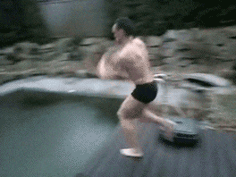{fig-align="center" width="310"}

**Scenario.** You're the team's sports scientist, and the head coach
comes to you after a tough training camp: "We've been using ice baths,
compression sleeves and light spin sessions for recovery, but which one
actually helps the players' bodies bounce back faster?"

You run a study with 45 athletes. After a hard session each athlete is
randomised to one of three recovery methods: an **ice bath** (10 °C
immersion), **compression garments**, or **active recovery** (30 min
easy cycling at 30% VO₂max). The next morning you measure resting heart
rate variability as RMSSD.

**What is RMSSD?** Your heart doesn't beat like a metronome, the gap
between beats varies slightly from one to the next. RMSSD (the root mean
square of successive R--R interval differences, in milliseconds)
captures how much that gap fluctuates. A well-recovered athlete shows
***more*** beat-to-beat variation, because the parasympathetic "rest and
digest" system is back in charge. A fatigued or stressed athlete shows
***less***. Typical resting values in trained athletes run from roughly
40 to 100 ms, and each person's normal differs, so it's the change that
matters more than the raw number.

**Reading the results.** Higher RMSSD means better recovery, so
whichever method produces the highest group mean is the winner. But a
difference only matters practically if it's big enough. Sports science
research treats a gap of about 8 ms *between* recovery methods as the
smallest difference that meaningfully affects next-day readiness. A 2 ms
advantage might be statistically significant in a large sample and still
be of no use to the coach.

-   **H₀:** μ~Ice~ = μ~Compression~ = μ~Active~ (all three recovery
    methods give the same mean RMSSD)
-   **Hₐ:** at least one recovery method differs

**a) Explore and check assumptions, per group.** Open `Recovery_HRV.csv`
in Jamovi. **Exploration ▸ Descriptives**: put `RMSSD (ms)` in
*Variables* and `Recovery Method` in **Split by**. Tick
**Shapiro--Wilk** and **Confidence interval** (for the mean), and under
*Plots* the **Density** (under Histogram), **Box plot** and **Q-Q**.
Look at the three SDs, is the largest less than twice the smallest?
That's a rule of thumb to suggest if variance is about equal or not.

```{=html}
<div class="ws-quiz" data-unlock="t1-desc" data-okmsg="Active recovery highest, ice bath lowest, and all three groups look normal with similar spread.">
  <p class="ws-qtext">From your split Descriptives (two decimal places):</p>
  <div class="ws-row"><label class="ws-inlab" for="t1-ma">Mean RMSSD, Active Recovery:</label>
    <input type="number" id="t1-ma" step="0.01" data-answer="44.73" data-tol="0.02"></div>
  <div class="ws-row"><label class="ws-inlab" for="t1-sa">SD, Active Recovery:</label>
    <input type="number" id="t1-sa" step="0.01" data-answer="2.66" data-tol="0.02"></div>
  <div class="ws-row"><label class="ws-inlab" for="t1-mc">Mean RMSSD, Compression:</label>
    <input type="number" id="t1-mc" step="0.01" data-answer="41.67" data-tol="0.02"></div>
  <div class="ws-row"><label class="ws-inlab" for="t1-sc">SD, Compression:</label>
    <input type="number" id="t1-sc" step="0.01" data-answer="4.19" data-tol="0.02"></div>
  <div class="ws-row"><label class="ws-inlab" for="t1-mi">Mean RMSSD, Ice Bath:</label>
    <input type="number" id="t1-mi" step="0.01" data-answer="33.13" data-tol="0.02"></div>
  <div class="ws-row"><label class="ws-inlab" for="t1-si">SD, Ice Bath:</label>
    <input type="number" id="t1-si" step="0.01" data-answer="3.29" data-tol="0.02"></div>
  <button class="ws-check" type="button">✓ Check</button>
  <span class="ws-fb"></span>
  <div class="ws-hint"><strong>Hint:</strong> with <code>Recovery Method</code> in <em>Split by</em>, the
    Descriptives table has one row per group. Two decimal places is plenty. Largest SD (4.19) ÷ smallest (2.66) = 1.6, under the "twice" rule of thumb.</div>
</div>
```
```{=html}
<p class="ws-lockednote" data-for="t1-desc">Assumption check locked. Answer correctly above to unlock it.</p>
```
::: {#t1-desc .callout-note .ws-locked collapse="true"}
## Worked answer --- descriptives & assumptions

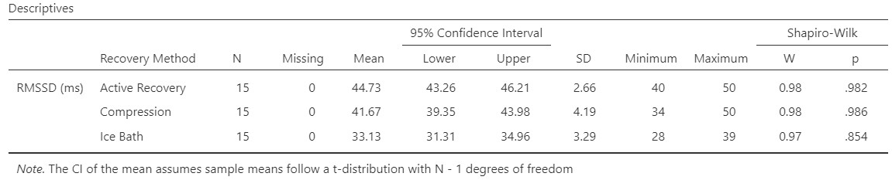

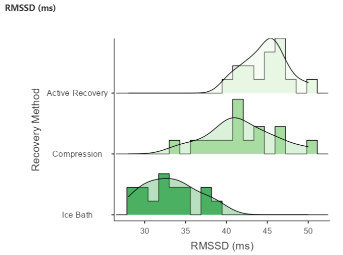{fig-align="center"}

Three roughly bell-shaped groups, there were no boxplot outliers, all
three Shapiro--Wilk tests non-significant (p = 0.98, 0.99 and 0.85)
therefore **Normality ✓** in each group. SDs 2.66, 4.19 and 3.29, the
largest is 1.6 × the smallest, comfortably under the "less than twice"
rule of thumb, so we expect Levene's to pass (we'll check it in the
ANOVA dialog). Three separate groups of 15 athletes, each randomised to
one method, so **independence ✓**.

Also notice the **95% CIs of the means**. Active Recovery \[43.26,
46.21\] and Compression \[39.35, 43.98\] **overlap**, while Ice Bath
\[31.31, 34.96\] sits well below both. That should give us a clue for a
significant difference, thought the overlapping group CIs do *not*
settle whether Active and Compression differ.
:::

```{=html}
<div class="ws-predict" data-reveal-on="t1-post">
  <p class="ws-qtext">Before you run the ANOVA, commit to three predictions from the descriptives alone (means 44.7 / 41.7 / 33.1 ms, SDs about 3 ms, n = 15 each). They are scored when you unlock the post-hoc worked answer.</p>
  <div class="ws-pq" data-answer="yes" data-why="F(2, 42) = 45.89, p &lt; 0.001. Three means spread over 11 ms with SDs of only 3 ms was always going to be significant: big gaps between, little scatter within.Remember this test only needs one comparison to be significant and ice bath and active recovery are pretty far apart with no 95% CI overlap of the means">
    <p>1. Will the overall F-test be significant?</p>
    <label class="ws-opt"><input type="radio" name="p1a" value="yes">Yes</label>
    <label class="ws-opt"><input type="radio" name="p1a" value="no">No</label>
  </div>
  <div class="ws-pq" data-answer="ac" data-why="Was always an educated guess, but Active vs Compression, p = 0.048, is a whisker under 0.05. The two closest means (3 ms apart) and give the weakest evidence; the ice-bath comparisons (8.5 and 11.6 ms) are both p &lt; 0.001.">
    <p>2. Which pair will come closest to <em>not</em> being significant?</p>
    <label class="ws-opt"><input type="radio" name="p1b" value="ac">Active vs Compression</label>
    <label class="ws-opt"><input type="radio" name="p1b" value="ai">Active vs Ice Bath</label>
    <label class="ws-opt"><input type="radio" name="p1b" value="ci">Compression vs Ice Bath</label>
  </div>
  <div class="ws-pq" data-answer="no" data-why="The mean difference is 3.07 ms and even the top of its CI (6.11) is under our MCID of 8 ms. Significant but not meaningful, the two won't always agree.">
    <p>3. Will the Active vs Compression difference beat the 8 ms threshold that matters?</p>
    <label class="ws-opt"><input type="radio" name="p1c" value="yes">Yes</label>
    <label class="ws-opt"><input type="radio" name="p1c" value="no">No</label>
  </div>
  <button class="ws-lock" type="button">🔒 Lock in my predictions</button>
  <span class="ws-fb"></span>
</div>
```
**b) Run the ANOVA.** **Analyses ▸ ANOVA ▸ ANOVA** (the general one,
*not* "One-Way ANOVA", which is missing the effect size and the plots we
want):

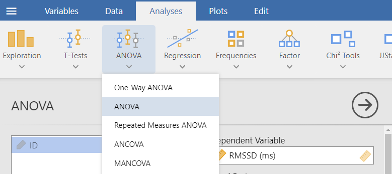{fig-align="center"}

1.  Move `RMSSD (ms)` into **Dependent Variable** and `Recovery Method`
    into **Fixed Factors**
2.  Under *Effect Size* tick **η²**
3.  Under *Assumption Checks* tick **Homogeneity test**, **Normality
    test** and **Q-Q plot**
4.  Under *Post Hoc Tests* move `Recovery Method` to the right-hand box;
    under *Correction* keep **Tukey** (untick "No correction"); under
    *Effect Size* tick **Cohen's d**
5.  Under *Estimated Marginal Means* move `Recovery Method` into **Term
    1**, and tick **Marginal means plots** and **Marginal means tables**

```{=html}
<div class="ws-quiz" data-unlock="t1-anova" data-okmsg="Assumptions fine, and a very large F. Now for what it means.">
  <p class="ws-qtext">From the ANOVA output:</p>
  <div class="ws-row"><label class="ws-inlab" for="t1-lev">Levene's test p:</label>
    <input type="number" id="t1-lev" step="0.001" data-answer="0.309" data-tol="0.01"></div>
  <div class="ws-row"><label class="ws-inlab" for="t1-sw">Shapiro–Wilk test p:</label>
    <input type="number" id="t1-sw" step="0.001" data-answer="0.996" data-tol="0.01"></div>
  <div class="ws-row"><label class="ws-inlab" for="t1-msb">Mean Square, Recovery Method:</label>
    <input type="number" id="t1-msb" step="0.01" data-answer="541.96" data-tol="0.1"></div>
  <div class="ws-row"><label class="ws-inlab" for="t1-msw">Mean Square, Residuals:</label>
    <input type="number" id="t1-msw" step="0.01" data-answer="11.81" data-tol="0.05"></div>
  <div class="ws-row"><label class="ws-inlab" for="t1-f">F:</label>
    <input type="number" id="t1-f" step="0.01" data-answer="45.89" data-tol="0.05"></div>
  <div class="ws-row"><label class="ws-inlab" for="t1-df2">df for Residuals (df₂):</label>
    <input type="number" id="t1-df2" step="1" data-answer="42"></div>
  <div class="ws-row"><label class="ws-inlab" for="t1-eta">η²:</label>
    <input type="number" id="t1-eta" step="0.001" data-answer="0.686" data-tol="0.006"></div>
  <button class="ws-check" type="button">✓ Check</button>
  <span class="ws-fb"></span>
  <div class="ws-hint"><strong>Hint:</strong> Levene's is in the <em>Homogeneity of Variances Test</em> table and Shapiro–Wilk in the <em>Normality Test</em> table, both under Assumption Checks. In the ANOVA table, F = 541.96 ÷ 11.81; check it on a calculator. df₂ = N − k = 45 − 3.</div>
</div>
```
```{=html}
<p class="ws-lockednote" data-for="t1-anova">Worked answer locked. Enter the ANOVA output correctly to unlock it.</p>
```
::: {#t1-anova .callout-note .ws-locked collapse="true"}
## Worked answer --- assumptions & the F-test

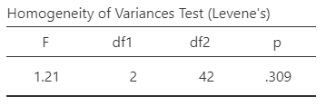{fig-align="left" width="307"}

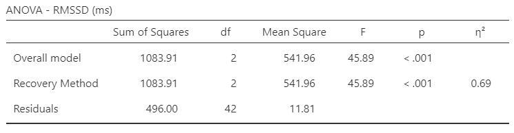

::: {layout-ncol="2"}
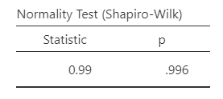

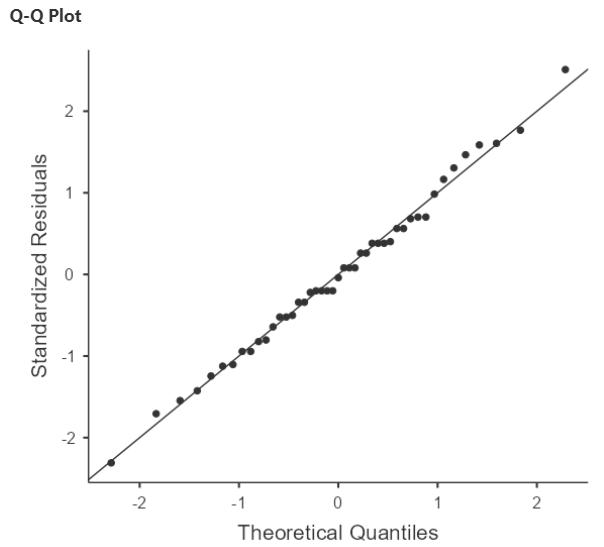
:::

```{=html}
<div class="ws-quiz" data-unlock="t1-anova2" data-okmsg="That is a complete write-up of the overall F-test.">
  <p class="ws-qtext">Build the interpretation of the overall test:</p>
  <p class="ws-cloze">A one-way ANOVA compared next-day RMSSD across three recovery methods (n = 15 per group). Levene’s test was <select data-answer="ns" aria-label="levene"><option value="">choose…</option><option value="ns">not significant (p = 0.309), so equal variances can be assumed</option><option value="sig">significant (p = 0.309), so the assumption is violated</option></select>. There was a <select data-answer="sig" aria-label="significance"><option value="">choose…</option><option value="sig">statistically significant</option><option value="ns">non-significant</option></select> effect of recovery method, F(2, 42) = 45.89, p &lt; 0.001, so we <select data-answer="reject" aria-label="decision"><option value="">choose…</option><option value="reject">reject H₀</option><option value="fail">fail to reject H₀</option><option value="accept">accept H₀</option></select>. η² = 0.69 means that <select data-answer="pct" aria-label="eta"><option value="">choose…</option><option value="pct">about 69% of the variability in RMSSD is explained by recovery method</option><option value="prob">there is a 69% probability that the methods differ</option><option value="ms">the methods differ by 0.69 ms on average</option></select>, a <select data-answer="large" aria-label="etasize"><option value="">choose…</option><option value="large">large</option><option value="medium">medium</option><option value="small">small</option></select> effect. This result tells us that <select data-answer="atleast" aria-label="meaning"><option value="">choose…</option><option value="atleast">at least one method differs from another</option><option value="all">every method differs from every other method</option><option value="best">active recovery is the best method</option></select>, so the next step is <select data-answer="posthoc" aria-label="next"><option value="">choose…</option><option value="posthoc">a Tukey post-hoc test to see which pairs differ</option><option value="ttests">three separate independent t-tests</option><option value="stop">nothing, the analysis is complete</option></select>.</p>
  <button class="ws-check" type="button">✓ Check</button>
  <span class="ws-fb"></span>
  <div class="ws-hint"><strong>Hint:</strong> for Levene's, a large p is good news. η² is a proportion of variance, not a probability and not in ms. Re-read the callout under the multiple-comparisons tool about what a significant F does and doesn't say.</div>
</div>
```
**Assumptions.** Levene's F(2, 42) = 1.21, p = 0.309: no evidence the
spreads differ, **homogeneity ✓**.

Shapiro--Wilk is non-signficant (p = 0.996) and the Q-Q dots hug the
line, **normality ✓**.

**The F-ratio, by hand from the table.**

Between: SS = 1083.91 on df₁ = k − 1 = 2, so MS~between~ = 541.96.

Within: SS = 496.00 on df₂ = N − k = 42, so MS~within~ = 11.81.

F = 541.96 ÷ 11.81 = **45.89**.

rom an F-table the critical value at α = 0.05 is about 3.22 (the table's
nearest row, df₂ = 40, gives 3.23), so 45.89 is enormous by comparison,
and Jamovi confirms with a p \< 0.001.

The between-group variability is about 46 times the within-group
variability (per degree of freedom); chance alone gives an F near 1.

**Effect size.** η² = 1083.91 ÷ (1083.91 + 496.00) = **0.686**. Recovery
method accounts for roughly 69% of the variation in next-day RMSSD, a
very large effect (≥ 0.14 is "large").

**So far,** we can reject H₀ and say *at least one* method differs. We
can't yet say which, or by how much. Post-hoc test is next.
:::

```{=html}
<p class="ws-lockednote" data-for="t1-anova2">Model sentence locked. Complete the interpretation correctly to unlock it.</p>
```
::: {#t1-anova2 .callout-note .ws-locked collapse="true"}
## Model sentence so far --- the overall F-test

> A one-way ANOVA showed a significant effect of recovery method on
> next-day RMSSD, F(2, 42) = 45.89, p \< 0.001, η² = 0.69 (recovery
> method explained about 69% of the variance). Tukey post-hoc
> comparisons were used to identify which methods differed.
:::

**c) Which methods differ? The post-hoc test.** Scroll to the *Post Hoc
Comparisons* table and the *Estimated Marginal Means* plot. Each row is
one pair. Jamovi gives you the mean difference, its SE, t, the
Tukey-corrected p and Cohen's d, but not a CI, so you'll calculate one.

```{=html}
<div class="ws-quiz" data-unlock="t1-post" data-okmsg="Three pairs, three different stories. Now the CI and the interpretation.">
  <p class="ws-qtext">From the Post Hoc Comparisons table (Tukey). Enter mean differences as positive numbers:</p>
  <div class="ws-row"><label class="ws-inlab" for="t1-d1">Active − Compression, mean difference:</label>
    <input type="number" id="t1-d1" step="0.01" data-answer="3.07" data-tol="0.02" data-abs="1"></div>
  <div class="ws-row"><label class="ws-inlab" for="t1-p1">Active − Compression, p<sub>tukey</sub>:</label>
    <input type="number" id="t1-p1" step="0.001" data-answer="0.048" data-tol="0.002"></div>
  <div class="ws-row"><label class="ws-inlab" for="t1-e1">Active − Compression, Cohen's d:</label>
    <input type="number" id="t1-e1" step="0.01" data-answer="0.89" data-tol="0.02" data-abs="1"></div>
  <div class="ws-row"><label class="ws-inlab" for="t1-d2">Active − Ice Bath, mean difference:</label>
    <input type="number" id="t1-d2" step="0.01" data-answer="11.60" data-tol="0.02" data-abs="1"></div>
  <div class="ws-row"><label class="ws-inlab" for="t1-d3">Compression − Ice Bath, mean difference:</label>
    <input type="number" id="t1-d3" step="0.01" data-answer="8.53" data-tol="0.02" data-abs="1"></div>
  <button class="ws-check" type="button">✓ Check</button>
  <span class="ws-fb"></span>
  <div class="ws-hint"><strong>Hint:</strong> the sign of a difference just depends on which group Jamovi lists first. All three SEs are the same (1.25) because a one-way ANOVA uses the pooled within-group variance (MS<sub>within</sub>) for every pair and the groups are the same size.</div>
</div>
```
```{=html}
<p class="ws-lockednote" data-for="t1-post">Worked answer locked. Enter the post-hoc output correctly to unlock it.</p>
```
::: {#t1-post .callout-note .ws-locked collapse="true"}
## Worked answer --- post-hoc comparisons

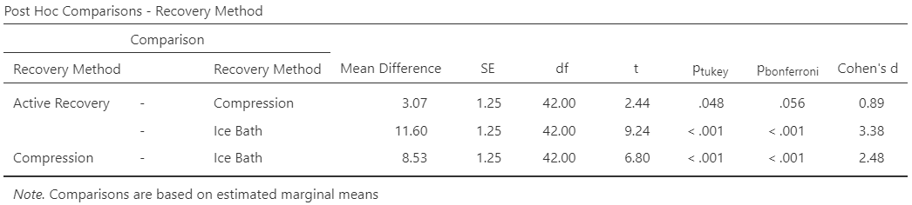{width="100%"}

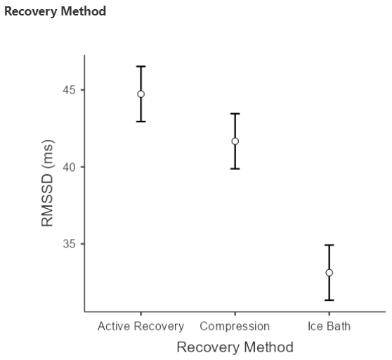{fig-align="center" width="55%"}

Now the four interpretation questions.

**Significance.** All three Tukey comparisons are significant.

Active vs Compression p = 0.048 (a whisker under 0.05).

Active vs Ice Bath and Compression vs Ice Bath both p \< 0.001. So
*every* method differs from every other, statistically.

**Confidence intervals** MD ± 2.43 × 1.25 = MD ± 3.04.

Active − Compression MD = 3.07 \[0.03, 6.11\]: just excludes 0, matching
p = 0.048, but the plausible difference runs from almost nothing up to 6
ms.

Active − Ice Bath MD = 11.60 \[8.56, 14.64\] and Compression − Ice Bath
MD = 8.53 \[5.49, 11.57\] are well clear of 0.

**Effect size.** d = 0.89, 3.38 and 2.48

All "large" by Cohen's benchmarks. That's what a very tight within-group
spread (SD ≈ 3.4 ms) does; even a 3 ms gap is nearly a whole SD.
Remember d is the gap between groups in SD units, not in ms.

**Clinical meaning.** Against the 8 ms threshold

Active vs Compression (3.07 ms; upper CI limit 6.11) is **not
meaningful**, statistically "large" or not.

Active vs Ice Bath (11.60 ms, CI 8.56 to 14.64) is **clearly
meaningful**, every plausible value is beyond the threshold.

Compression vs Ice Bath (8.53 ms) is beyond the threshold on average,
but its CI (5.49 to 11.57) straddles 8 ms, so call it **probably
meaningful**. A bigger study would be able pin it down. Either way the
ice bath left athletes **less recovered** the next morning.

The honest advice to the coach, active recovery or compression, take
your pick on cost and logistics, and rethink the ice baths for next-day
HRV.

**The overlapping-CI lesson, again.** In the marginal-means plot the
Active and Compression error bars overlap, yet their difference is
significant. Overlapping *group* CIs never rule out a significant
*difference*. Non-overlapping *group* CIs can predict a significant
*difference* though.
:::

**By hand, calculate the 95% CI** for the closest pair, Active Recovery
vs Compression:

95% CI = MD ± 2.43 × SE

The 2.43 is the Tukey multiplier for df = 42 described in the *Post-hoc
& CIs* tab at the start of this worksheet in The ANOVA essentials. It
has been adjusted to account for multiple comparisons in the ANOVA. SE =
SEM in the course I call it SE0 or SEp when talking about proportions,
or SEM when the standard error of a mean. Jamovi just calls it SE.

```{=html}
<div class="ws-quiz" data-okmsg="Only just clear of 0, which is exactly what p = 0.048 is telling you. The CI and the p-value agree.">
  <p class="ws-qtext">95% CI for the Active − Compression difference, to 2 decimal places:</p>
  <div class="ws-row"><label class="ws-inlab" for="t1-lo">Lower limit:</label>
    <input type="number" id="t1-lo" step="0.01" data-answer="0.03" data-tol="0.04"></div>
  <div class="ws-row"><label class="ws-inlab" for="t1-hi">Upper limit:</label>
    <input type="number" id="t1-hi" step="0.01" data-answer="6.11" data-tol="0.04"></div>
  <button class="ws-check" type="button">✓ Check</button>
  <span class="ws-fb"></span>
  <div class="ws-hint"><strong>Hint:</strong> margin = 2.43 × 1.25 = 3.04. Subtract it from and add it to 3.07.</div>
</div>
```
```{=html}
<div class="ws-quiz" data-unlock="t1-post2" data-okmsg="Significant, large by Cohen’s benchmarks, and still too small to matter. All four questions, in order.">
  <p class="ws-qtext">Build the interpretation for the Active Recovery vs Compression pair:</p>
  <p class="ws-cloze">Active recovery produced higher RMSSD than compression by 3.07 ms, a difference that was <select data-answer="sig" aria-label="significance"><option value="">choose…</option><option value="sig">statistically significant, but only just</option><option value="ns">not statistically significant</option><option value="highly">highly significant</option></select> (p<sub>tukey</sub> = 0.048). The 95% CI [0.03, 6.11] <select data-answer="excl" aria-label="ci"><option value="">choose…</option><option value="excl">only just excludes 0</option><option value="incl">includes 0</option><option value="far">is well clear of 0</option></select>, which <select data-answer="agrees" aria-label="agree"><option value="">choose…</option><option value="agrees">agrees with</option><option value="contradicts">contradicts</option></select> the p-value. Cohen’s d = 0.89 is a <select data-answer="large" aria-label="effect"><option value="">choose…</option><option value="large">large</option><option value="medium">medium</option><option value="small">small</option></select> effect by Cohen’s benchmarks. However, the mean difference, and even the upper limit of its CI, is <select data-answer="below" aria-label="mcid"><option value="">choose…</option><option value="below">below</option><option value="above">above</option></select> the 8 ms threshold that matters for athletes, so the difference is <select data-answer="notmeaningful" aria-label="meaning"><option value="">choose…</option><option value="notmeaningful">not clinically meaningful</option><option value="meaningful">clinically meaningful</option></select>. The two group CIs in the marginal-means plot overlap, which <select data-answer="fine" aria-label="overlap"><option value="">choose…</option><option value="fine">does not contradict the significant post-hoc result</option><option value="contra">proves the post-hoc result is wrong</option></select>.</p>
  <button class="ws-check" type="button">✓ Check</button>
  <span class="ws-fb"></span>
  <div class="ws-hint"><strong>Hint:</strong> p = 0.048 is under 0.05 by a whisker and the CI’s lower limit of 0.03 says the same thing. Compare 6.11 (the most optimistic end of the CI) with 8 ms. And re-read the overlapping-CI warning in the essentials.</div>
</div>
```
```{=html}
<p class="ws-lockednote" data-for="t1-post2">Model write-up locked. Complete the interpretation correctly to unlock it.</p>
```
::: {#t1-post2 .callout-note .ws-locked collapse="true"}
## Model write-up --- Task 1

> A one-way ANOVA showed a significant effect of recovery method on
> next-day RMSSD, F(2, 42) = 45.89, p \< 0.001, η² = 0.69. Tukey
> post-hoc comparisons showed that RMSSD was higher after active
> recovery (x = 44.7, SD = 2.7 ms) than after compression (x = 41.7, SD
> = 4.2; MD = 3.07 ms, 95% CI \[0.03, 6.11\], p = 0.048, d = 0.89), and
> both were higher than after an ice bath (x = 33.1, SD = 3.3; MD =
> 11.60 and 8.53 ms respectively, both p \< 0.001, d = 3.38 and 2.48).
> Only the ice-bath comparisons reached the 8 ms threshold considered
> meaningful for recovery (clearly for active recovery vs ice bath, 95%
> CI \[8.56, 14.64\]; on average for compression vs ice bath, 95% CI
> \[5.49, 11.57\]); the 3 ms advantage of active recovery over
> compression, although statistically significant, is unlikely to matter
> in practice.
:::

**Sort the pairs.** Read each card's CI. Once against 0 and once against
the 8 ms threshold, and drag it into the column that fits (or tap a
card, then tap a column). One column will stay empty today.

```{=html}
<div class="ws-quiz ws-sort" data-okmsg="Only one of the three is clearly meaningful; one is real but trivial; one is real and probably matters but the CI can't rule out a sub-threshold difference.">
  <p class="ws-qtext">Sort the three Tukey comparisons (MCID = 8 ms):</p>
  <p class="ws-sortnote">CIs use mean difference (MD) ± 2.43 × 1.25.</p>
  <div class="ws-cards">
    <div class="ws-card" draggable="true" tabindex="0" data-col="small">Active − Compression<small>MD 3.07 ms · 95% CI [0.03, 6.11] · p = 0.048</small></div>
    <div class="ws-card" draggable="true" tabindex="0" data-col="clear">Active − Ice Bath<small>MD 11.60 ms · 95% CI [8.56, 14.64] · p &lt; 0.001</small></div>
    <div class="ws-card" draggable="true" tabindex="0" data-col="maybe">Compression − Ice Bath<small>MD 8.53 ms · 95% CI [5.49, 11.57] · p &lt; 0.001</small></div>
  </div>
  <div class="ws-cols">
    <div class="ws-col" tabindex="0" data-col="none"><b>No evidence of a difference yet</b><span class="ws-coldesc">CI includes 0 (p ≥ 0.05)</span></div>
    <div class="ws-col" tabindex="0" data-col="small"><b>Real, but too small to matter</b><span class="ws-coldesc">CI excludes 0 but sits entirely below the MCID</span></div>
    <div class="ws-col" tabindex="0" data-col="maybe"><b>Real, might matter</b><span class="ws-coldesc">CI excludes 0 and straddles the MCID; more data would settle it</span></div>
    <div class="ws-col" tabindex="0" data-col="clear"><b>Clearly meaningful</b><span class="ws-coldesc">whole CI beyond the MCID</span></div>
  </div>
  <button class="ws-sortcheck" type="button">✓ Check</button>
  <span class="ws-fb"></span>
  <div class="ws-hint"><strong>Hint:</strong> a CI of [5.49, 11.57] contains 8, so a true difference just under 8 ms is still plausible; [8.56, 14.64] does not, so every plausible value is beyond the threshold; [0.03, 6.11] never reaches 8 at all.</div>
</div>
```
```{=html}
<div class="ws-quiz" data-answer="either" data-okmsg="Exactly. Two of the three are interchangeable in practice, and the ice bath is clearly worse.">
  <p class="ws-qtext"><strong>Clinical meaning.</strong> The other two differences are Active − Ice Bath = 11.60 ms and Compression − Ice Bath = 8.53 ms, both p<sub>tukey</sub> &lt; 0.001 with d = 3.38 and 2.48. Given the 8 ms threshold, what do you tell the coach?</p>
  <label class="ws-opt"><input type="radio" name="t1clin" value="active">Use active recovery only: it beat both other methods significantly, so it is the clear winner</label>
  <label class="ws-opt"><input type="radio" name="t1clin" value="either">Use active recovery or compression, either is fine; drop the ice baths, which left RMSSD 8–12 ms lower</label>
  <label class="ws-opt"><input type="radio" name="t1clin" value="none">The differences are all statistically significant, so all three methods are meaningfully different from each other</label>
  <button class="ws-check" type="button">✓ Check</button>
  <span class="ws-fb"></span>
  <div class="ws-hint"><strong>Hint:</strong> compare each mean difference with 8 ms. Active vs compression is 3.07 ms (below); both comparisons with ice bath are above. Significance says "real", the threshold says "matters".</div>
</div>
```
::: {.callout-important appearance="simple"}
**Design check before Task 2.** Athletes were *randomised* to a recovery
method, so this design can support a causal claim (the method caused the
difference), unlike last week's coffee study where students chose their
own group. Task 2 goes one step further: the same patients try every
treatment, which removes person-to-person differences from the
comparison altogether. Watch what that does to the error term.
:::

------------------------------------------------------------------------

### Task 2 --- Repeated measures ANOVA: antihistamine delivery

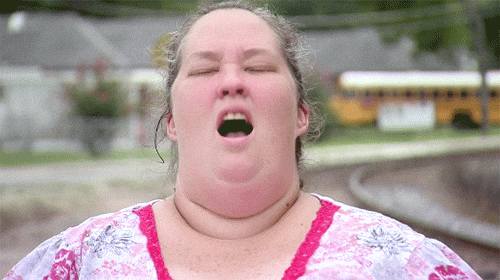{fig-align="center" width="446"}

**Scenario.** You're a clinical researcher at an allergy clinic, and the
lead physician has a practical question *"We stock three antihistamine
formulations, tablets, nasal sprays and eye drops. Patients always ask
which works best for their hay fever, and honestly I don't have solid
data. Can we please find out?"* You run a **cross-over** study with 25
patients with moderate-to-severe allergic rhinitis. Each patient tries
all three during separate pollen weeks, in randomised order with a
washout in between. You use an **oral tablet** (cetirizine 10 mg), a
**nasal spray** (azelastine 0.1%) and **eye drops** (olopatadine 0.2%).
Two hours after each dose you score total symptom relief on a validated
0--100 scale (nasal congestion, sneezing, itchy eyes, runny nose
combined; **higher = better**). From the allergy literature: a score of
**≥ 70** means effective relief (normal daily activities), 50--69
partial relief, \< 50 ineffective; and a difference of **8 points**
between treatments is the smallest that patients can reliably notice.

-   **H₀:** μ~Oral~ = μ~Nasal~ = μ~Eye~ (all three deliveries give the
    same mean relief)
-   **Hₐ:** at least one delivery method differs

**a) Explore and check normality, per condition.** Open
`Antihistamine_Delivery.csv` in Jamovi. This file is **wide**: one row
per patient, three columns. **Exploration ▸ Descriptives**: put `Oral`,
`Nasal` and `Eye` all in *Variables* (nothing in Split by). Tick
**Shapiro--Wilk** and **Confidence interval**, and under *Plots* the
**Density**, **Box plot** and **Q-Q**. You'll see a few boxplot outliers
(one tablet score of 60, for instance); don't remove them, there's no
reason to think they're errors.

```{=html}
<div class="ws-quiz" data-unlock="t2-desc" data-okmsg="Nasal spray highest, eye drops clearly lowest, and eye drops sit below the 70-point ‘effective’ line.">
  <p class="ws-qtext">From your Descriptives:</p>
  <div class="ws-row"><label class="ws-inlab" for="t2-mo">Mean relief, Oral:</label>
    <input type="number" id="t2-mo" step="0.01" data-answer="70.72" data-tol="0.02"></div>
  <div class="ws-row"><label class="ws-inlab" for="t2-mn">Mean relief, Nasal:</label>
    <input type="number" id="t2-mn" step="0.01" data-answer="73.04" data-tol="0.02"></div>
  <div class="ws-row"><label class="ws-inlab" for="t2-me">Mean relief, Eye:</label>
    <input type="number" id="t2-me" step="0.01" data-answer="63.72" data-tol="0.02"></div>
  <div class="ws-row"><label class="ws-inlab" for="t2-so">SD, Oral:</label>
    <input type="number" id="t2-so" step="0.01" data-answer="3.78" data-tol="0.02"></div>
  <div class="ws-row"><label class="ws-inlab" for="t2-cat">Eye drops, relief category:</label>
    <select id="t2-cat" data-answer="partial"><option value="">choose…</option><option value="eff">Effective (≥ 70)</option><option value="partial">Partial relief (50–69)</option><option value="ineff">Ineffective (&lt; 50)</option></select></div>
  <button class="ws-check" type="button">✓ Check</button>
  <span class="ws-fb"></span>
  <div class="ws-hint"><strong>Hint:</strong> three rows in the Descriptives table, one per column. Compare each mean with the 70-point line in the scenario.</div>
</div>
```
```{=html}
<p class="ws-lockednote" data-for="t2-desc">Assumption check locked. Answer correctly above to unlock it.</p>
```
::: {#t2-desc .callout-note .ws-locked collapse="true"}
## Worked answer --- descriptives & normality

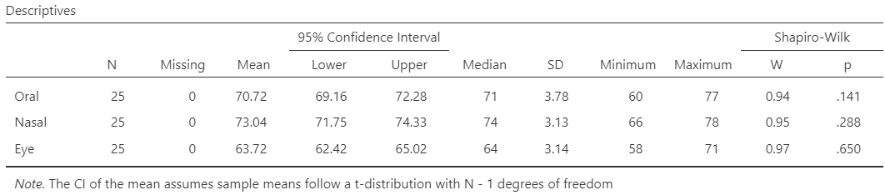{width="100%"}

::: {layout-ncol="3"}
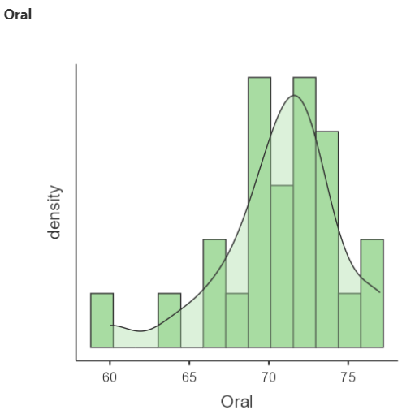

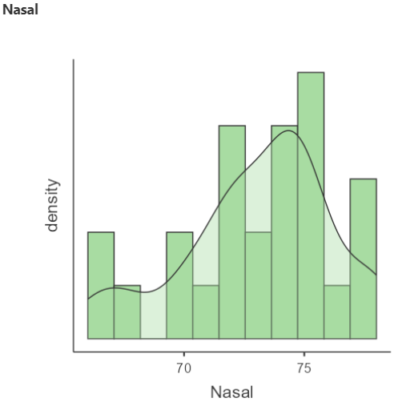

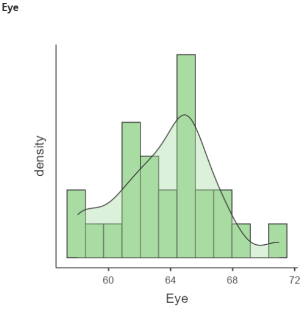
:::

Nasal spray scores highest (73.0), tablets a little lower (70.7) and eye
drops well below both (63.7), which already puts eye drops in the
"partial relief" band while the other two clear 70. All three conditions
are approximately normal (Shapiro--Wilk p = 0.14, 0.29 and 0.65;
slightly lumpy density plots with n = 25 are normal). A handful of
boxplot outliers (patient 4's tablet score of 60, patient 18's eye-drop
score of 71) are real scores, so they stay. Each patient is independent
of every other patient; the three scores *within* a patient are related
by design, which is exactly what the RM ANOVA is for.

The three group CIs, \[69.2, 72.3\], \[71.8, 74.3\] and \[62.4, 65.0\].
Oral and Nasal overlap while Eye is nowhere near either.
:::

```{=html}
<div class="ws-predict" data-reveal-on="t2-post">
  <p class="ws-qtext">Before you run the RM ANOVA, three predictions from the descriptives (means 70.7 / 73.0 / 63.7, SDs about 3.5, n = 25, each patient tried all three). Scored when you unlock the post-hoc worked answer.</p>
  <div class="ws-pq" data-answer="larger" data-why="F(2, 48) = 58.73, larger than Task 1's 45.89 with 20 fewer people. The design is why: each patient is their own control, so the between-patient variability (SS = 334) is removed from the error term instead of inflating it.">
    <p>1. Task 1 gave an large F = 45.89 with 45 athletes. So with only 25 patients here, would you expect F be larger or smaller?</p>
    <label class="ws-opt"><input type="radio" name="p2a" value="larger">Larger</label>
    <label class="ws-opt"><input type="radio" name="p2a" value="smaller">Smaller</label>
  </div>
  <div class="ws-pq" data-answer="yes" data-why="Yes: p = 0.019. A 2.3-point gap looks small next to SDs of 3–4, but the within-person differences are what get tested, and most patients scored a little higher on the spray. Same lesson as the music-and-focus paired test in Week 5.">
    <p>2. Oral tablet and nasal spray are only 2.3 points apart, less than one SD. Would we expect that pair to be significant?</p>
    <label class="ws-opt"><input type="radio" name="p2b" value="yes">Yes</label>
    <label class="ws-opt"><input type="radio" name="p2b" value="no">No</label>
  </div>
  <div class="ws-pq" data-answer="ne" data-why="Nasal − Eye = 9.32 (above 8 on average, CI 7.10 to 11.54); Oral − Eye = 7.00 (below 8 on average, CI 4.52 to 9.48); Oral − Nasal = 2.32 (nowhere near). Both eye-drop comparisons have CIs that straddle the threshold, which is the honest reading.">
    <p>3. Which pairs should have a mean difference above the 8-point threshold?</p>
    <label class="ws-opt"><input type="radio" name="p2c" value="none">None of them</label>
    <label class="ws-opt"><input type="radio" name="p2c" value="ne">Nasal vs Eye only</label>
    <label class="ws-opt"><input type="radio" name="p2c" value="both">Both comparisons with Eye drops</label>
    <label class="ws-opt"><input type="radio" name="p2c" value="all">All three</label>
  </div>
  <button class="ws-lock" type="button">🔒 Lock in my predictions</button>
  <span class="ws-fb"></span>
</div>
```
**b) Run the repeated measures ANOVA.** **Analyses ▸ ANOVA ▸ Repeated
Measures ANOVA**:

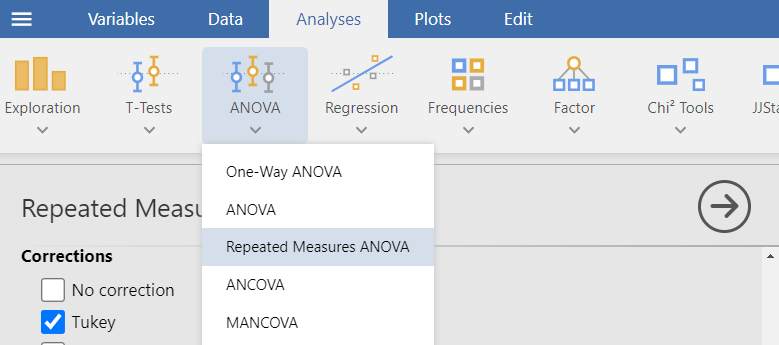{fig-align="center"}

1.  In *Repeated Measures Factors* (top right), click `RM Factor 1` and
    rename it **Delivery Method**; rename the three levels (`Level 1`,
    `Level 2`, `Level 3`) to **Oral tablet**, **Nasal spray**, **Eye
    drops**
2.  Under *Dependent Variable Label* (below the boxes), rename
    `Dependent` to **Symptom relief (0--100).** This labels the plot.
3.  Drag `Oral`, `Nasal` and `Eye` into the three **Repeated Measures
    Cells**, in that order
4.  Under *Effect Size* tick **η²**
5.  Under *Assumption Checks* tick **Sphericity tests**, and under
    *Sphericity corrections* tick **None** and **Greenhouse--Geisser**
    (so you can see both rows); tick **Q-Q plot**
6.  Under *Post Hoc Tests* move `Delivery Method` to the right; under
    *Correction* keep **Tukey**
7.  Under *Estimated Marginal Means* move `Delivery Method` into **Term
    1**, tick **Marginal means plots**, **Marginal means tables** and
    **Observed scores**

::: {.callout-note appearance="simple"}
**What you're checking with Mauchly's.** Sphericity says the three sets
of within-person differences (Oral − Nasal, Oral − Eye, Nasal − Eye)
have similar variances. Here their SDs are 3.96, 4.97 and 4.45, similar
enough. Mauchly's p \> 0.05 means "no evidence against sphericity", read
the **None** row of the ANOVA table. If Mauchly's p were \< 0.05 you'd
read the **Greenhouse--Geisser** row instead (same F, smaller df, larger
p).
:::

```{=html}
<div class="ws-quiz" data-unlock="t2-rm" data-okmsg="Sphericity fine, and an F even larger than Task 1’s despite fewer people. Now what it means.">
  <p class="ws-qtext">From the RM ANOVA output:</p>
  <div class="ws-row"><label class="ws-inlab" for="t2-w">Mauchly's W:</label>
    <input type="number" id="t2-w" step="0.01" data-answer="0.93" data-tol="0.01"></div>
  <div class="ws-row"><label class="ws-inlab" for="t2-wp">Mauchly's p:</label>
    <input type="number" id="t2-wp" step="0.001" data-answer="0.447" data-tol="0.01"></div>
  <div class="ws-row"><label class="ws-inlab" for="t2-df1">df, Delivery Method (df₁):</label>
    <input type="number" id="t2-df1" step="1" data-answer="2"></div>
  <div class="ws-row"><label class="ws-inlab" for="t2-df2">df, Residual (df₂):</label>
    <input type="number" id="t2-df2" step="1" data-answer="48"></div>
  <div class="ws-row"><label class="ws-inlab" for="t2-f">F (None / sphericity-assumed row):</label>
    <input type="number" id="t2-f" step="0.01" data-answer="58.73" data-tol="0.05"></div>
  <div class="ws-row"><label class="ws-inlab" for="t2-eta">η²:</label>
    <input type="number" id="t2-eta" step="0.001" data-answer="0.591" data-tol="0.006"></div>
  <button class="ws-check" type="button">✓ Check</button>
  <span class="ws-fb"></span>
  <div class="ws-hint"><strong>Hint:</strong> Mauchly's is in the <em>Tests of Sphericity</em> table. In the <em>Within Subjects Effects</em> table, df₂ = (n − 1)(k − 1) = 24 × 2. If you ticked Greenhouse–Geisser you'll see two rows; use the "None" row because sphericity was met.</div>
</div>
```
```{=html}
<p class="ws-lockednote" data-for="t2-rm">Worked answer locked. Enter the RM ANOVA output correctly to unlock it.</p>
```
::: {#t2-rm .callout-note .ws-locked collapse="true"}
## Worked answer --- sphericity & the F-test

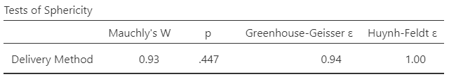{fig-align="center" width="80%"}

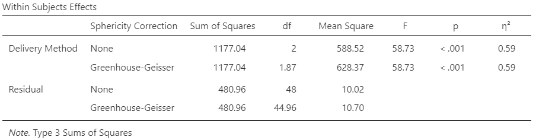{width="100%"}

::: {layout-ncol="2"}
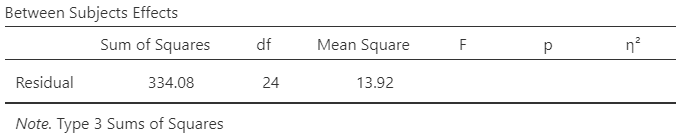

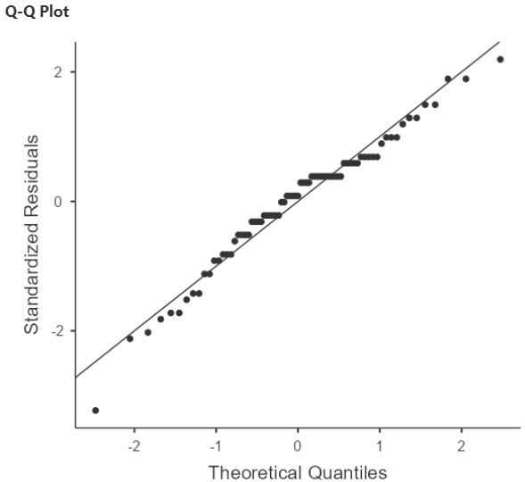
:::

```{=html}
<div class="ws-quiz" data-unlock="t2-rm2" data-okmsg="Complete write-up of the overall test, including the assumption.">
  <p class="ws-qtext">Build the interpretation of the overall test:</p>
  <p class="ws-cloze">A repeated measures ANOVA compared symptom relief across three delivery methods in the same 25 patients. Mauchly’s test was <select data-answer="ns" aria-label="mauchly"><option value="">choose…</option><option value="ns">not significant (p = 0.447), so sphericity can be assumed and no correction is needed</option><option value="sig">significant (p = 0.447), so the Greenhouse–Geisser row must be reported</option></select>. There was a <select data-answer="sig" aria-label="significance"><option value="">choose…</option><option value="sig">statistically significant</option><option value="ns">non-significant</option></select> effect of delivery method, F(2, 48) = 58.73, p &lt; 0.001, so we <select data-answer="reject" aria-label="decision"><option value="">choose…</option><option value="reject">reject H₀</option><option value="fail">fail to reject H₀</option></select>. η² = 0.59 means that about <select data-answer="59" aria-label="eta"><option value="">choose…</option><option value="59">59% of the variability in relief scores is explained by delivery method</option><option value="41">41% of patients responded to treatment</option></select>. The second degrees-of-freedom value is 48 rather than Task 1’s 42 because <select data-answer="rmdf" aria-label="df"><option value="">choose…</option><option value="rmdf">df₂ = (n − 1)(k − 1) = 24 × 2 in a repeated measures design</option><option value="more">there were more patients than athletes</option></select>.</p>
  <button class="ws-check" type="button">✓ Check</button>
  <span class="ws-fb"></span>
  <div class="ws-hint"><strong>Hint:</strong> for Mauchly's, like Levene's, a large p is good news. η² is a proportion of variance. Check the df rule in the "five steps" tab.</div>
</div>
```
**Sphericity.** Mauchly's W = 0.93, p = 0.447.

No evidence against sphericity, so read the uncorrected ("None") row.
(Greenhouse--Geisser ε = 0.94 would barely change the df anyway.)

**The F-ratio.**

Delivery Method: SS = 1177.04 on df₁ = 2, MS = 588.52.

Residual: SS = 480.96 on df₂ = (25 − 1)(3 − 1) = 48, MS = 10.02.

F = 588.52 ÷ 10.02 = **58.73**, p \< 0.001 (F-table critical value for
(2, 48) df ≈ 3.19).

Reject H₀: delivery method affects symptom relief.

**Effect size.** η² = 1177.04 ÷ (1177.04 + 480.96 + 334.08) = **0.59**.

Of all the variability in symptom scores across this study, 59% is
accounted for by which formulation the patient was taking. The remaining
41% is everything else --- day-to-day fluctuation, how badly each
patient's hay fever runs, measurement noise. The conventional benchmarks
are 0.01 small, 0.06 medium and 0.14 large, so 0.59 is a very large
effect. In plain terms: formulation isn't a minor contributor here, it's
the dominant one. That's the finding you'd take to a clinician. You
should always report an effect size alongside your p value. Significance
tells you an effect is there, effect size tells you whether anyone
should care.

**So far:** at least one delivery method differs. Post-hoc test is
needed.
:::

```{=html}
<p class="ws-lockednote" data-for="t2-rm2">Model sentence locked. Complete the interpretation correctly to unlock it.</p>
```
::: {#t2-rm2 .callout-note .ws-locked collapse="true"}
## Model sentence --- the overall F-test

> A repeated measures ANOVA showed a significant effect of delivery
> method on symptom relief, F(2, 48) = 58.73, p \< 0.001, η² = 0.59
> (Mauchly's p = 0.447 so sphericity assumed). Tukey post-hoc
> comparisons were used to identify which methods differed.
:::

**c) Which deliveries differ? The post-hoc test.** Scroll to *Post Hoc
Comparisons -- Delivery Method*. Jamovi reports MD, SE, df, t and
p~tukey~ for each pair, but for a repeated measures ANOVA it does not
offer Cohen's d, so we'll judge size from the mean difference against
the 8-point threshold.

```{=html}
<div class="ws-quiz" data-unlock="t2-post" data-okmsg="Notice the SEs differ between pairs this time; each pair has its own set of within-person differences.">
  <p class="ws-qtext">From the Post Hoc Comparisons table (Tukey). Enter mean differences as positive numbers:</p>
  <div class="ws-row"><label class="ws-inlab" for="t2-d1">Oral − Nasal, mean difference:</label>
    <input type="number" id="t2-d1" step="0.01" data-answer="2.32" data-tol="0.02" data-abs="1"></div>
  <div class="ws-row"><label class="ws-inlab" for="t2-p1">Oral − Nasal, p<sub>tukey</sub>:</label>
    <input type="number" id="t2-p1" step="0.001" data-answer="0.019" data-tol="0.002"></div>
  <div class="ws-row"><label class="ws-inlab" for="t2-d2">Oral − Eye, mean difference:</label>
    <input type="number" id="t2-d2" step="0.01" data-answer="7.00" data-tol="0.02" data-abs="1"></div>
  <div class="ws-row"><label class="ws-inlab" for="t2-se2">Oral − Eye, SE:</label>
    <input type="number" id="t2-se2" step="0.01" data-answer="0.99" data-tol="0.01"></div>
  <div class="ws-row"><label class="ws-inlab" for="t2-d3">Nasal − Eye, mean difference:</label>
    <input type="number" id="t2-d3" step="0.01" data-answer="9.32" data-tol="0.02" data-abs="1"></div>
  <button class="ws-check" type="button">✓ Check</button>
  <span class="ws-fb"></span>
  <div class="ws-hint"><strong>Hint:</strong> three rows: Oral tablet − Nasal spray, Oral tablet − Eye drops, Nasal spray − Eye drops. A negative Oral − Nasal difference means the nasal spray scored higher.</div>
</div>
```
```{=html}
<p class="ws-lockednote" data-for="t2-post">Worked answer locked. Enter the post-hoc output correctly to unlock it.</p>
```
::: {#t2-post .callout-note .ws-locked collapse="true"}
## Worked answer --- post-hoc comparisons

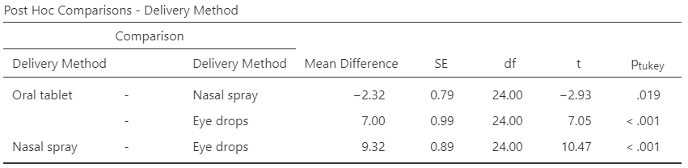{width="100%"}

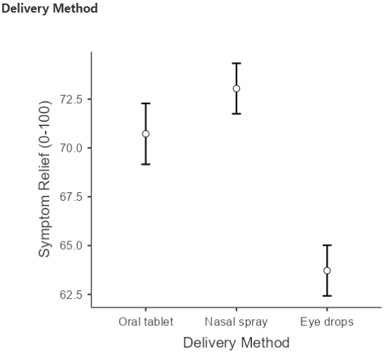{fig-align="center" width="55%"}

**Significance.** All three pairs differ.

Oral − Nasal p = 0.019

Oral − Eye p \< 0.001

Nasal − Eye p \< 0.001.

**Confidence intervals** MD ± 2.50 × SE (using each pair's own SE)

Oral − Nasal: −2.32 ± 2.50 × 0.79 = MD −2.32 \[−4.30, −0.34\] (nasal
higher; excludes 0, matching p = 0.019).

Oral − Eye: 7.00 ± 2.50 × 0.99 = MD 7.00 \[4.52, 9.48\].

Nasal − Eye: 9.32 ± 2.50 × 0.89 = MD 9.32 \[7.10, 11.54\].

All exclude 0, all agree with their p-values. For those interested, you
might notice the SEs differ between pairs this time (0.79, 0.99, 0.89),
because each pair is based on its own column of within-person
differences, whereas Task 1 used one pooled within-group variance for
every pair.

**Effect size.** Jamovi gives none for RM post-hoc pairs. If you want a
rough d, divide the mean difference by the typical SD of the scores
(about 3.5): 0.7, 2.0 and 2.7, medium-to-large and very large. The
overall-test η² = 0.59 already tells you the effect is big.

**Clinical meaning.**

Nasal - tablet is 2.32 points on a scale where 8 is the smallest
noticeable difference, and both means sit above the 70-point "effective"
line: **not meaningful**, prescribe on preference, cost and side
effects.

Tablet - Eye drops is 7.00 points with a CI from 4.5 to 9.5, so the true
difference could be just under or just over the MCID threshold likely a
**real, possibly meaningful, but more data needed**.

Spray - Eye drops is 9.32 points above the threshold on average \[CI 7.1
to 11.5\] so **practically** **meaningful**.

Add the fact that eye drops alone averaged 63.7, in the partial-relief
band, and the advice is clear. Tablet or spray first-line for total
symptom control, eye drops as an add-on for ocular symptoms, not on
their own if wanting the most effective option.
:::

**By hand, calculate the 95% CI** for Oral − Eye:

95% CI = MD ± 2.50 × SE

The 2.50 is the Tukey multiplier for df = 24 described in the *Post-hoc
& CIs* tab at the start of this worksheet in The ANOVA essentials. It
has been adjusted to account for multiple comparisons in the ANOVA. SE =
SEM in the course I call it SE0 or SEp when talking about proportions,
or SEM when the standard error of a mean. Jamovi just calls it SE.

```{=html}
<div class="ws-quiz" data-okmsg="An interval that straddles the 8-point threshold: real, might matter, and you would want more data to be sure.">
  <p class="ws-qtext">95% CI for the Oral − Eye difference, to 2 decimal places:</p>
  <div class="ws-row"><label class="ws-inlab" for="t2-lo">Lower limit:</label>
    <input type="number" id="t2-lo" step="0.01" data-answer="4.52" data-tol="0.04"></div>
  <div class="ws-row"><label class="ws-inlab" for="t2-hi">Upper limit:</label>
    <input type="number" id="t2-hi" step="0.01" data-answer="9.48" data-tol="0.04"></div>
  <button class="ws-check" type="button">✓ Check</button>
  <span class="ws-fb"></span>
  <div class="ws-hint"><strong>Hint:</strong> margin = 2.50 × 0.99 = 2.48. Subtract it from and add it to 7.00.</div>
</div>
```
```{=html}
<div class="ws-quiz" data-unlock="t2-post2" data-okmsg="Three pairs, three different clinical stories, all from the same ANOVA.">
  <p class="ws-qtext">Build the clinical interpretation across the three pairs:</p>
  <p class="ws-cloze">All three pairwise differences were statistically significant. Nasal spray beat the oral tablet by 2.32 points (p = 0.019), but as this is <select data-answer="below" aria-label="mcid1"><option value="">choose…</option><option value="below">well below</option><option value="above">above</option></select> the 8-point threshold and both means are <select data-answer="eff" aria-label="cat"><option value="">choose…</option><option value="eff">in the effective range (≥ 70)</option><option value="partial">in the partial-relief range</option></select>, the two are <select data-answer="interchange" aria-label="rec1"><option value="">choose…</option><option value="interchange">clinically interchangeable (choose on cost, side effects, preference)</option><option value="nasalonly">clearly different (nasal spray must always be first-line)</option></select>. Eye drops scored 7.00 points below the tablet (95% CI [4.52, 9.48]) and 9.32 below the spray; the tablet comparison <select data-answer="straddle" aria-label="ci"><option value="">choose…</option><option value="straddle">straddles the 8-point threshold, so it is real and possibly meaningful</option><option value="clear">lies entirely beyond the threshold</option><option value="zero">includes 0</option></select>, while the spray comparison sits <select data-answer="above8" aria-label="ci2"><option value="">choose…</option><option value="above8">above the threshold on average</option><option value="below8">below the threshold</option></select>. Since eye drops alone also left patients in the <select data-answer="partial2" aria-label="cat2"><option value="">choose…</option><option value="partial2">partial-relief band (mean 63.7)</option><option value="eff2">effective band</option></select>, the recommendation is <select data-answer="rec" aria-label="rec"><option value="">choose…</option><option value="rec">tablet or nasal spray first-line; eye drops as an add-on only</option><option value="eye">eye drops first-line, since the result was significant</option></select>.</p>
  <button class="ws-check" type="button">✓ Check</button>
  <span class="ws-fb"></span>
  <div class="ws-hint"><strong>Hint:</strong> compare each mean difference (2.32, 7.00, 9.32) and its CI with 8 points, and each mean (70.7, 73.0, 63.7) with the 70-point line. Significance tells you the difference isn't zero; the thresholds tell you whether a patient would notice.</div>
</div>
```
```{=html}
<p class="ws-lockednote" data-for="t2-post2">Model write-up locked. Complete the interpretation correctly to unlock it.</p>
```
::: {#t2-post2 .callout-note .ws-locked collapse="true"}
## Model write-up --- Task 2

> A repeated measures ANOVA showed a significant effect of delivery
> method on symptom relief in 25 patients with allergic rhinitis, F(2,
> 48) = 58.73, p \< 0.001, η² = 0.59 (sphericity assumed, Mauchly's p =
> 0.447). Tukey post-hoc comparisons showed that relief was higher with
> the nasal spray (x = 73.0, SD = 3.1) than the oral tablet (x = 70.7,
> SD = 3.8; MD = 2.32, 95% CI \[0.34, 4.30\], p = 0.019), and that both
> were higher than eye drops (x = 63.7, SD = 3.1; MD = 9.32 \[7.10,
> 11.54\] and 7.00 \[4.52, 9.48\], both p \< 0.001). Only the eye-drop
> comparisons approached or exceeded the 8-point minimal noticeable
> difference, and eye drops alone fell short of the 70-point threshold
> for effective relief, so a tablet or nasal spray is recommended as
> first-line treatment.
:::

**Sort the pairs.** Same four columns as Task 1, now with the 8-point
MCID. Read each CI against 0, then against 8.

```{=html}
<div class="ws-quiz ws-sort" data-okmsg="No pair is clearly beyond the threshold this time: one is real but trivial, and both eye-drop comparisons are real and probably matter, with CIs that can't quite rule out a sub-threshold difference.">
  <p class="ws-qtext">Sort the three Tukey comparisons (MCID = 8 points):</p>
  <p class="ws-sortnote">CIs use MD ± 2.50 × SE, with each pair's own SE.</p>
  <div class="ws-cards">
    <div class="ws-card" draggable="true" tabindex="0" data-col="small">Nasal − Oral<small>MD 2.32 · 95% CI [0.34, 4.30] · p = 0.019</small></div>
    <div class="ws-card" draggable="true" tabindex="0" data-col="maybe">Oral − Eye<small>MD 7.00 · 95% CI [4.52, 9.48] · p &lt; 0.001</small></div>
    <div class="ws-card" draggable="true" tabindex="0" data-col="maybe">Nasal − Eye<small>MD 9.32 · 95% CI [7.10, 11.54] · p &lt; 0.001</small></div>
  </div>
  <div class="ws-cols">
    <div class="ws-col" tabindex="0" data-col="none"><b>No evidence of a difference yet</b><span class="ws-coldesc">CI includes 0 (p ≥ 0.05)</span></div>
    <div class="ws-col" tabindex="0" data-col="small"><b>Real, but too small to matter</b><span class="ws-coldesc">CI excludes 0 but sits entirely below the MCID</span></div>
    <div class="ws-col" tabindex="0" data-col="maybe"><b>Real, might matter</b><span class="ws-coldesc">CI excludes 0 and straddles the MCID; more data would settle it</span></div>
    <div class="ws-col" tabindex="0" data-col="clear"><b>Clearly meaningful</b><span class="ws-coldesc">whole CI beyond the MCID</span></div>
  </div>
  <button class="ws-sortcheck" type="button">✓ Check</button>
  <span class="ws-fb"></span>
  <div class="ws-hint"><strong>Hint:</strong> does the interval contain 8? [4.52, 9.48] and [7.10, 11.54] both do, one from below on average and one from above. [0.34, 4.30] never gets near it.</div>
</div>
```

------------------------------------------------------------------------

### Task 3 --- Under the bonnet: where F comes from (if we have time in class)

No Jamovi needed.

**a) Between versus within, live.** Everything in an ANOVA table comes
from two kinds of spread. How far apart the **group means** are
(between) and how scattered **people** are around their own group mean
(within). The tool starts with the real Task 1 data. Press the presets,
then drag the sliders, and watch which sums of squares move.

```{=html}
<div class="tt-fviz" data-preset="hrv"></div>
```
Try these in order:

1.  Press **Task 1 HRV data** and confirm the ANOVA table matches your
    Jamovi output (SS 1083.91 and 496.00, F = 45.89, η² = 0.686).
2.  Press **Same means, wider spread**. The three group means haven't
    moved, so SS~between~ is unchanged, but SS~within~ balloons and F
    collapses. Same "effect", noisier people, weaker evidence.
3.  Press **Tiny differences, tight groups**. Means only 1.5 units
    apart, yet F is large, because the dots hug their own means. Small
    gaps are detectable when within-group noise is small (and when n is
    large: push the n slider and watch).
4.  Press **No real difference**. All three groups come from the same
    population. F lands near 1 and p is large. This is what H₀ looks
    like; the F-distribution in panel 2 is the spread of F values you'd
    get from *repeatedly* sampling this situation, and the shaded tail
    is the 5% of them we'd wrongly call significant.
5.  Now push the **Number of groups (k)** slider from 3 up to 6 and
    watch panel 2. With three groups df₁ = 2 and the F curve has no
    hump: it starts at its highest point and falls away. From four
    groups (df₁ = 3) it rises to a peak just under 1 and then falls back
    to zero, the textbook shape. Same distribution family, the shape
    just depends on the degrees of freedom, and a three-group ANOVA
    never has the hump.

```{=html}
<div class="ws-quiz" data-answer="within" data-okmsg="SS between depends only on the group means and n; SS within depends only on the scatter around each mean.">
  <p class="ws-qtext">You press <em>Same means, wider spread</em>. So the variablity (spread) of the data points around their mean get larger. Which sum of squares changes, and what happens to F?</p>
  <label class="ws-opt"><input type="radio" name="t3a" value="between">SS<sub>between</sub> increases, so F increases</label>
  <label class="ws-opt"><input type="radio" name="t3a" value="within">SS<sub>within</sub> increases, SS<sub>between</sub> stays the same, so F decreases</label>
  <label class="ws-opt"><input type="radio" name="t3a" value="both">Both increase in proportion, so F is unchanged</label>
  <button class="ws-check" type="button">✓ Check</button>
  <span class="ws-fb"></span>
  <div class="ws-hint"><strong>Hint:</strong> read the two SS cards before and after pressing the preset. F = MS<sub>between</sub> ÷ MS<sub>within</sub>: what happens to a ratio when only the bottom grows?</div>
</div>
```
**b) By hand, once.** The exam gives you sums of squares and asks for
the F-test with an F-table, exactly like the sprint-training example in
Lecture 14. Do it once here for the Task 1 data:

SS~between~ = 1083.91, SS~within~ = 496.00, k = 3 groups, N = 45
athletes.

From the F-table the critical value at α = 0.05 is 3.23 for df (2, 40),
the nearest row to 42 (the exact value for (2, 42) is 3.22; the tool
above shows it).

```{=html}
<div class="ws-quiz" data-unlock="t3-hand" data-okmsg="Same numbers as Jamovi's ANOVA table. F = 45.89 is way past the critical 3.23, so p < 0.05 (Jamovi: p < 0.001).">
  <p class="ws-qtext">Fill in the F-ratio (two decimal places):</p>
  <div class="ws-row"><label class="ws-inlab" for="t3-df1">df₁ = k − 1:</label>
    <input type="number" id="t3-df1" step="1" data-answer="2"></div>
  <div class="ws-row"><label class="ws-inlab" for="t3-df2">df₂ = N − k:</label>
    <input type="number" id="t3-df2" step="1" data-answer="42"></div>
  <div class="ws-row"><label class="ws-inlab" for="t3-msb">MS<sub>between</sub> = SS ÷ df₁:</label>
    <input type="number" id="t3-msb" step="0.01" data-answer="541.96" data-tol="0.1"></div>
  <div class="ws-row"><label class="ws-inlab" for="t3-msw">MS<sub>within</sub> = SS ÷ df₂:</label>
    <input type="number" id="t3-msw" step="0.01" data-answer="11.81" data-tol="0.05"></div>
  <div class="ws-row"><label class="ws-inlab" for="t3-f">F = MS<sub>between</sub> ÷ MS<sub>within</sub>:</label>
    <input type="number" id="t3-f" step="0.01" data-answer="45.89" data-tol="0.15"></div>
  <button class="ws-check" type="button">✓ Check</button>
  <span class="ws-fb"></span>
  <div class="ws-hint"><strong>Hint:</strong> 1083.91 ÷ 2 and 496.00 ÷ 42, then divide one by the other.</div>
</div>
```
```{=html}
<p class="ws-lockednote" data-for="t3-hand">Worked answer locked. Answer correctly above to unlock it.</p>
```
::: {#t3-hand .callout-note .ws-locked collapse="true"}
## Worked answer --- F by hand

df₁ = 3 − 1 = 2

df₂ = 45 − 3 = 42.

MS~between~ = 1083.91 ÷ 2 = 541.96

MS~within~ = 496.00 ÷ 42 = 11.81

F = 541.96 ÷ 11.81 = **45.89**

Critical F ≈ 3.22 (table row (2, 40): 3.23) \< 45.89, so reject H₀ at α
= 0.05 (p \< 0.05).

**Conclusion in words:** There is significant evidence (F = 45.89, p \<
0.05) that at least one recovery method produces a different mean
next-day RMSSD. Which is/are not known needs a post-hoc test.
:::

### Task 4 --- Spot the error (do at home)

Two short results paragraphs, written the way a rushed student (or a
rushed paper) might write them. Each contains mistakes of the kind in
the *six traps* list further down. **Click every sentence you think is
wrong**, then press Check. Get them all and the explanations appear
under each one.

**Write-up 1: one-way ANOVA.** A trial compared hamstring flexibility
(sit-and-reach, cm) after six weeks of static stretching (n = 20), PNF
stretching (n = 20) or foam rolling (n = 20). Jamovi gave: Levene's p =
0.62; F(2, 57) = 3.42, p = 0.040, η² = 0.107; Tukey: PNF − Static MD =
3.1 cm, p = 0.031, d = 0.72; PNF − Foam MD = 2.4 cm, p = 0.11, d = 0.55;
Static − Foam MD = −0.7 cm, p = 0.86, d = 0.16. The smallest change in
sit-and-reach that matters is about 2.5 cm.

```{=html}
<div class="ws-quiz ws-spot" data-okmsg="">
  <p class="ws-qtext">Find the four sentences that contain an error:</p>
  <p class="ws-count">8 sentences, 4 errors.</p>
  <div class="ws-passage">
    <span class="ws-sent">A one-way ANOVA showed a significant effect of protocol on flexibility, F(2, 57) = 3.42, p = 0.040.</span>
    <span class="ws-sent" data-err="1" data-why="η² is a proportion of variance, not a difference between groups. η² = 0.107 means protocol explains about 11% of the variability in flexibility scores. It says nothing about how many cm the groups differ by.">η² = 0.107, meaning the protocols differed by about 11% on average.</span>
    <span class="ws-sent" data-err="1" data-why="p = 0.62 is not significant. The conclusion (equal variances assumed) is right, but only because Levene's was non-significant; a significant Levene's would mean the assumption was violated. Wrong word, and it reverses the logic.">Levene's test was significant (p = 0.62), so equal variances could be assumed.</span>
    <span class="ws-sent" data-err="1" data-why="A significant F means at least one mean differs, not that all do. The post-hoc table shows only PNF vs Static is significant; PNF vs Foam (p = 0.11) and Static vs Foam (p = 0.86) are not.">Because the ANOVA was significant, all three protocols differ from each other.</span>
    <span class="ws-sent">Tukey post-hoc tests showed PNF improved flexibility more than static stretching (MD = 3.1 cm, p = 0.031, d = 0.72, a medium-to-large effect).</span>
    <span class="ws-sent" data-err="1" data-why="With p = 0.11 there is no evidence PNF outperformed foam rolling, so it can't be reported as having done so, and d = 0.55 should not be interpreted as the size of an effect that hasn't been shown. The honest sentence: PNF and foam rolling did not differ significantly (MD = 2.4 cm, p = 0.11).">PNF also outperformed foam rolling (MD = 2.4 cm, d = 0.55, a medium effect), although this did not reach significance (p = 0.11).</span>
    <span class="ws-sent">Given a minimal clinically important difference of about 2.5 cm, the 3.1 cm advantage of PNF over static stretching is likely to be meaningful for athletes.</span>
    <span class="ws-sent">The overall Type I error rate was kept at 5% by using Tukey's correction rather than three separate t-tests.</span>
  </div>
  <button class="ws-spotcheck" type="button">✓ Check</button>
  <span class="ws-fb"></span>
  <div class="ws-hint"><strong>Hint:</strong> check every claim against the numbers given: what does η² measure? Is 0.62 significant? Which pairs are actually p &lt; 0.05? Can you interpret d when p &gt; 0.05?</div>
</div>
```
**Write-up 2: repeated measures ANOVA.** Twenty runners completed a
10-km time trial in three shoe conditions (conventional A, conventional
B, carbon-plate), in randomised order a week apart. Jamovi gave:
Mauchly's W = 0.78, p = 0.02; F = 6.10, p = 0.004 (uncorrected row), η²
= 0.24; Tukey: carbon-plate faster than A by 45 s (95% CI 31 to 59 s)
and than B by 38 s (95% CI 33 to 43 s), both p \< 0.01; A vs B p = 0.61.
A 30-s change is the smallest that matters over 10 km.

```{=html}
<div class="ws-quiz ws-spot" data-okmsg="">
  <p class="ws-qtext">Find the two sentences that contain an error:</p>
  <p class="ws-count">7 sentences, 2 errors.</p>
  <div class="ws-passage">
    <span class="ws-sent">A repeated measures ANOVA compared 10-km time-trial performance across three shoe conditions in the same 20 runners.</span>
    <span class="ws-sent" data-err="1" data-why="Mauchly's p = 0.02 is significant, which means sphericity is violated, not assumed. The Greenhouse–Geisser row (corrected df, larger p) should be reported instead of the uncorrected one.">Mauchly's test was significant (p = 0.02), so sphericity was assumed and the uncorrected row was reported.</span>
    <span class="ws-sent" data-err="1" data-why="Wrong degrees of freedom. For a repeated measures ANOVA df₂ = (n − 1)(k − 1) = 19 × 2 = 38, so F(2, 38). (2, 57) is what a one-way ANOVA on 60 independent people would give, and 60 people were never measured.">There was a significant effect of shoe, F(2, 57) = 6.10, p = 0.004.</span>
    <span class="ws-sent">η² = 0.24, so shoe condition explained about a quarter of the variability in time-trial performance.</span>
    <span class="ws-sent">Because each runner served as their own control, between-runner differences in fitness were removed from the error term, increasing power.</span>
    <span class="ws-sent">Tukey comparisons showed the carbon-plate shoe was faster than both conventional shoes (by 45 s and 38 s, both p &lt; 0.01), while the two conventional shoes did not differ (p = 0.61).</span>
    <span class="ws-sent">Since a 30-s change is the smallest that matters over 10 km and both CIs lay entirely above 30 s, the carbon-plate advantage is both statistically significant and clearly meaningful.</span>
  </div>
  <button class="ws-spotcheck" type="button">✓ Check</button>
  <span class="ws-fb"></span>
  <div class="ws-hint"><strong>Hint:</strong> one error is about an assumption decision, the other about the df rule for repeated measures. The effect size, design and MCID sentences are all fine.</div>
</div>
```

------------------------------------------------------------------------

## Putting it into words

The numbers only matter if you can communicate them. Below is a model
write-up for each ANOVA, built on the same skeleton as last week, with
the post-hoc step slotted in: **the test and the design, F with df and
p, η², then for each pair that matters the mean difference with its CI,
p and d, then the decision and what it means in context.** This is the
template for the exam's short-answer interpretation questions and for
the results section of your project.

> **One-way ANOVA.** A one-way ANOVA showed a significant effect of
> recovery method on next-day RMSSD, F(2, 42) = 45.89, p \< 0.001, η² =
> 0.69. Tukey post-hoc comparisons showed that RMSSD was higher after
> active recovery (x = 44.7, SD = 2.7 ms) than after compression (x =
> 41.7, SD = 4.2; MD = 3.07 ms, 95% CI \[0.03, 6.11\], p = 0.048, d =
> 0.89), and both were higher than after an ice bath (x = 33.1, SD =
> 3.3; MD = 11.60 and 8.53 ms, both p \< 0.001, d = 3.38 and 2.48). Only
> the ice-bath comparisons reached the 8 ms threshold considered
> meaningful for recovery (clearly for active recovery, 95% CI \[8.56,
> 14.64\]; on average for compression, 95% CI \[5.49, 11.57\]); the 3 ms
> advantage of active recovery over compression is unlikely to matter in
> practice.

> **Repeated measures ANOVA.** A repeated measures ANOVA showed a
> significant effect of delivery method on symptom relief in 25 patients
> with allergic rhinitis, F(2, 48) = 58.73, p \< 0.001, η² = 0.59
> (sphericity assumed, Mauchly's p = 0.447). Tukey post-hoc comparisons
> showed that relief was higher with the nasal spray (x = 73.0, SD =
> 3.1) than the oral tablet (x = 70.7, SD = 3.8; MD = 2.32, 95% CI
> \[0.34, 4.30\], p = 0.019), and that both were higher than eye drops
> (x = 63.7, SD = 3.1; MD = 9.32 and 7.00, both p \< 0.001). Only the
> eye-drop comparisons approached or exceeded the 8-point minimal
> noticeable difference, so a tablet or nasal spray is recommended as
> first-line treatment.

::: {.callout-tip appearance="simple"}
**Reporting checklist for any ANOVA.** F(df₁, df₂), p, an effect size
(η²), the assumption checks you ran (Levene's or Mauchly's, with the
decision), the post-hoc test by name, and for each pair you discuss the
mean difference, its CI, its p, and whether it clears the clinical
threshold. If the overall F is not significant, stop there: no post-hoc
and no effect-size interpretation.
:::

### The same tests in real research (optional reading)

Three open-access papers, one per discipline, that lean on exactly
today's tools. In each, the *Results* section is short enough to read in
five minutes; look for F with its df, the p-value, the effect size, the
post-hoc pairs, and then ask the four interpretation questions yourself.

::: {.callout-note appearance="simple"}
**Exercise science · one-way ANOVA.** Merino-Marban et al. (2021)
compared three warm-ups in 76 primary-school children: a control warm-up
(n = 22), static stretching (n = 27) and dynamic stretching (n = 27),
with the change in standing long jump (cm) as the outcome. One factor,
three independent groups, so a one-way ANOVA: F(2, 73) = 34.18, p \<
0.001, η~p~² = 0.48. Bonferroni post-hoc pairs: dynamic stretching
improved jump distance by about 11 cm, more than the control (p \<
0.001, d = 1.51) and more than static stretching (p \< 0.001, d = 1.38),
while static and control were indistinguishable (about 1 cm apart, d =
0.12). **Notice,** the F only says the three groups are not all equal;
the pairs show one group drives it and two are the same, exactly the
Task 1 pattern. Notice too that η~p~² = 0.48 (partial η², which equals
η² in a one-way design) is large by any benchmark, and that the authors
report d for each pair alongside the p-values. Read the design
critically: the *class*, not the child, was randomised (three clusters),
and the control class was heavier at baseline. [PubMed 34475616 ·
Biology of Sport](https://pubmed.ncbi.nlm.nih.gov/34475616/)
:::

::: {.callout-note appearance="simple"}
**Pharmacology · repeated measures ANOVA (crossover).** Teimouri-Korani
et al. (2025) gave 15 strength-trained men caffeine as a **capsule**, as
**chewing gum**, and a **placebo**, one week apart in randomised order,
and measured vertical jump height. Same people, three conditions, so a
repeated measures ANOVA: F = 18.55, p = 0.001, η~p~² = 0.57. Bonferroni
post-hoc: capsule vs placebo p = 0.001, gum vs placebo p = 0.001,
capsule vs gum p = 1.000 (jump was about 6% higher with either caffeine
form). **Notice,** this is Task 2's logic with a different drug: the two
delivery forms both beat placebo but not each other, and a corrected p
of exactly 1.000 is what Bonferroni does when it multiplies a large raw
p by the number of comparisons and caps it at 1. Two things the paper
leaves out that you did today: no sphericity test is reported, and the
df are not printed with the F. And with around 30 separate ANOVAs across
all the strength measures, one or two "significant" results would be
expected by chance alone (re-read the multiple-comparisons tool).
[PubMed 40249126 · J Int Soc Sports
Nutr](https://pubmed.ncbi.nlm.nih.gov/40249126/)
:::

::: {.callout-note appearance="simple"}
**Clinical exercise physiology · repeated measures ANOVA with an MCID.**
Lockwood et al. (2025) followed 41 service members with severe
lower-limb injuries through three time points: walking without a
carbon-fibre ankle-foot orthosis, with the orthosis, and with the
orthosis plus a 4-week return-to-run programme, using the Two-Minute
Walk Test (m). Mauchly's test was not violated (χ²(2) = 5.78, p =
0.056); the RM ANOVA gave F = 95.90, p \< 0.001, η² = 0.71, and all
three Bonferroni pairs were p \< 0.001, with mean distances of 152 → 179
→ 208 m. **Notice,** the clinical-meaning step: the authors quote an
MCID of 37.2 m (and a minimal detectable change of 34.3 m). Each
individual step (27 m, then 29 m) is p \< 0.001 yet **below** both
thresholds; only the cumulative 56 m clears them. That is the "p says
real, MCID says matters" distinction matters here, and the authors say
so in their discussion. Also notice Mauchly's p = 0.056 is a near miss;
they almost had to report the Greenhouse--Geisser row. [PubMed 41133255
· Front Rehabil Sci](https://pubmed.ncbi.nlm.nih.gov/41133255/)
:::

::: {.callout-warning appearance="simple"}
**Six classic traps that cost marks:**

1.  **No post-hoc without a significant F.** If the overall p \> 0.05,
    stop. Running (or reporting) pairwise tests anyway is exactly the
    multiple-comparisons problem ANOVA exists to avoid.
2.  **"Significant F" ≠ "all groups differ".** It means *at least one*
    differs. Task 1 happened to have all three pairs significant; the
    stretching paper above had one group different and two the same.
3.  **Three t-tests ≠ one ANOVA.** Unadjusted, three pairwise tests run
    a \~14% family-wise false-positive risk. Tukey's p-values are
    already corrected, so never Bonferroni them again.
4.  **Overlapping group CIs ≠ non-significant.** Active vs Compression
    (Task 1) and Oral vs Nasal (Task 2) both had overlapping group CIs
    and significant differences. Only the CI of the *difference* answers
    the question.
5.  **Significant ≠ big ≠ matters.** p says the difference is unlikely
    to be chance; η² and d say how big; the MCID says whether anyone
    would notice. Active vs Compression was "large" (d = 0.89) *and*
    clinically trivial (3 ms against an 8 ms threshold).
6.  **Repeated measures has its own assumption.** Sphericity
    (Mauchly's), not Levene's; and the thing that must be independent is
    one *person* from another, not the three scores within a person.
:::

::: {.callout-tip appearance="simple"}
**Looking ahead.** Lecture 16 picks up three threads from today: why p
\< 0.05 is a lazy rule on its own, how effect sizes (η², d and the
chi-square ones you'll meet next) standardise "how big", and how to read
a CI against a clinical threshold rather than just against 0. After
that, chi-square: the same hypothesis-testing recipe for **categorical**
outcomes, the last branch of the decision tree.
:::

------------------------------------------------------------------------

## How this links to assessment

-   The workflow today (assumptions → hypotheses → F-test → post-hoc →
    CI → effect size → interpretation) is the frame for the **exam**,
    which will give you Jamovi ANOVA output like today's and ask you to
    **choose the right test from a scenario**, **read the tables** (F,
    df, p, η², the post-hoc pairs) and **write the interpretation**,
    including whether a result is practically meaningful.
-   The exam can also give you sums of squares and ask for F by hand
    with an F-table (Task 3b), just like the lecture examples.
-   The repeated measures ANOVA is the analysis you need for the
    within-participant question in your **Research Project**, so keep
    this page handy when you get to it.
-   And most immediately... the group activity (next) counts towards
    your **Portfolio of Evidence** and has lab-specific questions.

------------------------------------------------------------------------

## That's it for Jamovi today.

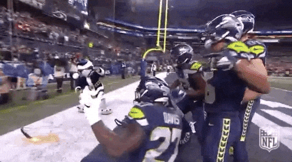{fig-align="center"}

**As we (I) celebrate the return of the NFL. Gather your squad for the
group Portfolio of Evidence activity (20 mins).**

-   Put all phones, laptops, electronic devices away

-   Turn off the lab computers

-   You can have a calculator, ruler, pen

-   You can write/draw on the exam sheet

-   Please include all names and s numbers for all group members

-   1 mark for first correct scratch, 1/2 mark for second, 1/4 for
    third, 0 for fourth

-   Work together as a team :)

------------------------------------------------------------------------

## Getting help

During the session I'll circulate to help, don't be afraid to ask. After
the workshop, revisit this page, check your module notes for
interpretation help, or post in the Microsoft Teams channel, email me,
or [**book an office hours
meeting**](https://lms.griffith.edu.au/courses/32192#cc-collection-4).

------------------------------------------------------------------------

## References

\[1\] The jamovi project (2024). *jamovi.* (Version 2.6) \[Computer
Software\]. Retrieved from <https://www.jamovi.org>.

\[2\] Cohen, J. (1988). *Statistical power analysis for the behavioral
sciences* (2nd ed.). Lawrence Erlbaum Associates.

\[3\] Tukey, J. W. (1949). Comparing individual means in the analysis of
variance. *Biometrics, 5*(2), 99--114. <https://doi.org/10.2307/3001913>

\[4\] Lakens, D. (2013). Calculating and reporting effect sizes to
facilitate cumulative science: A practical primer for t-tests and
ANOVAs. *Frontiers in Psychology, 4*, 863.
<https://doi.org/10.3389/fpsyg.2013.00863>

\[5\] Bohannon, J. (2015, May 27). I fooled millions into thinking
chocolate helps weight loss. Here's how. *Gizmodo/io9*.
<https://gizmodo.com/i-fooled-millions-into-thinking-chocolate-helps-weight-1707251800>

\[6\] Merino-Marban, R., Fuentes, V., Torres, M., & Mayorga-Vega, D.
(2021). Acute effect of a static- and dynamic-based stretching warm-up
on standing long jump performance in primary schoolchildren. *Biology of
Sport, 38*(3), 333--339. <https://doi.org/10.5114/biolsport.2021.99703>

\[7\] Teimouri-Korani, H., Hemmatinafar, M., Willems, M. E. T., Rezaei,
R., & Imanian, B. (2025). Individual responses to encapsulated caffeine
and caffeine chewing gum on strength and power in strength-trained
males. *Journal of the International Society of Sports Nutrition,
22*(1), 2495228. <https://doi.org/10.1080/15502783.2025.2495228>

\[8\] Lockwood, M. D., Hovorka, C. F., Baumann, M. E., & Childers, W. L.
(2025). Clinical outcome of Two Minute Walk Test after return to run
program in IDEO users: A retrospective study. *Frontiers in
Rehabilitation Sciences, 6*, 1602110.
<https://doi.org/10.3389/fresc.2025.1602110>

------------------------------------------------------------------------

*Document prepared by Aaron Bach using Quarto.*

```{=html}
<script>
(function(){
  "use strict";

  /* ---------- shared maths (same lgamma / betacf / ibeta as Workshop 5) ---------- */
  function lgamma(x){
    var c=[76.18009172947146,-86.50532032941677,24.01409824083091,-1.231739572450155,0.1208650973866179e-2,-0.5395239384953e-5];
    var y=x, tmp=x+5.5; tmp-=(x+0.5)*Math.log(tmp); var ser=1.000000000190015;
    for(var j=0;j<6;j++){ ser+=c[j]/++y; }
    return -tmp+Math.log(2.5066282746310005*ser/x);
  }
  function betacf(a,b,x){
    var MAXIT=300,EPS=3e-13,FPMIN=1e-300, qab=a+b,qap=a+1,qam=a-1, c=1, d=1-qab*x/qap;
    if(Math.abs(d)<FPMIN)d=FPMIN; d=1/d; var h=d;
    for(var m=1;m<=MAXIT;m++){
      var m2=2*m, aa=m*(b-m)*x/((qam+m2)*(a+m2));
      d=1+aa*d; if(Math.abs(d)<FPMIN)d=FPMIN; c=1+aa/c; if(Math.abs(c)<FPMIN)c=FPMIN; d=1/d; h*=d*c;
      aa=-(a+m)*(qab+m)*x/((a+m2)*(qap+m2));
      d=1+aa*d; if(Math.abs(d)<FPMIN)d=FPMIN; c=1+aa/c; if(Math.abs(c)<FPMIN)c=FPMIN; d=1/d;
      var del=d*c; h*=del; if(Math.abs(del-1)<EPS)break;
    }
    return h;
  }
  function ibeta(a,b,x){
    if(x<=0)return 0; if(x>=1)return 1;
    var bt=Math.exp(lgamma(a+b)-lgamma(a)-lgamma(b)+a*Math.log(x)+b*Math.log(1-x));
    return (x<(a+1)/(a+b+2)) ? bt*betacf(a,b,x)/a : 1-bt*betacf(b,a,1-x)/b;
  }
  /* right-tail p of the F distribution, and its critical value by bisection */
  function pF(F,df1,df2){ if(!(F>0)) return 1; return ibeta(df2/2,df1/2,df2/(df2+df1*F)); }
  function fCrit(df1,df2,alpha){ var lo=0,hi=1000; for(var i=0;i<100;i++){ var mid=(lo+hi)/2; if(pF(mid,df1,df2)>alpha) lo=mid; else hi=mid; } return (lo+hi)/2; }
  function fpdf(x,d1,d2){
    if(x<0) return 0; if(x===0) return d1===2?1:(d1<2?0:0); /* d1 = 2 gives a finite 1 at zero */
    var lb=lgamma(d1/2)+lgamma(d2/2)-lgamma((d1+d2)/2);
    var e=-lb+(d1/2)*Math.log(d1/d2)+((d1/2-1)===0?0:(d1/2-1)*Math.log(x))-((d1+d2)/2)*Math.log(1+d1*x/d2);
    return Math.exp(e);
  }
  function f1(x){ return (Math.round(x*10)/10).toFixed(1); }
  function f2(x){ return (Math.round(x*100)/100).toFixed(2); }
  function f3(x){ return (Math.round(x*1000)/1000).toFixed(3); }
  function pFmt(p){ return p<0.001 ? "&lt; 0.001" : f3(p); }
  function pStr(p){ return p<0.001 ? "p &lt; 0.001" : "p = "+f3(p); }
  function mean(a){ var s=0; for(var i=0;i<a.length;i++) s+=a[i]; return s/a.length; }
  function sdev(a){ var m=mean(a), v=0; for(var i=0;i<a.length;i++) v+=(a[i]-m)*(a[i]-m); return a.length>1?Math.sqrt(v/(a.length-1)):0; }
  /* deterministic pseudo-random numbers (same LCG as the Cohen's d viewer) */
  function lcg(seed){ var s=seed; return function(){ s=(s*9301+49297)%233280; return s/233280; }; }
  /* n standard-normal draws from a fixed seed, then standardised so the sample
     mean is exactly 0 and the sample SD exactly 1 (so target mean/SD are hit exactly) */
  function zDraws(n,seed){
    var rnd=lcg(seed), z=[];
    for(var i=0;i<n;i++){ var u=1-rnd(), v=rnd(); z.push(Math.sqrt(-2*Math.log(u))*Math.cos(2*Math.PI*v)); }
    var m=mean(z), s=sdev(z); if(!(s>1e-9)) s=1;
    return z.map(function(x){ return (x-m)/s; });
  }
  function fld(key,label,val,min,max,step,id){
    return '<div class="tt-field" data-key="'+key+'"><label for="'+id+'">'+label+' <span class="tt-val"></span></label>'+
      '<input type="range" id="'+id+'" min="'+min+'" max="'+max+'" step="'+step+'" value="'+val+'" aria-label="'+label+'">'+
      '<input type="number" class="tt-num" min="'+min+'" max="'+max+'" step="'+step+'" value="'+val+'" aria-label="'+label+' (type a value)"></div>';
  }
  function st(k,v,sub,cls){ /* Greek letters must not be upper-cased (η -> Η looks like H) */
    var raw=/[\u03b1-\u03c9]/.test(k) ? ' style="text-transform:none"' : '';
    return '<div class="tt-stat '+(cls||'')+'"><div class="k"'+raw+'>'+k+'</div><div class="v">'+v+'</div>'+(sub?'<div class="s">'+sub+'</div>':'')+'</div>';
  }
  var uid=0;

  /* =====================================================================
     (A) F-ratio explorer: between-group vs within-group variability
     ===================================================================== */
  var HRV={
    labels:["Ice Bath","Compression","Active Recovery"], ylab:"RMSSD (ms)",
    groups:[[33,35,30,32,38,29,31,34,39,28,35,30,34,32,37],
            [41,39,41,44,38,40,34,44,41,47,46,50,43,41,36],
            [44,42,46,41,45,46,43,45,43,50,40,46,48,45,47]]
  };
  function initFviz(el){
    var id="fv"+(++uid);
    el.innerHTML='<p class="tt-eyebrow">F-ratio explorer — variability between groups vs within groups (one dot = one person)</p>'+
      '<div class="tt-presets"><button data-p="hrv">Task 1 HRV data</button><button data-p="wide">Same means, wider spread</button><button data-p="tiny">Tiny differences, tight groups</button><button data-p="null">No real difference</button><button data-p="reset">Reset</button></div>'+
      '<div class="tt-note"></div>'+
      '<div class="tt-controls">'+
        fld("between","Spread of the group means (between)",6,0,15,0.1,id+"b")+
        fld("sd","Spread within each group (SD)",3.4,1,10,0.1,id+"s")+
        fld("n","People per group (n)",15,3,50,1,id+"n")+
        fld("k","Number of groups (k)",3,3,6,1,id+"k")+
      '</div>'+
      '<div class="tt-sub tt-sub-data">1 · The data: three groups, their means, and the grand mean</div><div class="tt-svgwrap"></div>'+
      '<div class="tt-legend"><span><i style="background:#8A939A;border-radius:50%"></i>One person’s score</span><span><i style="background:#16232E;height:3px;border-radius:0"></i>Group mean</span><span><i style="background:#B5352A;height:3px;border-radius:0"></i>Grand mean (all scores)</span><span><i style="background:#C77D0A;width:3px;height:14px;border-radius:0"></i>Between: group mean ↔ grand mean</span><span><i style="background:#0E7C7B;width:3px;height:14px;border-radius:0"></i>Within: ±1 SD of the dots around their own mean</span></div>'+
      '<div class="tt-sub">2 · The F statistic on the F distribution</div><div class="tt-fsvg"></div>'+
      '<div class="tt-legend"><span><i style="background:#F3C7C2"></i>Rejection region (α = .05, right tail only)</span><span><i style="background:#16232E"></i>Observed F</span></div>'+
      '<div class="tt-stats"></div><div class="tt-verdict"></div><div class="tt-work"></div>';

    var state={mode:"real",groups:HRV.groups,labels:HRV.labels,ylab:HRV.ylab};
    var jit=[lcg(11),lcg(222),lcg(3333),lcg(4444),lcg(5555),lcg(6666)].map(function(r){ var a=[]; for(var i=0;i<50;i++) a.push(r()*2-1); return a; });

    function set(k,v){ var f=el.querySelector('.tt-field[data-key="'+k+'"]'); f.querySelector('input[type=range]').value=v; f.querySelector('input[type=number]').value=v; }
    function read(k){ return parseFloat(el.querySelector('.tt-field[data-key="'+k+'"] input[type=number]').value); }
    var GL=["Group A","Group B","Group C","Group D","Group E","Group F"];
    function synth(means,sd,n){
      var g=[]; for(var i=0;i<means.length;i++){ var z=zDraws(n,101+i*37), a=[]; for(var j=0;j<n;j++) a.push(means[i]+sd*z[j]); g.push(a); }
      return {mode:"synth",groups:g,labels:GL.slice(0,means.length),ylab:"Outcome score (synthetic)"};
    }
    /* H0 true: identical population means, but the sample means wobble by sd/sqrt(n) x fixed z draws (seed 6 gives F close to 1 for k = 3) */
    function synthNull(sd,n,k){
      var r=lcg(6), m=[]; for(var i=0;i<k;i++){ var u=1-r(), v=r(); m.push(40+sd/Math.sqrt(n)*Math.sqrt(-2*Math.log(u))*Math.cos(2*Math.PI*v)); }
      var st=synth(m,sd,n); st.mode="null"; return st;
    }
    function readK(){ return Math.max(3,Math.min(6,Math.round(read("k")||3))); }
    function fromSliders(){
      var b=Math.max(0,Math.min(15,read("between")||0)), sd=Math.max(1,Math.min(10,read("sd")||1)), n=Math.max(3,Math.min(50,Math.round(read("n")||3))), k=readK();
      if(b===0){ state=synthNull(sd,n,k); return; }   /* b = 0 is the null: give the sample means realistic wobble instead of a degenerate F = 0 */
      var m=[]; for(var i=0;i<k;i++) m.push(40+b*(i-(k-1)/2));   /* k = 3 gives 40 - b, 40, 40 + b as before */
      state=synth(m,sd,n);
    }
    var hrvMeans=HRV.groups.map(mean);
    var notes={
      hrv:"<b>Task 1 as run in Jamovi:</b> 45 athletes, 15 per recovery method, resting RMSSD the morning after a hard session. Real scores, not simulated. The group means sit far apart (between) compared with how scattered the dots are around their own mean (within), so F is large.",
      wide:"<b>What if the same three means came from noisier people?</b> Same group means as the HRV data, but the scores now scatter with SD 9 instead of about 3.4. SS<sub>between</sub> is unchanged; SS<sub>within</sub> balloons; F shrinks.",
      tiny:"<b>Small gaps can still be significant.</b> The means differ by only 1.5 units, but the dots hug their own mean (SD 1.5), so the between-gap is large relative to the within-noise.",
      "null":"<b>The null hypothesis is true here.</b> All three groups were drawn from populations with the same mean (40), so the small differences between the sample means are pure sampling noise and F comes out near 1 (MS<sub>between</sub> ≈ MS<sub>within</sub>). Nudge the ‘between’ slider to see how much separation it takes to cross F crit.",
      slider:"<b>Synthetic data from the sliders.</b> Group means are spaced b apart and centred on 40 (with three groups: 40 − b, 40, 40 + b), where b is the ‘between’ slider; every group has exactly the SD you set, and b = 0 gives a true null with realistic sampling wobble. Watch which sums of squares move as you drag, and watch the <em>shape</em> of the F curve in panel 2 change as you add groups: df₁ = k − 1, and the curve only grows its hump once df₁ reaches 3."
    };
    function note(t){ el.querySelector(".tt-note").innerHTML=t||""; }
    function clearOn(){ el.querySelectorAll(".tt-presets button").forEach(function(x){ x.classList.remove("on"); }); }
    el.querySelectorAll(".tt-presets button").forEach(function(b){
      b.addEventListener("click",function(){
        var p=b.dataset.p;
        set("k",3);
        if(p==="hrv"||p==="reset"){ state={mode:"real",groups:HRV.groups,labels:HRV.labels,ylab:HRV.ylab}; set("between",6.0); set("sd",3.4); set("n",15); }
        if(p==="wide"){ state=synth(hrvMeans,9,15); state.labels=HRV.labels.slice(); state.ylab="RMSSD (ms), synthetic"; set("between",6.0); set("sd",9); set("n",15); }
        if(p==="tiny"){ set("between",1.5); set("sd",1.5); set("n",15); fromSliders(); }
        if(p==="null"){ set("between",0); set("sd",4); set("n",15); state=synthNull(4,15,3); }
        el.querySelectorAll(".tt-presets button").forEach(function(x){ x.classList.toggle("on",x===b&&p!=="reset"); });
        note(notes[p==="reset"?"hrv":p]); render();
      });
    });
    el.querySelectorAll(".tt-field").forEach(function(fw){
      var rg=fw.querySelector('input[type=range]'), nm=fw.querySelector('input[type=number]');
      rg.addEventListener("input",function(){ nm.value=rg.value; clearOn(); fromSliders(); note(notes.slider); render(); });
      nm.addEventListener("input",function(){ var v=parseFloat(nm.value); if(isNaN(v)) return; rg.value=Math.min(+rg.max,Math.max(+rg.min,v)); clearOn(); fromSliders(); note(notes.slider); render(); });
    });

    function niceStep(range,target){ var raw=range/target, p=Math.pow(10,Math.floor(Math.log(raw)/Math.LN10)), r=raw/p; return (r<1.5?1:r<3.5?2:r<7.5?5:10)*p; }

    function drawData(g,means,grand,sds){
      var W=720,H=338,padL=56,padR=16,top=30,bottom=58, base=H-bottom, all=[].concat.apply([],g);
      var lo=Math.min.apply(null,all), hi=Math.max.apply(null,all); if(hi-lo<4){ var c=(hi+lo)/2; lo=c-2; hi=c+2; }
      var m=(hi-lo)*0.10; lo-=m; hi+=m;
      function Y(v){ return base-(v-lo)/(hi-lo)*(base-top); }
      var k=g.length, pw=W-padL-padR, cw=pw/k, jw=Math.min(40,cw*0.28), tight=k>=5;
      var s='<svg class="tt-svg" viewBox="0 0 '+W+' '+H+'" role="img" aria-label="'+k+' groups of dots with group means, the grand mean, and between and within spread">';
      /* y axis */
      var step=niceStep(hi-lo,5), v0=Math.ceil(lo/step)*step;
      for(var v=v0; v<=hi+1e-9; v+=step){ s+='<line x1="'+padL+'" y1="'+Y(v).toFixed(1)+'" x2="'+(W-padR)+'" y2="'+Y(v).toFixed(1)+'" stroke="#EEF2F4"/><text x="'+(padL-8)+'" y="'+(Y(v)+4).toFixed(1)+'" text-anchor="end" font-size="11" fill="#5C6B76">'+(step<1?f1(v):Math.round(v))+'</text>'; }
      s+='<line x1="'+padL+'" y1="'+top+'" x2="'+padL+'" y2="'+base+'" stroke="#C7D3D6"/><line x1="'+padL+'" y1="'+base+'" x2="'+(W-padR)+'" y2="'+base+'" stroke="#C7D3D6"/>';
      s+='<text x="'+padL+'" y="13" font-size="11" font-weight="700" fill="#5C6B76">'+state.ylab+'</text>';
      s+='<text x="'+(W-padR)+'" y="13" text-anchor="end" font-size="11" font-weight="700" fill="#B5352A">dashed line = grand mean '+f2(grand)+'</text>';
      /* grand mean */
      s+='<line x1="'+padL+'" y1="'+Y(grand).toFixed(1)+'" x2="'+(W-padR)+'" y2="'+Y(grand).toFixed(1)+'" stroke="#B5352A" stroke-width="1.6" stroke-dasharray="6 4"/>';
      for(var i=0;i<k;i++){
        var cx=padL+cw*(i+0.5), n=g[i].length;
        /* dots */
        for(var j=0;j<n;j++){ s+='<circle cx="'+(cx+jit[i][j%50]*jw).toFixed(1)+'" cy="'+Y(g[i][j]).toFixed(1)+'" r="4" fill="#5C6B76" fill-opacity=".45"/>'; }
        /* within bracket: mean +/- 1 SD, right of the column */
        var bx=cx+jw+18, y1=Y(means[i]+sds[i]), y2=Y(means[i]-sds[i]);
        s+='<line x1="'+bx+'" y1="'+y1.toFixed(1)+'" x2="'+bx+'" y2="'+y2.toFixed(1)+'" stroke="#0E7C7B" stroke-width="2.4"/>';
        s+='<line x1="'+(bx-5)+'" y1="'+y1.toFixed(1)+'" x2="'+(bx+5)+'" y2="'+y1.toFixed(1)+'" stroke="#0E7C7B" stroke-width="2"/><line x1="'+(bx-5)+'" y1="'+y2.toFixed(1)+'" x2="'+(bx+5)+'" y2="'+y2.toFixed(1)+'" stroke="#0E7C7B" stroke-width="2"/>';
        if(!tight) s+='<text x="'+bx+'" y="'+(y1-6).toFixed(1)+'" text-anchor="middle" font-size="10" font-weight="700" fill="#0A5F5E" paint-order="stroke" stroke="#FBFDFD" stroke-width="3">within</text>';
        /* between arrow: grand mean -> group mean, left of the column */
        var ax=cx-jw-18, ya=Y(grand), yb=Y(means[i]), dir=yb>ya?1:-1;
        if(Math.abs(yb-ya)>4){
          s+='<line x1="'+ax+'" y1="'+ya.toFixed(1)+'" x2="'+ax+'" y2="'+(yb-dir*5).toFixed(1)+'" stroke="#C77D0A" stroke-width="2.4"/>';
          s+='<path d="M'+(ax-5)+' '+(yb-dir*7).toFixed(1)+' L'+ax+' '+yb.toFixed(1)+' L'+(ax+5)+' '+(yb-dir*7).toFixed(1)+' Z" fill="#C77D0A"/>';
          if(!tight) s+='<text x="'+(ax-7)+'" y="'+((ya+yb)/2+4).toFixed(1)+'" text-anchor="end" font-size="10" font-weight="700" fill="#8A5A08" paint-order="stroke" stroke="#FBFDFD" stroke-width="3">between</text>';
        } else {
          s+='<circle cx="'+ax+'" cy="'+ya.toFixed(1)+'" r="3.5" fill="#C77D0A"/>';
        }
        /* group mean bar */
        s+='<line x1="'+(cx-jw-8).toFixed(1)+'" y1="'+Y(means[i]).toFixed(1)+'" x2="'+(cx+jw+8).toFixed(1)+'" y2="'+Y(means[i]).toFixed(1)+'" stroke="#16232E" stroke-width="3.2"/>';
        /* labels */
        s+='<text x="'+cx+'" y="'+(base+17)+'" text-anchor="middle" font-size="12.5" font-weight="700" fill="#16232E">'+state.labels[i]+'</text>';
        if(tight){
          s+='<text x="'+cx+'" y="'+(base+31)+'" text-anchor="middle" font-size="10" fill="#5C6B76">mean '+f1(means[i])+' · SD '+f1(sds[i])+'</text>';
          s+='<text x="'+cx+'" y="'+(base+44)+'" text-anchor="middle" font-size="10" fill="#5C6B76">n = '+n+'</text>';
        } else {
          s+='<text x="'+cx+'" y="'+(base+33)+'" text-anchor="middle" font-size="10.5" fill="#5C6B76">mean '+f2(means[i])+' · SD '+f2(sds[i])+' · n = '+n+'</text>';
        }
      }
      s+='</svg>';
      el.querySelector(".tt-svgwrap").innerHTML=s;
    }

    function drawF(F,fc,df1,df2){
      /* x-axis: wide enough to show the whole curve falling back to zero, and at least
         1.6 x F crit so the rejection region is readable, but never beyond 7 (the density
         is essentially zero past 7 for any df1 here). A larger observed F is pinned at the
         right edge and labelled "off the chart" rather than squashing the curve. */
      var W=720,H=184,pad=30, xmin=0, xmax=Math.max(6,1.6*fc,Math.min(F+0.5,7)), base=H-46;
      function X(v){ return pad+(v-xmin)/(xmax-xmin)*(W-2*pad); }
      var peak=0; for(var q=0;q<=xmax;q+=xmax/400){ peak=Math.max(peak,fpdf(q,df1,df2)); }
      var scale=(base-24)/peak;
      function seg(a,b){ var d=""; for(var z=a; z<=b+1e-9; z+=xmax/360){ d+=(d?" L":"M")+X(z).toFixed(1)+" "+(base-fpdf(z,df1,df2)*scale).toFixed(1); } return d; }
      var s='<svg class="tt-svg" viewBox="0 0 '+W+' '+H+'" role="img" aria-label="F distribution with the right-tail rejection region and the observed F">';
      s+='<path d="'+seg(fc,xmax)+' L'+X(xmax)+' '+base+' L'+X(fc)+' '+base+' Z" fill="#B5352A" fill-opacity=".22"/>';
      s+='<path d="'+seg(xmin,xmax)+'" fill="none" stroke="#5C6B76" stroke-width="2"/>';
      s+='<path d="'+seg(fc,xmax)+'" fill="none" stroke="#B5352A" stroke-width="2.4"/>';
      s+='<line x1="'+pad+'" y1="'+base+'" x2="'+(W-pad)+'" y2="'+base+'" stroke="#C7D3D6"/>';
      var tstep=niceStep(xmax,6);
      for(var v=0; v<=xmax+1e-9; v+=tstep){ if(Math.abs(v-fc)/xmax<0.1) continue; /* leave room for the F crit label */ s+='<text x="'+X(v)+'" y="'+(base+15)+'" text-anchor="middle" font-size="11" fill="#5C6B76">'+(tstep<1?f1(v):Math.round(v))+'</text>'; }
      s+='<line x1="'+X(fc)+'" y1="'+(base-6)+'" x2="'+X(fc)+'" y2="'+base+'" stroke="#B5352A" stroke-width="1.5"/>';
      s+='<text x="'+X(fc)+'" y="'+(base+15)+'" text-anchor="middle" font-size="10.5" font-weight="700" fill="#B5352A">F crit '+f2(fc)+'</text>';
      var off=F>xmax+1e-9, fx=Math.min(xmax-0.02*xmax,Math.max(0,F));
      s+='<line x1="'+X(fx)+'" y1="14" x2="'+X(fx)+'" y2="'+base+'" stroke="#16232E" stroke-width="2.4"/>';
      var anchor=(fx/xmax>0.75?'end':(fx/xmax<0.1?'start':'middle'));
      s+='<text x="'+X(fx)+'" y="11" text-anchor="'+anchor+'" font-size="11.5" font-weight="700" fill="#16232E">F = '+f2(F)+(off?' (off the chart →)':'')+'</text>';
      s+='<text x="'+pad+'" y="'+(base+29)+'" font-size="10.5" fill="#5C6B76">F-distribution on ('+df1+', '+df2+') df. F cannot be negative, so the rejection region is one tail on the right; under H₀, F is usually near 1.</text>';
      var shape = df1<=2
        ? 'With '+(df1+1)+' groups df₁ = '+df1+', so the curve has no hump: highest at 0, then falling away. Push k to 4 or more and watch the hump appear.'
        : 'With '+(df1+1)+' groups df₁ = '+df1+', so the curve rises to a peak just below 1 and then falls back towards zero: the familiar humped shape.';
      s+='<text x="'+pad+'" y="'+(base+42)+'" font-size="10.5" fill="#5C6B76">'+shape+'</text>';
      s+='</svg>';
      el.querySelector(".tt-fsvg").innerHTML=s;
    }

    function render(){
      var g=state.groups, k=g.length, N=0, means=g.map(mean), sds=g.map(sdev), all=[].concat.apply([],g), grand=mean(all);
      var ssb=0, ssw=0;
      for(var i=0;i<k;i++){ N+=g[i].length; ssb+=g[i].length*Math.pow(means[i]-grand,2); for(var j=0;j<g[i].length;j++) ssw+=Math.pow(g[i][j]-means[i],2); }
      var df1=k-1, df2=N-k, msb=ssb/df1, msw=ssw/df2, F=msw>0?msb/msw:Infinity, p=pF(F,df1,df2), eta=ssb/(ssb+ssw), fc=fCrit(df1,df2,0.05), sig=p<0.05;
      el.querySelector('.tt-field[data-key="between"] .tt-val').textContent=f1(read("between"));
      el.querySelector('.tt-field[data-key="sd"] .tt-val').textContent=f1(read("sd"));
      el.querySelector('.tt-field[data-key="n"] .tt-val').textContent=Math.round(read("n"));
      el.querySelector('.tt-field[data-key="k"] .tt-val').textContent=k;
      el.querySelector('.tt-sub-data').textContent='1 · The data: '+k+' groups, their means, and the grand mean';
      drawData(g,means,grand,sds); drawF(F,fc,df1,df2);
      el.querySelector(".tt-stats").innerHTML=
        st("SS between",f2(ssb),"Σ nᵢ(x̄ᵢ − x̄)²")+
        st("SS within",f2(ssw),"Σ (x − x̄ᵢ)²")+
        st("df between",df1,"k − 1 = "+k+" − 1")+
        st("df within",df2,"N − k = "+N+" − "+k)+
        st("MS between",f2(msb),"SSₘ ÷ df₁")+
        st("MS within",f2(msw),"SSᵥ ÷ df₂")+
        st("F",isFinite(F)?f2(F):"∞","MS between ÷ MS within",sig?"sig":"ns")+
        st("p (right tail)",pFmt(p),(sig?"below":"not below")+" α = .05",sig?"sig":"ns")+
        st("η² (ETA SQUARED)",f3(eta),(eta*100).toFixed(0)+"% of variability is between groups")+
        st("F critical",f2(fc),"α = .05 on ("+df1+", "+df2+") df");
      var v=el.querySelector(".tt-verdict"); v.className="tt-verdict "+(sig?"":"ns");
      v.innerHTML= sig ?
        '<b>Reject H₀.</b> F('+df1+', '+df2+') = '+f2(F)+' is beyond the critical value '+f2(fc)+' and '+pStr(p)+'. The spread <em>between</em> the group means is much bigger than the spread <em>within</em> the groups would explain by chance: at least one group mean differs from another. η² = '+f2(eta)+' means '+(eta*100).toFixed(0)+'% of the variability in scores is accounted for by group. The F test does <b>not</b> say which groups differ; that is the job of the post-hoc test.' :
        '<b>Fail to reject H₀.</b> F('+df1+', '+df2+') = '+f2(F)+' does not reach the critical value '+f2(fc)+' and '+pStr(p)+'. The gaps between the group means are no bigger than the scatter within the groups would produce by chance. η² = '+f2(eta)+'. No post-hoc tests are needed when the overall F is not significant.';
      el.querySelector(".tt-work").innerHTML=
        '<span class="lbl">SS<sub>between</sub> = Σ nᵢ(x̄ᵢ − x̄)² = </span>'+g.map(function(a,i){ return a.length+'('+f2(means[i])+' − '+f2(grand)+')²'; }).join(' + ')+' = <span class="ans">'+f2(ssb)+'</span><br>'+
        '<span class="lbl">SS<sub>within</sub> = Σ (x − x̄ᵢ)² = </span>'+g.map(function(a,i){ return f2((a.length-1)*sds[i]*sds[i]); }).join(' + ')+' = <span class="ans">'+f2(ssw)+'</span><br>'+
        '<span class="lbl">MS<sub>between</sub> = </span>'+f2(ssb)+' ÷ '+df1+' = <span class="ans">'+f2(msb)+'</span>'+
        ' <span class="lbl">&nbsp;MS<sub>within</sub> = </span>'+f2(ssw)+' ÷ '+df2+' = <span class="ans">'+f2(msw)+'</span><br>'+
        '<span class="lbl">F = MS<sub>between</sub> ÷ MS<sub>within</sub> = </span>'+f2(msb)+' ÷ '+f2(msw)+' = <span class="ans">'+(isFinite(F)?f2(F):"∞")+'</span>'+
        ' <span class="lbl">→ compared with F crit '+f2(fc)+' on ('+df1+', '+df2+') df → </span><span class="ans">'+pStr(p)+'</span>';
    }
    var start=el.dataset.preset||"hrv", btn=el.querySelector('.tt-presets button[data-p="'+start+'"]');
    if(btn){ btn.click(); } else { note(notes.hrv); render(); }
  }

  /* =====================================================================
     (B) Multiple comparisons: family-wise error rate
     ===================================================================== */
  function initFwer(el){
    var id="fw"+(++uid);
    el.innerHTML='<p class="tt-eyebrow">Multiple comparisons — why three t-tests are not the same as one ANOVA</p>'+
      '<div class="tt-presets"><button data-g="3">3 groups (3 pairs)</button><button data-g="4">4 groups (6 pairs)</button><button data-g="5">5 groups (10 pairs)</button><button data-k="18">The chocolate hoax (18 outcomes)</button><button data-k="20">20 tests</button></div>'+
      '<div class="tt-note"></div>'+
      '<div class="tt-controls">'+
        fld("k","Number of tests run on the same data",3,1,30,1,id+"k")+
        '<div class="tt-field numonly" data-key="g"><label for="'+id+'g">Number of groups being compared <span class="tt-val"></span></label><input type="number" class="tt-num" id="'+id+'g" min="2" max="8" step="1" value="3" aria-label="Number of groups being compared"></div>'+
      '</div>'+
      '<div class="tt-svgwrap"></div>'+
      '<div class="tt-legend"><span><i style="background:#0E7C7B;height:3px;border-radius:0"></i>1 − 0.95<sup>k</sup>: chance of at least one false positive in k tests</span><span><i style="background:#B5352A;height:3px;border-radius:0"></i>α = 5%: the risk you signed up for with one test</span></div>'+
      '<div class="tt-stats"></div><div class="tt-verdict"></div>';
    var rg=el.querySelector('input[type=range]'), nm=el.querySelector('.tt-field[data-key="k"] .tt-num'), gi=el.querySelector('.tt-field[data-key="g"] .tt-num');
    var notes={
      pairs:"<b>Every extra group adds more pairs.</b> With g groups there are g(g − 1) ÷ 2 pairwise comparisons, and each unadjusted t-test carries its own 5% false-positive risk.",
      choc:"<b>The chocolate hoax (Bohannon, 2015).</b> A real (deliberately bad) trial measured 18 outcomes in a handful of people and reported the one that came up significant: chocolate ‘speeds weight loss’. With 18 tests, something was very likely to look significant by luck alone.",
      k20:"<b>Twenty tests.</b> A classic rule of thumb: at α = .05, one in twenty tests on pure noise will be ‘significant’. Run twenty and you should expect one false positive, on average.",
      free:"<b>Drag the slider.</b> Each test is a 5% gamble on a false positive. Running several on the same data stacks those gambles."
    };
    function note(t){ el.querySelector(".tt-note").innerHTML=t||""; }
    function clearOn(){ el.querySelectorAll(".tt-presets button").forEach(function(x){ x.classList.remove("on"); }); }
    function groupsFor(k){ for(var g=2;g<=8;g++){ if(g*(g-1)/2===k) return g; } return null; }
    function setK(k){ k=Math.max(1,Math.min(30,Math.round(k))); rg.value=k; nm.value=k; var g=groupsFor(k); gi.value=g===null?"":g; }
    el.querySelectorAll(".tt-presets button").forEach(function(b){
      b.addEventListener("click",function(){
        if(b.dataset.g){ var g=+b.dataset.g; setK(g*(g-1)/2); gi.value=g; note(notes.pairs); }
        else { setK(+b.dataset.k); note(b.dataset.k==="18"?notes.choc:notes.k20); }
        el.querySelectorAll(".tt-presets button").forEach(function(x){ x.classList.toggle("on",x===b); }); render();
      });
    });
    rg.addEventListener("input",function(){ setK(+rg.value); clearOn(); note(notes.free); render(); });
    nm.addEventListener("input",function(){ var v=parseFloat(nm.value); if(isNaN(v)) return; setK(v); nm.value=v; clearOn(); note(notes.free); render(); });
    gi.addEventListener("input",function(){ var g=parseInt(gi.value,10); if(isNaN(g)) return; g=Math.max(2,Math.min(8,g)); rg.value=g*(g-1)/2; nm.value=rg.value; clearOn(); note(notes.pairs); render(); });

    function draw(k){
      var W=720,H=230,padL=46,padR=20,top=26,base=H-36, K=30;
      function X(i){ return padL+(i-1)/(K-1)*(W-padL-padR); }
      function Y(p){ return base-p*(base-top); }
      var s='<svg class="tt-svg" viewBox="0 0 '+W+' '+H+'" role="img" aria-label="Line chart of the chance of at least one false positive against the number of tests">';
      var pk=1-Math.pow(0.95,k);
      /* tick labels that the current-k guides would sit on are hidden */
      [0,0.25,0.5,0.75,1].forEach(function(p){ s+='<line x1="'+padL+'" y1="'+Y(p)+'" x2="'+(W-padR)+'" y2="'+Y(p)+'" stroke="#EEF2F4"/>'+(Math.abs(Y(p)-Y(pk))<12?'':'<text x="'+(padL-8)+'" y="'+(Y(p)+4)+'" text-anchor="end" font-size="11" fill="#5C6B76">'+(p*100)+'%</text>'); });
      s+='<line x1="'+padL+'" y1="'+top+'" x2="'+padL+'" y2="'+base+'" stroke="#C7D3D6"/><line x1="'+padL+'" y1="'+base+'" x2="'+(W-padR)+'" y2="'+base+'" stroke="#C7D3D6"/>';
      for(var i=1;i<=K;i++){ if((i===1||i%5===0)&&Math.abs(i-k)>1){ s+='<text x="'+X(i)+'" y="'+(base+15)+'" text-anchor="middle" font-size="11" fill="#5C6B76">'+i+'</text>'; } }
      s+='<text x="'+(W-padR)+'" y="'+(base+30)+'" text-anchor="end" font-size="10.5" fill="#5C6B76">number of tests (k)</text>';
      s+='<text x="'+padL+'" y="13" font-size="11" font-weight="700" fill="#5C6B76">Chance of at least one false positive if H₀ is true everywhere</text>';
      s+='<line x1="'+padL+'" y1="'+Y(0.05)+'" x2="'+(W-padR)+'" y2="'+Y(0.05)+'" stroke="#B5352A" stroke-width="1.4" stroke-dasharray="5 4"/>';
      s+='<text x="'+(W-padR)+'" y="'+(Y(0.05)-5)+'" text-anchor="end" font-size="10.5" font-weight="700" fill="#B5352A">5% (one test)</text>';
      var d=""; for(i=1;i<=K;i++){ d+=(d?" L":"M")+X(i).toFixed(1)+" "+Y(1-Math.pow(0.95,i)).toFixed(1); }
      s+='<path d="'+d+'" fill="none" stroke="#0E7C7B" stroke-width="2.4"/>';
      for(i=1;i<=K;i++){ s+='<circle cx="'+X(i).toFixed(1)+'" cy="'+Y(1-Math.pow(0.95,i)).toFixed(1)+'" r="3" fill="#0E7C7B"/>'; }
      /* guides from the current point to both axes, labelled on the axes so nothing sits on the curve */
      s+='<line x1="'+X(k).toFixed(1)+'" y1="'+Y(pk).toFixed(1)+'" x2="'+X(k).toFixed(1)+'" y2="'+base+'" stroke="#16232E" stroke-width="1.2" stroke-dasharray="3 3"/>';
      s+='<line x1="'+padL+'" y1="'+Y(pk).toFixed(1)+'" x2="'+X(k).toFixed(1)+'" y2="'+Y(pk).toFixed(1)+'" stroke="#16232E" stroke-width="1.2" stroke-dasharray="3 3"/>';
      s+='<circle cx="'+X(k).toFixed(1)+'" cy="'+Y(pk).toFixed(1)+'" r="7" fill="#fff" stroke="#16232E" stroke-width="3"/>';
      s+='<text x="'+(padL-8)+'" y="'+(Y(pk)+4).toFixed(1)+'" text-anchor="end" font-size="12" font-weight="800" fill="#16232E">'+Math.round(pk*100)+'%</text>';
      s+='<text x="'+X(k).toFixed(1)+'" y="'+(base+15)+'" text-anchor="middle" font-size="12" font-weight="800" fill="#16232E">k = '+k+'</text>';
      s+='</svg>';
      el.querySelector(".tt-svgwrap").innerHTML=s;
    }
    function render(){
      var k=Math.max(1,Math.min(30,Math.round(+rg.value))), g=groupsFor(k), pk=1-Math.pow(0.95,k), pct=Math.round(pk*100), bonf=0.05/k;
      el.querySelector('.tt-field[data-key="k"] .tt-val').textContent=k;
      el.querySelector('.tt-field[data-key="g"] .tt-val').textContent=g===null?"—":g;
      draw(k);
      el.querySelector(".tt-stats").innerHTML=
        st("Chance of at least one false positive",pct+"%","1 − 0.95<sup>"+k+"</sup> = "+f3(pk),"big "+(k===1?"sig":"warn"))+
        st("Groups → pairwise tests",g===null?k+" tests":g+" → "+k,g===null?"not a full set of pairs (2–8 groups give 1, 3, 6, 10, 15, 21, 28)":g+" × "+(g-1)+" ÷ 2 = "+k+" pairs")+
        st("α NEEDED PER TEST (BONFERRONI)",bonf<0.001?f3(bonf).replace(/^0\./,".")+"":f3(bonf),"0.05 ÷ "+k+(k>1?" keeps the family at 5%":" (one test needs no correction)"));
      var v=el.querySelector(".tt-verdict"); v.className="tt-verdict "+(k===1?"":"ns");
      v.innerHTML= k===1 ?
        '<b>One test, one 5% risk.</b> With a single comparison, α = .05 means a 5% chance of a false positive when nothing is really going on. That is the risk you agreed to.' :
        '<b>Running '+k+' unadjusted '+(g!==null?'t-tests across '+g+' groups':'tests')+':</b> '+pct+'% chance of at least one false positive if nothing is really going on. '+(g!==null?'A post-hoc correction (Tukey’s HSD in Jamovi, or Bonferroni: test each pair at α = '+f3(bonf)+')':'A correction (e.g. Bonferroni: judge each test against α = '+f3(bonf)+')')+' pulls the whole family back to about 5%. That is why you run one ANOVA first and only then look at which pairs differ. <span style="display:block;margin-top:6px;font-size:12px;color:#5C6B76">Assumes independent tests and no real effects. Pairwise tests that share groups are correlated, so the real figure is a little lower, but it still climbs fast.</span>';
    }
    el.querySelector('.tt-presets button[data-g="3"]').click();
  }

  function safe(fn){ return function(el){ try{ fn(el); }catch(e){ el.innerHTML='<p style="color:#B5352A;font-family:system-ui">This tool failed to load: '+e.message+'</p>'; if(window.console)console.error(e);} }; }
  function boot(){
    document.querySelectorAll(".tt-fviz").forEach(safe(initFviz));
    document.querySelectorAll(".tt-fwer").forEach(safe(initFwer));
  }
  if(document.readyState==="loading") document.addEventListener("DOMContentLoaded",boot); else boot();
})();
</script>
```
